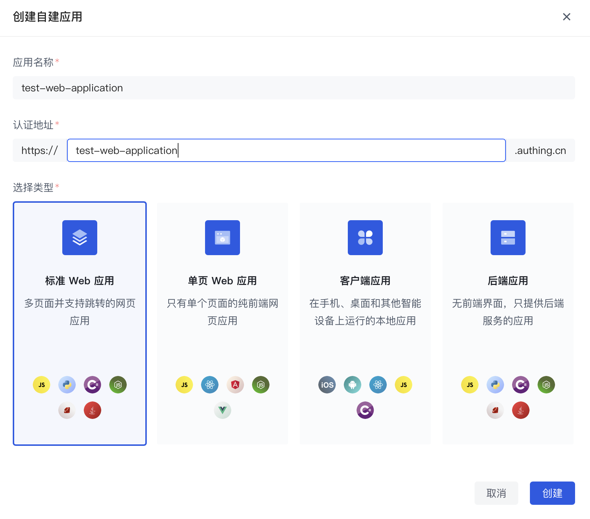
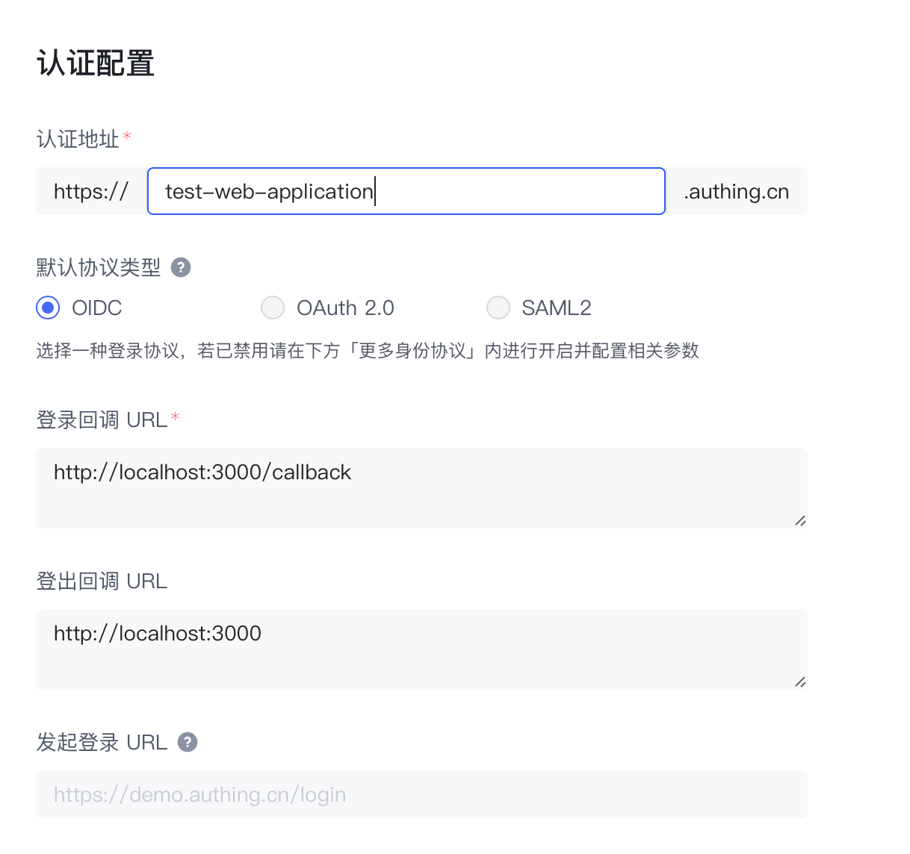
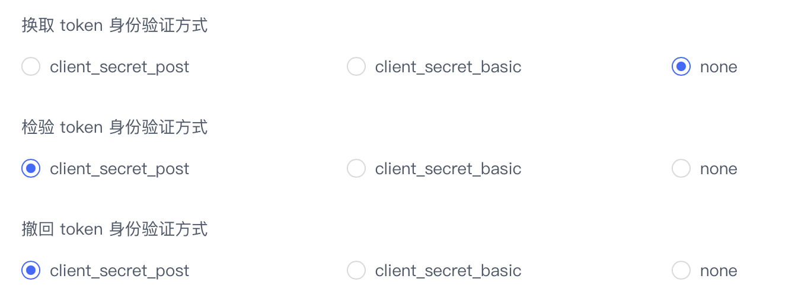

# 将 Guard 接入到标准 WEB 应用

<LastUpdated />

## 简介

当前使用文档适用于 [Guard 5.0](https://github.com/authing/guard)，如果您正在使用[Guard 3.x](https://github.com/Authing/authing-ui-components/tree/v3.1.25) 或 [Guard 4.x](https://github.com/authing/authing-ui-components)，可参考：

[将 Guard 接入到原生 JS 项目](https://docs.authing.cn/v2/reference/guard/v2/native-javascript.html)

Guard 是 Authing 提供的一种轻便的认证组件，你可以把它嵌入在你任何的 MPA（Multiple Page Application）应用中，一站式处理复杂的用户认证流程。

准备好你的原生 JavaScript 项目，跟随引导将 Authing Guard 接入到你的原生 JavaScript 项目中吧！

## STEP 1：创建 Authing 应用

1. 使用 Authing 创建一个应用：

<ul style="padding-left: 50px">
  <li>进入<a href="https://console.authing.cn/" target="blank">控制台</a></li>
  <li>展开左侧<strong>应用</strong>菜单，点击<strong>自建应用</strong>菜单</li>
  <li>点击右上角<strong>创建自建应用</strong>按钮</li>
  <li>填写<strong>应用名称</strong>和<strong>认证地址</strong>、选择<strong>标准 Web 应用</strong></li>
  <li>点击创建</li>
</ul>



<br />

2. 在<strong>认证配置</strong>处填写<strong>登录回调 URL</strong>和<strong>登出回调 URL</strong>



<br />

3. 换取 token 身份验证方式选择 <strong>none</strong>



<br />

4. 保存当前配置。

## STEP 2：接入 Guard

根据你的使用场景和个人偏好，在使用 Guard 时，你可以选择是否采用构建流程。

### 使用构建工具

``` shell
npm install --save @authing/guard
```

使用 `appId` 即可初始化 Guard，更多可选参数及其应用场景可参考：[GuardOptions](#GuardOptions)

``` javascript
import { Guard } from '@authing/guard'

const guard = new Guard({
  appId: '62e22721c889dd44bad1dda2'
})
```

点击查看[使用示例](https://github.com/Authing/Guard/tree/master/examples/guard)，下载代码并进入对应的目录，即可快速体验 Guard 基本功能。

### 不使用构建工具

若不想经过构建流程就可以使用 Guard，请直接复制下面的代码到一个 HTML 文件中，并在浏览器中打开它：

``` html
发布了正式版再补 cdn 及 html 代码
```

至此，你已经完成了 Guard 的初始化，接下来你可以使用 Guard 实例来完成后续更多的操作。

## STEP 3：使用 Guard

Guard 提供三种登录方式，分别是<strong>嵌入模式</strong>、<strong>弹窗模式</strong>、<strong>跳转模式</strong>。

- <strong>嵌入模式</strong>、<strong>弹窗模式</strong>：在指定的 DOM 中渲染一个登录框组件，通过这个组件面板可轻松完成登录、注册、找回密码、MFA 多因素认证、各种社会化登录等操作。[在线体验](https://sample-sso.authing.cn)

- <strong>跳转模式</strong>：Guard 完整集成并封装了 Auhting 认证类 SDK，只需一行代码即可实现登录、登出、处理登录成功后的回调等能力。

使用 Guard 提供的各种 API 可拥有获取用户信息、切换语言、自定义样式等能力。

### 嵌入模式

使用 `start` 和 `unmount` 方法实现组件渲染和卸载。

``` html
<button id="unmount">unmount Guard</button>

<div id="guard"></div>

<script>
  guard.start('#guard').then(userInfo => {
    console.log(userInfo)
  })

  document.querySelector('#unmount').onclick = function () {
    guard.unmount()
  }
</script>
```

### 弹窗模式

当 Guard 初始化时的参数 `mode` 为 `modal` 时，启动窗口模式，可使用以下 API 操作 Guard 窗口的展示和隐藏。

```html
<button id="show-guard">show Guard</button>
<button id="hide-guard">hide Guard</button>
<div id="guard"></div>

<script>
  guard.start('#guard').then(userInfo => {
    console.log(userInfo)
  })

  document.querySelector('#show-guard').onclick = function () {
    guard.show()
  }

  document.querySelector('#hide-guard').onclick = function () {
    guard.hide()
  }
</script>
```

### 跳转模式

``` typescript
// login.html
guard.startWithRedirect()

// callback.html
guard.handleRedirectCallback().then(() => {
  window.location.replace('personal.html')
})
```

### 退出登录

``` typescript
guard.logout()
```

### 用户注册

``` typescript
guard.startRegister()
```

### 判断用户登录状态

``` typescript
guard.checkLoginStatus().then(user => {
  // 如果是未登录状态，user 为 undefined
  console.log(user)
})
```

### 切换语言

``` html
<div id="change-lang">changeLang</div>

<script>
  let lang = 'zh-CN'

  document.querySelector('#change-lang').onclick = function () {
    lang = 'zh-CN' ? 'en-US' : 'zh-CN'

    guard.changeLang(lang)
  }
</script>
```

### 自定义样式

``` html
<div id="change-content-css">changeContentCSS</div>

<script>
  document.querySelector('#change-content-css').onclick = function () {
    guard.changeContentCSS('body {background: red}')
  }
</script>
```

## 注册事件

使用 Guard 提供的 `on` 方法可以方便的注册一些实用的事件

``` javascript
guard.on('event-name', () => {
  console.log('........')
})
```

常用事件列表：

|事件名称|描述|回调参数|回调参数说明
|-----|----|----|----|
|load|Guard 初始化完成，开始渲染页面|authClient|AuthenticationClient 对象，详情请查看 [authing-js-sdk](https://docs.authing.cn/v2/reference/sdk-for-node/authentication/)|
|load-error|Guard 初始化失败|error|错误信息
|login|用户登录成功|user|用户信息|
|login-error|用户登录失败|error|错误信息|
|register|用户注册成功|user|用户信息|
|register-error|用户注册失败|error|错误信息|
|close|modal 模式中关闭 Guard 事件| - | - |

## Guard 内置 Authing JS SDK

Guard 集成了 AuthenticationClient, 可调用 AuthenticationClient 的所有方法。

``` javascript
guard.getAuthClient().then(authClient => {
  authClient.registerByEmail()
  authClient.validateToken()
  // .........
})
// ....
```

参考 [Authentication SDK](https://docs.authing.cn/v2/reference/sdk-for-node/authentication/) 

## 常用参数列表
### <p id="GuardOptions">GuardOptions</p>

初始化 Guard 所需参数：

| 名称         | 类型            | 默认值 | 必传 | 描述                                               |
| ------------ | --------------- | ------ | ---- | -------------------------------------------------- |
| appId        | String          | -      | 是   | appId                                              |
| mode         | normal / modal  | normal | 否   | Guard 组件展示模式，normal：嵌入模式，modal：窗口模式                                 |
| defaultScene | GuardModuleType | login  | 否   | 组件默认渲染界面     
| align|none / left / center / right | none | 否 | Guard 默认展示位置                              |
| lang         | zh-CN / en-US   | zh-CN  | 否   | 语言                                               |
| isSSO        | Boolean         | true   | 否   | 是否是单点登录                                     |
| host         | String          | -      | 否   | 私有部署时的 API 请求地址，可在 Console 控制台配置 |
| scope        | String          | -      | 否   | OIDC scope                                         |
| redirectUri  | String          | -      | 否   | 回调地址，可在 Console 控制台配置                  |
| state        | String          | -      | 否   | OIDC 状态                                          |

使用以上参数实例化 Guard，您可以体验 Guard 最基本的登录、注册等功能。

**如果想拥有 Guard 的完整能力，可以配置 config 和 authClientOptions（相同参数以上表格中的值优先级更高）：**

- [config](#config)

- [authClientOptions](#authClientOptions)

### <p id="config">config</p>

| 名称                  | 类型                                                      | 描述                                                                                                                                                                                                                              | 默认值                 |
| :-------------------- | :-------------------------------------------------------- | :-------------------------------------------------------------------------------------------------------------------------------------------------------------------------------------------------------------------------------- | :--------------------- |
| target                | String                                                    | 指定 Guard 表单的挂载点，接受 [querySelector (opens new window)](https://developer.mozilla.org/en-US/docs/Web/API/Document/querySelector)能接受的所有参数或者 dom 元素，若未传入，Guard 会自动生成一个 div 标签放入 body 的最后面 | -                      |
| mode                  | [GuardMode](#GuardMode)                                   | Guard 组件展示模式                                                                                                                                                                                                                | normal                 |
| title                 | String                                                    | 产品名称                                                                                                                                                                                                                          | Authing 控制台中的配置 |
| logo                  | String                                                    | 产品 logo                                                                                                                                                                                                                         | Authing 控制台中的配置 |
| contentCss            | String                                                    | **自定义 CSS 样式**，如果指定了，会在 DOM 的 head 中插入一个 节点。如 body {background:#6699 !important;}                                                                                                                         | -                      |
| loginMethods          | [LoginMethods](#LoginMethods)                             | 需要使用的普通登录(包括 LDAP)方式列表                                                                                                                                                                                             | Authing 控制台中的配置 |
| registerMethods       | [RegisterMethods](#RegisterMethods)                       | 需要使用的注册方式                                                                                                                                                                                                                | Authing 控制台中的配置 |
| defaultRegisterMethod | [RegisterMethods](#RegisterMethods)                       | 默认展示的注册方式                                                                                                                                                                                                                | Authing 控制台中的配置 |
| defaultScenes         | GuardModuleType                                           | 打开组件时展示的界面                                                                                                                                                                                                              | GuardModuleType.LOGIN  |
| socialConnections     | [SocialConnections](../parameters.md#socialconnections)[] | 需要使用的社会化登录列表，**如果在 Authing 控制台中没有配置，则不会显示**                                                                                                                                                         | Authing 控制台中的配置 |
| enterpriseConnections | Array                                                     | **需要使用的企业身份源列表(不包括 LDAP)**，列表项值为配置的企业身份源唯一标识符，注意：企业身份源需要传入对应 appId 才能使用，**如果在 Authing 控制台中没有配置，则不会显示**                                                     | Authing 控制台中的配置 |
| defaultLoginMethod    | String                                                    | **默认显示的登录方式**。可选值为 options.loginMethods 中的某一项                                                                                                                                                                  | Authing 控制台中的配置 |
| autoRegister          | Boolean                                                   | **是否将注册和登录合并**，合并后如果用户不存在将自动注册                                                                                                                                                                          | Authing 控制台中的配置 |
| disableRegister       | Boolean                                                   | **是否禁止注册**，禁止的话会隐藏「注册」入口                                                                                                                                                                                      | Authing 控制台中的配置 |
| disableResetPwd       | Boolean                                                   | **是否禁止重置密码**，禁止的话会隐藏「忘记密码」入口                                                                                                                                                                              | Authing 控制台中的配置 |
| clickCloseable        | Boolean                                                   | **Modal 模式时是否隐藏登录框右上角的关闭按钮**，如果隐藏，用户将不能通过点击按钮关闭登录框                                                                                                                                        | Authing 控制台中的配置 |
| escCloseable          | Boolean                                                   | **Modal 模式时是否可以通过键盘 ESC 键关闭登录框**                                                                                                                                                                                 | Authing 控制台中的配置 |
| isSSO                 | Boolean                                                   | 是否是单点登录                                                                                                                                                                                                                    | Authing 控制台中的配置 |
| lang                  | 'zh-CN'                                                   | 使用语言，可选值为 zh-CN、en-US                                                                                                                                                                                                   | 'en-US'                |
| langRange             | ('zh-CN'｜ 'en-US')[]                                     | 语言切换可选的范围，如果填入空数组 或 一个项时，则不会显示语言切换按钮                                                                                                                                                            | ['zh-CN', 'en-US']     |
| host                  | String                                                    | 私有部署时的 API 请求地址                                                                                                                                                                                                         | -                      |

### <p id="GuardMode">GuardMode</p>

| 键     | 值       | 说明       |
| :----- | :------- | :--------- |
| Modal  | 'modal'  | 模态框模式 |
| Normal | 'normal' | 正常模式   |

### <p id="LoginMethods">LoginMethods</p>

| 键        | 值                          | 说明                                                                                     |
| :-------- | :-------------------------- | :--------------------------------------------------------------------------------------- |
| LDAP      | 'ldap'                      | LDAP 身份目录登录(需要[配置 LDAP 服务](/connections/ldap/))                              |
| AppQr     | 'app-qrcode'                | APP 扫码登录(需要接入 [APP 扫码登录](/guides/authentication/qrcode/use-self-build-app/)) |
| Password  | 'password'                  | 账号密码登录(包括手机号 + 密码、邮箱 + 密码、用户名 + 密码。)                            |
| PhoneCode | 'phone-code'                | 手机验证码登录                                                                           |
| WxMinQr   | 'wechat-miniprogram-qrcode' | 微信 PC 小程序扫码登录                                                                   |
| AD        | 'ad'                        | AD 用户目录登录                                                                          |

### <p id="RegisterMethods">RegisterMethods</p>

| 键    | 值      | 说明           |
| :---- | :------ | :------------- |
| Email | 'email' | 邮箱注册       |
| Phone | 'phone' | 手机验证码注册 |

### <p id="GuardModuleType">GuardModuleType</p>

| 键       | 值         | 说明     |
| :------- | :--------- | :------- |
| LOGIN    | 'login'    | 登录界面 |
| REGISTER | 'register' | 注册界面 |

### <p id="SocialConnections">SocialConnections</p>

| 键                        | 值                             | 说明                 |
| :------------------------ | :----------------------------- | :------------------- |
| ALIPAY                    | 'alipay'                       | 支付宝登录           |
| GOOGLE                    | 'google'                       | 谷歌登录             |
| WECHATPC                  | 'wechat:pc'                    | 微信 PC 登录         |
| WECHATMP                  | 'wechat:webpage-authorization' | 微信网页授权         |
| WECHATMOBILE              | 'wechat:mobile'                | 微信移动端扫码登录   |
| WECHATWORK_ADDRESS_BOOK   | 'wechatwork:addressbook'       | 企业微信通讯录       |
| WECHATWORK_CORP_QRCONNECT | 'wechatwork:corp:qrconnect'    | 企业微信内部应用     |
| DINGTALK                  | 'dingtalk'                     | 钉钉登录             |
| WEIBO                     | 'weibo'                        | 微博登录             |
| APPLE                     | 'apple'                        | Apple 登录           |
| LARK_PUBLIC               | 'lark-public'                  | 飞书应用商店登录     |
| LARK_INTERNAL             | 'lark-internal'                | 飞书企业自建应用登录 |
| BAIDU                     | 'baidu'                        | 百度登录             |
| LINKEDIN                  | 'linkedin'                     | 领英登录             |
| SLACK                     | 'slack'                        | Slack 登录           |
| YIDUN                     | 'yidun'                        | 网易易盾登录         |
| QINGCLOUD                 | 'qingcloud'                    | 青云 QingCloud 登录  |
| FACEBOOK                  | 'facebook'                     | FaceBook 登录        |

### <p id="authClientOptions">authClientOptions</p>

| 名称                            | 类型                                              | 必填 | 描述                                                               |
| ------------------------------- | ------------------------------------------------- | ---- | ------------------------------------------------------------------ |
| appId                           | String                                            | 是   | 应用 ID                                                            |
| appHost                         | String                                            | 否   | 应用完整域名，如 https://sample-app.authing.cn，不带最后的斜线 '/' |
| tenantId                        | String                                            | 否   | 租户 ID                                                            |
| lang                            | zh-CN / en-US                                     | 否   | 语言                                                               |
| secret                          | String                                            | 否   | 应用密钥                                                           |
| protocol                        | oauth / oidc / saml / cas                         | 否   | 应用身份协议                                                       |
| tokenEndPointAuthMethod         | client_secret_post / client_secret_basic / none   | 否   | 获取 token 端点认证方式                                            |
| introspectionEndPointAuthMethod | client_secret_post / client_secret_basic / none   | 否   | 检查 token 端点认证方式                                            |
| revocationEndPointAuthMethod    | client_secret_post / client_secret_basic / none   | 否   | 撤回 token 端点认证方式                                            |
| timeout                         | Number                                            | 否   | 请求超时时间                                                       |
| websocketHost                   | String                                            | 否   | Websocket 服务器域名                                               |
| requestFrom                     | String                                            | 否   | 请求来源                                                           |
| token                           | String                                            | 否   | token                                                              |
| publicKey                       | String                                            | 否   | 密码传输加密公钥                                                   |
| privateKeys                     | PrivateKey[]                                      | 否   | 用于解密 Token 的私钥                                              |
| onError                         | (code: number, message: string, data?: any): void | 否   | 错误回调函数                                                       |
