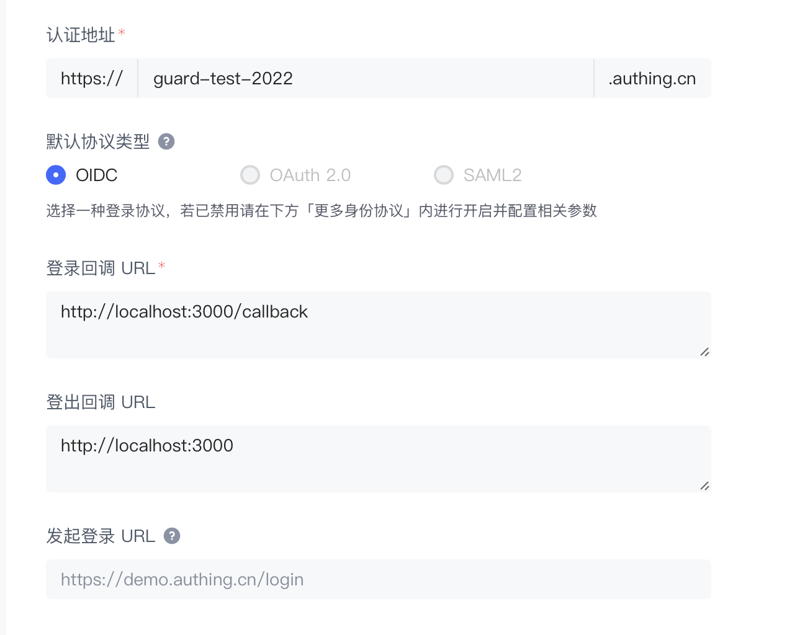

# 将 Guard 接入到单页应用

<LastUpdated />

## 简介

当前使用文档适用于 [Guard 5.0](https://github.com/authing/guard)，如果您正在使用 [Guard 3.x / 4.x](https://github.com/authing/authing-ui-components)，可参考：

- [将 Guard 接入到 React 项目](https://docs.authing.cn/v2/reference/guard/v2/react.html)
- [将 Guard 接入到 Vue 项目](https://docs.authing.cn/v2/reference/guard/v2/vue.html)
- [将 Guard 接入到 Angular 项目](https://docs.authing.cn/v2/reference/guard/v2/angular.html)

Guard 是 Authing 提供的一种轻便的认证组件，你可以把它嵌入在你任何的 SPA（Single Page Application）应用中，一站式处理复杂的用户认证流程。

准备好你的 SPA 项目，跟随引导将 Authing Guard 接入到你的 SPA 项目中吧！

## STEP 1：创建 Authing 应用

1. 使用 Authing 创建一个应用：

<ul style="padding-left: 50px">
  <li>进入<a href="https://console.authing.cn/" target="blank">控制台</a></li>
  <li>展开左侧<strong>应用</strong>菜单，点击<strong>自建应用</strong>菜单</li>
  <li>点击右上角<strong>创建自建应用</strong>按钮</li>
  <li>填写<strong>应用名称</strong>和<strong>认证地址</strong>、选择<strong>单页 Web 应用</strong></li>
  <li>点击创建</li>
</ul>


<br />

2. 在<strong>应用配置</strong>标签页的<strong>认证配置</strong>处填写<strong>登录回调 URL</strong>和<strong>登出回调 URL</strong>



<br />

3. 保存当前配置。

## STEP 2：接入 Guard

根据你的使用场景和个人偏好，在使用 Guard 时，你可以选择是否采用构建流程。

### 使用构建工具

:::: tabs :options="{ useUrlFragment: false }"
::: tab React
``` shell
# 兼容 React 16 / 17
npm install --save @authing/guard-react
:::

::: tab Vue2
``` shell
# 兼容 Vue 2
npm install --save @authing/guard-vue2
```
:::

::: tab Vue3
``` shell
# 兼容 Vue 3
npm install --save @authing/guard-vue3
```
:::

::: tab Angular
``` shell
# 兼容 Angular 14
npm install --save @authing/guard-angular
```
:::
::::

使用 `appId` 即可初始化 Guard，更多可选参数及其应用场景可参考：[GuardOptions](#GuardOptions)

:::: tabs :options="{ useUrlFragment: false }"
::: tab React
``` tsx
// App.tsx
import React from 'react'

import { GuardProvider } from '@authing/guard-react'

import '@authing/guard-react/dist/esm/guard.min.css'

import RouterComponent from './router'

function App() {
  return (
    <GuardProvider
      appId="62e22721c889dd44bad1dda2"
    >
      <RouterComponent></RouterComponent>
    </GuardProvider>
  )
}
```
:::

::: tab Vue2
``` javascript
// main.js
import Vue from 'vue'
import { GuardPlugin } from '@authing/guard-vue2'

import '@authing/guard-vue2/dist/esm/guard.min.css'

Vue.use(GuardPlugin, {
  appId: '62e22721c889dd44bad1dda2'
})
```
:::

::: tab Vue3
``` typescript
// main.ts
import { createApp } from 'vue'

import { GuardPlugin } from '@authing/guard-vue3'

import '@authing/guard-vue3/dist/esm/guard.min.css'

import App from './App.vue'

const app = createApp(App)

app.use(
  createGuard({
    appId: '62e22721c889dd44bad1dda2'
  })
)
```
:::

::: tab Angular
``` json
// angular.json
{
  "projects": {
    "architect": {
      "build": {
        "styles": [
          "node_modules/@authing/guard-angular/dist/guard.min.css"
        ]
      }
    }
  }
}
```

``` typescript
// app.module.ts
import { NgModule } from '@angular/core'
import { BrowserModule } from '@angular/platform-browser'

import { AppRoutingModule } from './app-routing.module'
import { AppComponent } from './app.component'

import { GuardModule } from '@authing/guard-angular'

@NgModule({
  declarations: [
    AppComponent
  ],
  imports: [
    BrowserModule,
    AppRoutingModule,
    GuardModule.forRoot({
      appId: '62e22721c889dd44bad1dda2'
    })
  ],
  providers: [],
  bootstrap: [AppComponent]
})

export class AppModule { }
```
:::
::::

获取 Guard 实例并使用其 API

:::: tabs :options="{ useUrlFragment: false }"
::: tab React
``` tsx
import { useGuard } from '@authing/guard-react'

export default function Login () {
  const guard = useGuard()

  console.log('guard instance: ', guard)

  return <div></div>
}
```
:::

::: tab Vue2
``` typescript
export default {
  created () {
    console.log('guard instance: ', this.$guard)
  }
}
```
:::

::: tab Vue3
``` typescript
// Composition API 
import { useGuard } from '@authing/guard-vue3'

const guard = useGuard()

console.log('guard instance: ', guard)

// Options API
export default {
  created () {
    console.log('guard instance: ', this.$guard)
  }
}
```
:::

::: tab Angular
``` typescript
// Angular 组件中使用 Guard API
import { Component } from '@angular/core'

import { GuardService } from '@authing/guard-angular'

@Component({
  selector: 'login-container',
  templateUrl: './login.component.html',
  styleUrls: ['./login.component.css']
})
export class LoginComponent {
  constructor (
    // // 使用 Angular 依赖注入，获取 Guard 实例
    private guard: GuardService
  ) {}

  userInfo = ''

  ngOnInit () {
   console.log('guard instance: ', this.guard.client)
  }
}
```
:::
::::

点击查看[使用示例](https://github.com/Authing/Guard/tree/master/examples)，下载代码并进入对应的目录，即可快速体验 Guard 基本功能。

### 不使用构建工具

若不想经过构建流程就可以使用 Guard，比如引用 Gurad 的 CDN 资源。请直接复制下面的代码到一个 HTML 文件中，并在浏览器中打开它：

```html
发布了正式版再补 cdn 及 html 代码
```

至此，你已经完成了 Guard 的初始化，接下来你可以使用 Guard 实例来完成后续更多的操作。

## STEP 3：常用操作

Guard 提供三种登录方式，分别是<strong>嵌入模式</strong>、<strong>弹窗模式</strong>、<strong>跳转模式</strong>。

- <strong>嵌入模式</strong>、<strong>弹窗模式</strong>：在指定的 DOM 中渲染一个登录框组件，通过这个组件面板可轻松完成登录、注册、找回密码、MFA 多因素认证、各种社会化登录等操作。[在线体验](https://sample-sso.authing.cn)

- <strong>跳转模式</strong>：Guard 完整集成并封装了 Auhting 认证类 SDK，只需一行代码即可实现登录、登出、处理登录成功后的回调等能力。

使用 Guard 提供的各种 API 可拥有获取用户信息、切换语言、自定义样式等能力。

### 嵌入模式

使用 `start` 和 `unmount` 方法实现组件渲染和卸载。

:::: tabs :options="{ useUrlFragment: false }"
::: tab React
``` tsx
import React, { useEffect } from 'react'

import { useGuard } from '@authing/guard-react'

export default function Login() {
  // 获取 Guard 实例
  const guard = useGuard()

  const unmountGuard = () => guard.unmount()

  useEffect(() => {
    guard.start('#guard').then(userInfo => {
      console.log(userInfo)
    })
  }, [])

  return <>
    <button onClick={unmountGuard}>unmount Guard</button>
    <div id="guard"></div>
  <>
}
```
:::

::: tab Vue2
``` html
<template>
  <div>
    <button @click="unmountGuard">unmount Guard</button>
    <div id="guard"></div>
  </div>
</template>

<script>
export default {
  mounted () {
    this.$guard.start('#guard').then(userInfo => {
      console.log(userInfo)
    })
  },
  methods: {
    unmountGuard () {
      this.$guard.unmount()
    }
  }
}
</script>
```
:::

::: tab Vue3
``` html
<template>
  <div>
    <button @click="unmountGuard">unmount Guard</button>
    <div id="guard"></div>
  </div>
</template>

<script setup scoped>
import { onMounted } from 'vue'
import { useGuard } from '@authing/guard-vue3'

const guard = useGuard()

const unmountGuard = () => guard.unmount()

onMounted(() => {
  guard.start('#root').then(userInfo => {
    console.log(userInfo)
  })
})
</script>
```
:::

::: tab Angular
``` typescript
import { Component } from '@angular/core'

import { GuardService } from '@authing/guard-angular'

@Component({
  selector: 'login-container',
  templateUrl: './login.component.html',
  styleUrls: ['./login.component.css']
})
export class LoginComponent {
  constructor (
    private guard: GuardService
  ) {}

  userInfo = ''

  ngOnInit () {
    this.guard.client.start('#guard').then(userInfo => {
      this.userInfo = userInfo
    })
  }

  unmountGuard () {
    this.guard.client.unmount()
  }
}
```
:::

::: tab CDN
``` html
<div id="guard"></div>

<script>
  guard.start('#guard')
</script>
```
:::
::::

### 弹窗模式

当 Guard 初始化时的参数 `mode` 为 `modal` 时，启动窗口模式，可使用以下 API 操作 Guard 窗口的展示和隐藏。

:::: tabs :options="{ useUrlFragment: false }"
::: tab React
``` tsx
import React, { useEffect } from 'react'
import { useGuard } from '@authing/guard-react'

export export function Login () {
  // 展示 Guard 弹窗
  const showGuard = guard.show()

  // 隐藏 Guard 弹窗
  const hideGuard = guard.hide()

  useEffect(() => {
    guard.start('#guard').then(userInfo => {
      console.log(userInfo)
    })
  }, [])

  return <>
    <button onClick={showGuard}>show Guard</button>
    <button onClick={hideGuard}>hide Guard</button>
    <div id="guard"></div>
  </>
}
```
:::

::: tab Vue2
``` html
<template>
  <div>
    <button @click="showGuard">show Guard</button>
    <button @click="hideGuard">hide Guard</button>
    <div id="guard"></div>
  </div>
</template>

<script>
export default {
  mounted () {
    this.$guard.start('#guard').then(userInfo => {
      console.log(userInfo)
    })
  },
  methods: {
    showGuard () {
      // 展示 Guard 弹窗
      this.$guard.show()
    },

    hideGuard () {
      // 隐藏 Guard 弹窗
      this.$guard.hide()
    }
  }
}
</script>
```
:::

::: tab Vue3
``` html
<template>
  <div>
    <button @click="showGuard">show Guard</button>
    <button @click="hideGuard">hide Guard</button>
    <div id="guard"></div>
  </div>
</template>

<script setup scoped>
import { onMounted } from 'vue'
import { useGuard } from '@authing/guard-vue3'

const guard = useGuard()

// 展示 Guard 弹窗
const showGuard = guard.show()

// 隐藏 Guard 弹窗
const hideGuard = guard.hide()

onMounted(() => {
  guard.start('#guard').then(userInfo => {
    console.log(userInfo)
  })
})
</script>
```
:::

::: tab Angular
``` typescript
import { Component } from '@angular/core'

import { GuardService } from '@authing/guard-angular'

@Component({
  selector: 'login-container',
  templateUrl: './login.component.html',
  styleUrls: ['./login.component.css']
})
export class LoginComponent {
  constructor (
    private guard: GuardService
  ) {}

  ngOnInit () {
    this.guard.client.start('#guard').then(userInfo => {
      console.log(userInfo)
    })
  }

  showGuard () {
    // 展示 Guard 弹窗
    this.guard.client.show()
  },

  hideGuard () {
    // 隐藏 Guard 弹窗
    this.guard.client.hide()
  }
}
```
:::
::: tab CDN
``` html
<div id="show">show Guard</div>
<div id="hide">hide Guard</div>
<div id="guard"></div>

<script>
  guard.start('#guard').then(userInfo => {
    console.log(userInfo)
  })

  document.querySelector('#show').onclick = function () {
    guard.show()
  }

  document.querySelector('#hide').onclick = function () {
    guard.hide()
  }
</script>
```
:::
::::

### 跳转模式

:::: tabs :options="{ useUrlFragment: false }"
::: tab React
``` tsx
// Login.tsx
import React from 'react'

import { useGuard } from '@authing/guard-react'

export default function Jump() {
  const guard = useGuard()

  const onLogin = () => guard.startWithRedirect()

  return (
    <div>
      <div>
        <button onClick={onLogin}>登录</button>
      </div>
    </div>
  )
}
```

``` typescript
// Callback.tsx
import React, { useEffect } from 'react'

import { useHistory } from 'react-router-dom'

import { useGuard } from '@authing/guard-react'

export default function Callback() {
  const history = useHistory()
  const guard = useGuard()

  const handleCallback = async () => {
    await guard.handleRedirectCallback()
    history.replace('/personal')
  }

  useEffect(() => {
    handleCallback()
  })

  return <div>This is Callback page</div>
}
```
:::

::: tab Vue2
``` typescript
// Login.vue
export default {
  created () {
    this.startWithRedirect()
  },
  methods: {
    startWithRedirect () {
      this.$guard.startWithRedirect()
    }
  }
}
```

``` typescript
// Callback.vue
export default {
  created () {
    this.handleRedirectCallback()
  },
  methods: {
    async handleAuthingLoginCallback () {
      await this.$guard.handleRedirectCallback()
      this.$router.replace({
        name: 'Personal'
      })
    }
  }
}
```
:::

::: tab Vue3
``` typescript
// Login.vue
import { onMounted } from 'vue'
import { useGuard } from '@authing/guard-vue3'

const guard = useGuard()

const startWithRedirect = () => guard.startWithRedirect()

onMounted(() => {
  startWithRedirect()
})
```

``` typescript
// Callback.vue
import { onMounted } from 'vue'
import { useRouter } from 'vue-router'
import { useGuard } from '@authing/guard-vue3'

const router = useRouter()
const guard = useGuard()

const handleRedirectCallback = async () => {
  await guard.handleRedirectCallback()
  router.replace({
    name: 'Personal'
  })
}

onMounted(() => {
  handleRedirectCallback()
})
```
:::

::: tab Angular
``` typescript
// Login.ts
import { Component } from '@angular/core'

import { GuardService } from '@authing/guard-angular'

@Component({
  selector: 'login-container',
  templateUrl: './login.component.html',
  styleUrls: ['./login.component.css']
})
export class LoginComponent {
  constructor (
    private guard: GuardService
  ) {}

  startWithRedirect () {
    this.guard.client.startWithRedirect()
  }
}
```

``` typescript
// Callback.ts
import { Component } from '@angular/core'

import { GuardService } from '@authing/guard-angular'

@Component({
  selector: 'callback-container',
  templateUrl: './callback.component.html',
  styleUrls: ['./callback.component.css']
})
export class CallbackComponent {
  constructor (
    private guard: GuardService
  ) {}

  async handleRedirectCallback () {
    await this.guard.client.handleRedirectCallback()

    this.router.navigateByUrl('personal', {
      replaceUrl: true
    })
  }
}
```
:::
::: tab CDN
``` html
<!-- login.html -->
<script>
  guard.startWithRedirect()
</script>
```
``` html
<!-- callback.html -->
<script>
  guard.handleRedirectCallback().then(() => {
    window.location.replace('/personal.html')
  })
</script>
```
:::
::::

### 获取用户信息

:::: tabs :options="{ useUrlFragment: false }"
::: tab React
``` tsx
import React, { useEffect, useState } from 'react'

import { useGuard } from '@authing/guard-react'

export default function Jump() {
  const [userInfo, setUserInfo] = useState()

  const guard = useGuard()

  const getUserInfo = async () => {
    const userInfo = await guard.trackSession()
    setUserInfo(userInfo)
  }

  useEffect(() => {
    getUserInfo()
  })

  return (
    <div>
      <div>
        <button onClick={getUserInfo}>获取用户信息</button>
      </div>
    </div>
  )
}
```
:::

::: tab Vue2
``` html
<template>
  <div>
    <button @click="getUserInfo">获取用户信息</button>
  </div>
</template>

<script>
export default {
  data () {
    return {
      userInfo: null
    }
  },
  methods: {
    async getUserInfo () {
      this.userInfo = await this.$guard.trackSession()
    }
  }
}
</script>
```
:::

::: tab Vue3
``` html
<template>
  <div>
    <button @click="getUserInfo">获取用户信息</button>
  </div>
</template>

<script>
import { onMounted, ref } from 'vue'
import { useGuard } from '@authing/guard-vue3'

const userInfo = ref(null)
const guard = useGuard()

const getUserInfo = async () => {
  const _userInfo = await guard.trackSession()
  userInfo.value = _userInfo
}
</script>
```
:::

::: tab Angular
``` typescript
import { Component } from '@angular/core'

import { GuardService } from '@authing/guard-angular'

@Component({
  selector: 'login-container',
  templateUrl: './login.component.html',
  styleUrls: ['./login.component.css']
})
export class LoginComponent {
  constructor (
    private guard: GuardService
  ) {}

  userInfo = null

  async getUserInfo () {
    this.userInfo = await this.guard.client.trackSession()
  }
}
```
:::
::: tab CDN
``` html
<div id="get-user-info">获取用户信息</div>

<script>
  document.querySelector('#get-user-info').onclick = function () {
    guard.trackSession().then(userInfo => {
      console.log(userInfo)
    })
  }
</script>
```
:::
::::

### 退出登录

:::: tabs :options="{ useUrlFragment: false }"
::: tab React
``` tsx
import React from 'react'

import { useGuard } from '@authing/guard-react'

export default function Jump() {
  const guard = useGuard()

  const onLogout = () => guard.logout()

  return (
    <div>
      <div>
        <button onClick={onLogout}>登录</button>
      </div>
    </div>
  )
}
```
:::

::: tab Vue2
``` typescript
export default {
  methods: {
    onLogout () {
      this.$guard.logout()
    }
  }
}
```
:::

::: tab Vue3
``` typescript
import { onMounted } from 'vue'
import { useGuard } from '@authing/guard-vue3'

const guard = useGuard()

const onLogout = () => guard.logout()
```
:::

::: tab Angular
``` typescript
import { Component } from '@angular/core'

import { GuardService } from '@authing/guard-angular'

@Component({
  selector: 'login-container',
  templateUrl: './login.component.html',
  styleUrls: ['./login.component.css']
})
export class LoginComponent {
  constructor (
    private guard: GuardService
  ) {}

  onLogout () {
    this.guard.client.logout()
  }
}
```
:::
::: tab CDN
``` html
<div id="logout">logout</div>

<script>
  document.querySelector('#logout').onclick = function () {
    guard.logout()
  }
</script>
```
:::
::::

### 用户注册

:::: tabs :options="{ useUrlFragment: false }"
::: tab React
``` tsx
import React from 'react'

import { useGuard } from '@authing/guard-react'

export default function Jump() {
  const guard = useGuard()

  const startRegister = () => guard.startRegister()

  return (
    <div>
      <div>
        <button onClick={startRegister}>startRegister</button>
      </div>
    </div>
  )
}
```
:::

::: tab Vue2
``` typescript
export default {
  methods: {
    startRegister () {
      this.$guard.startRegister()
    }
  }
}
```
:::

::: tab Vue3
``` typescript
import { onMounted } from 'vue'
import { useGuard } from '@authing/guard-vue3'

const guard = useGuard()

const startRegister = () => guard.startRegister()
```
:::

::: tab Angular
``` typescript
import { Component } from '@angular/core'

import { GuardService } from '@authing/guard-angular'

@Component({
  selector: 'login-container',
  templateUrl: './login.component.html',
  styleUrls: ['./login.component.css']
})
export class LoginComponent {
  constructor (
    private guard: GuardService
  ) {}

  startRegister () {
    this.guard.client.startRegister()
  }
}
```
:::
::: tab CDN
``` html
<div id="start-register">startRegister</div>

<script>
  document.querySelector('#start-register').onclick = function () {
    guard.startRegister()
  }
</script>
```
:::
::::

### 判断用户登录状态

:::: tabs :options="{ useUrlFragment: false }"
::: tab React
``` tsx
import React from 'react'

import { useGuard } from '@authing/guard-react'

export default function Jump() {
  const guard = useGuard()

  const checkLoginStatus = () => {
    guard.checkLoginStatus().then(user => {
      // 如果是未登录状态，user 为 undefined
      console.log(user)
    })
  }

  return (
    <div>
      <div>
        <button onClick={checkLoginStatus}>checkLoginStatus</button>
      </div>
    </div>
  )
}
```
:::

::: tab Vue2
``` typescript
export default {
  methods: {
    checkLoginStatus () {
      guard.checkLoginStatus().then(user => {
        // 如果是未登录状态，user 为 undefined
        console.log(user)
      })
    }
  }
}
```
:::

::: tab Vue3
``` typescript
import { onMounted } from 'vue'
import { useGuard } from '@authing/guard-vue3'

const guard = useGuard()

const checkLoginStatus = () => {
  guard.checkLoginStatus().then(user => {
    // 如果是未登录状态，user 为 undefined
    console.log(user)
  })
}
```
:::

::: tab Angular
``` typescript
import { Component } from '@angular/core'

import { GuardService } from '@authing/guard-angular'

@Component({
  selector: 'login-container',
  templateUrl: './login.component.html',
  styleUrls: ['./login.component.css']
})
export class LoginComponent {
  constructor (
    private guard: GuardService
  ) {}

  checkLoginStatus () {
    guard.checkLoginStatus().then(user => {
      // 如果是未登录状态，user 为 undefined
      console.log(user)
    })
  }
}
```
:::
::: tab CDN
``` html
<div id="check-login-status">checkLoginStatus</div>

<script>
  document.querySelector('#check-login-status').onclick = function () {
    guard.checkLoginStatus().then(user => {
      // 如果是未登录状态，user 为 undefined
      console.log(user)
    })
  }
</script>
```
:::
::::

### 切换语言

:::: tabs :options="{ useUrlFragment: false }"
::: tab React
``` tsx
import React, { useEffect, useState } from 'react'

import { useGuard, Lang } from '@authing/guard-react'

export default function Jump() {
  const guard = useGuard()

  const [lang, setLang] = useState<Lang>('zh-CN')

  useEffect(() => {
    guard.start('#guard').then(userInfo => {
      console.log('userInfo from guard.start: ', userInfo)
    })
  }, [])

  const changeLang = () => {
    if (lang === 'zh-CN') {
      setLang('en-US')
    } else {
      setLang('zh-CN')
    }
  }

  useEffect(() => {
    guard.changeLang(lang)
  }, [lang])

  return (
    <div>
      <button onClick={changeLang}>changeLang</button>
      <div id="guard"></div>
    </div>
  )
}
```
:::

::: tab Vue2
``` typescript
export default {
  data: {
    lang: 'zh-CN'
  },
  methods: {
    changeLang () {
      this.lang = this.lang === 'zh-CN' ? 'en-US' : 'zh-CN'
      this.$guard.changeLang(lang)
    }
  }
}
```
:::

::: tab Vue3
``` typescript
import { onMounted } from 'vue'
import { useGuard } from '@authing/guard-vue3'

const guard = useGuard()

let lang = 'zh-CN'

const changeLang = () => {
  lang = lang === 'zh-CN' ? 'en-US' : 'zh-CN'
  guard.changeLang(lang)
}
```
:::

::: tab Angular
``` typescript
import { Component } from '@angular/core'

import { GuardService } from '@authing/guard-angular'

@Component({
  selector: 'login-container',
  templateUrl: './login.component.html',
  styleUrls: ['./login.component.css']
})
export class LoginComponent {
  constructor (
    private guard: GuardService
    private
  ) {}

  lang = 'zh-CN'

  changeLang () {
    this.lang = this.lang === 'zh-CN' ? 'en-US' : 'zh-CN'
    this.guard.client.changeLang(this.lang)
  }
}
```
:::
::: tab CDN
``` html
<div id="change-lang">changeLang</div>

<script>
  let lang = 'zh-CN'

  document.querySelector('#change-lang').onclick = function () {
    lang = 'zh-CN' ? 'en-US' : 'zh-CN'

    guard.changeLang(lang)
  }
</script>
```
:::
::::

### 自定义样式

:::: tabs :options="{ useUrlFragment: false }"
::: tab React
``` tsx
import React, { useEffect, useState } from 'react'

import { useGuard } from '@authing/guard-react'

export default function Jump() {
  const guard = useGuard()

  useEffect(() => {
    guard.start('#guard').then(userInfo => {
      console.log('userInfo from guard.start: ', userInfo)
    })
  }, [])

  const changeContentCSS = () => guard.changeContentCSS('body {background: red}')

  return (
    <div>
      <button onClick={changeContentCSS}>changeContentCSS</button>
      <div id="guard"></div>
    </div>
  )
}
```
:::

::: tab Vue2
``` typescript
export default {
  data: {
    lang: 'zh-CN'
  },
  methods: {
    changeLang () {
      this.$guard.changeContentCSS('body {background: red}')
    }
  }
}
```
:::

::: tab Vue3
``` typescript
import { onMounted } from 'vue'
import { useGuard } from '@authing/guard-vue3'

const guard = useGuard()

const changeLang = () => guard.changeContentCSS('body {background: red}')
```
:::

::: tab Angular
``` typescript
import { Component } from '@angular/core'

import { GuardService } from '@authing/guard-angular'

@Component({
  selector: 'login-container',
  templateUrl: './login.component.html',
  styleUrls: ['./login.component.css']
})
export class LoginComponent {
  constructor (
    private guard: GuardService
    private
  ) {}

  lang = 'zh-CN'

  changeLang () {
    this.guard.client.changeContentCSS('body {background: red}')
  }
}
```
:::
::: tab CDN
``` html
<div id="change-content-css">changeContentCSS</div>

<script>
  document.querySelector('#change-content-css').onclick = function () {
    guard.changeContentCSS('body {background: red}')
  }
</script>
```
:::
::::

## 注册事件

使用 Guard 提供的 `on` 方法可以方便的注册一些实用的事件

:::: tabs :options="{ useUrlFragment: false }"
::: tab React
``` tsx
import { useEffect } from 'react'
import { useGuard } from '@authing/guard-react'

export default function Login () {
  const guard = useGuard()

  useEffect(() => {
    guard.on('event-name', () => {
      console.log('........')
    })
  })

  return <div></div>
}
```
:::

::: tab Vue2
``` typescript
export default {
  mounted () {
    this.$guard.on('event-name', () => {
      console.log('........')
    })
  }
}
```
:::

::: tab Vue3
``` typescript
import { onMounted } from 'vue'
import { useGuard } from '@authing/guard-vue3'

const guard = useGuard()

onMounted(() => {
  guard.on('event-name', () => {
    console.log('........')
  })
})
```
:::

::: tab Angular
``` typescript
import { Component } from '@angular/core'

import { GuardService } from '@authing/guard-angular'

@Component({
  selector: 'login-container',
  templateUrl: './login.component.html',
  styleUrls: ['./login.component.css']
})
export class LoginComponent {
  constructor (
    private guard: GuardService
  ) {}

  ngOnInit () {
    this.guard.client.on('event-name', () => {
      console.log('........')
    })
  }
}
```
:::
::: tab CDN
``` html
<script>
  guard.on('event-name', () => {
    console.log('........')
  })
</script>
```
:::
::::

常用事件列表：

| 事件名称       | 描述                           | 回调参数   | 回调参数说明                                                                                                              |
| -------------- | ------------------------------ | ---------- | ------------------------------------------------------------------------------------------------------------------------- |
| load           | Guard 初始化完成，开始渲染页面 | authClient | AuthenticationClient 对象，详情请查看 [authing-js-sdk](https://docs.authing.cn/v2/reference/sdk-for-node/authentication/) |
| load-error     | Guard 初始化失败               | error      | 错误信息                                                                                                                  |
| login          | 用户登录成功                   | user       | 用户信息                                                                                                                  |
| login-error    | 用户登录失败                   | error      | 错误信息                                                                                                                  |
| register       | 用户注册成功                   | user       | 用户信息                                                                                                                  |
| register-error | 用户注册失败                   | error      | 错误信息                                                                                                                  |
| close          | modal 模式中关闭 Guard 事件    | -          | -                                                                                                                         |

## Guard 内置 Authing JS SDK

Guard 集成了 AuthenticationClient, 可调用 AuthenticationClient 的所有方法。

:::: tabs :options="{ useUrlFragment: false }"
::: tab React
``` tsx
import { useEffect } from 'react'
import { useGuard } from '@authing/guard-react'

export default function Login () {
  const guard = useGuard()

  useEffect(() => {
    guard.getAuthClient().then(authClient => {
      authClient.registerByEmail()
      authClient.validateToken()
      // ........
    })
  })

  return <div></div>
}
```
:::

::: tab Vue2
``` typescript
export default {
  created () {
    this.$guard.getAuthClient().then(authClient => {
      authClient.registerByEmail()
      authClient.validateToken()
      // ........
    })
  }
}
```
:::

::: tab Vue3
``` typescript
import { onMounted } from 'vue'
import { useGuard } from '@authing/guard-vue3'

const guard = useGuard()

onMounted(() => {
  guard.getAuthClient().then(authClient => {
    authClient.registerByEmail()
    authClient.validateToken()
    // ........
  })
})
```
:::

::: tab Angular
``` typescript
import { Component } from '@angular/core'

import { GuardService } from '@authing/guard-angular'

@Component({
  selector: 'login-container',
  templateUrl: './login.component.html',
  styleUrls: ['./login.component.css']
})
export class LoginComponent {
  constructor (
    private guard: GuardService
  ) {}

  ngOnInit () {
    this.guard.client.getAuthClient().then(authClient => {
      authClient.registerByEmail()
      authClient.validateToken()
      // ........
    })
  }
}
```
:::
::: tab CDN
``` html
<script>
  guard.getAuthClient().then(authClient => {
    authClient.registerByEmail()
    authClient.validateToken()
    // ........
  })
</script>
```
:::
::::

参考 [Authentication SDK](https://docs.authing.cn/v2/reference/sdk-for-node/authentication/)

## 附录常用参数列表
### <p id="GuardOptions"></p>

初始化 Guard 所需参数：

| 名称         | 类型            | 默认值 | 必传 | 描述                                               |
| ------------ | --------------- | ------ | ---- | -------------------------------------------------- |
| appId        | String          | -      | 是   | appId                                              |
| mode         | normal / modal  | normal | 否   | Guard 组件展示模式，normal：嵌入模式，modal：窗口模式                                 |
| defaultScene | GuardModuleType | login  | 否   | 组件默认渲染界面     
| align|none / left / center / right | none | 否 | Guard 默认展示位置                              |
| lang         | zh-CN / en-US   | zh-CN  | 否   | 语言                                               |
| isSSO        | Boolean         | true   | 否   | 是否是单点登录                                     |
| host         | String          | -      | 否   | 私有部署时的 API 请求地址，可在 Console 控制台配置 |
| scope        | String          | -      | 否   | OIDC scope                                         |
| redirectUri  | String          | -      | 否   | 回调地址，可在 Console 控制台配置                  |
| state        | String          | -      | 否   | OIDC 状态                                          |

使用以上参数实例化 Guard，您可以体验 Guard 最基本的登录、注册等功能。

**如果想拥有 Guard 的完整能力，可以配置 config 和 authClientOptions（相同参数以上表格中的值优先级更高）**

- [config](#config)
- [authClientOptions](#authClientOptions)
### <p id="config">config</p>

| 名称                  | 类型                                                      | 描述                                                                                                                                                                                                                              | 默认值                 |
| :-------------------- | :-------------------------------------------------------- | :-------------------------------------------------------------------------------------------------------------------------------------------------------------------------------------------------------------------------------- | :--------------------- |
| target                | String                                                    | 指定 Guard 表单的挂载点，接受 [querySelector (opens new window)](https://developer.mozilla.org/en-US/docs/Web/API/Document/querySelector)能接受的所有参数或者 dom 元素，若未传入，Guard 会自动生成一个 div 标签放入 body 的最后面 | -                      |
| mode                  | [GuardMode](#GuardMode)                                   | Guard 组件展示模式                                                                                                                                                                                                                | normal                 |
| title                 | String                                                    | 产品名称                                                                                                                                                                                                                          | Authing 控制台中的配置 |
| logo                  | String                                                    | 产品 logo                                                                                                                                                                                                                         | Authing 控制台中的配置 |
| contentCss            | String                                                    | **自定义 CSS 样式**，如果指定了，会在 DOM 的 head 中插入一个 节点。如 body {background:#6699 !important;}                                                                                                                         | -                      |
| loginMethods          | [LoginMethods](#LoginMethods)                             | 需要使用的普通登录(包括 LDAP)方式列表                                                                                                                                                                                             | Authing 控制台中的配置 |
| registerMethods       | [RegisterMethods](#RegisterMethods)                       | 需要使用的注册方式                                                                                                                                                                                                                | Authing 控制台中的配置 |
| defaultRegisterMethod | [RegisterMethods](#RegisterMethods)                       | 默认展示的注册方式                                                                                                                                                                                                                | Authing 控制台中的配置 |
| defaultScenes         | GuardModuleType                                           | 打开组件时展示的界面                                                                                                                                                                                                              | GuardModuleType.LOGIN  |
| socialConnections     | [SocialConnections](../parameters.md#socialconnections)[] | 需要使用的社会化登录列表，**如果在 Authing 控制台中没有配置，则不会显示**                                                                                                                                                         | Authing 控制台中的配置 |
| enterpriseConnections | Array                                                     | **需要使用的企业身份源列表(不包括 LDAP)**，列表项值为配置的企业身份源唯一标识符，注意：企业身份源需要传入对应 appId 才能使用，**如果在 Authing 控制台中没有配置，则不会显示**                                                     | Authing 控制台中的配置 |
| defaultLoginMethod    | String                                                    | **默认显示的登录方式**。可选值为 options.loginMethods 中的某一项                                                                                                                                                                  | Authing 控制台中的配置 |
| autoRegister          | Boolean                                                   | **是否将注册和登录合并**，合并后如果用户不存在将自动注册                                                                                                                                                                          | Authing 控制台中的配置 |
| disableRegister       | Boolean                                                   | **是否禁止注册**，禁止的话会隐藏「注册」入口                                                                                                                                                                                      | Authing 控制台中的配置 |
| disableResetPwd       | Boolean                                                   | **是否禁止重置密码**，禁止的话会隐藏「忘记密码」入口                                                                                                                                                                              | Authing 控制台中的配置 |
| clickCloseable        | Boolean                                                   | **Modal 模式时是否隐藏登录框右上角的关闭按钮**，如果隐藏，用户将不能通过点击按钮关闭登录框                                                                                                                                        | Authing 控制台中的配置 |
| escCloseable          | Boolean                                                   | **Modal 模式时是否可以通过键盘 ESC 键关闭登录框**                                                                                                                                                                                 | Authing 控制台中的配置 |
| isSSO                 | Boolean                                                   | 是否是单点登录                                                                                                                                                                                                                    | Authing 控制台中的配置 |
| lang                  | 'zh-CN'                                                   | 使用语言，可选值为 zh-CN、en-US                                                                                                                                                                                                   | 'en-US'                |
| langRange             | ('zh-CN'｜ 'en-US')[]                                     | 语言切换可选的范围，如果填入空数组 或 一个项时，则不会显示语言切换按钮                                                                                                                                                            | ['zh-CN', 'en-US']     |
| host                  | String                                                    | 私有部署时的 API 请求地址                                                                                                                                                                                                         | -                      |

### <p id="GuardMode">GuardMode</p>

| 键     | 值       | 说明       |
| :----- | :------- | :--------- |
| Modal  | 'modal'  | 模态框模式 |
| Normal | 'normal' | 正常模式   |

### <p id="LoginMethods">LoginMethods</p>

| 键        | 值                          | 说明                                                                                     |
| :-------- | :-------------------------- | :--------------------------------------------------------------------------------------- |
| LDAP      | 'ldap'                      | LDAP 身份目录登录(需要[配置 LDAP 服务](/connections/ldap/))                              |
| AppQr     | 'app-qrcode'                | APP 扫码登录(需要接入 [APP 扫码登录](/guides/authentication/qrcode/use-self-build-app/)) |
| Password  | 'password'                  | 账号密码登录(包括手机号 + 密码、邮箱 + 密码、用户名 + 密码。)                            |
| PhoneCode | 'phone-code'                | 手机验证码登录                                                                           |
| WxMinQr   | 'wechat-miniprogram-qrcode' | 微信 PC 小程序扫码登录                                                                   |
| AD        | 'ad'                        | AD 用户目录登录                                                                          |

### <p id="RegisterMethods">RegisterMethods</p>

| 键    | 值      | 说明           |
| :---- | :------ | :------------- |
| Email | 'email' | 邮箱注册       |
| Phone | 'phone' | 手机验证码注册 |

### <p id="GuardModuleType">GuardModuleType</p>

| 键       | 值         | 说明     |
| :------- | :--------- | :------- |
| LOGIN    | 'login'    | 登录界面 |
| REGISTER | 'register' | 注册界面 |

### <p id="SocialConnections">SocialConnections</p>

| 键                        | 值                             | 说明                 |
| :------------------------ | :----------------------------- | :------------------- |
| ALIPAY                    | 'alipay'                       | 支付宝登录           |
| GOOGLE                    | 'google'                       | 谷歌登录             |
| WECHATPC                  | 'wechat:pc'                    | 微信 PC 登录         |
| WECHATMP                  | 'wechat:webpage-authorization' | 微信网页授权         |
| WECHATMOBILE              | 'wechat:mobile'                | 微信移动端扫码登录   |
| WECHATWORK_ADDRESS_BOOK   | 'wechatwork:addressbook'       | 企业微信通讯录       |
| WECHATWORK_CORP_QRCONNECT | 'wechatwork:corp:qrconnect'    | 企业微信内部应用     |
| DINGTALK                  | 'dingtalk'                     | 钉钉登录             |
| WEIBO                     | 'weibo'                        | 微博登录             |
| APPLE                     | 'apple'                        | Apple 登录           |
| LARK_PUBLIC               | 'lark-public'                  | 飞书应用商店登录     |
| LARK_INTERNAL             | 'lark-internal'                | 飞书企业自建应用登录 |
| BAIDU                     | 'baidu'                        | 百度登录             |
| LINKEDIN                  | 'linkedin'                     | 领英登录             |
| SLACK                     | 'slack'                        | Slack 登录           |
| YIDUN                     | 'yidun'                        | 网易易盾登录         |
| QINGCLOUD                 | 'qingcloud'                    | 青云 QingCloud 登录  |
| FACEBOOK                  | 'facebook'                     | FaceBook 登录        |

### <p id="authClientOptions">authClientOptions</p>

| 名称                            | 类型                                              | 必填 | 描述                                                               |
| ------------------------------- | ------------------------------------------------- | ---- | ------------------------------------------------------------------ |
| appId                           | String                                            | 是   | 应用 ID                                                            |
| appHost                         | String                                            | 否   | 应用完整域名，如 https://sample-app.authing.cn，不带最后的斜线 '/' |
| tenantId                        | String                                            | 否   | 租户 ID                                                            |
| lang                            | zh-CN / en-US                                     | 否   | 语言                                                               |
| secret                          | String                                            | 否   | 应用密钥                                                           |
| protocol                        | oauth / oidc / saml / cas                         | 否   | 应用身份协议                                                       |
| tokenEndPointAuthMethod         | client_secret_post / client_secret_basic / none   | 否   | 获取 token 端点认证方式                                            |
| introspectionEndPointAuthMethod | client_secret_post / client_secret_basic / none   | 否   | 检查 token 端点认证方式                                            |
| revocationEndPointAuthMethod    | client_secret_post / client_secret_basic / none   | 否   | 撤回 token 端点认证方式                                            |
| timeout                         | Number                                            | 否   | 请求超时时间                                                       |
| websocketHost                   | String                                            | 否   | Websocket 服务器域名                                               |
| requestFrom                     | String                                            | 否   | 请求来源                                                           |
| token                           | String                                            | 否   | token                                                              |
| publicKey                       | String                                            | 否   | 密码传输加密公钥                                                   |
| privateKeys                     | PrivateKey[]                                      | 否   | 用于解密 Token 的私钥                                              |
| onError                         | (code: number, message: string, data?: any): void | 否   | 错误回调函数                                                       |
