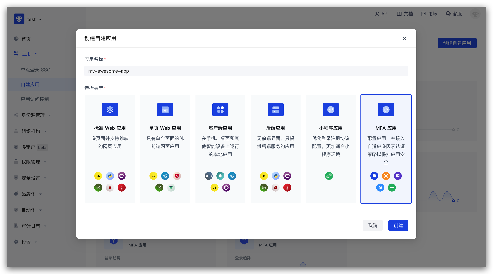

# Authing MFA 多因素认证组件

## 什么是 MFA？

MFA，全称为多因素认证（Multi-Factor Authentication），也被称为强制性身份验证（Strong Authentication），是一种安全措施，通过结合两个或更多不同的身份验证因素来保护用户的身份和信息安全。

在 MFA 中，用户需要提供两个或多个不同的身份验证因素才能通过身份验证。例如，用户需要提供密码和生物识别才能登录到系统中，或者用户需要提供硬件令牌和手机验证码才能完成某个重要操作。

MFA 是一种安全措施，可以提高身份验证的安全性，保护用户的身份和信息安全。

现在开始跟随引导将 Authing MFA 组件接入到你的项目中吧！

|条目|说明|
|-----|----|
|最新版本|1.0.0-alpha.11|
|仓库地址|https://github.com/authing/authing-mfa-component|

## 第一步：在 Authing 控制台创建应用

**首先，你需要将你的应用接入 Authing 控制台**。如果你还没有创建，请先[在 Authing 控制台创建一个应用](https://docs.authing.cn/v2/guides/app-new/create-app/create-app.html)。

从 Authing 控制台左侧导航进入 **自建应用** 功能区，点击右上角的 **创建自建应用** 按钮，填入以下信息：

- 应用名称：填入你的应用名称；
- 认证地址：选择一个二级域名，必须为合法的域名格式，例如 `my-awesome-app`；
- 应用类型：选择 **MFA 应用**。



创建完成！接下来你将正式开始 Authing MFA 组件的接入和配置。


## 第二步：安装并初始化

有两种方式可以供你选择：**安装 Authing library** 或 **直接通过浏览器加载**。

无论使用哪一种安装方式，你都需要用到应用的 **APP ID**，请先 [前往控制台获取](https://console.authing.cn)。关于 **APP ID** 所在位置，请参阅 [应用配置](https://docs.authing.cn/v2/guides/app-new/create-app/app-configuration.html)。

### 方法一：安装 Authing library

::: hint-info
推荐使用 npm 或 yarn，它们能更好的与 `Webpack`、`Rollup` 等打包工具进行配合，也可放心地在生产环境打包部署使用，享受整个生态圈和工具链带来的诸多好处。
:::

首先，通过 npm / yarn 安装 Authing library。

:::: tabs :options="{ useUrlFragment: false }"
::: tab React

```shell
# 兼容 React 16/17
npm install --save @authing/mfa-component-react
# OR
yarn add @authing/mfa-component-react

# 兼容 React 18
npm install --save @authing/mfa-component-react18
# OR
yarn add @authing/mfa-component-react18
```

:::

::: tab Vue2

```shell
# 兼容 Vue 2
npm install --save @authing/mfa-component-vue2

# OR

yarn add @authing/mfa-component-vue2
```

:::

::: tab Vue3

```shell
# 兼容 Vue 3
npm install --save @authing/mfa-component-vue3

# OR

yarn add @authing/mfa-component-vue3
```
:::
::: tab Angular

```shell
# 兼容 Angular 14
npm install --save @authing/mfa-component-angular

# OR

yarn add @authing/mfa-component-angular
```
:::
::::

:::: tabs :options="{ useUrlFragment: false }"
::: tab React

```tsx
// App.tsx

// React 16 / 17
// 代码示例：https://github.com/Authing/authing-mfa-component/blob/master/examples/mfa-component-react/src/App.tsx
import { AuthingMFAProvider } from '@authing/mfa-component-react'
import '@authing/mfa-component-react/dist/index.min.css'

// React 18
// 代码示例：https://github.com/Authing/authing-mfa-component/blob/master/examples/mfa-component-react18/src/App.tsx
// import { AuthingMFAProvider } from '@authing/mfa-component-react18'
// import '@authing/mfa-component-react18/dist/index.min.css'

import React from 'react'

// 你的业务代码根组件
import RouterComponent from './router'

function App() {
  return (
    <AuthingMFAProvider
      appId="AUTHING_APP_ID"
      
      // 如果你使用的是私有化部署的 Authing 服务，需要传入自定义 host，如:
      // host="https://my-authing-app.example.com"
    >
      <RouterComponent></RouterComponent>
    </AuthingMFAProvider>
  );
}
```
:::

::: tab Vue2

```javascript
// main.js
// 代码示例：https://github.com/Authing/authing-mfa-component/blob/master/examples/mfa-component-vue2/src/main.js
import Vue from 'vue'
import { AuthingMFAPlugin } from '@authing/mfa-component-vue2'
import '@authing/mfa-component-vue2/dist/index.min.css'

Vue.use(AuthingMFAPlugin, {
  appId: "AUTHING_APP_ID",

  // 如果你使用的是私有化部署的 Authing 服务，需要传入自定义 host，如:
  // host: 'https://my-authing-app.example.com'
});
```

:::

::: tab Vue3

```typescript
// main.ts
// 代码示例：https://github.com/Authing/authing-mfa-component/blob/master/examples/mfa-component-vue3/src/main.ts
import { createApp } from 'vue'
import { createAuthingMFA } from '@authing/mfa-component-vue3'
import '@authing/mfa-component-vue3/dist/index.min.css'

// 你的业务代码根组件
import App from './App.vue'

const app = createApp(App)

app.use(
  createAuthingMFA({
    appId: "AUTHING_APP_ID",

    // 如果你使用的是私有化部署的 Authing 服务，需要传入自定义 host，如:
    // host: 'https://my-authing-app.example.com'
  })
);
```

:::

::: tab Angular

```json
// 代码示例：https://github.com/Authing/authing-mfa-component/blob/master/examples/mfa-component-angular/angular.json
// angular.json
{
  "projects": {
    "architect": {
      "build": {
        "styles": ["node_modules/@authing/mfa-component-angular/dist/index.min.css"]
      }
    }
  }
}
```

```typescript
// 代码示例：https://github.com/Authing/authing-mfa-component/blob/master/examples/mfa-component-angular/src/app/app.module.ts
// app.module.ts
import { NgModule } from '@angular/core'
import { BrowserModule } from '@angular/platform-browser'
import { AppRoutingModule } from './app-routing.module'
import { AppComponent } from './app.component'
import { AuthingMFAModule } from '@authing/mfa-component-angular'

@NgModule({
  declarations: [AppComponent],
  imports: [
    BrowserModule,
    AppRoutingModule,
    AuthingMFAModule.forRoot({
      appId: "AUTHING_APP_ID",
      
      // 如果你使用的是私有化部署的 Authing 服务，需要传入自定义 host，如:
      // host: 'https://my-authing-app.example.com'
    }),
  ],
  providers: [],
  bootstrap: [AppComponent],
})
export class AppModule {}
```
:::
::::

调试成功后，即完成 Authing library 的初始化加载。

### 方法二：直接通过浏览器加载

首先，在你的 HTML 文件中使用 `script` 和 `link` 标签直接引入文件，并使用全局变量 `AuthingMFAFactory`。

```html
<!-- 代码示例：https://github.com/Authing/authing-mfa-component/blob/master/examples/mfa-component-native/index.html -->
<!DOCTYPE html>
<html lang="en">
<head>
  <meta charset="UTF-8">
  <meta http-equiv="X-UA-Compatible" content="IE=edge">
  <meta name="viewport" content="width=device-width, initial-scale=1.0">
  <title>Authing MFA Demo</title>
  <!-- 替换你自己的 React、React DOM CDN -->
  <script src="xxxxxxxxxx"></script>
  
  <script src="https://cdn.authing.co/packages/authing-mfa-component/1.0.0-alpha.11/index.min.js"></script>
  
  <link rel="stylesheet" type="text/css" href="https://cdn.authing.co/packages/authing-mfa-component/1.0.0-alpha.11/index.min.css" />
</head>
<body>
  <div id="authing-mfa-container"></div>

  <script>
    ;(function (window, document, AuthingMFAFactory) {
      const authingMFA = new AuthingMFAFactory.AuthingMFA({
        appId: '630ed3137dd6f2fd7001da24'
      })

      authingMFA.start({
        el: document.querySelector('#authing-mfa-container'),
        mfaTriggerData: {
          mfaToken: 'xxxxxx',
          // .....
        }
      })
    })(window, document, AuthingMFAFactory);
  </script>
</body>
</html>
```

无论通过哪一种方式，你都可以完成 Authing MFA 组件在你项目中的安装和初始化。

接下来，你可以根据实际的需要，直接阅读对应的使用指南和代码示例。

## 第三步：获取 Authing MFA 实例

:::: tabs :options="{ useUrlFragment: false }"

::: tab React

```tsx
// React 16 / 17
// 代码示例：https://github.com/Authing/authing-mfa-component/blob/master/examples/mfa-component-react/src/pages/MFA.tsx
import { useAuthingMFA } from '@authing/mfa-component-react'

// React 18
// 代码示例：https://github.com/Authing/authing-mfa-component/blob/master/examples/mfa-component-react18/src/pages/MFA.tsx
// import { useAuthingMFA } from '@authing/mfa-component-react18'

export default function MFA() {
  const authingMFA = useAuthingMFA()

  console.log("authing mfa instance: ", authingMFA)

  return <div></div>
}
```

:::

::: tab Vue2

```javascript
// 代码示例：https://github.com/Authing/authing-mfa-component/blob/master/examples/mfa-component-vue2/src/views/MFA.vue
export default {
  created() {
    console.log("authing mfa instance: ", this.$authingMFA);
  },
};
```

:::

::: tab Vue3

```javascript
// 代码示例：https://github.com/Authing/authing-mfa-component/blob/master/examples/mfa-component-vue3/src/views/MFA.vue
import { useAuthingMFA } from '@authing/mfa-component-vue3'

const authingMFA = useAuthingMFA()

console.log('authingMFA instance: ', authingMFA)
```

:::

::: tab Angular

```typescript
// Angular 组件中使用 Authing MFA API
// 代码示例：https://github.com/Authing/authing-mfa-component/blob/master/examples/mfa-component-angular/src/app/pages/mfa/mfa.component.ts
import { Component } from '@angular/core'
import { AuthingMFAService } from '@authing/mfa-component-angular'

@Component({
  selector: "mfa-container",
  templateUrl: "./mfa.component.html",
  styleUrls: ["./mfa.component.css"],
})
export class MFAComponent {
  constructor(
    // 使用 Angular 依赖注入，获取 Authing MFA 实例
    private authingMFA: AuthingMFAService
  ) {}

  ngOnInit() {
    console.log("authing mfa instance: ", this.authingMFA.client);
  }
}
```

:::

::: tab CDN

```javascript
// 代码示例：https://github.com/Authing/authing-mfa-component/blob/master/examples/mfa-component-native/index.html
const authingMFA = new AuthingMFAFactory.AuthingMFA({
  appId: 'AUTHING_APP_ID'
})

console.log("authing mfa instance: ", authingMFA)
```
:::
::::

## 第四步：获取 MFA `mfaTriggerData`

你可以使用 Authing 『基础 MFA』、『自适应 MFA』或『持续自适应 MFA』能力获取 `mfaTriggerData`。

以『基础 MFA』为例：

``` javascript
const url = 'https://core.authing.cn/api/v3/mfa-trigger-data'
const { data: mfaTriggerData } = await axios.get(url, {
  params: {
    appId,
    userId: username,
    userIdType: 'username'
  },
  headers: {
    'x-authing-userpool-id': userPoolId,
    authorization: token
  }
})
```

## 第五步：渲染 Authing MFA 组件

:::: tabs :options="{ useUrlFragment: false }"

::: tab React

```tsx
import { useEffect } from 'react'

// React 16 / 17
// 代码示例：https://github.com/Authing/authing-mfa-component/blob/master/examples/mfa-component-react/src/pages/MFA.tsx
import { useAuthingMFA } from '@authing/mfa-component-react'

// React 18
// 代码示例：https://github.com/Authing/authing-mfa-component/blob/master/examples/mfa-component-react18/src/pages/MFA.tsx
// import { useAuthingMFA } from '@authing/mfa-component-react18'

export default function MFA() {
  const authingMFA = useAuthingMFA()

  useEffect(() => {
    authingMFA.start({
      el: document.querySelector('#authing-mfa-container') as Element,
      mfaTriggerData: {}
    })

    // 监听 MFA 认证成功的事件
    // 认证成功后，执行自定义操作
    authingMFA.on('success', function (code, data) {
      console.log('Authing MFA success: ', code, data)
      // ..... more actions
    })
  }, [])

  return <div id="authing-mfa-container"></div>
}
```

:::

::: tab Vue2

```javascript
// 代码示例：https://github.com/Authing/authing-mfa-component/blob/master/examples/mfa-component-vue2/src/views/MFA.vue
export default {
  mounted() {
    this.$authingMFA.start({
      el: document.querySelector('#authing-mfa-container'),
      mfaTriggerData: {}
    })

    // 监听 MFA 认证成功的事件
    // 认证成功后，执行自定义操作
    this.$authingMFA.on('success', function (code, data) {
      console.log('Authing MFA success: ', code, data)
      // ..... more actions
    })
  },
};
```

:::

::: tab Vue3

```javascript
// 代码示例：https://github.com/Authing/authing-mfa-component/blob/master/examples/mfa-component-vue3/src/views/MFA.vue
import { onMounted } from 'vue'
import { useAuthingMFA } from '@authing/mfa-component-vue3'

const authingMFA = useAuthingMFA()

onMounted(() => {
  authingMFA.start({
    el: document.querySelector('#authing-mfa-container'),
    mfaTriggerData: {}
  })

  // 监听 MFA 认证成功的事件
  // 认证成功后，执行自定义操作
  authingMFA.on('success', function (code, data) {
    console.log('Authing MFA success: ', code, data)
    // ..... more actions
  })
})
```

:::

::: tab Angular

```typescript
// Angular 组件中使用 Authing MFA API
// 代码示例：https://github.com/Authing/authing-mfa-component/blob/master/examples/mfa-component-angular/src/app/pages/mfa/mfa.component.ts
import { Component } from '@angular/core'
import { AuthingMFAService } from '@authing/mfa-component-angular'

@Component({
  selector: "mfa-container",
  templateUrl: "./mfa.component.html",
  styleUrls: ["./mfa.component.css"],
})
export class MFAComponent {
  constructor(
    // 使用 Angular 依赖注入，获取 Authing MFA 实例
    private authingMFA: AuthingMFAService
  ) {}

  ngOnInit() {
    this.authingMFA.client.start({
      el: document.querySelector('#authing-mfa-container') as Element,
      mfaTriggerData: {}
    })

    // 监听 MFA 认证成功的事件
    // 认证成功后，执行自定义操作
    this.authingMFA.client.on('success', function (code, data) {
      console.log('Authing MFA success: ', code, data)
      // ..... more actions
    })
  }
}
```

:::

::: tab CDN

```javascript
// 代码示例：https://github.com/Authing/authing-mfa-component/blob/master/examples/mfa-component-native/index.html
const authingMFA = new AuthingMFAFactory.AuthingMFA({
  appId: 'AUTHING_APP_ID'
})

authingMFA.start({
  el: document.querySelector('#authing-mfa-container'),
  mfaTriggerData: {}
})
```
:::
::::

## Authing MFA 初始化参数列表

<p id="IMFAInitOptions"></p>

| 参数名| 参数说明 | 类型 | 是否必传 | 默认值|
| ---- | ---- | ---- | ---- | ---- |
| appId| Authing 自建应用 APP ID | String | 是 | - |
| host | 私有化部署地址 | String | 否 | - |
| style| 自定义 CSS 样式 | CSSProperties | 否 | - |
|lang | 多语言配置 | [Lang](#Lang) | 否 | - |

## 事件列表

使用 Authing 提供的 `on` 方法可以对 Authing MFA 支持的事件进行监听：

| 事件名称 | 说明 | 回调参数 |
| ---- | ---- | ---- |
| load | Authing MFA 基本数据加载完毕，尚未渲染 | - |
| mount | Authing MFA 组件渲染完毕，可访问 DOM | - |
| unmount | Authing MFA 组件销毁| - |
| success|认证成功| <p>code</p> <p>data</p>|
| fail|认证失败| <p>message</p>|
| saveRecoveryCode|恢复码保存成功| - |

## 类型定义

<p id="Lang"></p>

| 值    | 描述 |
| ----- | ---- |
| zh-CN | 中文 |
| en-US | 英文 |
| zh-TW | 繁体 |
| ja-JP | 日语 |
