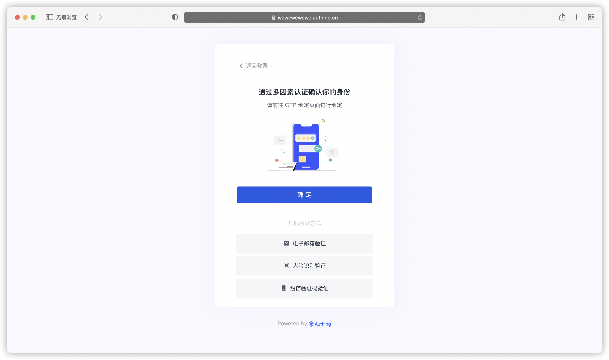

# 接入 Authing MFA 多因素认证组件

## 什么是 MFA？

MFA，全称为多因素认证（Multi-Factor Authentication），也被称为强制性身份验证（Strong Authentication），是一种安全措施，通过结合两个或更多不同的身份验证因素来保护用户的身份和信息安全。

在 MFA 中，用户需要提供两个或多个不同的身份验证因素才能通过身份验证。例如，用户需要提供密码和生物识别才能登录到系统中，或者用户需要提供硬件令牌和手机验证码才能完成某个重要操作。

MFA 是一种安全措施，可以提高身份验证的安全性，保护用户的身份和信息安全。

现在开始跟随引导将 Authing MFA 组件接入到你的项目中吧！

| 条目     | 说明                                             |
| -------- | ------------------------------------------------ |
| 最新版本 | 1.0.0-alpha.14                                   |
| 仓库地址 | https://github.com/authing/authing-mfa-component |
| 快速开始 | <a href="https://docs.authing.cn/v2/reference/mfa/web-mfa.html" _target="blank"> 接入 Web MFA </a> |

Authing MFA 是一种安全认证技术，它使用多个身份验证因素来确保用户的身份。在为你的应用接入 Authing MFA 后，你的应用将能够使用 Authing 开放的各种多因素认证相关能力，包括但不限于：

## 丰富多样的认证方式

- 基于短信验证码
- 基于邮件验证码
- 基于 OTP 口令验证
- 基于人脸识别验证

## 获取帮助

请访问 [Authing 论坛](https://forum.authing.cn/)。
