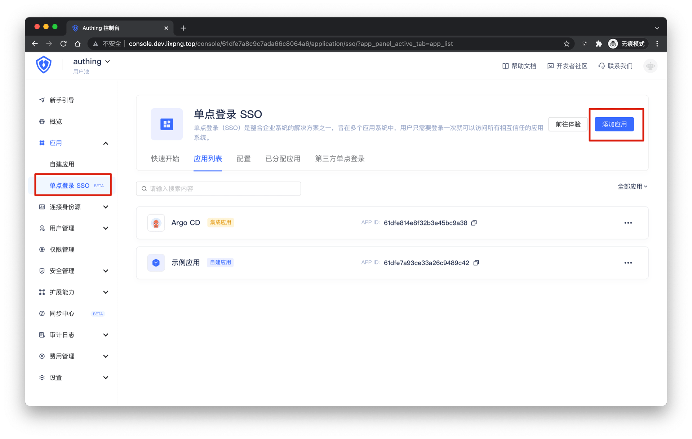
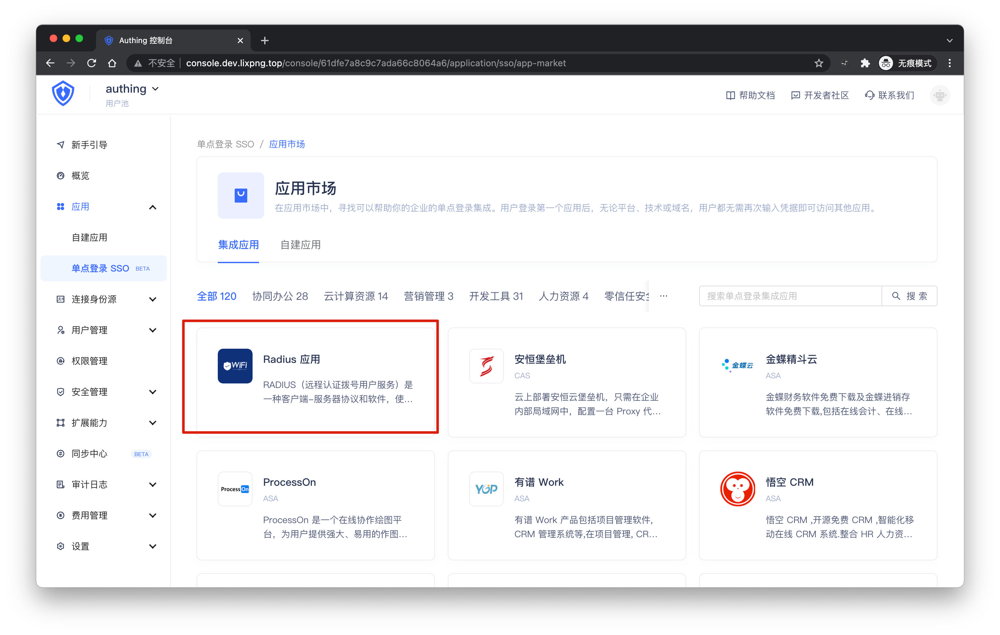
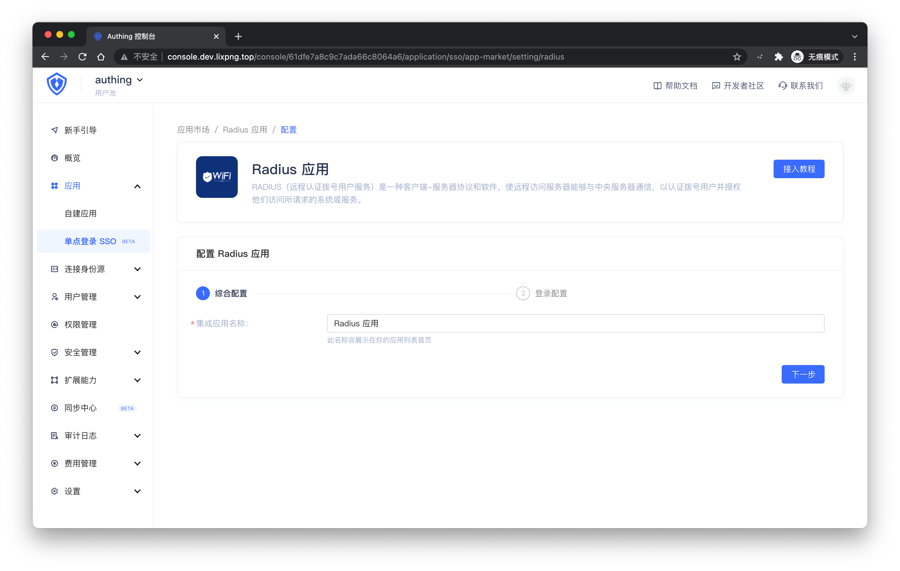
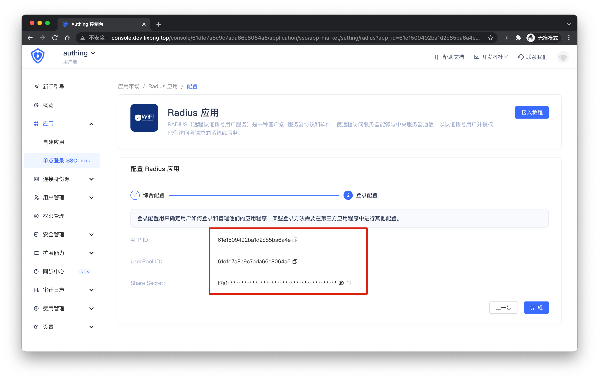
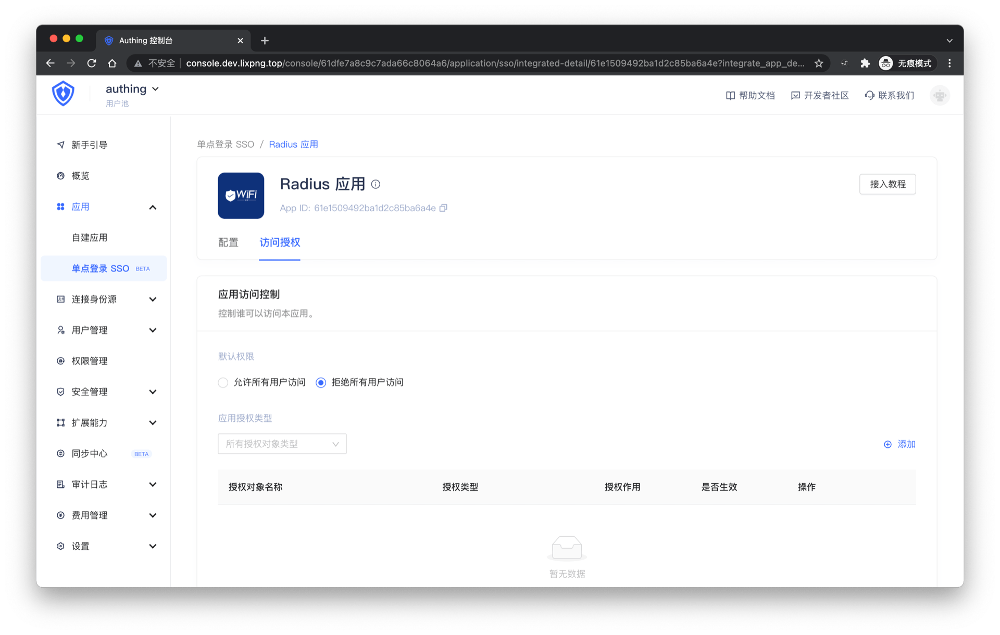

# Radius 服务器搭建步骤

<LastUpdated/>

## 步骤一：[下载 Authing Radius Agent](https://github.com/Authing/radius/releases/download/2.0.0/AuthingRadius-2.0.0.zip)

<br>

## 步骤二：安装 Authing Radius Agent

- 首先要准备一台支持 java 的服务器用来安装 Authing Radius Agent

- 确保设备安装了 java 11 或以上版本

- 将步骤一下载的安装包拷贝至设备文件系统，如：/root/radius/AuthingRadius.jar

<br>

## 步骤三：在 Authing 控制台创建 Radius 应用

在 Authing 控制 **应用** -> **单点登录 SSO** 页面点击「添加应用」



找到 **Radius 应用**，点击进入创建界面，然后点击「获取应用」



填写应用名



点击「下一步」，可以看到需要的配置信息



点击「完成」，进入**访问授权**，给用户授权访问权限



<br>

## 步骤四：配置 Authing Radius Agent

cd 到目标设备上 Agent 所在目录，创建 config.json，填入以下配置信息：

```json
{
  "scheme": "https",
  "port": 1812,
  "userPoolId": "your authing user pool id",
  "appId": "your authing radius app id",
  "sharedSecret": "copy from your authing radius app in authing console",
  "authingHost": "core.authing.cn",
  "publicKey": "replace_with_your_on_premise_authing_public_key"
}
```

| 参数名       |  类型  |                          说明                           |     默认值      |
| ------------ | :----: | :-----------------------------------------------------: | :-------------: |
| scheme       | 字符串 |               发送给 authing 的请求 sheme               |      https      |
| port         |  整数  | Radius 服务端口，需要和 Radius 客户端应用程序的设置匹配 |      1812       |
| userPoolId   | 字符串 |                    authing 用户池 id                    |                 |
| appId        | 字符串 |                 authing radius 应用 id                  |                 |
| sharedSecret | 字符串 |           authing radius 应用的 SharedSecret            |                 |
| authingHost  | 字符串 |      若私有化部署了 authing，需要填写私有化的域名       | core.authing.cn |
| publicKey    | 字符串 |           authing 服务的公钥。在私有化部署场景需要指定。若使用 SaaS 版本，请删掉本字段           |        SaaS 版本默认值         |

<br>

## 步骤五：配置服务器证书

Authing Radius Agent 支持协议包括：

* PAP
* EAP-GTC
* EAP-TTLS-PAP
* EAP-TTLS-GTC

若使用 PAP、EAP-GTC 协议，则不涉及证书问题，可以跳过此步骤。

若使用 EAP-TTLS-PAP、EAP-TTLS-GTC 协议，则要求配置服务器证书。

首先在 AuthingRadius.jar 所在目录创建文件夹，命名为 cer，然后将证书以及私钥通过 openssl 命令转为 der 格式，拷贝到 cer 目录下。证书的文件名为：server.der；私钥的文件名为：server_pri.der

> 如果没有自己的证书，可以使用 zip 包里面的自签名证书

<br>

## 步骤六：启动 Authing Radius Agent

在 Authing Radius Agent 所在目录下，运行

```shell
java -jar AuthingRadius.jar
```

<br>

## 步骤七：测试 / 验证 Radius 服务

可以用支持 Radius 的设备 / 应用程序进行测试。也可以下载我们的 [Authing Radius 测试客户端](https://github.com/Authing/radius/releases/download/1.0.0/AuthingRadiusClient.jar)

在本机，cd 到我们的测试客户端所在目录，运行：

```shell
java -jar AuthingRadiusClient.jar your_agent_ip your_secret username password
```

示例：

```shell
java -jar AuthingRadiusClient.jar 192.168.1.100 1234567890 test 123456
```

<br>

## Best Practice

1. 让 Agent 以 Daemon 进程方式运行。Linux 系统下面运行：

```shell
nohup java -jar AuthingRadius.jar > /dev/null &
```

2. 对 config.json 的任何修改都需要重启 Agent。注意需要先退出运行的 Agent，否则会报端口被占用。在 Linux 系统下，可以考虑使用类似下面的脚本：
```shell
kill -9 `lsof -t -i:1812`
nohup java -jar AuthingRadius.jar > /dev/null &
echo
```

3. Agent 日志和 Agent 在同一目录下，文件名：radius.log

