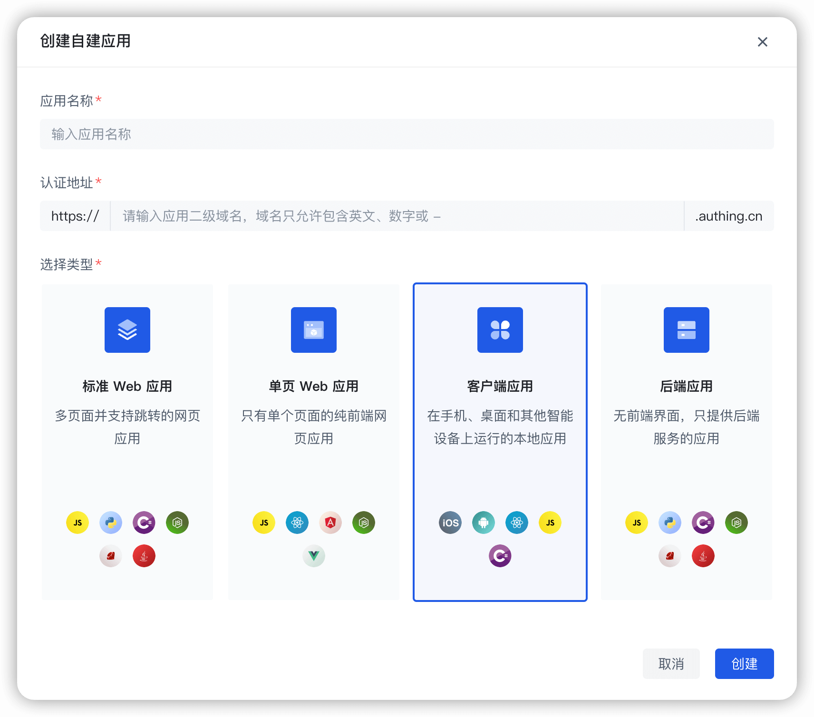

# Android Guard

<LastUpdated/>

Guard Android SDK 包含 **[Guard 登录组件](./component/README.md)** 及 **[用户认证 API](./apis/README.md)** 两部分：

**Guard 登录组件** 采用了全新的 [语义化编程模型](https://github.com/Authing/guard-android/blob/master/doc/topics/design.md)，App 通过 Guard 可以快速构建自定义风格的认证流程。

如果想自己实现认证流程，独立构建自己的登录注册等 UI 界面，可以通过 **用户认证 API** 部分实现。

## 基本信息

| 条目         | 说明                                                                                     |
| ------------ | ---------------------------------------------------------------------------------------- |
| 支持版本     | Android 7.0 +                                                                            |
| 仓库地址     | [https://github.com/Authing/guard-android](https://github.com/Authing/guard-android)     |
| SDK 名称     | Guard Android SDK                                                                        |
| 开发者       | 北京蒸汽记忆科技有限公司                                                                 |
| 版本         | 2.0.0                                                                                    |
| 主要功能     | 包含基本登录组件的封装，如账密登录、手机号验证码登录，以及对 Authing 登录认证 API 的封装 |
| 个人信息收集 | 本 SDK 不收集个人隐私信息                                                                |
| 合规使用说明 | 参考[合规使用指南](/reference/sdk-for-android/compliance-guidelines.md)                  |

## 开始之前

在开始开发之前，需要准备以下内容：

1. 开发设备上安装 [AndroidStudio](https://developer.android.google.cn/studio)。

2. 免费创建一个 [Authing 帐号](https://www.authing.cn/)。

3. 在 Authing 控制台 [创建一个客户端自建应用](/guides/app-new/create-app/create-app.md)。

- 在 **选择类型** 时请选择：**客户端应用**。

- 创建完应用后，你可以根据你的业务需求来进行自定义配置，参考 [应用常用配置](./scenario/application_config.md)。

 

<a href="./quick.html" style="color:#FFF;">快速开始 →</a>

 
