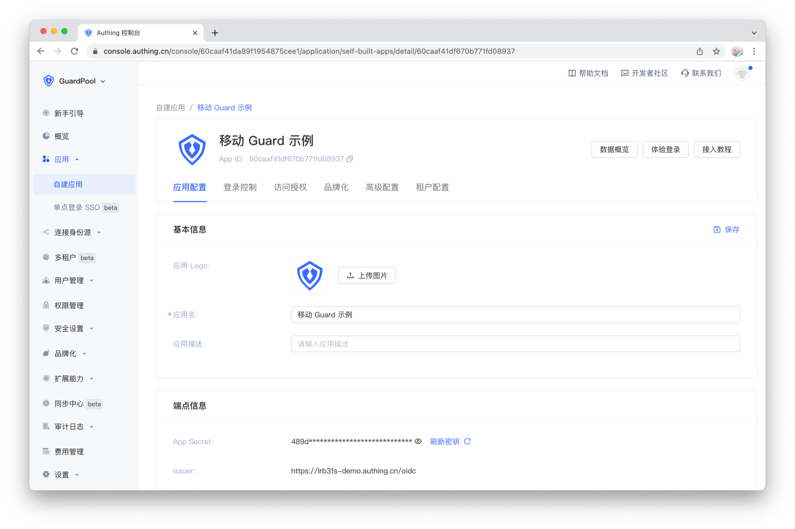

# 超组件

<LastUpdated/>

如果应用需要自定义认证流程和界面，推荐使用超组件（Hyper Component）快速构建认证流程和界面。

超组件（Hyper Component）是我们在低代码领域的重要创新，它具备以下特性：

* 语义化
* 上下文感知
* 数据实时同步
* 声明式编程
* 可嵌入

Guard 提供了认证领域相关、功能齐全的超组件集合，开发者只需要在需要的地方“放置”相应的超组件即可实现业务功能。
接下来，我们通过一个简单例子来展示语义化编程的魅力。

假设我们需要在某个地方显示应用图标，并在其下面显示应用名称。应用图标和名称都可以在控制台配置：

按照传统编程模型思路，我们需要写非常多的代码。具体来说，我们需要在 xml 里面放置 UI 控件，我们还需要编写网络请求代码，然后将网络请求结果刷新 UI。这里有很多细节，举例来说，网络请求结束后的回调是在后台线程，如果直接设置 UI，应用程序就会崩溃。另外，图片的保存还涉及到本地磁盘以及内存缓存。

如果使用超组件，开发就变得非常简单。

## 组件

| 名称                                                    | 组件名称                | 类型         |
| ------------------------------------------------------- | :---------------------- | ------------ |
| [应用图标](./basic/app-logo.md)                         | AppLogo                 | ImageView    |
| [应用名称](./basic/app-name.md)                         | AppName                 | TextView     |
| [账号输入框](./basic/account-edit-text.md)              | AccountEditText         | EditText     |
| [密码输入框](./basic/password-edit-text.md)             | PasswordEditText        | EditText     |
| [密码确认输入框](./basic/password-confirm-edit-text.md) | PasswordConfirmEditText | EditText     |
| [电话号码输入框](./basic/phonenumber-edit-text.md)      | PhoneNumberEditText     | EditText     |
| [邮箱输入框](./basic/email-edit-text.md)                | EmailEditText           | EditText     |
| [验证码输入框](./basic/verifycode-edit-text.md)         | VerifyCodeEditText      | EditText     |
| [获取短信验证码按钮](./basic/get-verifycode-button.md)  | GetVerifyCodeButton     | Button       |
| [获取邮箱验证码按钮](./basic/get-emailcode-button.md)   | GetEmailCodeButton      | Button       |
| [注册按钮](./basic/register-button.md)                  | RegisterButton          | Button       |
| [登录按钮](./basic/login-button.md)                     | LoginButton             | Button       |
| [跳转注册按钮](./basic/go-register-button.md)           | GoRegisterButton        | Button       |
| [跳转登录按钮](./basic/go-login-button.md)              | GoLoginButton           | Button       |
| [跳转忘记密码按钮](./basic/go-fogot-password-button.md) | GoForgotPasswordButton  | Button       |
| [跳转问题反馈按钮](./basic/go-feedback-button.md)       | GoFeedbackButton        | Button       |
| [登录方式切换栏](./basic/login-method-tab.md)           | LoginMethodTab          | LinearLayout |
| [登录容器](./basic/login-container.md)                  | LoginContainer          | LinearLayout |
| [注册方式切换栏](./basic/register-method-tab.md)        | RegisterMethodTab       | LinearLayout |
| [注册容器](./basic/register-container.md)               | RegisterContainer       | LinearLayout |
| [隐私协议按钮](./basic/privacy-confirm-box.md)          | PrivacyConfirmBox       | LinearLayout |
| [错误文本](./basic/error-text.md)                       | ErrorTextView           | TextView     |

 
<a href="./tutorial/example.html" style="color:#FFF;">超组件入门示例 →</a>
