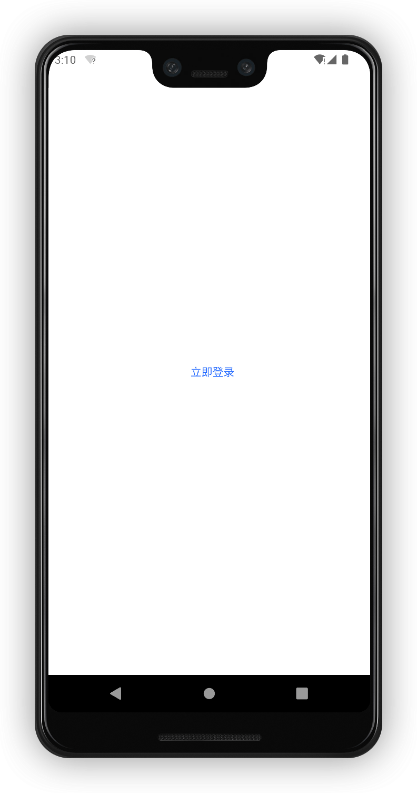
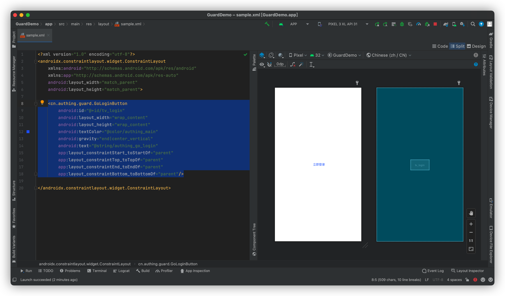

# GoLoginButton

<LastUpdated/>

此组件提供跳转按钮的样式和国际化文本

## 示例



## 创建

放置一个 GoLoginButton

```xml
<cn.authing.guard.GoLoginButton
    android:id="@+id/tv_login"
    android:layout_width="wrap_content"
    android:layout_height="wrap_content"
    android:textColor="@color/authing_main"
    android:gravity="end|center_vertical"
    android:text="@string/authing_go_login"
    app:layout_constraintStart_toStartOf="parent"
    app:layout_constraintTop_toTopOf="parent"
    app:layout_constraintEnd_toEndOf="parent"
    app:layout_constraintBottom_toBottomOf="parent"/>
```



