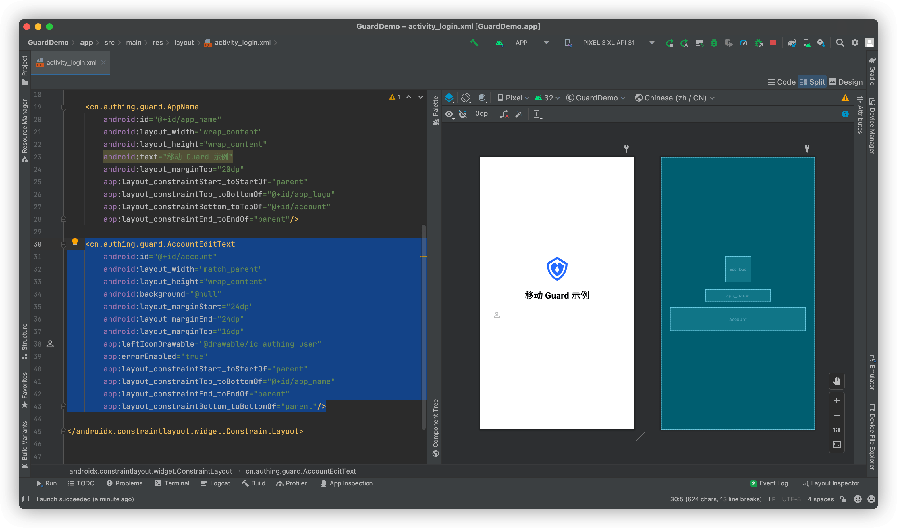
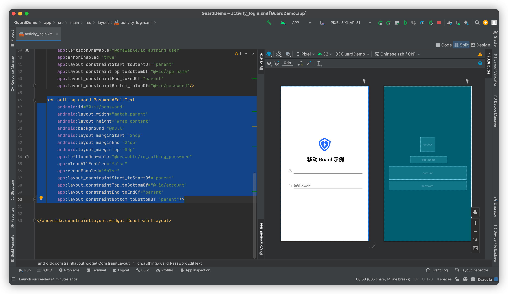
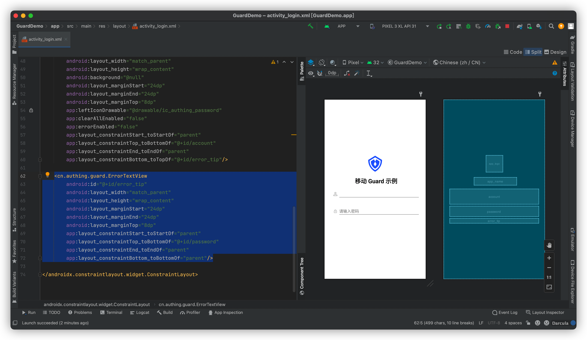
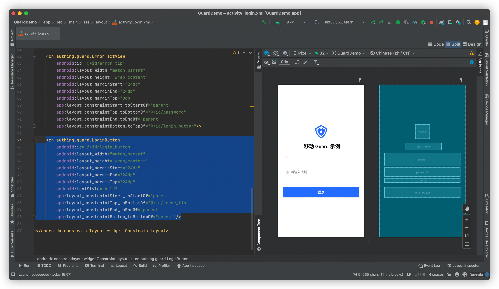
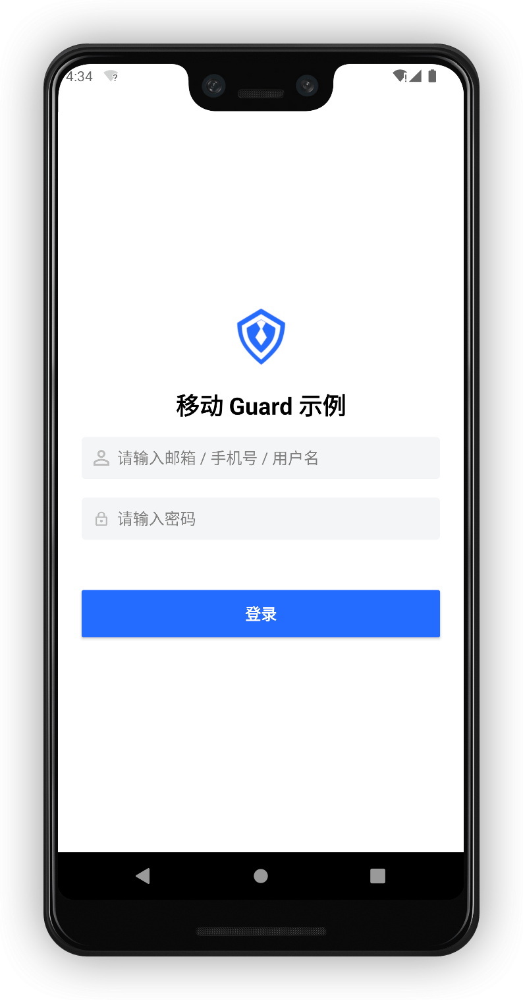
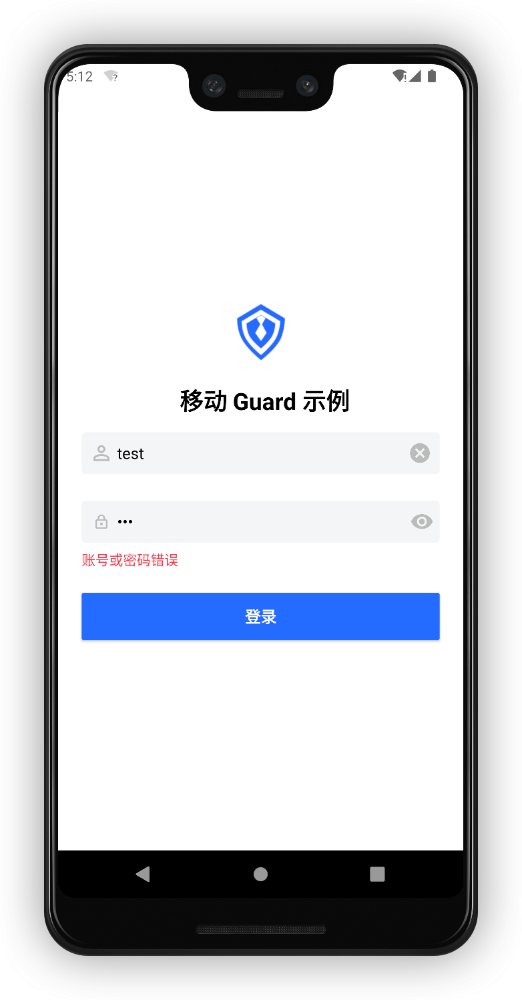
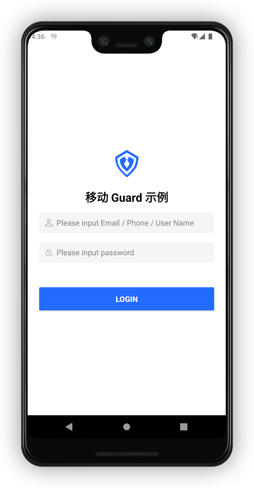

# 基础登录示例

<LastUpdated/>

阅读此教程之前，确保已经完成了 [开发准备](/reference/sdk-for-android/develop.md)

## 在 xml 上放置超组件

放置一个 AccountEditText



再放置一个  PasswordEditText



再放置一个 ErrorTextView



再放置一个 LoginButton



## 运行






一个具有登录业务能力的界面就开发完了，输入有效的用户名密码，点击登录就可以完成认证。如果登录出现错误，服务器返回的错误信息也能直接显示在 ErrorTextView 上。

>Guard 超组件提供了一些默认的视觉效果，如输入框获取焦点时，会播放一个高亮边框的动画；输入框提示语跟随 Authing 控制台配置；密码输入框默认提供 “显示明文”按钮；点击登录按钮时，会播放加载动画等等。如果需要自定这些视觉效果，请参考每个组件的详细说明。


Guard支持中英文版本，当我们把手机系统设置为英文后，效果如下：



接下来，我们获取登录成功回调信息：

```java
LoginButton btn = findViewById(R.id.login_button);
btn.setOnLoginListener((code, message, data) -> {
  if (code == 200) {
    //login success
  }
});
        
```

登录成功后也可以通过如下代码获取本地用户数据

```java
UserInfo userInfo = Authing.getCurrentUser();
```

## 完整示例代码

```xml
<?xml version="1.0" encoding="utf-8"?>
<androidx.constraintlayout.widget.ConstraintLayout
    xmlns:android="http://schemas.android.com/apk/res/android"
    xmlns:app="http://schemas.android.com/apk/res-auto"
    android:layout_width="match_parent"
    android:layout_height="match_parent">

    <cn.authing.guard.AppLogo
        android:id="@+id/app_logo"
        android:layout_width="68dp"
        android:layout_height="68dp"
        app:layout_constraintStart_toStartOf="parent"
        app:layout_constraintEnd_toEndOf="parent"
        app:layout_constraintTop_toTopOf="parent"
        app:layout_constraintBottom_toTopOf="@+id/app_name"
        app:layout_constraintVertical_chainStyle="packed"
        android:src="@drawable/ic_authing_default_logo"/>

    <cn.authing.guard.AppName
        android:id="@+id/app_name"
        android:layout_width="wrap_content"
        android:layout_height="wrap_content"
        android:text="移动 Guard 示例"
        android:layout_marginTop="20dp"
        app:layout_constraintStart_toStartOf="parent"
        app:layout_constraintTop_toBottomOf="@+id/app_logo"
        app:layout_constraintBottom_toTopOf="@+id/account"
        app:layout_constraintEnd_toEndOf="parent"/>

    <cn.authing.guard.AccountEditText
        android:id="@+id/account"
        android:layout_width="match_parent"
        android:layout_height="wrap_content"
        android:background="@null"
        android:layout_marginStart="24dp"
        android:layout_marginEnd="24dp"
        android:layout_marginTop="16dp"
        app:leftIconDrawable="@drawable/ic_authing_user"
        app:errorEnabled="true"
        app:layout_constraintStart_toStartOf="parent"
        app:layout_constraintTop_toBottomOf="@+id/app_name"
        app:layout_constraintEnd_toEndOf="parent"
        app:layout_constraintBottom_toTopOf="@+id/password"/>

    <cn.authing.guard.PasswordEditText
        android:id="@+id/password"
        android:layout_width="match_parent"
        android:layout_height="wrap_content"
        android:background="@null"
        android:layout_marginStart="24dp"
        android:layout_marginEnd="24dp"
        android:layout_marginTop="0dp"
        app:leftIconDrawable="@drawable/ic_authing_password"
        app:clearAllEnabled="false"
        app:errorEnabled="false"
        app:layout_constraintStart_toStartOf="parent"
        app:layout_constraintTop_toBottomOf="@+id/account"
        app:layout_constraintEnd_toEndOf="parent"
        app:layout_constraintBottom_toTopOf="@+id/error_tip"/>

    <cn.authing.guard.ErrorTextView
        android:id="@+id/error_tip"
        android:layout_width="match_parent"
        android:layout_height="wrap_content"
        android:layout_marginStart="24dp"
        android:layout_marginEnd="24dp"
        android:layout_marginTop="8dp"
        app:layout_constraintStart_toStartOf="parent"
        app:layout_constraintTop_toBottomOf="@+id/password"
        app:layout_constraintEnd_toEndOf="parent"
        app:layout_constraintBottom_toTopOf="@+id/login_button"/>

    <cn.authing.guard.LoginButton
        android:id="@+id/login_button"
        android:layout_width="match_parent"
        android:layout_height="wrap_content"
        android:layout_marginStart="24dp"
        android:layout_marginEnd="24dp"
        android:layout_marginTop="24dp"
        android:textStyle="bold"
        app:layout_constraintStart_toStartOf="parent"
        app:layout_constraintTop_toBottomOf="@+id/error_tip"
        app:layout_constraintEnd_toEndOf="parent"
        app:layout_constraintBottom_toBottomOf="parent"/>

</androidx.constraintlayout.widget.ConstraintLayout>
```


此教程展示了如何在 5 分钟左右的时间构建一个简单的登录界面。接下来，我们再构建一个更为复杂的登录界面。


<span style="background-color: #396aff;a:link:color:#FFF;padding:8px;border-radius: 4px;"><a href="./advanced-login.html" style="color:#FFF;">复杂登录示例 →</a>
</span>

