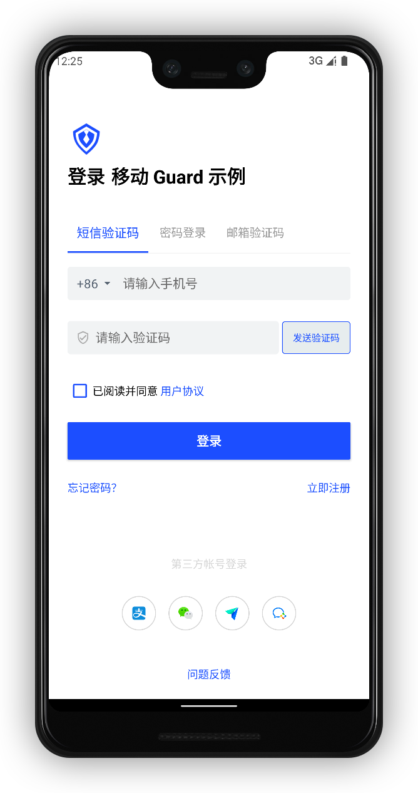

# 快速接入

<LastUpdated/>

通过 Authing 提供的标准认证流程和界面，应用程序可以 1 分钟完成接入。

首先确保已经完成了 开发准备工作，然后在需要认证的地方调用：

```java
AuthFlow.start(this);
```

效果如下：



接下来，我们获取登录成功回调信息：

```java
  @Override
  protected void onActivityResult(int requestCode, int resultCode, @Nullable Intent data) {
    super.onActivityResult(requestCode, resultCode, data);
    if (requestCode == RC_LOGIN && resultCode == OK && data != null) {
      //login success，do next task
    }
  }
```

登录成功后也可以通过如下代码获取本地用户数据

```java
UserInfo userInfo = Authing.getCurrentUser();
```

