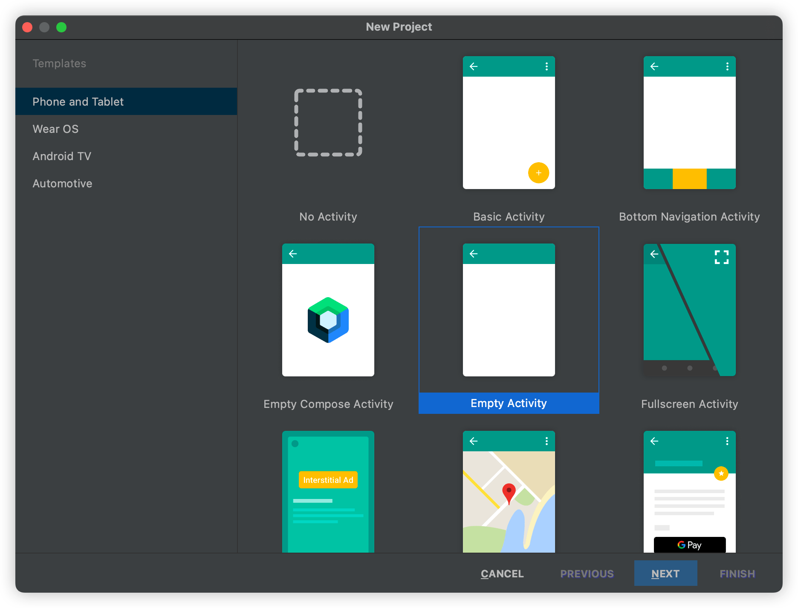
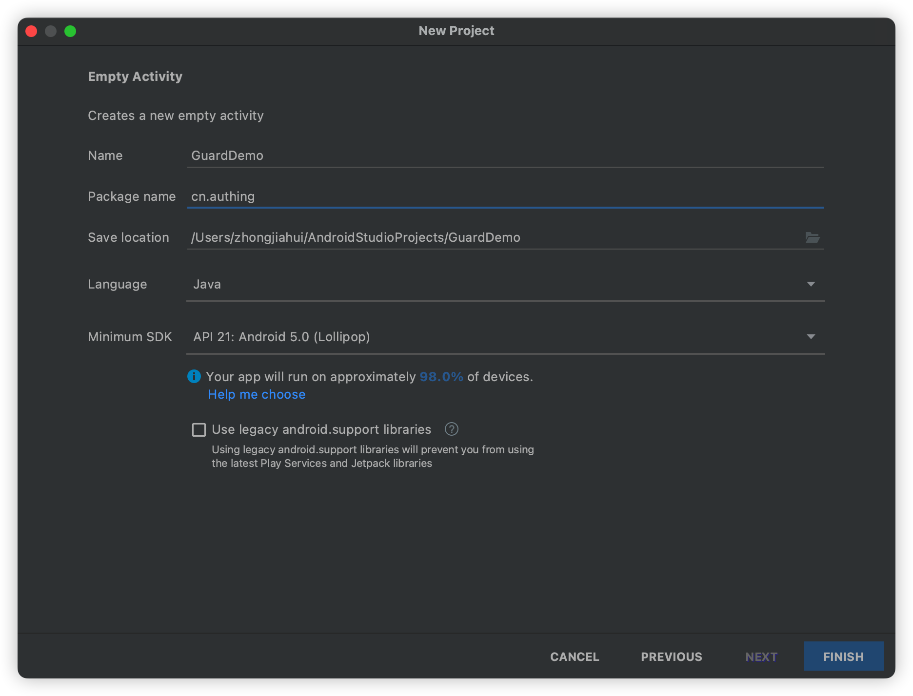

# 快速开始

<LastUpdated/>

## 第一步：新建 Android 工程





:::hint-info
注意：Minimum SDK 版本 Android 7.0
:::

## 第二步：添加 Guard 依赖

在工程根目录的 build.gradle	(4.2+以后的版本 AndroidStudio 创建的新工程在 setting.gradle) 文件里面需包含 mavenCentral

 ```groovy
 buildscript {
    repositories {
        mavenCentral()
        // other repositories
    }
 }
 ```

在主工程的 build.gradle 文件里面添加依赖

```groovy
implementation 'cn.authing:guard:+'
```

## 第三步：添加权限

在 AndroidManifest.xml 中：

```xml
<uses-permission android:name="android.permission.INTERNET"/>
```

## 第四步：初始化

在应用启动时调用：

```java
// context is application or initial activity
// ”AUTHING_APP_ID“ is obtained from the Authing console
Authing.init(context, "AUTHING_APP_ID");
```

:::hint-info
注意：AUTHING_APP_ID 是应用 ID，不是用户池 ID，请先[前往控制台获取](https://docs.authing.cn/v2/guides/faqs/get-app-id-and-secret.html)
:::

:::hint-info
注意：如果需要登录成功后获取到 accessToken，请先参考[登录成功获取到 accessToken](https://docs.authing.cn/v2/reference/sdk-for-android/scenario/application_config.html#登录成功获取到-accesstoken) 配置
:::

## 第五步：常用操作

### 1. 注册/登录并获取用户信息

我们提供了三种方式来帮助开发者实现认证流程： 

- 如果想独立构建自己的登录注册等 UI 界面，只调用认证相关接口，推荐[使用 SDK API](./apis/)。
- 如果想两行代码实现包括 UI 的整个认证流程，推荐[使用 SDK 托管页](./develop.md)。
- 如果想通过[语义化编程模型](https://github.com/Authing/guard-android/blob/master/doc/topics/design.md)快速构建自定义风格的认证流程，推荐[使用 SDK 超组件](./component/)。

### 2. [第三方身份源登录](./social/)

### 3. [典型场景](./scenario/)

### 4. [私有化部署](./onpremise.md)

