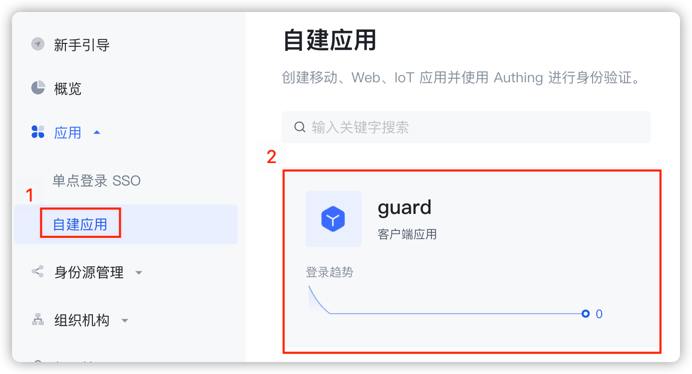
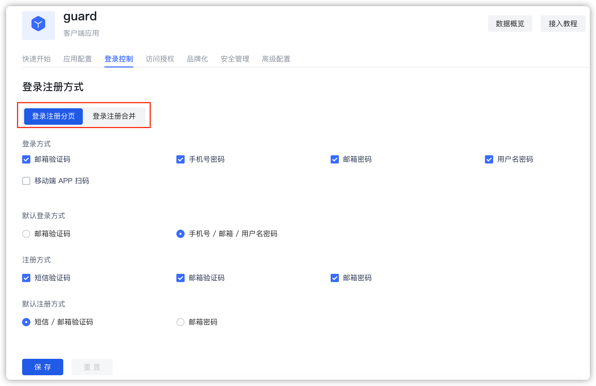
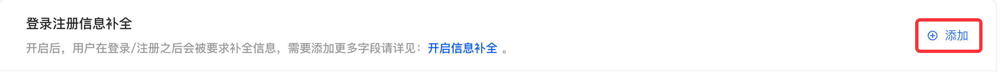
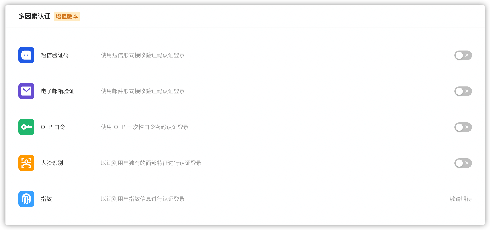

# 应用常用配置

 首先先进入控制台，在控制台左侧菜单栏选中自建应用，然后点击进入到你的自建应用。



1. 自定义应用图标

   

2. 自定义登录/注册方式

   

3. 自定义隐私协议

   在**品牌化-登录注册协议**中添加

   

4. 自定义信息补全

   在**品牌化-登录注册信息补全**中添加

5. 自定义MFA

   在**安全管理-多因素认证**中添加

   

6. 登录成功获取到 accessToken

    如你的业务需求要求登录之后获取到 `accessToken`，请在**应用配置-授权模式**下勾选 `authing_token`。


​		如果使用 SDK 中的托管页或者 Guard 登录/注册组件，需要代码中设置：

```java
Authing.setAuthProtocol(Authing.AuthProtocol.EOIDC);
```

​		如果只是使用 API 的调用方式，请使用 `OIDCClient` 中的[登录/注册 API](../apis/protocol/#获取-access-token、id-token-和-refresh-token)。