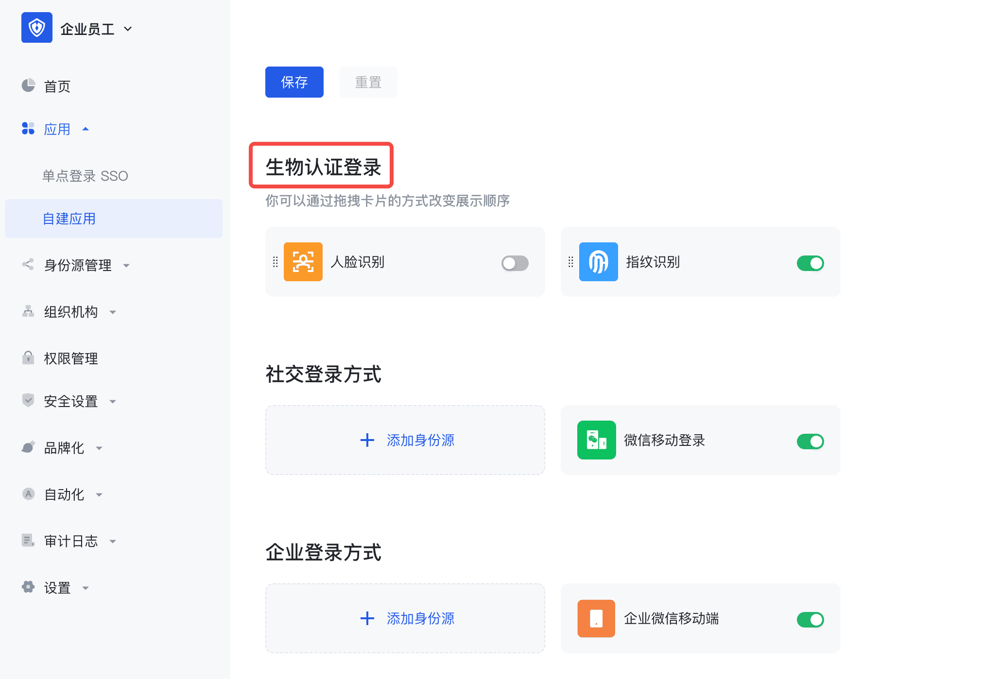

# 生物认证

<LastUpdated/>

目前 Android 仅支持指纹识别登录，首先确保已经完成了 [开发准备工作](./quick.md)。

:::hint-info
此功能在 android guard sdk 1.5.0 版本新增。
:::

<br>

## 第一步：控制台配置

需要先在 Authing 控制台配置，在**自建应用-客户端应用-登录控制-生物认证登录**中勾选**指纹识别**。



## 第二步：添加依赖

```groovy
implementation 'cn.authing:authing-android-webauthn:1.0.0'
```

## 第三步：分场景使用

### 使用托管页

在需要登录认证的地方启动托管页：

```java
// this is the activity context
AuthFlow.start(this);
```

​		通过以上步骤即可简单快速地通过配置 Authing 管理控制台后自动拥有生物认证登录功能，登录入口会在 Guard 内置登录界面的社会化登录按钮列表中体现。

### 使用指纹登录按钮

如果使用我们提供的指纹登录按钮。

​		1. 布局文件里面加上（或者代码初始化添加）如下代码：

```xml
 <cn.authing.guard.social.FingerLoginButton
    android:id="@+id/btn_finger_login"
    android:background="@drawable/authing_button_background"
    android:textColor="@color/white"
    android:layout_width="match_parent"
    android:layout_height="wrap_content" />
```

​		2. 然后在代码里面处理事件：

```java
FingerLoginButton button = findViewById(R.id.btn_finger_login);
button.setOnLoginListener(new AuthCallback<UserInfo>() {
    @Override
    public void call(int code, String message, UserInfo data) {
      	if (code == 200) {
        	// 登录成功，data 是用户信息
       	} else {
        	// 登录失败
      	}
    }
});
```

### 使用指纹登录授权类

如果不想使用我们内置的按钮，想完全自己实现 UI，则可以在按钮的点击事件里面调用 `Finger` 类的授权函数，此类集成了拉起指纹授权登录的业务逻辑：

```java
Finger finger = new Finger();
finger.login(appContext, new AuthCallback<UserInfo>() {
    @Override
    public void call(int code, String message, UserInfo data) {
        if (code == 200) {
          // 登录成功，data 是用户信息
        } else {
          // 登录失败
        }
    }
});
```

### 使用指纹登录 API 

#### 指纹绑定 - 初始化绑定请求参数

```java
public static void bindBiometricRequest(@NotNull AuthCallback<JSONObject> callback)
```

**示例**

```java
AuthClient.bindBiometricRequest(new AuthCallback<JSONObject>() {
    @Override
    public void call(int code, String message, JSONObject data) {
      	if (code == 200) {
      	  // 成功
       	} 
    }
});
```

**请求响应**

| 名称                                                         | 类型     | 描述                                                         |
| :----------------------------------------------------------- | :------- | :----------------------------------------------------------- |
| statusCode                                                   | int      | 业务状态码，可以通过此状态码判断操作是否成功，200 表示成功   |
| message                                                      | String   | 描述信息                                                     |
| data.registrationOptions.challenge                           | string   | 挑战码, base64Url 编码                                       |
| data.registrationOptions.rp.id                               | String   | 信赖方 domain                                                |
| data.registrationOptions.rp.name                             | String   | 信赖方名称                                                   |
| data.registrationOptions.user.id                             | String   | 用户 Id                                                      |
| data.registrationOptions.user.name                           | String   | 用户名                                                       |
| data.registrationOptions.user.displayName                    | String   | 用户显示名                                                   |
| data.registrationOptions.pubKeyCredParams[x].alg             | number   | -7： ES256、-257：RS256                                      |
| data.registrationOptions.pubKeyCredParams[x].type            | String   | 固定值, public-key                                           |
| data.registrationOptions.timeout                             | number   | 超时时间，毫秒                                               |
| data.registrationOptions.attestation                         | String   | 依赖方是否需要证明                                           |
| data.registrationOptions.excludeCredentials[x].id            | String   | 凭证 ID, base64Url 编码                                      |
| data.registrationOptions.excludeCredentials[x].type          | String   | 固定值                                                       |
| data.registrationOptions.excludeCredentials[x].transports    | string[] |                                                              |
| data.registrationOptions.authenticatorSelection.userVerification | String   | 指定认证器是否需要验证“用户为本人 (User Verified, UV)”，否则只须“用户在场 (User Present, UP)” |
| data.registrationOptions.authenticatorSelection.residentKey  | String   |                                                              |
| data.registrationOptions.authenticatorSelection.requireResidentKey | boolean  | 是否要求将私钥钥永久存储于认证器中                           |
| data.ticket                                                  | String   | ticket 参数，验证时回传                                      |

<br>

#### 指纹绑定 - 验证绑定

```java
public static void bindBiometric(RegistrationParams registrationParams, @NotNull AuthCallback<JSONObject> callback)
```

**参数**

| 名称                                              | 类型     | 是否必填 | 默认值 | 描述                                                         |
| :------------------------------------------------ | :------- | :------- | :----- | :----------------------------------------------------------- |
| ticket                                            | String   | 是       | -      | ticket, options 响应中的需回传的参数                         |
| registrationCredential.id                         | String   | 是       | -      | 凭证 ID, Base64URL 编码的凭证 ID                             |
| registrationCredential.rawId                      | String   | 是       | -      | 凭证 ID                                                      |
| registrationCredential.response.attestationObject | String   | 是       | -      | CBOR 编码的认证器数据，包含凭证公钥、凭证 ID、签名（如果有）、签名计数等信息 |
| registrationCredential.response.clientDataJSON    | String   | 是       | -      | 客户端数据，包含 origin（即凭证请求来源）、挑战等信息        |
| registrationCredential.type                       | String   | 是       | -      | 固定值                                                       |
| registrationCredential.transports                 | String[] | 是       | -      | 字符串数组                                                   |
| authenticatorCode                                 | String   | 是       | -      | 凭证类型编码：fingerprint 指纹、face 人脸                    |

**示例**

```java
RegistrationParams registrationParams = new RegistrationParams();
registrationParams.setTicket(ticket);
RegistrationCredential registrationCredential = new RegistrationCredential();
registrationCredential.setId(rep.getId());
registrationCredential.setRawId(Util.encodeBase64URL(rep.getRawId()));
RegistrationCredential.Response response = new RegistrationCredential.Response();
response.setAttestationObject(Util.encodeBase64URL(rep.getResponse().getAttestationObject()));
response.setClientDataJSON(Util.encodeBase64URL(rep.getResponse().getClientDataJSON().getBytes()));
registrationCredential.setResponse(response);
registrationCredential.setType("public-key");
registrationParams.setRegistrationCredential(registrationCredential);
registrationParams.setAuthenticatorCode("fingerprint");
AuthClient.bindBiometric(registrationParams, new AuthCallback<JSONObject>() {
    @Override
    public void call(int code, String message, JSONObject data) {
      	if (code == 200) {
      	  // 成功
       	} 
    }
});
```

**请求响应**

| 名称          | 类型   | 描述                                                       |
| :------------ | :----- | :--------------------------------------------------------- |
| statusCode    | int    | 业务状态码，可以通过此状态码判断操作是否成功，200 表示成功 |
| message       | String | 描述信息                                                   |
| data.verified | String | true 成功，false 失败                                      |

<br>

#### 指纹登录 - 初始化认证请求参数

```java
public static void biometricAuthenticationRequest(@NotNull AuthCallback<JSONObject> callback)
```

**示例**

```java
AuthClient.biometricAuthenticationRequest(new AuthCallback<JSONObject>() {
    @Override
    public void call(int code, String message, JSONObject data) {
      	if (code == 200) {
      	  // 成功
       	} 
    }
});
```

**请求响应**

| 名称                                                      | 类型     | 描述                                                       |
| :-------------------------------------------------------- | :------- | :--------------------------------------------------------- |
| statusCode                                                | int      | 业务状态码，可以通过此状态码判断操作是否成功，200 表示成功 |
| message                                                   | String   | 描述信息                                                   |
| data.authenticationOptions.challenge                      | string   | 挑战码, base64Url 编码                                     |
| data.authenticationOptions.allowCredentials[x].id         | String   | 允许的凭证 ID                                              |
| data.authenticationOptions.allowCredentials[x].type       | String   | 固定值                                                     |
| data.authenticationOptions.allowCredentials[x].transports | String[] | 字符串数组                                                 |
| data.authenticationOptions.timeout                        | number   | 超时时间，毫秒值                                           |
| data.authenticationOptions.userVerification               | String   |                                                            |
| data.authenticationOptions.rpId                           | String   | 依赖方 domain                                              |
| data.ticket                                               | String   | ticket 参数，验证时回传                                    |

<br>

#### 指纹登录 - 验证认证

```java
public static void biometricAuthentication(AuthenticationParams authenticationParams, @NotNull AuthCallback<JSONObject> callback)
```

**参数**

| 名称                                                | 类型   | 是否必填 | 默认值 | 描述                                                         |
| :-------------------------------------------------- | :----- | :------- | :----- | :----------------------------------------------------------- |
| ticket                                              | String | 是       | -      | ticket, options 响应中的需回传的参数                         |
| authenticationCredential.id                         | String | 是       | -      | 凭证 ID, Base64URL 编码的凭证 ID                             |
| authenticationCredential.rawId                      | String | 是       | -      | 凭证 ID                                                      |
| authenticationCredential.response.authenticatorData | String | 是       | -      | 认证器信息，包含认证状态、签名计数等                         |
| authenticationCredential.response.userHandle        | String | 是       | -      | 创建凭证时的用户 ID, user.id                                 |
| authenticationCredential.response.clientDataJSON    | String | 是       | -      | 客户端数据，包含 origin（即凭证请求来源）、挑战等信息        |
| authenticationCredential.response.signature         | String | 是       | -      | 被认证器签名的 authenticatorData + clientDataHash（clientDataJSON 的 SHA-256 hash） |
| authenticationCredential.type                       | String | 是       | -      | 固定值                                                       |
| authenticationCredential.authenticatorAttachment    | String | 是       | -      | 指定要求的认证器类型                                         |

**示例**

```java
AuthenticationParams authenticationParams = new AuthenticationParams();
authenticationParams.setTicket(ticket);
AuthenticationCredential authenticationCredential = new AuthenticationCredential();
authenticationCredential.setId(rep.getId());
authenticationCredential.setRawId(Util.encodeBase64URL(rep.getRawId()));
AuthenticationCredential.Response response = new AuthenticationCredential.Response();
response.setAuthenticatorData(Util.encodeBase64URL(rep.getResponse().getAuthenticatorData()));
response.setClientDataJSON(Util.encodeBase64URL(rep.getResponse().getClientDataJSON().getBytes()));
response.setSignature(Util.encodeBase64URL(rep.getResponse().getSignature()));
response.setUserHandle(Util.encodeBase64URL(Util.encodeBase64URL(rep.getResponse().getUserHandle()).getBytes()));
authenticationCredential.setResponse(response);
authenticationCredential.setType("public-key");
authenticationParams.setAuthenticationCredential(authenticationCredential);
authenticationParams.setAuthenticatorAttachment("platform");
AuthClient.biometricAuthentication(registrationParams, new AuthCallback<JSONObject>() {
    @Override
    public void call(int code, String message, JSONObject data) {
      	if (code == 200) {
      	  // 成功
       	} 
    }
});
```

**请求响应**

| 名称                        | 类型   | 描述                                                       |
| :-------------------------- | :----- | :--------------------------------------------------------- |
| statusCode                  | int    | 业务状态码，可以通过此状态码判断操作是否成功，200 表示成功 |
| message                     | String | 描述信息                                                   |
| data.verified               | String | true 成功，false 失败                                      |
| data.tokenSet.expire_in     | number | 过期时间 单位是秒                                          |
| data.tokenSet.access_token  | String | Access token                                               |
| data.tokenSet.id_token      | String | Id token                                                   |
| data.tokenSet.token_type    | String | Token type                                                 |
| data.tokenSet.refresh_token | String | Refresh token                                              |

<br>

#### 指纹解绑

```java
public static void unBindBiometric(String credentialID, @NotNull AuthCallback<JSONObject> callback)
```

**参数**

| 名称         | 类型   | 是否必填 | 默认值 | 描述              |
| :----------- | :----- | :------- | :----- | :---------------- |
| credentialID | String | 是       | -      | 路径参数, 凭证 ID |

**示例**

```java
AuthClient.unBindBiometric("credentialID", new AuthCallback<JSONObject>() {
    @Override
    public void call(int code, String message, JSONObject data) {
      	if (code == 200) {
      	  // 成功
       	} 
    }
});
```

**请求响应**

| 名称         | 类型   | 描述                                                       |
| :----------- | :----- | :--------------------------------------------------------- |
| statusCode   | int    | 业务状态码，可以通过此状态码判断操作是否成功，200 表示成功 |
| message      | String | 描述信息                                                   |
| data.success | String | true 成功，false 失败                                      |

<br>

#### 指纹绑定数据查询

```java
public static void getBiometricList(String authenticatorCode, @NotNull AuthCallback<JSONObject> callback)
```

**参数**

| 名称              | 类型   | 是否必填 | 默认值 | 描述                        |
| :---------------- | :----- | :------- | :----- | :-------------------------- |
| authenticatorCode | String | 是       | -      | fingerprint 指纹、face 人脸 |

**示例**

```java
AuthClient.getBiometricList("authenticatorCode", new AuthCallback<JSONObject>() {
    @Override
    public void call(int code, String message, JSONObject data) {
      	if (code == 200) {
      	  // 成功
       	} 
    }
});
```

**请求响应**

| 名称                           | 类型   | 描述                                                       |
| :----------------------------- | :----- | :--------------------------------------------------------- |
| statusCode                     | int    | 业务状态码，可以通过此状态码判断操作是否成功，200 表示成功 |
| message                        | String | 描述信息                                                   |
| data.list[x].id                | String | 认证器凭证信息 Id                                          |
| data.list[x].userPoolId        | String | 用户池 ID                                                  |
| data.list[x].userId            | String | 用户 ID                                                    |
| data.list[x].credentialID      | String | 凭证 ID                                                    |
| data.list[x].authenticatorCode | String | 凭证类型编码，fingerprint: 指纹、face: 人脸、other: 未知   |
| data.list[x].name              | String | 凭证名称或设备名                                           |
| data.list[x].initiatorPlatform | String | 凭证注册平台信息                                           |
| data.totalCount                | number | 总数                                                       |

<br>

#### 指纹绑定数据查询 - 通过凭证 id

```java
public static void checkBiometricBind(String authenticatorCode, String[] credentialIds，@NotNull AuthCallback<JSONObject> callback)
```

**参数**

| 名称              | 类型     | 是否必填 | 默认值 | 描述                                                        |
| :---------------- | :------- | :------- | :----- | :---------------------------------------------------------- |
| authenticatorCode | String   | 是       | -      | fingerprint 指纹、face 人脸                                 |
| credentialIds     | String[] | 是       | -      | 待检查的凭证 id 列表。要求至少有 1 个凭证 ID，最大 100 个。 |

**示例**

```java
AuthClient.checkBiometricBind("authenticatorCode", ["1"],  new AuthCallback<JSONObject>() {
    @Override
    public void call(int code, String message, JSONObject data) {
      	if (code == 200) {
      	  // 成功
       	} 
    }
});
```

**请求响应**

| 名称                           | 类型   | 描述                                                       |
| :----------------------------- | :----- | :--------------------------------------------------------- |
| statusCode                     | int    | 业务状态码，可以通过此状态码判断操作是否成功，200 表示成功 |
| message                        | String | 描述信息                                                   |
| data.list[x].id                | String | 认证器凭证信息 Id                                          |
| data.list[x].userPoolId        | String | 用户池 ID                                                  |
| data.list[x].userId            | String | 用户 ID                                                    |
| data.list[x].credentialID      | String | 凭证 ID                                                    |
| data.list[x].authenticatorCode | String | 凭证类型编码，fingerprint: 指纹、face: 人脸、other: 未知   |
| data.list[x].name              | String | 凭证名称或设备名                                           |
| data.list[x].initiatorPlatform | String | 凭证注册平台信息                                           |
| data.totalCount                | number | 总数                                                       |

<br>
