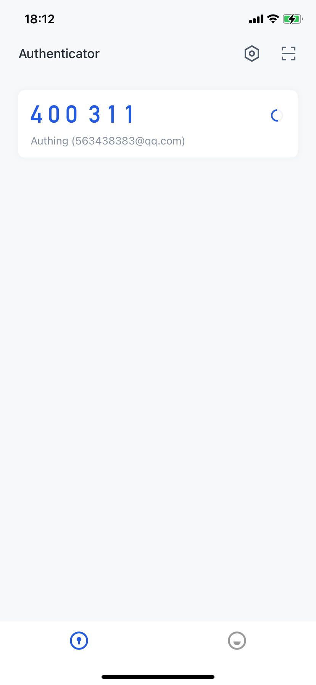

# Authing OTP

<LastUpdated/>

目前我们提供的 OTP SDK 支持 TOTP （基于时间的一次性密码算法），可用于 [多因素认证（MFA）](https://docs.authing.cn/v2/guides/security/mfa/totp.html)中的 OTP 验证方式场景。通过 SDK 可以快速生成 OTP 验证码，同时提供增删改查能力。也可以下载 [ Authing 令牌](https://authing-public-cn.oss-cn-beijing.aliyuncs.com/public/AuthingCloud/android/Authing_OTP_1.4.2_release_2023_03_27_10_45.apk) 体验 Authing 官方应用。



## 数据格式

OTP 数据格式为 uri，如：

```json
otpauth://totp/GuardPool:test?secret=E55EYQJ5EUHX6ALB&period=30&digits=6&algorithm=SHA1&issuer=GuardPool
```

通过 `URI` 类解析后为：

- `scheme`  otpauth 
- `host`  totp 
- `path` GuardPool:test 
- `query`  secret=E55EYQJ5EUHX6ALB&period=30&digits=6&algorithm=SHA1&issuer=GuardPool

## 添加依赖

在项目 build.gradle 文件的 `dependencies` 中添加 sdk 依赖

```groovy
implementation 'cn.authing:otp:1.0.2'
```

## TOTPEntity 类

TOTP 账号实体类，参数如下：

|    名称     | 类型   | 说明                                 |
| :---------: | :----- | ------------------------------------ |
|    path     | String | 路径，如："GuardPool:test"           |
| application | String | 组织或应用名称，如："GuardPool"      |
|   account   | String | 账户名称，如："test"                 |
|   secret    | String | 密钥，如："E55EYQJ5EUHX6ALB"         |
|   period    | int    | 令牌间隔时间，默认单位是秒，如：30   |
|   digits    | int    | 密钥位数，如：6                      |
|  algorithm  | String | 算法，如："SHA1"、"SHA256"、"SHA512" |
|   issuer    | String | 颁发者，如："GuardPool"              |
|  totpCode   | String | 验证码，如："888888"                 |

如果设置了 `secret`、`period`、`digits`、`algorithm` 之后，可以通过 `getTotpCode()` 方法直接获取到 TOTP `code`。

## TOTP 类

TOTP 账号数据管理类。

### 增加数据

可以通过 `bind()` 方法直接传入原始数据绑定

```java
public static TOTPBindResult bind(Context context, String data) 
```

示例：

```java
String otpData = "otpauth://totp/GuardPool:test?secret=E55EYQJ5EUHX6ALB&period=30&digits=6&algorithm=SHA1&issuer=GuardPool";
TOTPBindResult bindResult = TOTP.bind(this, otpData);
if (bindResult.getCode() == TOTPBindResult.BIND_SUCCESS) {
    //绑定成功
} else if (bindResult.getCode() == TOTPBindResult.UPDATED_ACCOUNT) {
    //更新账号
} else if (bindResult.getCode() == TOTPBindResult.BIND_FAILURE) {
    //绑定失败
} 
```

也可以通过 `addTotp()` 方法添加

示例：

```java
OTPEntity totp = new TOTPEntity();
totp.setPath("GuardPool:test");
totp.setApplication("GuardPool");
totp.setAccount("test");
totp.setSecret("E55EYQJ5EUHX6ALB");
totp.setAlgorithm("SHA1");
totp.setDigits(6);
totp.setPeriod(30);
totp.setIssuer("GuardPool");
TOTP.addTotp(this, totp);
```

### 更新数据

更新数据

```java
public static void updateTotp(Context context, TOTPEntity totp)
```

### 获取数据

获取全部数据

```java
public static List<TOTPEntity> getTotpList(Context context)
```

通过 `path` 获取单个数据

```java
public static TOTPEntity getTotp(Context context, String path)
```

### 删除数据

通过实体类删除

```java
public static void deleteTotp(Context context, TOTPEntity totp)
```

通过 `path` 删除

```java
public static void deleteTotp(Context context, String path)
```

## TOTPGenerator 类

TOTP 验证码生成类，可以通过 `TOTPGenerator` 类的 `generateTOTP()` 方法自己生成 TOTP `code`

```java
public static String generateTOTP(String secret, int period, int digits, String algorithm)
```

## 安全建议

为了安全，建议在显示 `code` 的界面禁止截屏，加入如下代码：

```java
getWindow().addFlags(WindowManager.LayoutParams.FLAG_SECURE);
```

