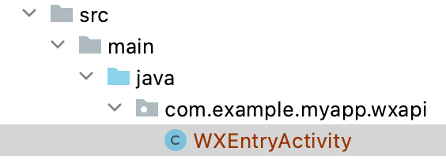

# APP 拉起微信小程序登录

<LastUpdated/>

## 准备工作

在 [微信开放平台](https://open.weixin.qq.com/cgi-bin/index?t=home/index&lang=zh_CN) 及 [Authing Console 控制台](https://authing.cn/) 进行配置，请参阅 [ APP 拉起微信小程序](../../../guides/connections/social/wechat-miniprogram-applaunch/README.md)，移动应用 APP 需要关联相关小程序。

:::hint-info
此功能在 android guard sdk 1.4.8 版本新增。
:::

<br>

## 集成步骤

### 第一步：添加依赖

```groovy
implementation 'cn.authing:guard:+'
implementation 'com.tencent.mm.opensdk:wechat-sdk-android:6.8.0'
```

:::hint-info
Guard 只是 compileOnly 依赖 gms，这样可以让 App 按需引入，防止 Guard aar 包随着支持的第三方登录增加而越来越大。所以每增加一个第三方身份源，都需要 App 手动加上该身份源的依赖。
:::

### 第二步：初始化

在应用启动的时候初始化 Guard Android SDK：

```java
// context is application or initial activity
// ”AUTHING_APP_ID“ is obtained from the Authing console
Authing.init(context, "AUTHING_APP_ID");
Authing.setAuthProtocol(Authing.AuthProtocol.EOIDC)
```

### 第三步：创建WXEntryActivity

由于微信的限制，必须在应用包名所在的目录下创建一个 wxapi/WXEntryActivity。假设你的应用包名为：

com.example.myapp

则需要按照如下方式创建：



其内容只需要继承我们的实现类：

```java
package com.example.myapp.wxapi;

import cn.authing.guard.social.callback.wechat.WXCallbackActivity;

public class WXEntryActivity extends WXCallbackActivity {
}
```

### 第四步：在 Manifest 里面声明微信回调 Activity

在 manifest 文件里面加上`exported`、`taskAffinity`及 `launchMode` 属性，其中 `exported` 设置为`true`，`taskAffinity`设置为你的包名，`launchMode`设置为`singleTask`，如：

```xml
<activity
    android:name=".wxapi.WXEntryActivity"
    android:exported="true"
    android:taskAffinity="填写你的包名"
    android:launchMode="singleTask"/>
```

**注意事项**

如果需要混淆代码，为了保证 sdk 的正常使用，需要在 proguard.cfg 加上下面配置：

```
-keep class com.tencent.mm.opensdk.** {
    *;
}

-keep class com.tencent.wxop.** {
    *;
}

-keep class com.tencent.mm.sdk.** {
    *;
}
```

### 第五步：规范小程序回调数据格式

小程序回调到 APP 的数据（extMsg）的格式需要约束为：

```json
{
  "code": "001x691w398h8039gl0w3ERdyy1x691y",
  "phoneInfoCode": "geC88uOGAkjOeziTDu/iJA==",
}
```

APP 将会在 `WXEntryActivity` 的回调获取到数据：

```java
public void onResp(BaseResp resp) {
    if (resp.getType() == ConstantsAPI.COMMAND_LAUNCH_WX_MINIPROGRAM) {
        WXLaunchMiniProgram.Resp launchMiniProResp = (WXLaunchMiniProgram.Resp) resp;
        String extraData =launchMiniProResp.extMsg; //对应小程序组件 <button open-type="launchApp"> 中的 app-parameter 属性
    }
}
```

### 第六步：分场景使用

- #### 使用托管页
  在需要登录认证的地方启动托管页：
```java
// this is the activity context
AuthFlow.start(this);
```

通过以上步骤即可简单快速地通过配置 Authing 管理控制台后自动拥有 APP 拉起微信小程序登录功能，登录入口会在 Guard 内置登录界面的社会化登录按钮列表中体现。

- #### 使用 APP 拉起微信小程序登录按钮
    如果使用我们提供的 APP 拉起微信小程序登录按钮。

​		1. 布局文件里面加上如下代码：

```xml
 <cn.authing.guard.social.view.WechatMiniProgramLoginButton
    android:id="@+id/btn_login"
    android:background="@drawable/authing_button_background"
    android:textColor="@color/white"
    android:layout_width="match_parent"
    android:layout_height="wrap_content" />
```

​		2. 然后在代码里面处理事件：

```java
WechatMiniProgramLoginButton button = findViewById(R.id.btn_login);
button.setOnLoginListener(new AuthCallback<UserInfo>() {
    @Override
    public void call(int code, String message, UserInfo data) {
      	if (code == 200) {
        	// 登录成功，data 是用户信息
       	} else {
        	// 登录失败
      	}
    }
});
```

- #### 使用 APP 拉起微信小程序登录授权类
  如果不想使用我们内置的按钮，想完全自己实现 UI，则可以在按钮的点击事件里面调用 `WechatMiniProgram` 类的授权函数，此类集成了拉起  APP 拉起微信小程序授权登录的业务逻辑：

```java
WechatMiniProgram wechatMiniProgram = new WechatMiniProgram();
wechatMiniProgram.login(appContext, new AuthCallback<UserInfo>() {
    @Override
    public void call(int code, String message, UserInfo data) {
        if (code == 200) {
          // 登录成功，data 是用户信息
        } else {
          // 登录失败
        }
    }
});
```

​	`data` 包含 `idToken` 以及用户信息（`用户名`、`昵称`、`姓名`等）。

- #### 使用  APP 拉起微信小程序登录 API 

  如果想完全自己实现  APP 拉起微信小程序登录 UI 以及获取授权码逻辑，拿到授权码后，可以调用下面 API 换取用户信息：

```java
public static void loginByWechatMiniProgram(String code, String phoneInfoCode, @NotNull AuthCallback<UserInfo> callback)
```

**参数**

- *`code`* `wx.login` 接口返回的用户 `code`

- *`phoneInfoCode`* 小程序获取用户手机号返回的 `code`

**示例**

如果你只需要获取到用户信息（`用户名`、`昵称`、`姓名`等）和 `idToken`，调用：

```java
AuthClient.loginByWechatMiniProgram(code, phoneInfoCode, new AuthCallback<UserInfo>() {
    @Override
    public void call(int code, String message, UserInfo data) {
        if (code == 200) {
          // 登录成功，data 是用户信息, 包含 idToken。
        } else {
          // 登录失败
        }
    }
});
```

如果你需要获取到用户信息（`用户名`、`昵称`、`姓名`等）、`idToken`、`accessToken` 和 `refreshToken`，调用：

```java
OIDCClient oidcClient = new OIDCClient();
oidcClient.loginByWechatMiniProgram(code, phoneInfoCode, new AuthCallback<UserInfo>() {
    @Override
    public void call(int code, String message, UserInfo data) {
        if (code == 200) {
          // 登录成功，data 是用户信息, 包含 idToken、accessToke and refreshToken。
        } else {
          // 登录失败
        }
    }
});
```

