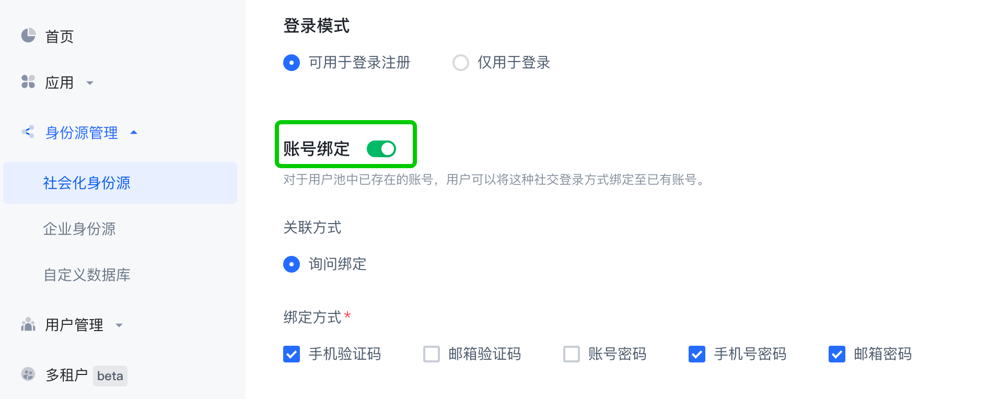

# 微信登录

<LastUpdated/>

## 准备工作

在[微信开放平台](https://open.weixin.qq.com/cgi-bin/index?t=home/index&lang=zh_CN)及 [Authing Console 控制台](https://authing.cn/) 进行配置，请参阅[微信移动端](../../../guides/connections/social/wechat-mobile/README.md)。

<br>

## 集成微信登录步骤

### 第一步：添加依赖

```groovy
implementation 'cn.authing:guard:+'
implementation 'com.tencent.mm.opensdk:wechat-sdk-android:6.8.0'
```

:::hint-info
Guard 只是 compileOnly 依赖微信，这样可以让 App 按需引入，防止 Guard aar 包随着支持的第三方登录增加而越来越大。所以每增加一个第三方身份源，都需要 App 手动加上该身份源的依赖。
:::

### 第二步：初始化 Guard Android SDK

在应用启动的时候初始化：

```java
// context is application or initial activity
// ”AUTHING_APP_ID“ is obtained from the Authing console
Authing.init(context, "AUTHING_APP_ID");
Authing.setAuthProtocol(Authing.AuthProtocol.EOIDC)
```

### 第三步：创建WXEntryActivity

由于微信的限制，必须在应用包名所在的目录下创建一个 wxapi/WXEntryActivity。假设你的应用包名为：

com.example.myapp

则需要按照如下方式创建：


其内容只需要继承我们的实现类：

```java
package com.example.myapp.wxapi;

import cn.authing.guard.social.wechat.WXCallbackActivity;

public class WXEntryActivity extends WXCallbackActivity {
}
```

### 第四步：在 Manifest 里面声明微信回调 Activity

在 manifest 文件里面加上`exported`、`taskAffinity`及 `launchMode` 属性，其中 `exported` 设置为`true`，`taskAffinity`设置为你的包名，`launchMode`设置为`singleTask`，如：

```xml
<activity
    android:name=".wxapi.WXEntryActivity"
    android:exported="true"
    android:taskAffinity="填写你的包名"
    android:launchMode="singleTask"/>
```

**注意事项**

如果需要混淆代码，为了保证 sdk 的正常使用，需要在 proguard.cfg 加上下面配置：

```text
-keep class com.tencent.mm.opensdk.** {
    *;
}

-keep class com.tencent.wxop.** {
    *;
}

-keep class com.tencent.mm.sdk.** {
    *;
}
```


**通过以上步骤即可简单快速的通过 Authing 管理控制台配置后自动获取微信身份源，登录入口会在 Guard 内置登录界面的社会化登录按钮列表中体现**


- 接下来，如果使用我们提供的微信登录按钮，则在布局文件里面加上（当然也可以用代码初始化）：


```xml
<cn.authing.guard.WechatLoginButton
    android:id="@+id/btn_wechat_login"
    android:layout_width="44dp"
    android:layout_height="44dp"
    app:layout_constraintLeft_toLeftOf="parent"
    app:layout_constraintRight_toRightOf="parent"/>
```

然后在 java 代码里面处理事件：

```java
WechatLoginButton wechatLoginButton = findViewById(R.id.btn_wechat_login);
wechatLoginButton.setOnLoginListener(new AuthCallback<UserInfo>() {
    @Override
    public void call(int code, String message, UserInfo data) {
      	if (code == 200) {
        	// 登录成功，data 是用户信息
       	} else {
        	// 登录失败
      	}
    }
});
```

<br>

- 如果不想使用我们内置的按钮，则可以在自己按钮的点击事件里面调用 Authing 微信登录 API：

  如果想获取到用户信息：


```java
Wechat wechat = new Wechat();
wechat.login(appContext, context, new AuthCallback<UserInfo>() {
    @Override
    public void call(int code, String message, UserInfo data) {
        if (code == 200) {
          // 登录成功，data 是用户信息
        } else if (code == 1640) {
          // 只允许绑定已有账号
          // data.getSocialBindData() 中返回 method(登录方式) 以及 key(中间态键)
        } else if (code == 1641) {
          // 允许绑定已有账号，或者创建新账号
          // data.getSocialBindData() 中返回 method(登录方式) 以及 key(中间态键)
        } else if (code == 2921) {
          // 多账号选择后绑定
          // data.getSocialBindData() 中返回 accounts(账号列表) 以及 key(中间态键)
        } else {
          // 登录失败
        }
    }
});
```

​	`data` 包含用户信息（`用户名`、`昵称`、`姓名`等）以及 `idToken`。

​	如果想只获取微信的授权码：

```java
Wechat wechat = new Wechat();
wechat.getAuthCode(this, new AuthCallback<String>() {
    @Override
    public void call(int code, String message, String authCode) {
      	if (code == 200) {
      	  // 获取成功，authCode 是微信授权码
       	} 
    }
});
```

<br>

- 如果想完全自己实现微信登录，拿到授权码后，可以调用下面 API 换取用户信息：


```java
public static void loginByWechatWithBind(String authCode, String context, @NotNull AuthCallback<UserInfo> callback)
```

**参数**

- *`authCode`* 微信授权码

- *`context`* 请求上下文，这里设置的 `context` 可以在 [pipeline 的 context](/guides/pipeline/context-object.md) 中获取到。

**示例**

如果你只需要获取到用户信息（`用户名`、`昵称`、`姓名`等）和 `idToken`，调用：

```java
AuthClient.loginByWechatWithBind(authCode, context, new AuthCallback<UserInfo>() {
    @Override
    public void call(int code, String message, UserInfo data) {
        if (code == 200) {
          // 登录成功，data 是用户信息，包含 idToken。
        } else if (code == 1640) {
          // 只允许绑定已有账号
          // data.getSocialBindData() 中返回 method(登录方式) 以及 key(中间态键)
        } else if (code == 1641) {
          // 允许绑定已有账号，或者创建新账号
          // data.getSocialBindData() 中返回 method(登录方式) 以及 key(中间态键)
        } else if (code == 2921) {
          // 多账号选择后绑定
          // data.getSocialBindData() 中返回 accounts(账号列表) 以及 key(中间态键)
        }  else {
          // 登录失败
        }
    }
});
```

如果你需要获取到用户信息（`用户名`、`昵称`、`姓名`等）、`idToken`、`accessToken` 和 `refreshToken`，调用：

```java
OIDCClient oidcClient = new OIDCClient();
oidcClient.loginByWechatWithBind(authCode, context, new AuthCallback<UserInfo>() {
    @Override
    public void call(int code, String message, UserInfo data) {
        if (code == 200) {
          // 登录成功，data 是用户信息，包含 idToken、accessToken 和 refreshToken。
        } else if (code == 1640) {
          // 只允许绑定已有账号
          // data.getSocialBindData() 中返回 method(登录方式) 以及 key(中间态键)
        } else if (code == 1641) {
          // 允许绑定已有账号，或者创建新账号
          // data.getSocialBindData() 中返回 method(登录方式) 以及 key(中间态键)
        } else if (code == 2921) {
          // 多账号选择后绑定
          // data.getSocialBindData() 中返回 accounts(账号列表) 以及 key(中间态键)
        }  else {
          // 登录失败
        }
    }
});
```

**错误码**

* `1640` 只允许绑定已有账号。

* `1641` 允许绑定已有账号，或者创建新账号。

* `2921 ` 多账号询问后选择并绑定。

* `602` 请求第三方端点时返回错误，请在控制台检查微信移动端身份源 `appSecret` 配置是否正确。

* `422` 外部身份源连接类型不匹配，身份源类型错误。

* `501` 此身份源连接不支持询问式绑定，未开启「询问绑定」关联方式。

* `403` 不允许的登录模式，请在控制台检查信移动端身份源配置。

* `499` 应用不存在！。

* `404` 权限组不存在，无权限登录：认证时没有用户信息，则创建新用户和身份，发现开启了「仅登录模式」。

* `403` 无权限登录，请联系管理员。

  

## 账号绑定相关 API

如果你想在微信账号登录的时候绑定实现询问是否绑定已有账号，可以在  [Authing Console 控制台](https://authing.cn/)中开启询问绑定功能，

**身份源管理 -> 社会化身份源 -> 微信 -> 微信移动端** **-> 账号绑定：**



:::hint-info
如果使用我们的 **AuthFlow** 托管页，开启了**账号绑定**后，托管页中处理了相关业务流程。
:::

如果已经选择了**登录模式**，并且开启了**账号绑定**功能，通过如下 API 构建后续业务流程：

### 新建账号

如果**登录模式**选择了可用于**登录注册**，并且开启了**账号绑定**，在调用 `loginByWechatWithBind` 接口时会返回 `1641` 状态码以及 `key`，这个时候可以调用**新建账号**接口直接创建账号。

```java
public static void bindWechatWithRegister(String key, @NotNull AuthCallback<UserInfo> callback)
```

**参数**

- `key` 中间态键，由 `loginByWechatWithBind` 接口返回。

**示例**

```java
AuthClient.bindWechatWithRegister("key", new AuthCallback<UserInfo>() {
    @Override
    public void call(int code, String message, UserInfo data) {
      	if (code == 200) {
      	  // 成功，data 是用户信息
       	} 
    }
});
```

<br>

### 通过账号密码绑定

如果开启了**账号绑定**，在调用 `loginByWechatWithBind` 接口时会返回 `1640` 状态码、支持的绑定方式以及 `key`，如果支持的绑定方式包含`username-password`、`phone-password`、`email-password`，这个时候可以调用**通过账号密码绑定**接口绑定已有账号。

```java
public static void bindWechatByAccount(String key, String account, String password, @NotNull AuthCallback<UserInfo> callback)
```

**参数**

- `key` 中间态键，由 `loginByWechatWithBind` 接口返回。
- `account` 账号（Authing 用户：用户名 / 手机号 / 邮箱）。
- `password` 密码，需要经过 rsa 算法加密。

**示例**

```java
AuthClient.bindWechatByAccount("key", "张三", "xxxxxx", new AuthCallback<UserInfo>() {
    @Override
    public void call(int code, String message, UserInfo data) {
      	if (code == 200) {
      	  // 成功，data 是用户信息
       	} 
    }
});
```

**错误码**

* `499` 使用 rsa 算法解密密码失败，请检查请求参数。

<br>

### 通过手机号验证码绑定

如果开启了**账号绑定**，在调用 `loginByWechatWithBind` 接口时会返回 `1640` 状态码、支持的绑定方式以及 `key`，如果支持的绑定方式包含`phone-code`，这个时候可以调用**通过手机号验证码绑定**接口绑定已有账号。

```java
public static void bindWechatByPhoneCode(String key, String phoneCountryCode, String phone, String code, @NotNull AuthCallback<UserInfo> callback)
```

**参数**

- `key` 中间态键，由 `loginByWechatWithBind` 接口返回。
- `phoneCountryCode` 电话国家码。可以为空，为空时默认为 `+86`
- `phone` 手机号
- `code` 短信验证码

**示例**

```java
AuthClient.bindWechatByPhoneCode("key", "+86", "188xxxx8888", "1234", new AuthCallback<UserInfo>() {
    @Override
    public void call(int code, String message, UserInfo data) {
      	if (code == 200) {
      	  // 成功，data 是用户信息
       	} 
    }
});
```

**错误码**

* `2001` 验证码不正确。
* `2001` 验证码已失效，请重新获取验证码。

<br>

### 通过邮箱验证码绑定

如果开启了**账号绑定**，在调用 `loginByWechatWithBind` 接口时会返回 `1640` 状态码、支持的绑定方式以及 `key`，如果支持的绑定方式包含`email-code`，这个时候可以调用**通过邮箱验证码绑定**接口绑定已有账号。

```java
public static void bindWechatByEmailCode(String key, String email, String code, @NotNull AuthCallback<UserInfo> callback)
```

**参数**

- `key` 中间态键，由 `loginByWechatWithBind` 接口返回。
- `email` 邮箱
- `code` 验证码

**示例**

```java
AuthClient.bindWechatByEmailCode("key", "test@example.com", "1234", new AuthCallback<UserInfo>() {
    @Override
    public void call(int code, String message, UserInfo data) {
      	if (code == 200) {
      	  // 成功，data 是用户信息
       	} 
    }
});
```

**错误码**

* `2001` 验证码不正确。
* `2001` 验证码已失效，请重新获取验证码。

<br>

### 通过多账号选择绑定

如果开启了**账号绑定**，在调用 `loginByWechatWithBind` 接口时会返回 `2921` 状态码、支持的绑定的账号数据以及 `key`，这个时候可以调用**通过多账号选择绑定**接口绑定已有账号。

```java
public static void bindWechatBySelectedAccountId(String key, String account, @NotNull AuthCallback<UserInfo> callback)
```

**参数**

- `key` 中间态键，由 `loginByWechatWithBind` 接口返回。
- `account` 选定的账号 ID（Authing 用户），由 `loginByWechatWithBind` 接口返回。

**示例**

```java
AuthClient.bindWechatBySelectedAccountId("key", "638xxxxxxxxxxxxxx", new AuthCallback<UserInfo>() {
    @Override
    public void call(int code, String message, UserInfo data) {
      	if (code == 200) {
      	  // 成功，data 是用户信息
       	} 
    }
});
```

<br>

### 通过账号 Id 绑定

如果开启了**账号绑定**，在调用 `loginByWechatWithBind` 接口时会返回 `1640` 或者 `1641` 状态码、支持的绑定的账号数据以及 `key`，这个时候可以调用**通过账号 Id 绑定**接口绑定已有账号。

```java
public static void bindWechatByAccountId(String key, String accountId, @NotNull AuthCallback<UserInfo> callback)
```

**参数**

- `key` 中间态键，由 `loginByWechatWithBind` 接口返回。
- `accountId` 账号 ID（Authing 用户 ID）。

**示例**

```java
AuthClient.bindWechatByAccountId("key", "638xxxxxxxxxxxxxx", new AuthCallback<UserInfo>() {
    @Override
    public void call(int code, String message, UserInfo data) {
      	if (code == 200) {
      	  // 成功，data 是用户信息
       	} 
    }
});
```

<br>
