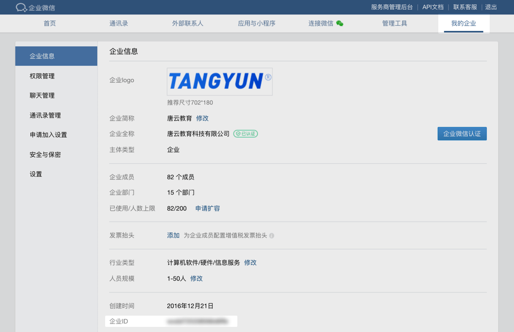
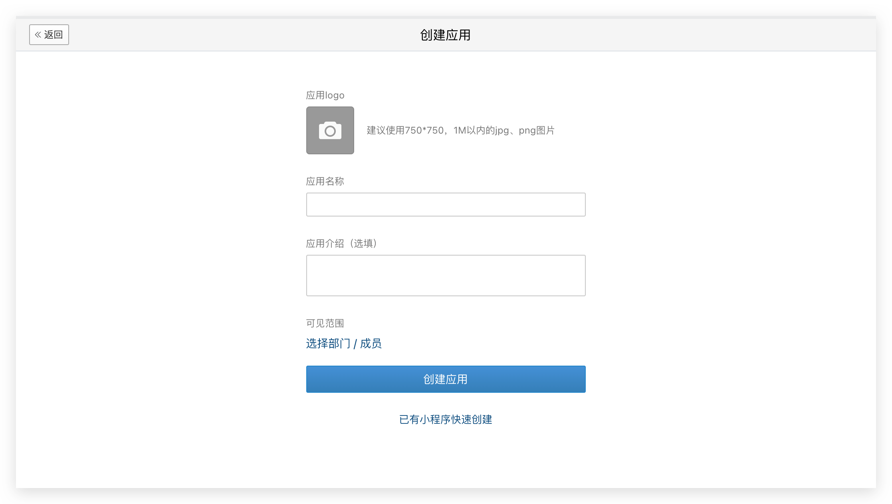
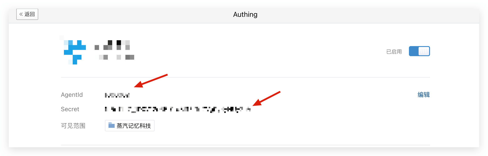
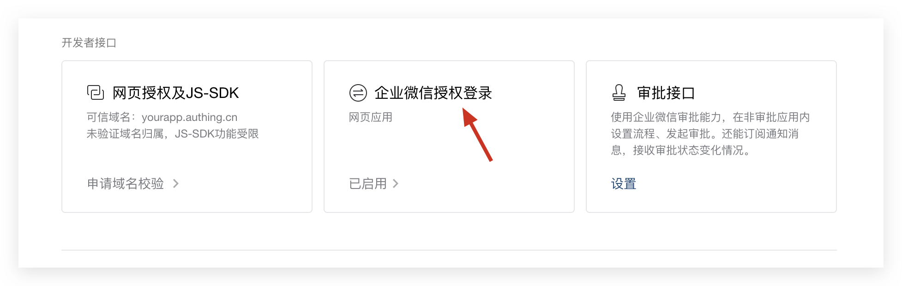
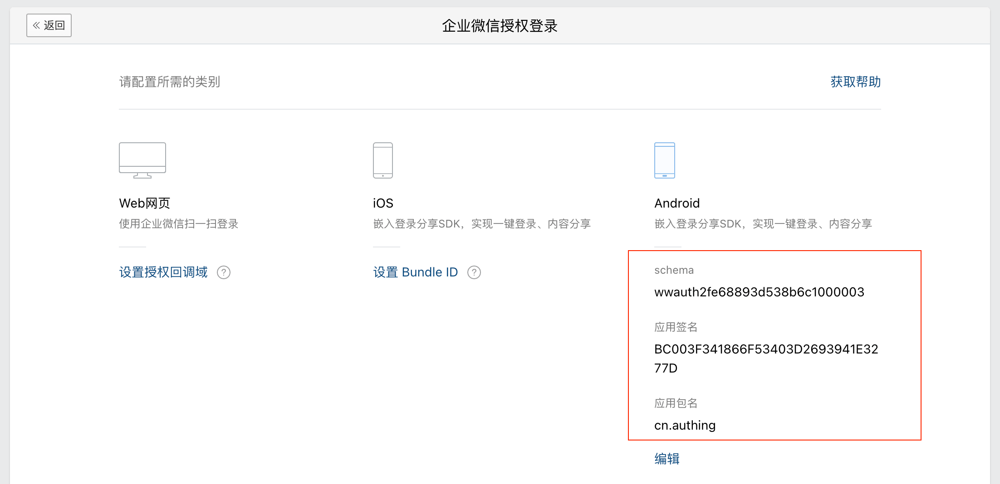
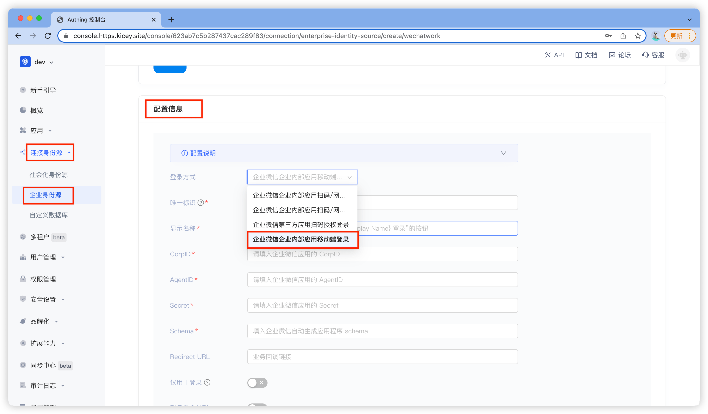

# 企业微信登录

<LastUpdated/>

集成企业微信需要三个主要步骤：

* 在企业微信管理控制台进行配置

* 在 Authing 管理控制台进行配置

* 集成 Android SDK

  

## STEP 1 ：在[企业微信管理控制台](https://work.weixin.qq.com/wework_admin)的操作步骤
1. 获取企业 ID（CorpID）




2. 获取 AgentID 和 Secret

你需要先在 [应用管理 - 应用管理](https://work.weixin.qq.com/wework_admin/frame#apps) 创建一个自建应用



创建完成之后，你可以获取该应用的 AgentId 和 Secret：




3. 启用企业微信授权登录

在应用详情页，点击设置企业微信授权登录：




启用之后，再次点击 “已启用” 按钮，进入配置界面，填入 App 签名的 MD5 码和包名：




> 特别注意：这里的签名 MD5 不能包含冒号


## STEP 2 ：在 Authing 管理控制台的操作步骤

1. 选择或者创建一个用户池—>身份源管理—>企业身份源—>创建企业身份源—>选择企业微信

   


2. 填写配置信息

   登录方式：企业微信企业内部应用移动端登录

   唯一标志性：自定义

   显示名称：自定义

   CorpID：企业微信管理控制平台注册的应用 CorpID

   AgentID：企业微信管理控制平台注册的应用 AgentID

   Secret：企业微信管理控制平台注册的应用 Secret

   Schema：企业微信管理控制平台注册的应用 Schema

   

## STEP 3 ：集成 Android SDK 步骤

1. 设置依赖

- 下载<a href="attachment/wechatwork.jar" target="_blank">企业微信 SDK</a>；
- 将下载的 sdk  jar 文件拷贝到工程的 libs 目录下；
- 在工程的 build.gradle 文件中引入该 jar，引入相关依赖项。

```java
implementation 'cn.authing:guard:+'
implementation files('libs/wechatwork.jar')
```

​	如果需要混淆代码，为了保证sdk的正常使用，需要在proguard.cfg加上下面两行配置：

```
-keep class com.tencent.wework.api.** {   
		*; 
}
```

2. 在应用启动的时候初始化：

```java
// context is application or initial activity
// ”your_authing_app_id“ is obtained from the Authing console
Authing.init(context, "your_authing_app_id");
```


**通过以上三步即可简单快速的通过 Authing 管理控制台配置后自动获取企业微信身份源，登录入口会在 Guard 内置登录界面的社会化登录按钮列表中体现**


- 接下来，如果使用我们提供的企业微信登录按钮，则在布局文件里面加上（当然也可以用代码初始化）：


```xml
<cn.authing.guard.WeComLoginButton
    android:id="@+id/btn_wecom_login"
    android:layout_width="44dp"
    android:layout_height="44dp"
    app:layout_constraintLeft_toLeftOf="parent"
    app:layout_constraintRight_toRightOf="parent"/>
```

然后在 java 代码里面处理事件：

```java
WeComLoginButton button = findViewById(R.id.btn_wecom_login);
button.setOnLoginListener((ok, data) -> {
    if (ok) {
        // 登录成功，data 是用户信息，里面有 accessToken
    } else {
        // 登录失败
    }
});
```


- 如果不想使用我们内置的按钮，则可以在自己按钮的点击事件里面调用 Authing 企业微信登录 API：

```java
WeCom weCom = new WeCom();
weCom.login(appContext, ((ok, data) -> {
    if (ok) {
        // 登录成功，data 是用户信息，里面有 accessToken
    } else {
        // 登录失败
    }
}));
```


- 如果想完全自己实现企业微信登录，拿到授权码后，可以调用下面 API 换取 Authing 用户信息：


```
public static void loginByWecom(String authCode, @NotNull AuthCallback<UserInfo> callback)
```

**参数**

- *authCode*  企业微信授权码

**示例**

```
AuthClient.loginByWecom(authCode, (code, message, userInfo)->{
    if (code == 200) {
        // userInfo：用户信息
    }
});
```

