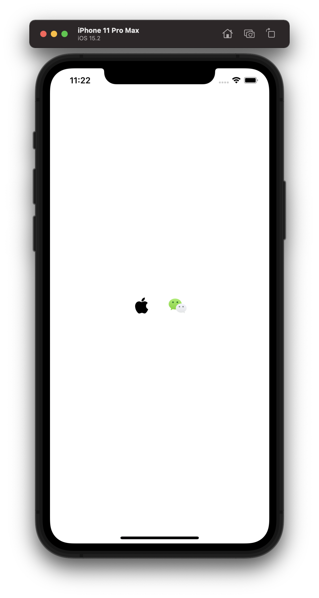
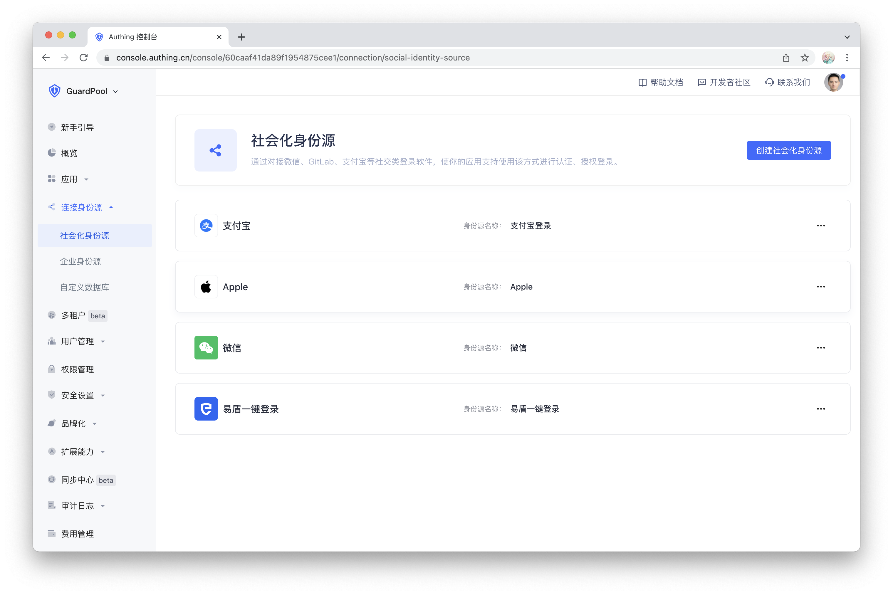
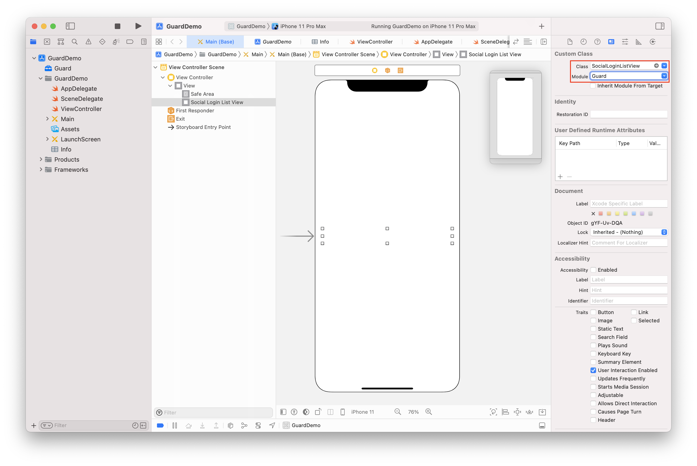

# SocialLoginListView

<LastUpdated/>

此组件根据控制台设置显示社会化登录源。用户点击图标时，拉起相应 App 完成认证。

## 示例



## 控制台设置



## 创建

放置一个 UIView，并将其类型改为 SocialLoginListView



## 属性

| 属性名                     | 类型 | 说明 | 默认值 |
| ----------------------- |:--------:| :------:| :-----: |
|  src     |    String    |   社会化登录源。auto：跟随控制台；wechat\|apple\|wecom\|google\|lark-internal\|lark-public，用 \| 隔开   |    auto   |

## 设置属性示例

```swift
if let social: SocialLoginListView = Util.findView(view, viewClass: SocialLoginListView.self) {
    social.src = "wechat|apple"
}
```