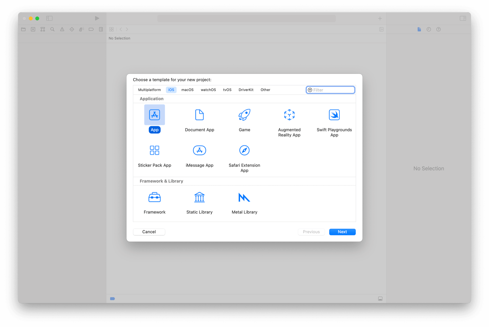
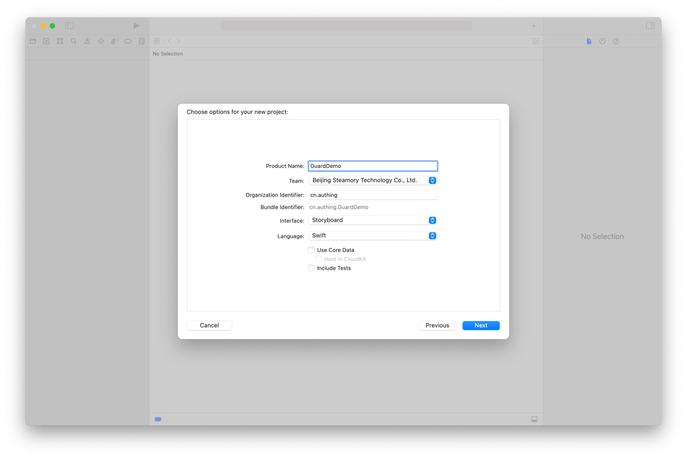
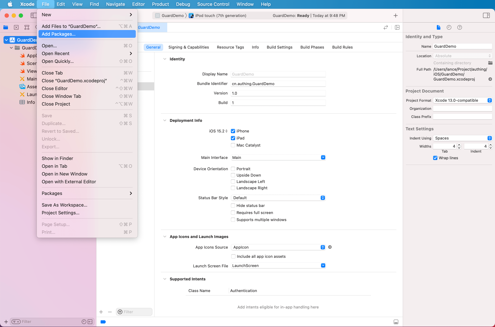
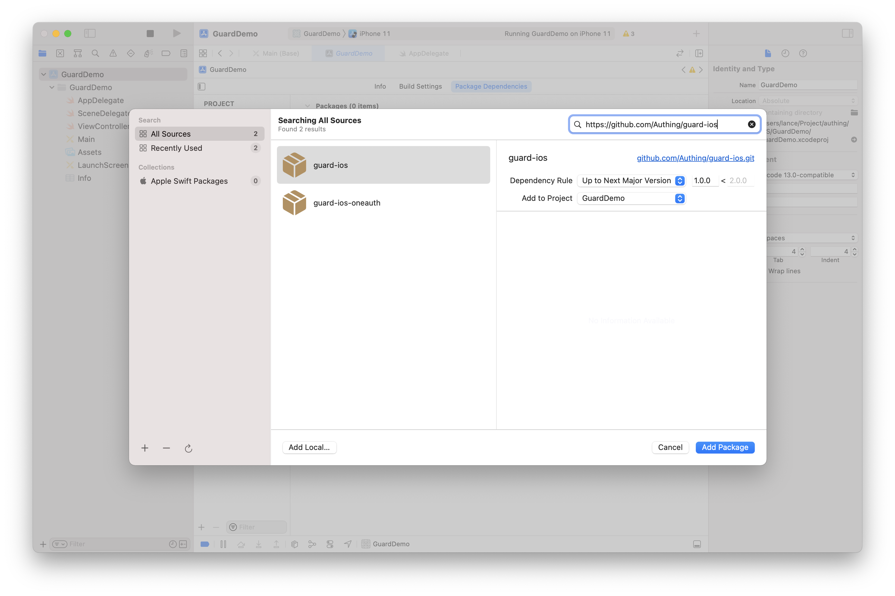
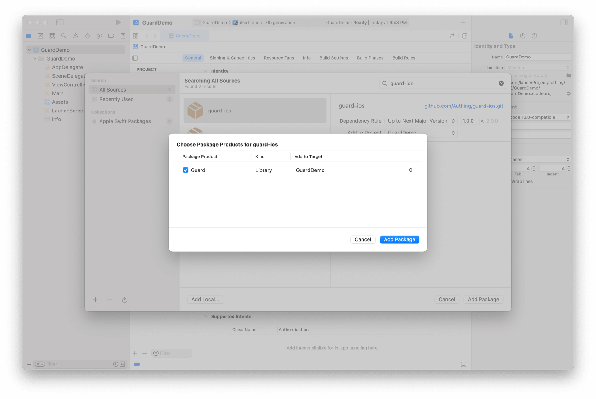
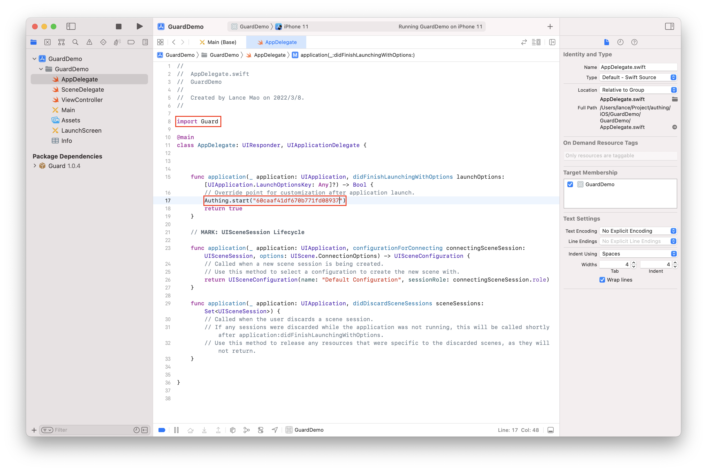
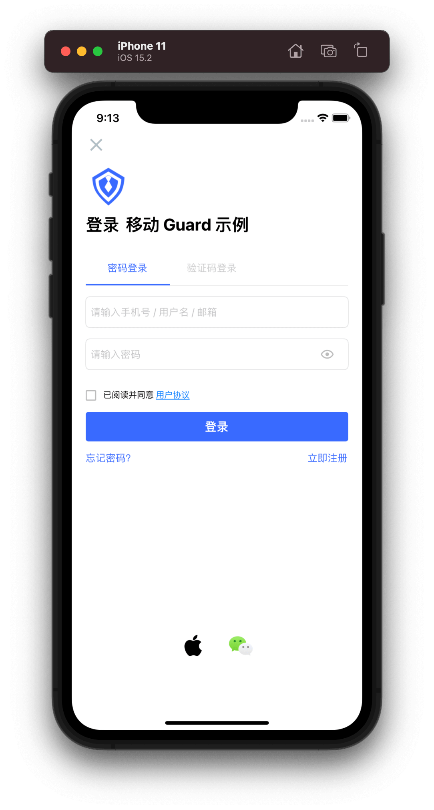

# 快速开始

<LastUpdated/>

## 第一步：新建 iOS Swift 工程





## 第二步：添加 Guard 依赖

在 Xcode 菜单栏右上角选择 *File* 点击 *Add Packages*

在 Swift Package 搜索栏输入：https://github.com/Authing/guard-ios

依赖规则选择 *Up to Next Major Version 1.0.0*







## 第三步：初始化

红色部分是需要改动的地方



<br>

接下来，应用程序只需要 1 分钟，即可嵌入 Authing 提供的标准认证流程和界面。

<span style="background-color: #215ae5;a:link:color:#FFF;padding:8px;border-radius: 4px;"><a href="./quick.html" style="color:#FFF;">快速接入 →</a>
</span>

<br>


通过 Authing 提供的标准认证流程和界面，应用程序可以 1 分钟完成接入。

首先确保已经完成了 [开发准备工作](./develop.md)，然后在需要认证的地方调用：

```swift
import Guard
AuthFlow().start { [weak self] code, message, userInfo in
    if code == 200 {
        // userInfo 为用户信息
    }
}
```

效果如下：



如果应用需要自定义认证流程和界面，推荐使用超组件（Hyper Component）快速构建认证流程和界面。

<br>
<span style="background-color: #215ae5;a:link:color:#FFF;padding:8px;border-radius: 4px;"><a href="./component/" style="color:#FFF;">超组件使用指南 →</a>
</span>