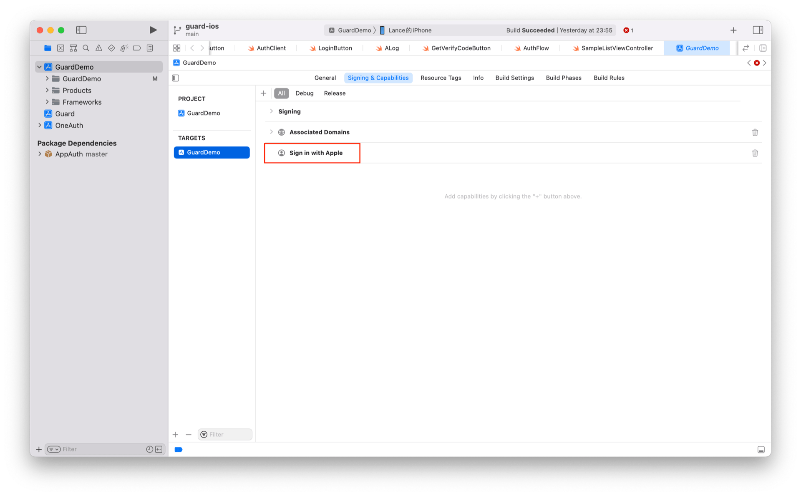

# 苹果帐号登录

<LastUpdated/>

### 步骤 1：配置苹果帐号登录

首先登录到苹果开发者网站，然后参考这里进行配置：[详细步骤](/connections/apple/)

<br>

### 步骤 2：初始化 Guard SDK

通过 Swift Package Manager 引入 Guard 依赖并调用初始化函数。[详细步骤](/reference/sdk-for-ios/develop.html)

<br>

### 步骤 3：在工程里面启动 Sign in with Apple



### 步骤 4：发起苹果认证

通过我们提供的语义化 Hyper Component，只需要在 xib 里面放置一个：

```swift
AppleLoginButton
```

所有的逻辑由我们语义化引擎自动处理。如果想自己实现苹果帐号认证，在拿到授权码后可以调用下面接口：

```swift
func loginByApple(_ code: String, completion: @escaping(Int, String?, UserInfo?) -> Void)
```

**参数**

* *authCode* 苹果授权码

**示例**

```swift
AuthClient().loginByApple(authCode) { code, message, userInfo in
    if (code == 200) {
        // userInfo：用户信息
    }
}
```
