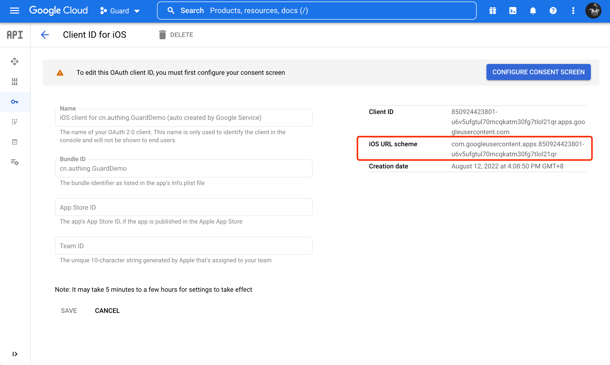

# Google 帐号登录

<LastUpdated/>

集成 Google 登录需要以下步骤：

1. 在 [Google API Console Credentials 控制台](https://console.cloud.google.com/apis/credentials) 及 [Authing 管理控制台](https://www.authing.cn/) 进行配置，请参阅 [Google 移动端](https://docs.authing.cn/v2/guides/connections/social/google-mobile/)。

2. 添加 Google 登录组件依赖。

3. 修改项目配置。

## 集成 Google 登录组件

### 步骤 1：添加 Google 登录组件依赖

1. 在 swift package 搜索栏输入：https://github.com/Authing/authing-binary 。

2. 选择 [Authing-binary](https://github.com/Authing/authing-binary)。
> [Authing-binary](https://github.com/Authing/authing-binary) 依赖于 [Guard-iOS SDK](https://github.com/Authing/guard-ios)。

2. 依赖规则选择 **Up to Next Major Version 1.0.0** 。

3. 点击 **Add Package** 后勾选 **Google** 。

<br>

### 步骤 2：修改项目配置

配置 Google 登录组件回跳 URL：
1. 选择 Xcode 工程，在 **Targets** - **Info** - **URL Types** 中点击加号。
2. **URL Schemes** 添加 Google 控制台的 **iOS URL scheme** 。



::: img-description
iOS URL scheme
:::


::: img-description
添加 URL Types
:::

<br>

### 步骤 3：初始化 Google 组件

1. 在 AppDelegate 或 SceneDelegate 中加入 import Guard 和 import Google 。

2. 调用 Authing.start() 初始化 Guard SDK。

3. Google.register 需要传入 Google 控制台发放的、 **clientID** 和 **serverClientId**。


> **clientID** 为 Google 控制台 iOS 应用的 **ClientID**，
> **serverClientId** 为 Google 控制台 Web 应用的 **ClientID**。

```swift
import Guard
import Google

Authing.start(<#Authing AppId#>);
Google.register(clientID: <#iOS ClientId#>, serverClientId: <#Oauth Web ClientId#>)
 ```
 
<br>

### 步骤 4：添加回调

登录成功返回应用后，如果使用了 SceneDelegate，则需要在 SceneDelegate.swift 里面重载下面的函数：

```swift
func scene(_ scene: UIScene, openURLContexts URLContexts: Set<UIOpenURLContext>) {
    if let url = URLContexts.first?.url {
        _ = Google.handleURL(url: url)
    }
}
 ```

如果未使用 SceneDelegate，则需要在 AppDelegate 里面重载以下函数。

```swift
func application(_ app: UIApplication, open url: URL, options: [UIApplication.OpenURLOptionsKey : Any] = [:]) -> Bool {
   return Google.handleURL(url: url)
}
 ```

<br>

### 步骤 5：发起 Google 授权
Google 登录组件提供了三种授权方式：

- 开发者在需要登录时调用一键登录 API：

```swift
Google.login(viewController: <#承载视图的ViewController#>) { code, message, userInfo in
    if (code == 200) {
        // userInfo：用户信息
    }
}
```

<br>

- 通过我们提供的语义化 Hyper Component，只需要在 xib 里面放置一个：

```swift
GoogleSignInButton
```

设置 **Module** 为 Google，Build success 后点击 **GoogleSignInButton** 即可登录。


<br>

- 如果想自己接入 Google 授权整个流程，拿到授权码后，可以调用下面 API 换取 Authing 用户信息：

```swift
func loginByGoogle(_ code: String, completion: @escaping(Int, String?, UserInfo?) -> Void)
```

**参数**

`authCode` Google 授权码

**示例**

```swift
AuthClient().loginByGoogle(authCode) { code, message, userInfo in
    if (code == 200) {
        // userInfo：用户信息
    }
}
```