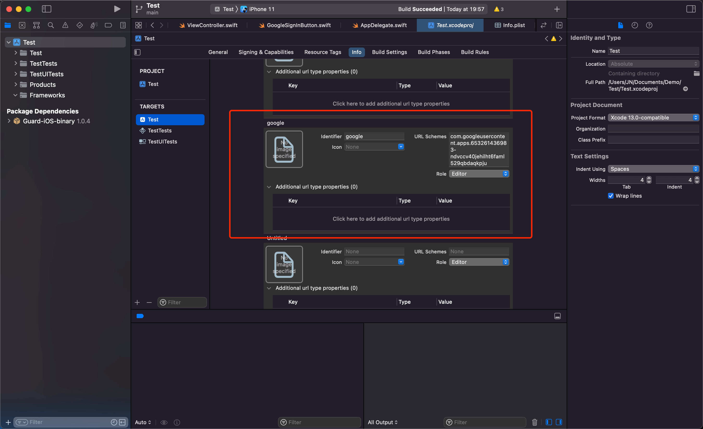
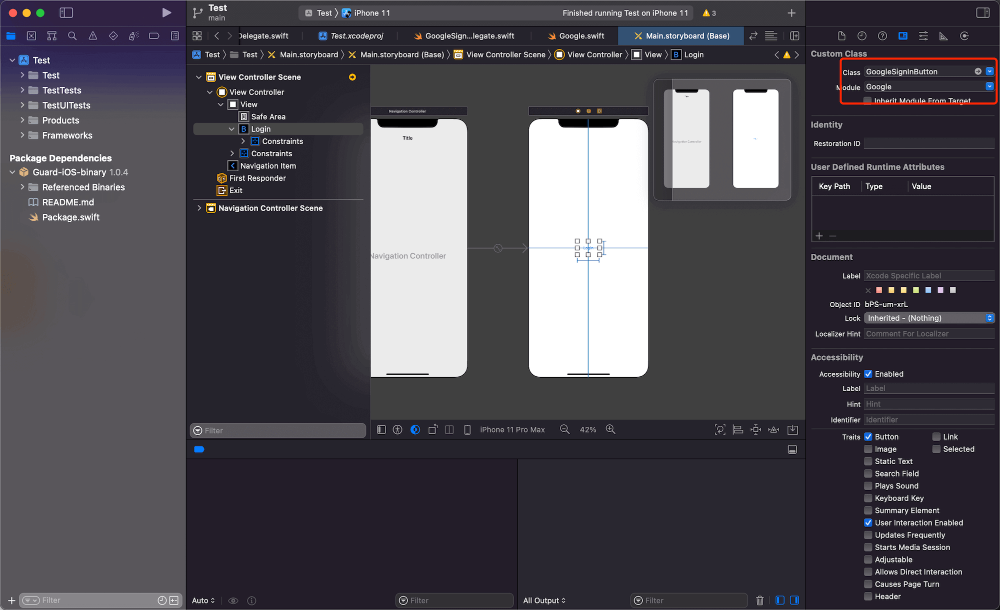

# Google 帐号登录

<LastUpdated/>

集成 Google 登录需要以下步骤：

- 在 Google 开发者控制台及 Authing 管理控制台进行配置请参阅 [Google 移动端](https://docs.authing.cn/v2/guides/connections/social/google-mobile/)

- 集成 Authing iOS Google 登录

- 修改项目配置

> OAuth Client 应用类型需要创建 Web Application 及 iOS 两种
> Authing 控制台社会化身份源应选择 Google 移动端

## 集成 Authing iOS Google 登录

### 添加依赖

> Guard-iOS-binary 依赖于 Guard 组件

- 在 swift package 搜索栏输入：https://github.com/Authing/authing-binary

- 依赖规则选择 Up to Next Major Version 1.0.0

- Add Package 后勾选 Google

<br>

### 修改项目配置

配置 Google 回跳 URL：
- 点击项目文件，URL Types 中点击加号。
- URL Schemes 添加 `REVERSED_CLIENT_ID` （例如：com.googleusercontent.apps.416092875790-gk29o58aein6vrkneb3vd1bki91b5his）。



<br>

### 初始化 Google

- 导入 Guard 和 Google

- Google.register 需要传入 Google 发放的 `clientID` `serverClientId`
> clientID 为 Google iOS 应用的 ClientID
> serverClientId 为 Google Web 应用的 ClientID
```swift
import Guard
import Google

Authing.start(<#Authing AppId#>);
Google.register(clientID: <#iOS ClientId#>, serverClientId: <#Oauth Web ClientId#>)
 ```
 
<br>

### 添加回调

登录成功返回应用后，如果使用了 SceneDelegate，则需要在 SceneDelegate.swift 里面重载下面的函数：

```swift
func scene(_ scene: UIScene, openURLContexts URLContexts: Set<UIOpenURLContext>) {
    if let url = URLContexts.first?.url {
        _ = Google.handleURL(url: url)
    }
}
 ```

如果未使用 SceneDelegate，则需要在 AppDelegate 里面重载

```swift
  func application(_ app: UIApplication, open url: URL, options: [UIApplication.OpenURLOptionsKey : Any] = [:]) -> Bool {
      return Google.handleURL(url: url)
  }
 ```

<br>

### 发起 Google 授权
SDK 提供了三种授权方式：

1. 开发者在需要登录时调用 API：

```swift
Google.login(viewController: <#承载视图的ViewController#>) { code, message, userInfo in
    if (code == 200) {
        // userInfo：用户信息
    }
}
```

2. 通过我们提供的语义化 Hyper Component，只需要在 xib 里面放置一个：

```swift
GoogleSignInButton
```
设置 Module 为 Google，Build success 后点击按钮即可登录。


3. 如果想自己接入 Google 授权整个流程，拿到授权码后，可以调用下面 API 换取 Authing 用户信息：

```swift
func loginByGoogle(_ code: String, completion: @escaping(Int, String?, UserInfo?) -> Void)
```

**参数**

* *authCode* Google 授权码

**示例**

```swift
AuthClient().loginByGoogle(authCode) { code, message, userInfo in
    if (code == 200) {
        // userInfo：用户信息
    }
}
```