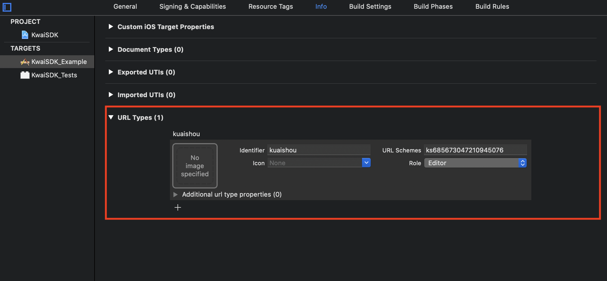

# 快手登录

<LastUpdated/>

## 准备工作

在 [快手开放平台](https://open.kuaishou.com/platform/) 及 [Authing Console 控制台](https://authing.cn/)进行配置，请参阅 [快手接入准备](../../../guides/connections/social/kuaishou-mobile/README.md)、[快手官方文档](https://github.com/KwaiSocial/KwaiSDK-iOS)。

<br>

## 集成快手登录

### 第一步：添加 Kuaishou 依赖

1. 在 swift package 搜索栏输入：https://github.com/Authing/authing-binary 。

2. 选择 [Authing-binary](https://github.com/Authing/authing-binary)。
> [Authing-binary](https://github.com/Authing/authing-binary) 依赖于 [Guard-iOS SDK](https://github.com/Authing/guard-ios)。

3. 依赖规则选择 **Up to Next Major Version 1.0.0** 。

4. Add Package 后勾选 **Kuaishou** 。

> **Kuaishou** 依赖于 [Guard-iOS 1.4.4](https://github.com/Authing/guard-ios) 之后版本。

<br>

### 第二步：Info.plist 里面添加启动白名单

key: LSApplicationQueriesSchemes

value: kwai, kwaiAuth2, kwaiopenapi, KwaiBundleToken, kwai.clip.multi, KwaiSDKMediaV2, ksnebula

> 注意大小写

也可以通过 Source Code 方式打开 Info.plist，然后复制粘贴下面代码：

```xml
<key>LSApplicationQueriesSchemes</key>
<array>
    <string>kwai</string>
    <string>kwaiAuth2</string>
    <string>kwaiopenapi</string>
    <string>KwaiBundleToken</string>
    <string>kwai.clip.multi</string>
    <string>KwaiSDKMediaV2</string>
    <string>ksnebula</string>
</array>
```
<br>

### 第三步：修改项目配置

配置快手登录组件回跳 URL：
1. 选择 Xcode 工程，在 **Targets** -> **Info** -> **URL Types** 中点击加号。
2. **Identifier** 填写 **kuaishou**。
3. **URL Schemes** 填写快手开放平台的 **AppId**。



<br>

### 第四步：设置 Associated Domains：

> 填入开发者的 Universal Link 对应的 host 。


<br>


### 第五步：初始化快手登录

```swift
import Guard
import Kuaishou

func application(_ application: UIApplication, didFinishLaunchingWithOptions launchOptions: [UIApplication.LaunchOptionsKey: Any]?) -> Bool {
    Authing.start(<#AUTHING_APP_ID#>)
    // appId: 快手的 AppId
    // universalLink: 快手开放平台填写的通用链接
    Kuaishou.register(appId: <#your_kuaishou_appId#>, universalLink: <#your_kuaishou_universalLink#>)
}
 ```
<br>


### 第六步：处理快手登录回调

快手返回应用后，如果使用了 SceneDelegate，则需要在 SceneDelegate.swift 里面重载下面的函数：

```swift
func scene(_ scene: UIScene, continue userActivity: NSUserActivity) {
    _ = Kuaishou.handleOpenUniversalLink(userActivity)
}

func scene(_ scene: UIScene, openURLContexts URLContexts: Set<UIOpenURLContext>) {
    if let url = URLContexts.first?.url{
        _ = Kuaishou.handleOpenUrl(url: url)
    }
}
```

如果未使用 SceneDelegate，则需要在 AppDelegate 里面重载：

```swift
func application(_ application: UIApplication, continue userActivity: NSUserActivity, restorationHandler: @escaping ([UIUserActivityRestoring]?) -> Void) -> Bool {
    return  Kuaishou.handleOpenUniversalLink(userActivity)
}

func application(_ app: UIApplication, open url: URL, options: [UIApplication.OpenURLOptionsKey : Any] = [:]) -> Bool {
    return Kuaishou.handleOpenUrl(url: url)
}
```

<br>

### 第七步：发起快手登录授权
#### 快手授权登录

```swift
func login(viewController: UIViewController, _ scope: String = "user_info", completion: @escaping Authing.AuthCompletion) -> Void
```

**参数**

* *viewController* 承载视图的 UIViewController
* *scope* 以逗号分割，默认为 user_info 
  
**示例**

```swift
Kuaishou.login(viewController: <#ViewController#>) { code, message, userInfo in
    if (code == 200) {
        // 登录成功
        // userInfo
    }
}
```

<br>

如果开发者自己集成快手登录，拿到 AuthorizationCode 后，可以调用以下 API 换取 Authing 用户信息：

#### 通过快手授权码登录

```swift
func loginByKuaishou(_ code: String, completion: @escaping(Int, String?, UserInfo?) -> Void)
```

**参数**

`code` 快手授权码

**示例**

```swift
AuthClient().loginByKuaishou(authCode) { code, message, userInfo in
    if (code == 200) {
        // userInfo：用户信息
    }
}
```