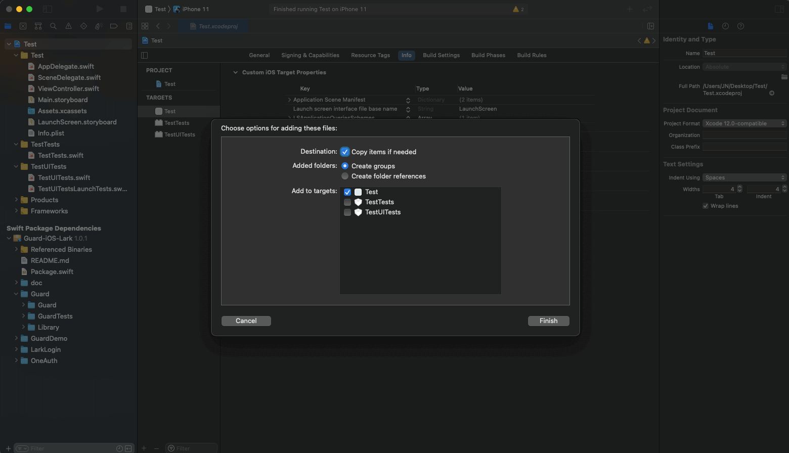
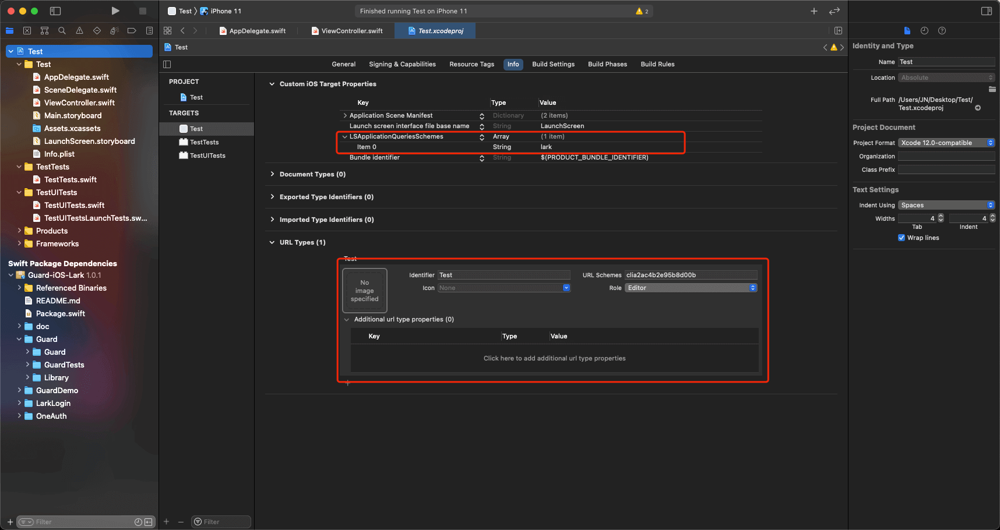

# 飞书登录

<LastUpdated/>

## 准备工作

- 企业自建应用 Authing 控制台以及飞书控制台配置请参阅[接入飞书企业自建应用移动应用登录](https://docs.authing.cn/v2/connections/lark-internal-mobile/)。

- 应用商店应用 Authing 控制台以及飞书控制台配置请参阅[接入飞书应用商店应用移动应用登录](https://docs.authing.cn/v2/connections/lark-public-mobile/)。

<br>

## 集成飞书登录步骤

### 步骤 1：添加飞书登录组件依赖

1. 在 swift package 搜索栏输入：https://github.com/Authing/authing-binary 。

2. 选择 [Authing-binary](https://github.com/Authing/authing-binary)。
> [Authing-binary](https://github.com/Authing/authing-binary) 依赖于 [Guard-iOS SDK](https://github.com/Authing/guard-ios)。

3. 依赖规则选择 **Up to Next Major Version 1.0.0** 。

4. 勾选 **LarkLogin** 。

<br>

### 步骤 2：修改项目配置

- 前往[飞书开发平台](https://open.feishu.cn/document/uAjLw4CM/uYjL24iN/mobile-app/sdk)下载 iOS LarkSS0Demo。

- 将 LarkSSO 目录中的 LarkSSO.bundle 拖入工程项目目录下，勾选 Copy items if needed 。

- 配置跳转 Scheme: LSApplicationQueriesSchemes Key 下添加 lark 。

- 配置飞书回跳 URL：URL types Key 下 添加注册时申请到到 app_id （例如：clia0988c0addf81013），注意需要去掉 app_id 中的下划线。




<br>

### 步骤 3：初始化飞书登录

1. 在 AppDelegate 或 SceneDelegate 中加入 import Guard 和 import LarkLogin 。
2. Authing.start 需要传入 Authing 的应用 ID 。
3. LarkLogin.setupLark 需要传入飞书开放平台发放的 **AppId** 以及 **Scheme** 。

```swift
import Guard
import LarkLogin

Authing.start(<#AUTHING_APP_ID#>)
LarkLogin.setupLark(<#Lark App ID#>, Scheme: <#Lark Scheme#>)
 ```

<br>

### 步骤 4：添加飞书登录回调

飞书返回应用后，如果使用了 SceneDelegate，则需要在 SceneDelegate.swift 里面重载下面的函数：

```swift
func scene(_ scene: UIScene, openURLContexts URLContexts: Set<UIOpenURLContext>) {
    if let url = URLContexts.first?.url {
        _ = LarkLogin.handleUrl(url: url)
    }
}
 ```

如果未使用 SceneDelegate，则需要在 AppDelegate 里面重载：

```swift
func application(_ app: UIApplication, open url: URL, options: [UIApplication.OpenURLOptionsKey : Any] = [:]) -> Bool {
    return LarkLogin.handleUrl(url: url)
}
 ```

<br>


### 步骤 5：发起飞书授权

推荐通过我们提供的语义化 Hyper Component，只需要在 xib 里面放置一个：

```swift
LarkLoginButton
```

如果不想使用我们内置的按钮，则可以在自己按钮的点击事件里面调用 Authing 飞书登录 API：

```swift
LarkLogin.login(viewController: <#呈现视图的 ViewController#>) { (code, message, userInfo) in
    if (code == 200) {
        // userInfo：用户信息
    }
}
```
