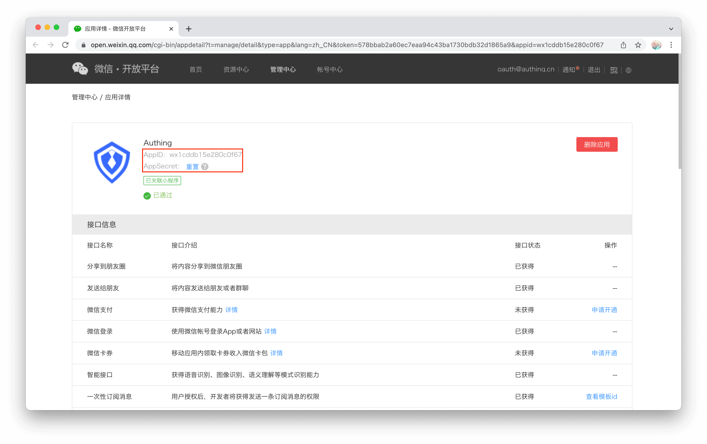
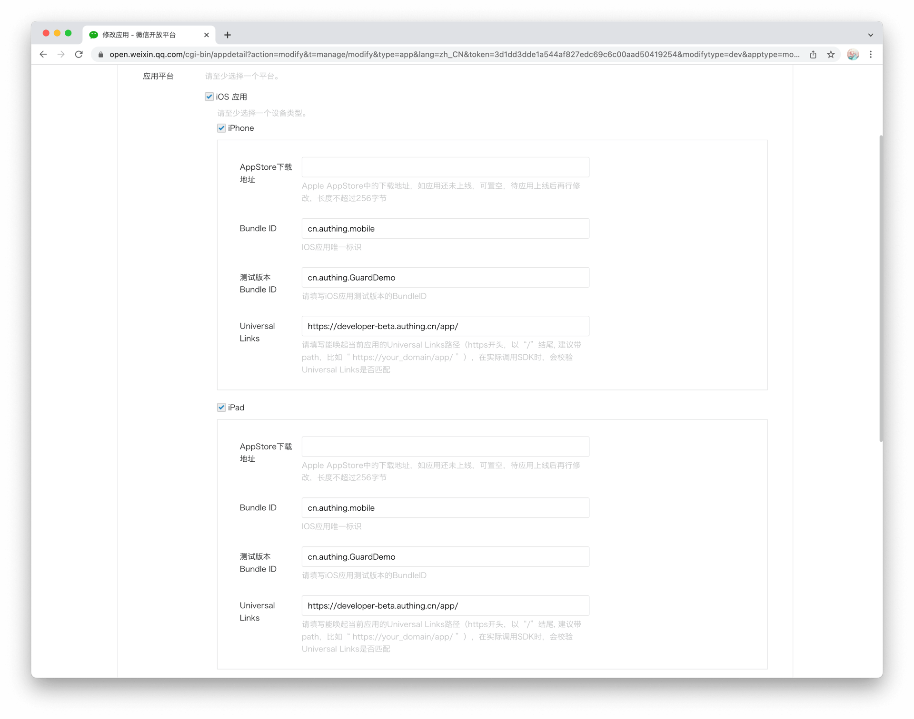
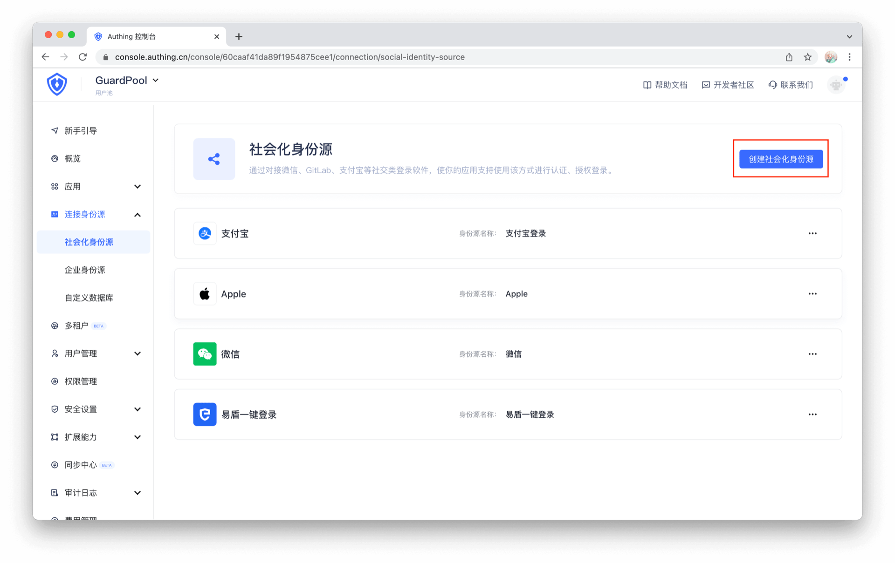
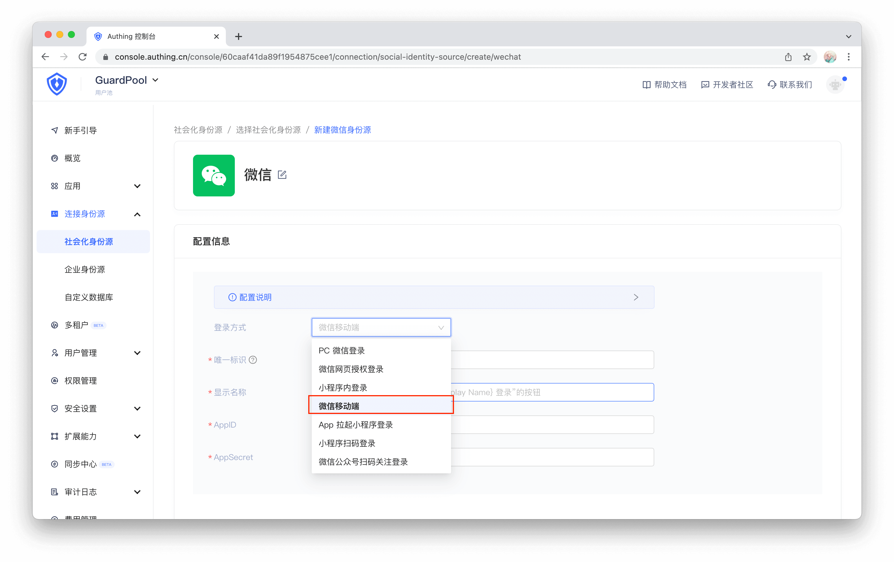
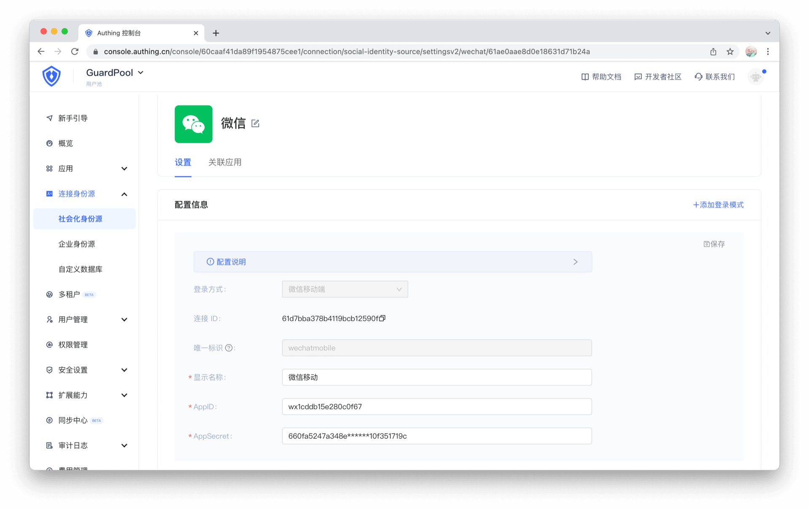
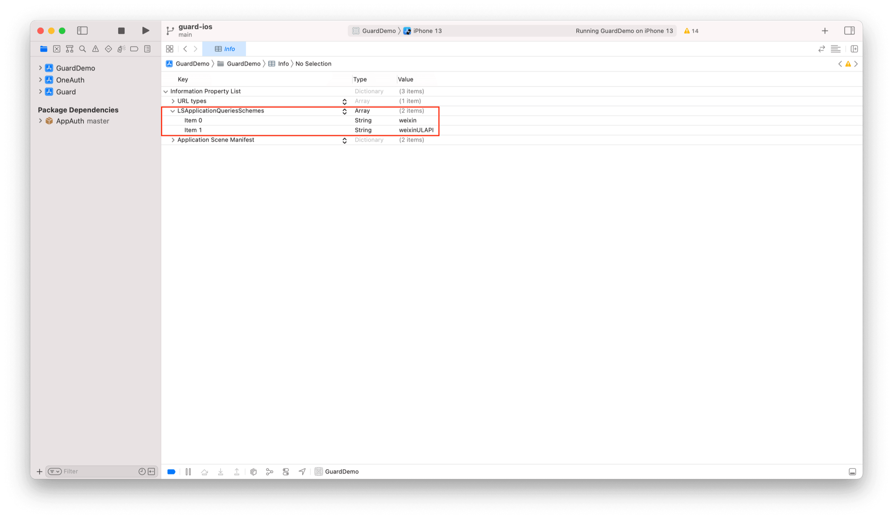
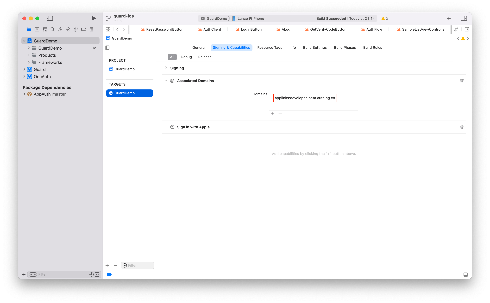

# 微信登录

<LastUpdated/>

集成微信需要三个主要步骤：
* 在微信开放平台进行配置
* 在 Authing 管理控制台进行配置
* 集成 iOS SDK

<br>

## STEP 1：在 [微信开放平台](https://open.weixin.qq.com/) 进行配置

>使用微信登录需要开发人员在微信开放平台认证，认证主体需要是个体商户，企事业单位，不支持个人开发人员，当前认证费用为 300 RMB

1. 获取 AppID 和 AppSecret



2. 设置 iOS 应用信息



> 微信要求通过 [Universal Links](https://developer.apple.com/ios/universal-links/) 的方式回调

<br>

## STEP 2：在 Authing 管理控制台的操作步骤

1. 在控制台的 “连接身份源” 菜单选择 “创建社交身份源“



2. 选择 “微信移动端”



3. 填入微信开放平台对应的 AppID 和 AppSecret



<br>

## STEP 3：集成 iOS SDK 步骤

### 初始化 Guard SDK

通过 Swift Package Manager 引入 Guard 依赖并调用初始化函数。[详细步骤](/reference/sdk-for-ios/develop.html)

<br>

### Info.plist 里面添加启动微信白名单

key: LSApplicationQueriesSchemes

value: weixin, weixinULAPI

> 注意大小写



也可以通过 Source Code 方式打开 Info.plist，然后复制粘贴下面代码：

```xml
<plist version="1.0">
<dict>
    ...
    <key>LSApplicationQueriesSchemes</key>
	<array>
		<string>weixin</string>
		<string>weixinULAPI</string>
	</array>
    ...
</dict>
</plist>
```

<br>

### 在应用启动的时候设置微信：

```swift
import Guard
Authing.setupWechat("your_wechat_appid", universalLink: "your_deep_link")
 ```

>第一个参数为微信应用 id；第二个参数为 iOS [Universal Link](https://developer.apple.com/ios/universal-links/)

<br>

### 设置 Associated Domains：

> 替换为自己 Universal Link 对应的 host



<br>

### 处理微信回调

微信返回应用后，如果使用了 SceneDelegate，则需要在 SceneDelegate.swift 里面重载下面的函数：

```swift
func scene(_ scene: UIScene, continue userActivity: NSUserActivity) {
    NotificationCenter.default.post(name: NSNotification.Name(rawValue: "wechatLoginOK"), object: userActivity)
}
```

如果未使用 SceneDelegate，则需要在 AppDelegate 里面重载

```swift
func application(_ application: UIApplication, continue userActivity: NSUserActivity, restorationHandler: @escaping ([UIUserActivityRestoring]?) -> Void) -> Bool {
    NotificationCenter.default.post(name: NSNotification.Name(rawValue: "wechatLoginOK"), object: userActivity)
    return true
}
```

<br>

### 发起微信授权

推荐通过我们提供的语义化 Hyper Component，只需要在 xib 里面放置一个：

```swift
WechatLoginButton
```

所有的逻辑由我们语义化引擎自动处理。如果想自己实现微信登录，拿到授权码后，可以调用下面 API 换取 Authing 用户信息：

```swift
func loginByWechat(_ code: String, completion: @escaping(Int, String?, UserInfo?) -> Void)
```

**参数**

* *authCode* 微信授权码

**示例**

```swift
AuthClient().loginByWechat(authCode) { code, message, userInfo in
    if (code == 200) {
        // userInfo：用户信息
    }
}
```