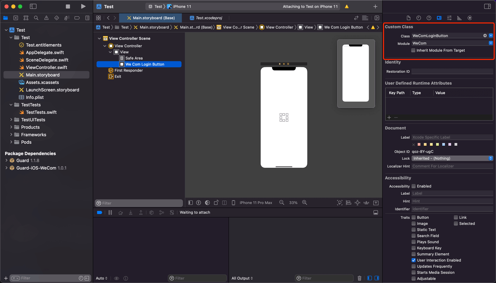

# 企业微信登录

<LastUpdated/>

集成企业微信录需要以下步骤：

- 在企业微信管理后台及 Authing 管理控制台进行配置请参阅[企业微信移动端（代开发模式）](https://docs.authing.cn/v2/guides/connections/enterprise/wecom-agency-mobile/)

- 集成 Authing iOS 企业微信登录

<br>

## 集成 Authing iOS 企业微信登录

### 添加依赖

> Guard-iOS-binary 依赖于 Guard 组件

- 在 swift package 搜索栏输入：https://github.com/Authing/authing-binary

- 依赖规则选择 Up to Next Major Version 1.0.0

- Add Package 后勾选 WeCom

<br>

### 修改项目配置

- 配置跳转 Scheme: LSApplicationQueriesSchemes Key 下添加 wxwork 和 wxworklocal

- 配置企业微信回跳 URL：URL types Key 下 添加企业微信管理后台申请到的 Schema （例如：wwauth803c38cb89ac1d57000002）


<br>

### 初始化 WeCom

- 导入 Guard 和 WeCom

- WeCom.registerApp 需要传入企业微信发放的 `Scheme` `AgentID` `CorpID`

```swift
import Guard
import WeCom

Authing.start(<#Authing AppId#>);
WeCom.registerApp(appId: <#Scheme#>, corpId: <#CorpID#>, agentId: <#AgentID#>)
 ```
 
<br>

### 添加回调

企业微信返回应用后，如果使用了 SceneDelegate，则需要在 SceneDelegate.swift 里面重载下面的函数：

```swift
func scene(_ scene: UIScene, openURLContexts URLContexts: Set<UIOpenURLContext>) {
    if let url = URLContexts.first?.url {
        _ = WeCom.handleOpenURL(url: url)
    }
}
 ```

如果未使用 SceneDelegate，则需要在 AppDelegate 里面重载

```swift
func application(_ app: UIApplication, open url: URL, options: [UIApplication.OpenURLOptionsKey : Any] = [:]) -> Bool {
    return WeCom.handleOpenURL(url: url)
}
 ```

<br>


### 发起企业微信授权

推荐通过我们提供的语义化 Hyper Component，只需要在 xib 里面放置一个：

```swift
WeComLoginButton
```
设置 Module 为 WeCom



如果不想使用我们内置的按钮，则可以在自己按钮的点击事件里面调用 Authing 企业微信登录 API：

```swift
WeCom.login { code, message, userInfo in
    if (code == 200) {
        // userInfo：用户信息
    }
}
```
