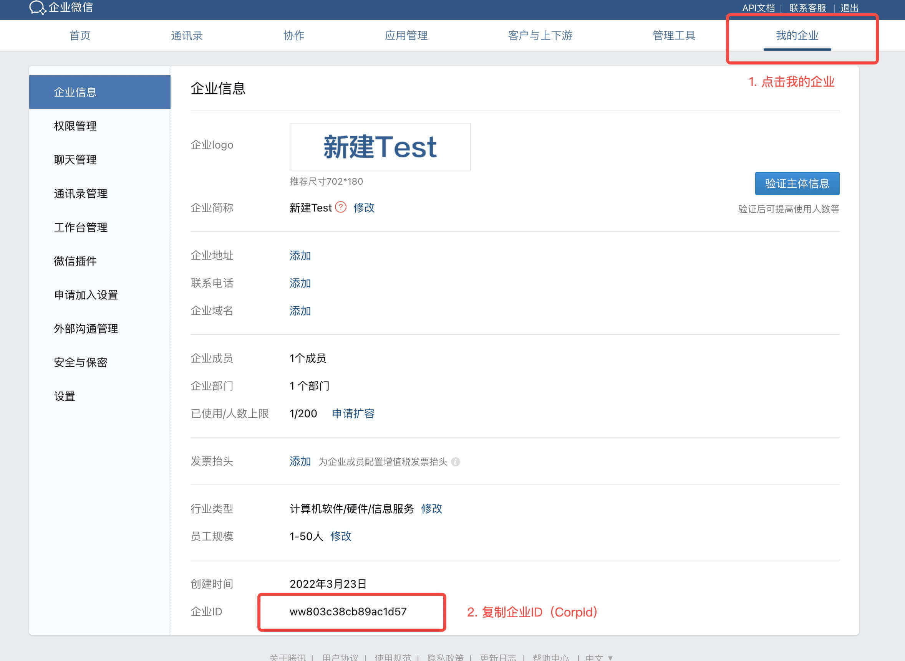
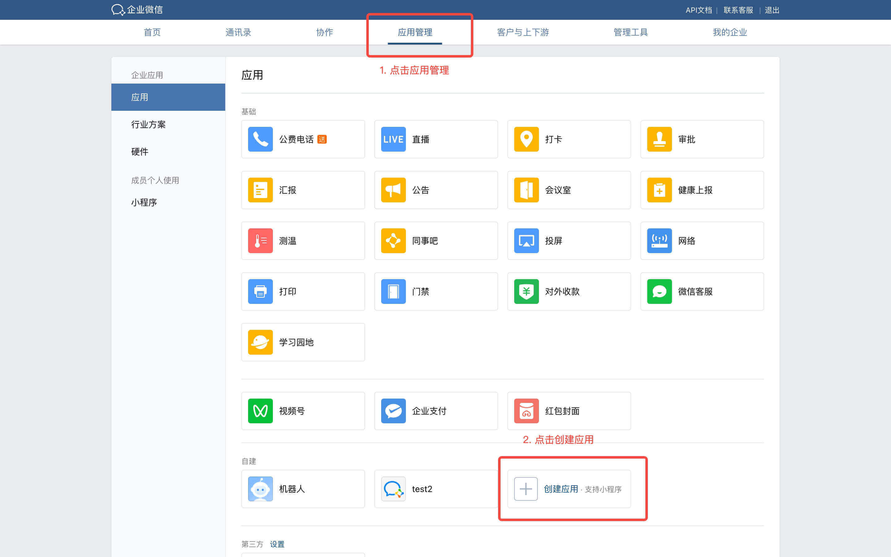
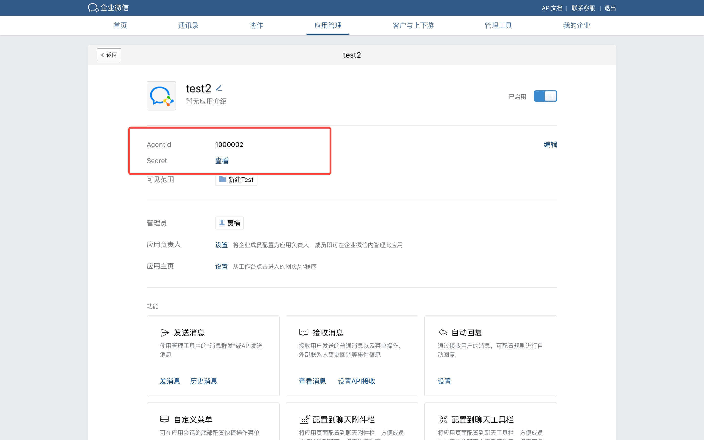
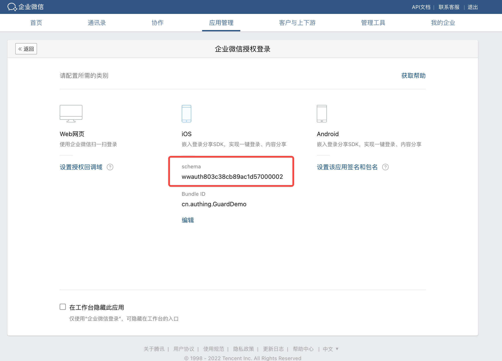
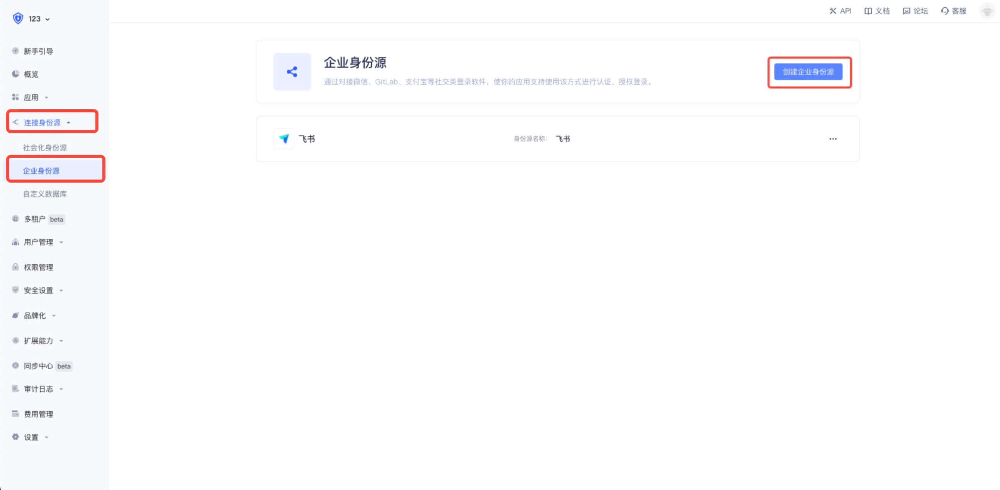
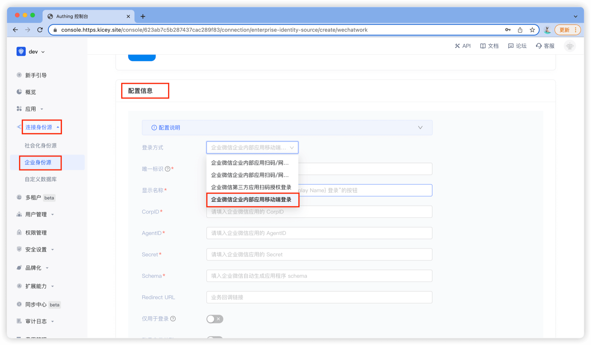
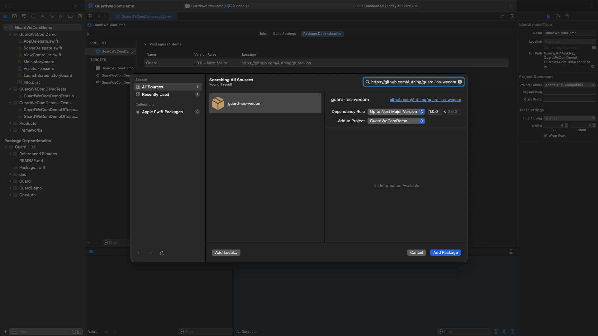
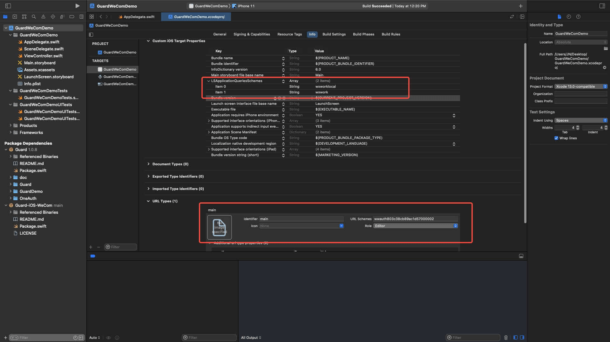

# 企业微信登录

<LastUpdated/>

集成企业微信录需要以下步骤：

- 在企业微信管理后台进行配置

- 在 Authing 管理控制台进行配置

- 集成 iOS SDK

<br>

## STEP 1：在[企业微信管理后台](https://work.weixin.qq.com/)进行配置

获取 `CorpID` `AgentID` `Schema` `Secret` 并填写 BundleID

- 点击 “我的企业”

- 页面底部复制企业ID ( CorpID )



- 点击 “应用管理“

- 点击 “创建应用“

- 复制 AgentID 和 Schema





- 点击 “企业微信授权登录“

- 选择 iOS 复制 Schema 并填写 BundleID



<br>

## STEP 2：在 Authing 管理控制台的操作步骤

- 在控制台的 “连接身份源” 菜单选择 “创建企业身份源“

- 选择 “企业微信”

- 选择 “企业微信企业内部应用移动端登录”

- 填入对应参数





<br>

## STEP 3：集成 iOS SDK 步骤

### 初始化 Guard-iOS-WeCom SDK

> Guard-iOS-WeCom 依赖于 Guard 组件（Version 1.0.8 之后）

- 在 swift package 搜索栏输入：https://github.com/Authing/guard-ios-wecom

- 依赖规则选择 Up to Next Major Version 1.0.0

- Add Package 后勾选 WeCom



<br>

### 修改项目配置

- 配置跳转 Scheme: LSApplicationQueriesSchemes Key 下添加 wxwork 和 wxworklocal

- 配置企业微信回跳 URL：URL types Key 下 添加企业微信管理后台申请到的 Schema （例如：wwauth803c38cb89ac1d57000002）



<br>

### 初始化 WeCom

- 导入 Guard 和 WeCom

- WeCom.registerApp 需要传入企业微信发放的 `Scheme` `AgentID` `CorpID`

```swift
import Guard
import WeCom

LarkLogin.setupLark(<#Lark App ID#>, Scheme: <#Lark Scheme#>)
WeCom.registerApp(appId: <#Scheme#>, corpId: <#CorpID#>, agentId: <#AgentID#>)

 ```

<br>

### 添加回调

企业微信返回应用后，如果使用了 SceneDelegate，则需要在 SceneDelegate.swift 里面重载下面的函数：

```swift
func scene(_ scene: UIScene, openURLContexts URLContexts: Set<UIOpenURLContext>) {
    if let url = URLContexts.first?.url {
        _ = WeCom.handleOpenURL(url: url)
    }
}
 ```

如果未使用 SceneDelegate，则需要在 AppDelegate 里面重载

```swift
func application(_ app: UIApplication, open url: URL, options: [UIApplication.OpenURLOptionsKey : Any] = [:]) -> Bool {
    return WeCom.handleOpenURL(url: url)
}
 ```

<br>


### 发起企业微信授权

推荐通过我们提供的语义化 Hyper Component，只需要在 xib 里面放置一个：

```swift
WeComLoginButton
```

如果不想使用我们内置的按钮，则可以在自己按钮的点击事件里面调用 Authing 企业微信登录 API：

```swift
WeCom.login { code, message, userInfo in
    if (code == 200) {
        // userInfo：用户信息
    }
}
```
