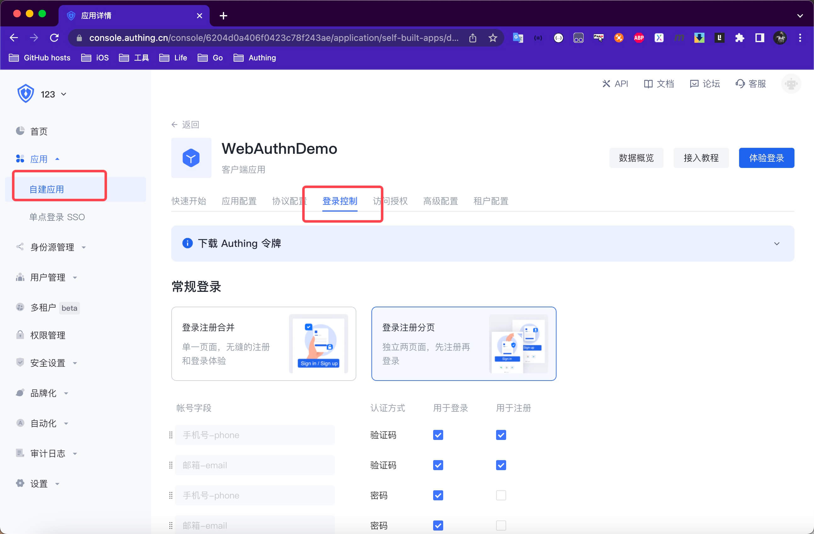
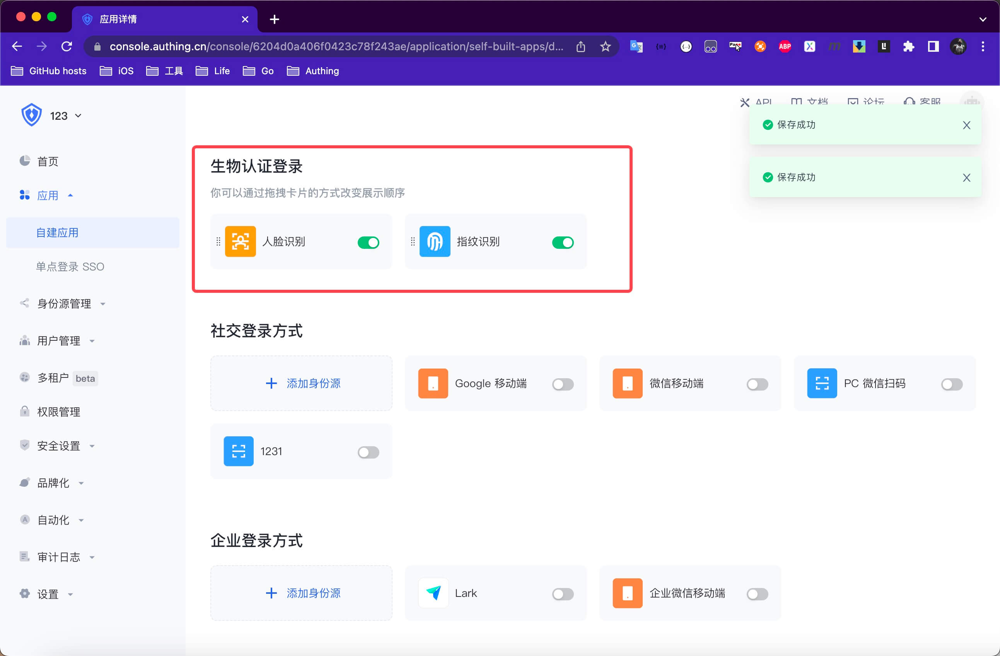

# WebAuthn 生物认证


<LastUpdated/>


## 集成 WebAuthn 登录

### 第一步：在 [Authing 管理控制台](https://www.authing.cn/) 打开生物认证
1. 在自建应用下找到需要开启的客户端应用。
2. 点击登录控制。
3. 点击生物认证控制并开启开关。
   




<br>

### 第二步：添加 WebAuthn 登录依赖
1. 在 swift package 搜索栏输入：https://github.com/Authing/authing-binary 。

2. 选择 [Authing-binary](https://github.com/Authing/authing-binary)。

3. 依赖规则选择 **Up to Next Major Version 1.0.0** 。

4. Add Package 后勾选 **WebAuthn** 。

> **WebAuthn** 依赖于 [Guard-iOS 1.4.0](https://github.com/Authing/guard-ios) 之后版本。

<br>

## 使用 WebAuthn 登录

### 使用 WebAuthn 超组件

**Authing WebAuthn SDK** 为开发者提供了[生物认证按钮](../component/basic/biometric-login-button.md)超组件，开发者可以通过此组件一分钟集成 WebAuthn 无密码认证。

### 使用 WebAuthn API

如果开发者想自己实现 WebAuthn 认证流程，可参阅[自定义-WebAuthn-认证流程](../scenario/webauthn.md)，结合以下 API 进行开发。

#### 获取 WebAuthn 凭证创建初始化参数

获取 WebAuthn 凭证创建初始化参数，调用此接口前需要用户已登录。

```swift
public func getWebauthnRegistrationParam(completion: @escaping(Int, String?, NSDictionary?) -> Void) 
```

**示例**

```swift
AuthClient().getWebauthnRegistrationParam() { code, message, data in
    // data.registrationOptions
}
```

<br>

#### 验证 WebAuthn 绑定注册认证器凭证

验证 WebAuthn 绑定注册认证器凭证

```swift
func webauthnRegistration(ticket: String, credentialId: String, rawId: String, attestationObject: String, clientDataJSON: String, authenticatorCode: String, completion: @escaping(Int, String?, NSDictionary?) -> Void)
``` 

**参数**

* *ticket* 获取凭证创建初始化参数时的 ticket
* *credentialId* Base64URL 编码的凭证 ID
* *rawId* Base64URL 原始凭证 ID
* *attestationObject* 客户端数据，包含 origin（即凭证请求来源）、挑战等信息
* *creclientDataJSONdentialId* Base64URL 编码的凭证 ID
* *authenticatorCode* 凭证信息类型：`"fingerprint"` `"face"` `"other"`

**示例**

```swift
AuthClient().webauthnRegistration(ticket: ticket, credentialId: cid, rawId: rid, attestationObject: att, clientDataJSON: clidata, authenticatorCode: "face") { code, message, res in
}
```

<br>

#### 服务端验证 WebAuthn 认证请求凭证

```swift
func webauthnAuthentication(ticket: String, credentialId: String, rawId: String, authenticatorData: String, userHandle: String, clientDataJSON: String, signature: String, completion: @escaping(Int, String?, NSDictionary?) -> Void)
``` 

**参数**

* *ticket* 从 获取 WebAuthn 认证请求初始化参数接口 获得的 ticket
* *credentialId* Base64URL 编码的凭证 ID
* *rawId* Base64URL 原始凭证 ID
* *authenticatorData* 认证器信息，包含认证状态、签名计数等
* *userHandle* 创建凭证时的用户 ID
* *clientDataJSON* 客户端数据，包含 origin（即凭证请求来源）、挑战码等信息
* *signature* 认证器签名

**示例**

```swift
AuthClient().webauthnAuthentication(ticket: ticket, credentialId: cid, rawId: rawId, authenticatorData: attData, userHandle: userHandle, clientDataJSON: clientData, signature: sig) { code, message, res in
}
```

<br>

#### 删除服务端 WebAuthn 认证请求凭证

```swift
func webauthnRemoveCredential(credentialID: String, completion: @escaping(Int, String?, NSDictionary?) -> Void)
``` 

**参数**

* *credentialID* Base64URL 编码的凭证 ID

**示例**

```swift
AuthClient().webauthnRemoveCredential(credentialID: cid) { code, message, res in
}
```

<br>


#### 获取已绑定的凭证列表

```swift
func checkWebauthnVaildCredentitals(credentialIds: [String], authenticatorCode: String, completion: @escaping(Int, String?, NSDictionary?) -> Void)
``` 

**参数**

* *credentialIds* Base64URL 编码的凭证 ID 的数组
* *authenticatorCode* 凭证信息类型：`"fingerprint"` `"face"` `"other"`

**示例**

```swift
AuthClient().checkWebauthnVaildCredentitals(credentialIds: [cid], authenticatorCode: "face") { code, message, res in
}
```

<br>

