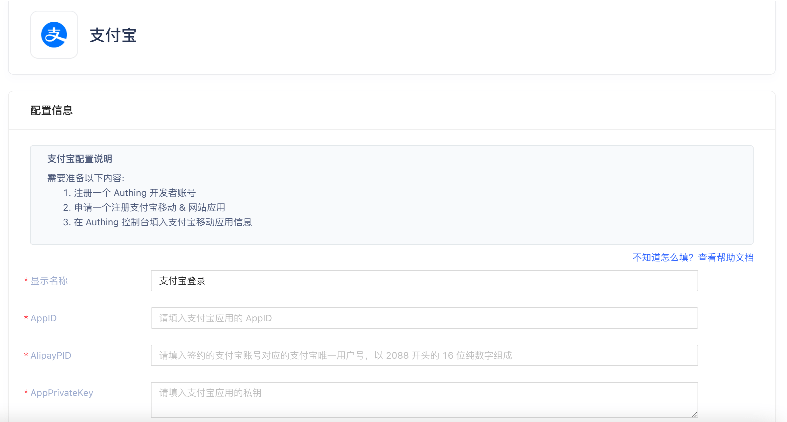
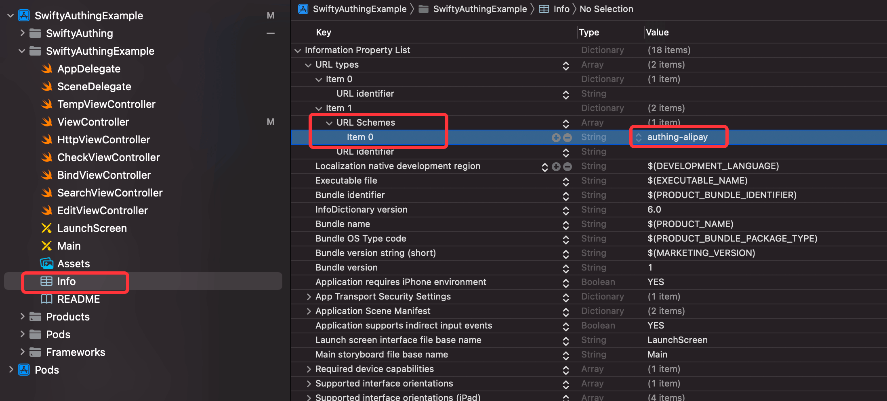
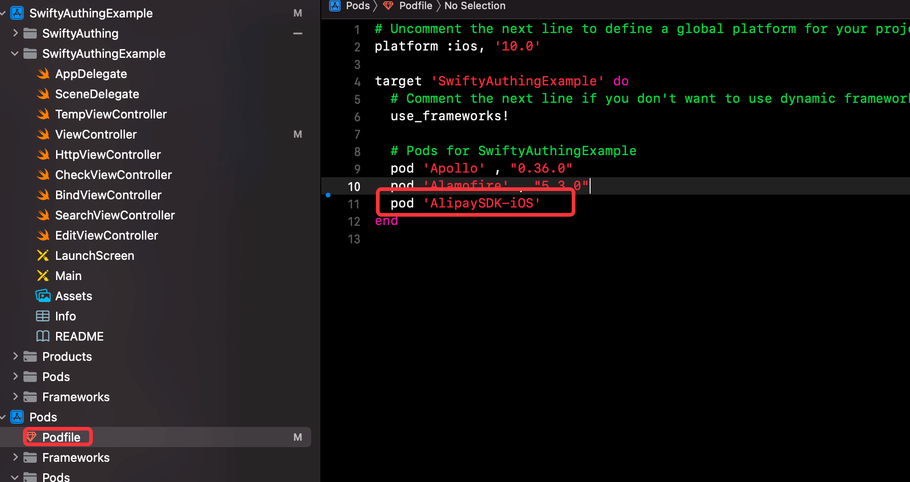

# 支付宝社会化登录

<LastUpdated/>

- **基础设置-后台**

支付宝社会化登录需要在登录 https://console.authing.cn/ 后开启功能：

进入创建社交身份源页面后，选择支付宝选项后，进入支付宝登录配置页面：



 输入在支付宝开放平台 https://open.alipay.com/ 申请的 **AppID**，**AlipayPID** 和 **AppPrivateKey** 数据后，完成支付宝社会化登录 Authing 的关联注册。

- **基础设置-工程**



 在接入工程中，找到 Info.plist 文件，增加 **URL types** -> **URL Schemes** -> **Item 0**，设置 **Item 0** 的 Value 为：**authing-alipay**。

- **基础设置- Podfile**

在工程的 Podfile 中，增加 **pod 'AlipaySDK-iOS'** 导入。



 在项目 podfile 根目录下用 Cocoapods **pod install** 命令后，完成开发环境的基础设置和更新。

- **示例**

```
AuthenticationClient.shared.loginByAlipay() { result in }
```

