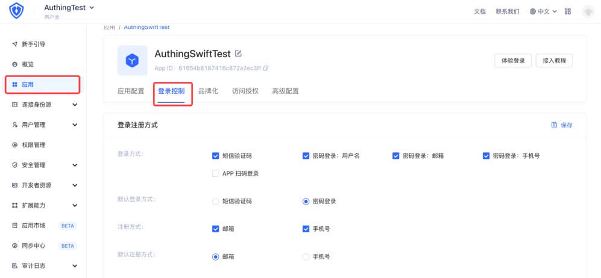

# Authing 社会化登录
<LastUpdated/>

Guard 托管登录是 Authing 提供给开发者的内置登录 H5 表单：


请登录 https://console.authing.cn/ 后，在如下界面进行设置：



登录注册方式设置后，在移动端 H5 Guard 托管注册/登录页面会显示设置的几种方式。

- **示例**

```swift
//self :当前UIViewController

AuthenticationClient.shared.loginByAuthing(self) { result in }
```

