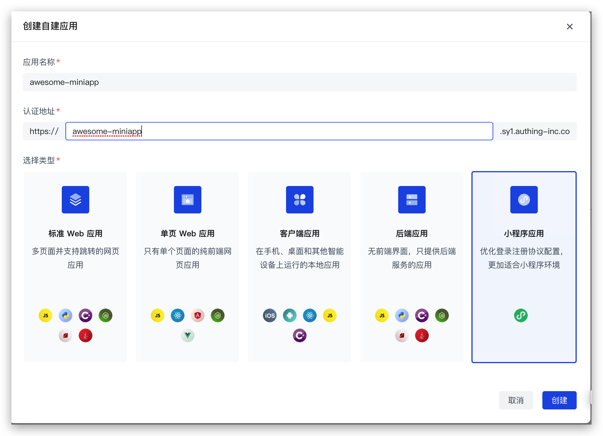
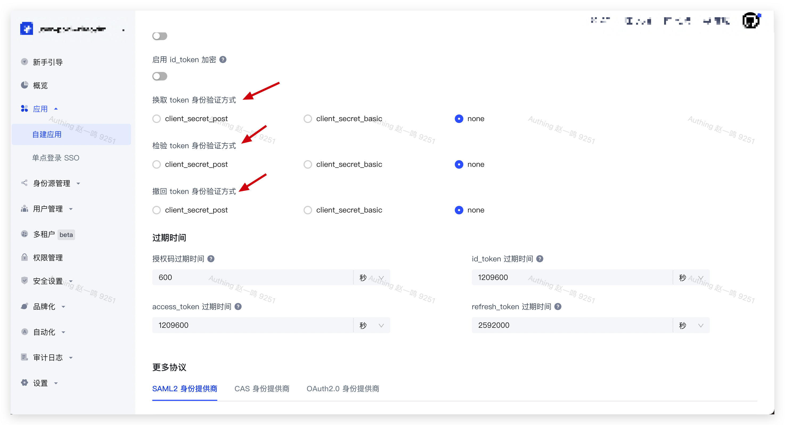

# 微信小程序 SDK

## 说明

[Authing 小程序 SDK 5.x](https://github.com/Authing/authing-js-sdk/tree/master/packages/) 于 2022 年 9 月 7 日发布，如果你正在使用之前的版本 [authing-wxapp-sdk](https://github.com/Authing/authing-wxapp-sdk)，可参考：[微信小程序 SDK](./sdk-for-wxapp.md)

SDK 5.x 主要升级：

- 集成并增强 Authing 最新 V3 版认证 API，覆盖大多数用户认证、授权类核心功能，未来我们将根据用户需要继续拓展其他功能
- 完善的 TS 类型提示
- 基于 [AuthingMove](https://github.com/authing/authingmove) 框架构建适配多端产物：原生微信小程序、Taro 和 uniapp 框架，未来我们将按需继续支持其他主流小程序平台及框架
- 核心认证场景总包体积 16.68 K，未来我们将继续优化其他场景下的包体积
- 支持按需集成 rsa 和 sm2 两种加密方式，包体积更优
- 向下兼容至小程序基础库版本 `2.14.1`

## STEP 1：创建应用

1. 使用 Authing 创建一个应用：

<ul style="padding-left: 50px">
  <li>进入<a href="https://console.authing.cn/" target="blank">控制台</a></li>
  <li>展开左侧<strong>应用</strong>菜单，点击<strong>自建应用</strong>菜单</li>
  <li>点击右上角<strong>创建自建应用</strong>按钮</li>
  <li>填写<strong>应用名称</strong>和<strong>认证地址</strong>、选择<strong>标准 Web 应用</strong></li>
  <li>点击创建</li>
</ul>



2. 以下身份验证方式选择 <strong>none</strong>



<br />

3. 保存当前配置

## STEP 2：创建社会化身份源

- 在微信公众平台后台的`开发` -> `开发管理` -> `开发设置`页面获取`小程序 ID` 和`小程序密钥`。
- 在 Authing 控制台`身份源管理` -> `社会化身份源` -> `创建社会化身份源` -> `微信` -> `小程序`创建一个微信社会化身份源，并填写以下信息：

  - 唯一标识：这是此连接的唯一标识，设置之后不能修改。
  - 小程序名称
  - 小程序 ID
  - 小程序密钥
- 选择`使用此身份源的应用`
- 点击保存

## STEP 3: 安装 SDK

:::: tabs :options="{ useUrlFragment: false }"
::: tab 微信原生小程序
``` shell
npm install --save @authing/miniapp-wx
```
:::

::: tab Taro
``` shell
npm install --save @authing/miniapp-taro
```
:::

::: tab uniapp
``` shell
npm install --save @authing/miniapp-uniapp
```
:::
::::

## STEP 4: 初始化 SDK

:::: tabs :options="{ useUrlFragment: false }"
::: tab 微信原生小程序
``` typescript
import { Authing } from '@authing/miniapp-wx'

// 以下两种密码加密方式可以按需使用，选其一即可

// rsa 加密
import { encryptFunction } from '@authing/miniapp-jsencrypt'

// sm2 加密
import { encryptFunction } from '@authing/miniapp-sm2encrypt'

const authing = new Authing({
  appId: '630b549efa97ba795338e2cd',
  host: 'http://localhost:3000',
  userPoolId: '630b549d5a697473a2d7fa20',
  // 非必传，密码默认将以明文传输
  encryptFunction
})
```
:::
::: tab Taro
``` typescript
import { Authing } from '@authing/miniapp-taro'

// 以下两种密码加密方式可以按需使用，选其一即可

// rsa 加密
import { encryptFunction } from '@authing/miniapp-jsencrypt'

// sm2 加密
import { encryptFunction } from '@authing/miniapp-sm2encrypt'

const authing = new Authing({
  appId: '630b549efa97ba795338e2cd',
  host: 'http://localhost:3000',
  userPoolId: '630b549d5a697473a2d7fa20',
  // 非必传，密码默认将以明文传输
  encryptFunction
})
```
:::
::: tab uniapp
``` typescript
import { Authing } from '@authing/miniapp-uniapp'

// 以下两种密码加密方式可以按需使用，选其一即可

// rsa 加密
import { encryptFunction } from '@authing/miniapp-jsencrypt'

// sm2 加密
import { encryptFunction } from '@authing/miniapp-sm2encrypt'

const authing = new Authing({
  appId: '630b549efa97ba795338e2cd',
  host: 'http://localhost:3000',
  userPoolId: '630b549d5a697473a2d7fa20',
  // 非必传，密码默认将以明文传输
  encryptFunction
})
```
:::
::::

## STEP 5: 使用 SDK

### 微信授权 code 登录

>authing.loginByCode

#### 入参

|名称|类型|描述|默认值|必填|
|-----|----|----|----|----|
|connection|String|认证方式|wechat_mini_program_code|否|
|extIdpConnidentifier|String|Console 控制台中小程序身份源唯一标识| - |是|
|wechatMiniProgramCodePayload|WechatMiniProgramCodePayload|社会化登录数据| - | 是|
|options|[WxLoginOptions](#WxLoginOptions)|额外数据| - |否|

**WechatMiniProgramCodePayload**

|名称|类型|描述|默认值|必填|
|-----|----|----|----|----|
|encryptedData|String|包括敏感数据在内的完整用户信息的加密数据|-|是|
|iv|String|加密算法的初始向量| - | 是 |

#### 出参

参考：[LoginState](#LoginState)

#### 示例代码
:::: tabs :options="{ useUrlFragment: false }"
::: tab 微信原生小程序
``` html
<!-- index.wxml -->
<button bindtap="loginByCode">loginByCode</button>
```
``` typescript
// index.js
Page({
  async loginByCode () {
    const { encryptedData, iv } = await wx.getUserProfile({
      desc: 'getUserProfile'
    })
    
    const res = await authing.loginByCode({
      connection: 'wechat_mini_program_code',
      extIdpConnidentifier: 'authing-zhaoyiming-miniprogram',
      wechatMiniProgramCodePayload: {
        encryptedData,
        iv
      },
      options: {
        scope: 'openid profile offline_access'
      }
    })

    console.log('authing.loginByCode res: ', res)
  }
})
```
:::
::: tab Taro
``` tsx
export default class Index extends Component<PropsWithChildren> {
  render () {
    return (
      <View className='index'>
        <Button onClick={() => this.loginByCode()}>loginByCode</Button>
      </View>
    )
  }
  async loginByCode () {
    const { encryptedData, iv } = await Taro.getUserProfile({
      desc: 'getUserProfile'
    })
    
    const res = await authing.loginByCode({
      connection: 'wechat_mini_program_code',
      extIdpConnidentifier: 'authing-zhaoyiming-miniprogram',
      wechatMiniProgramCodePayload: {
        encryptedData,
        iv
      },
      options: {
        scope: 'openid profile offline_access'
      }
    })

    console.log('authing.loginByCode res: ', res)
  }
}
```
:::
::: tab uniapp
``` typescript
export default {
  methods: {
    async loginByCode () {
      const [, { encryptedData, iv }] = await uni.getUserProfile({
        desc: 'getUserProfile'
      })
      
      const res = await authing.loginByCode({
        connection: 'wechat_mini_program_code',
        extIdpConnidentifier: 'authing-zhaoyiming-miniprogram',
        wechatMiniProgramCodePayload: {
          encryptedData,
          iv
        },
        options: {
          scope: 'openid profile offline_access'
        }
      })

      console.log('authing.loginByCode res: ', res)
    }
  }
}
```
:::
::::

### 账号密码登录

> authing.loginByPassword

**入参**

|名称|类型|描述|默认值|必填|
|-----|----|----|----|----|
|connection|String|认证方式|PASSWORD|否|
|passwordPayload|PasswordPayload|登录数据| - | 是|
|options|[NormalLoginOptions](#NormalLoginOptions)|额外数据| - |否|

**PasswordPayload**

|名称|类型|描述|默认值|必填|
|-----|----|----|----|----|
|password|String|密码|-|是|
|username|String|用户名|-|否|
|email|String|邮箱|-|否|
|phone|String|手机号|-|否|
|account|String|用户账号（用户名/手机号/邮箱|-|否|

#### 出参

参考：[LoginState](#LoginState)

#### 示例代码
:::: tabs :options="{ useUrlFragment: false }"
::: tab 微信原生小程序
``` html
<!-- index.wxml -->
<button bindtap="loginByPassword">loginByPassword</button>
```
``` typescript
// index.js
Page({
  async loginByPassword () {
    const res = await authing.loginByPassword({
      connection: 'PASSWORD',
      passwordPayload: {
        password: '123',
        username: 'test'
      },
      options: {
        passwordEncryptType: 'sm2',
        scope: 'offline_access openid profile'
      }
    })

    console.log('authing.loginByPassword res: ', res)
  }
})
```
:::
::: tab Taro
``` tsx
export default class Index extends Component<PropsWithChildren> {
  render () {
    return (
      <View className='index'>
        <Button onClick={() => this.loginByPassword()}>loginByPassword</Button>
      </View>
    )
  }
  async loginByPassword () {
    const res = await authing.loginByPassword({
      connection: 'PASSWORD',
      passwordPayload: {
        password: '123',
        username: 'test'
      },
      options: {
        passwordEncryptType: 'sm2',
        scope: 'offline_access openid profile'
      }
    })

    console.log('authing.loginByPassword res: ', res)
  }
}
```
:::
::: tab uniapp
``` typescript
export default {
  methods: {
    async loginByPassword () {
      const res = await authing.loginByPassword({
        connection: 'PASSWORD',
        passwordPayload: {
          password: '123',
          username: 'test'
        },
        options: {
          passwordEncryptType: 'rsa',
          scope: 'offline_access openid profile'
        }
      })

      console.log('authing.loginByPassword res: ', res)
    }
  }
}
```
:::
::::

### 发送短信验证码

> authing.sendSms

#### 入参

|名称|类型|描述|默认值|必填|
|-----|----|----|----|----|
|phoneNumber|String|手机号码|是|
|phoneCountryCode|String|默认 +86，手机区号，中国大陆手机号可不填| +86 | 否|

#### 出参

|名称|类型|描述|
|-----|----|----|
|message|String|返回信息
|statusCode|Number|状态码

#### 示例代码
:::: tabs :options="{ useUrlFragment: false }"
::: tab 微信原生小程序
``` html
<!-- index.wxml -->
<button bindtap="sendSms">sendSms</button>
```
``` typescript
// index.js
Page({
  async sendSms () {
    // 指定 channel 为 CHANNEL_LOGIN，发送登录所用的验证码
    const res = await authing.sendSms({
      phoneNumber: '13100000000',
      phoneCountryCode: '+86',
      channel: 'CHANNEL_LOGIN'
    })

    console.log('authing.sendSms res: ', res)
  }
})
```
:::
::: tab Taro
``` tsx
export default class Index extends Component<PropsWithChildren> {
  render () {
    return (
      <View className='index'>
        <Button onClick={() => this.sendSms()}>sendSms</Button>
      </View>
    )
  }
  
  async sendSms () {
    // 指定 channel 为 CHANNEL_LOGIN，发送登录所用的验证码
    const res = await authing.sendSms({
      phoneNumber: '13100000000',
      phoneCountryCode: '+86',
      channel: 'CHANNEL_LOGIN'
    })

    console.log('authing.sendSms res: ', res)
  }
}
```
:::
::: tab uniapp
```html
<button @click="sendSms">sendSms</button>
```
``` typescript
export default {
  methods: {
    async sendSms () {
      // 指定 channel 为 CHANNEL_LOGIN，发送登录所用的验证码
      const res = await authing.sendSms({
        phoneNumber: '13100000000',
        phoneCountryCode: '+86',
        channel: 'CHANNEL_LOGIN'
      })

      console.log('authing.sendSms res: ', res)
    },
  }
}
```
:::
::::

### 验证码登录

>authing.loginByPassCode

**入参**

|名称|类型|描述|默认值|必填|
|-----|----|----|----|----|
|connection|String|认证方式|PASSCODE|否|
|passCodePayload|PassCodePayload|登录数据| - | 是|
|options|[NormalLoginOptions](#NormalLoginOptions)|额外数据| - |否|

**PassCodePayload**
|名称|类型|描述|默认值|必填|
|-----|----|----|----|----|
|passCode|String|短信/邮箱等验证码|-|是|
|email|String|邮箱|-|否|
|phone|String|手机号|-|否|
|phoneCountryCode|String|默认 +86,手机区号，中国大陆手机号可不填|-|否|

#### 出参

参考：[LoginState](#LoginState)

#### 示例代码
:::: tabs :options="{ useUrlFragment: false }"
::: tab 微信原生小程序
``` html
<!-- index.wxml -->
<button bindtap="loginByPassCode">loginByPassCode</button>
```
``` typescript
// index.js
Page({
  async loginByPassCode () {
    const res = await authing.loginByPassCode({
      connection: 'PASSCODE',
      passCodePayload: {
        // 手机收到的短信验证码
        passCode: '5671',
        phone: '13100000000',
        phoneCountryCode: '+86'
      },
      options: {
        scope: 'openid profile offline_access'
      }
    })

    console.log('authing.loginByPassCode: ', res)
  }
})
```
:::
::: tab Taro
``` tsx
export default class Index extends Component<PropsWithChildren> {
  render () {
    return (
      <View className='index'>
        <Button onClick={() => this.loginByPassCode()}>loginByPassCode</Button>
      </View>
    )
  }
  async loginByPassCode () {
    const res = await authing.loginByPassCode({
      connection: 'PASSCODE',
      passCodePayload: {
        // 手机收到的短信验证码
        passCode: '9973',
        phone: '13100000000',
        phoneCountryCode: '+86'
      }
    })

    console.log('authing.loginByPassCode: ', res)
  }
}
```
:::
::: tab uniapp
``` typescript
export default {
  methods: {
    async loginByPassCode () {
      const res = await authing.loginByPassCode({
        connection: 'PASSCODE',
        passCodePayload: {
          // 手机收到的短信验证码
          passCode: '9973',
          phone: '13100000000',
          phoneCountryCode: '+86'
        }
      })

      console.log('authing.loginByPassCode: ', res)
    }
  }
}
```
:::
::::

### 刷新 Token

>authing.refreshToken

#### 说明

刷新 Token 需要用到登录接口返回的 `refresh_token` 字段，使用登录相关方法时需传入参数 `scope`，并包含 `offline_access`，具体参考：[WxLoginOptions](#WxLoginOptions) 和 [NormalLoginOptions](#NormalLoginOptions)

#### 入参

无

#### 出参

参考：[LoginState](#LoginState)

#### 示例代码
:::: tabs :options="{ useUrlFragment: false }"
::: tab 微信原生小程序
``` html
<!-- index.wxml -->
<button bindtap="refreshToken">refreshToken</button>
```
``` typescript
// index.js
Page({
  async refreshToken () {
    const res = await authing.refreshToken()
    console.log('authing.refreshToken res: ', res)
  }
})
```
:::
::: tab Taro
``` tsx
export default class Index extends Component<PropsWithChildren> {
  render () {
    return (
      <View className='index'>
        <Button onClick={() => this.refreshToken()}>refreshToken</Button>
      </View>
    )
  }
  
  async refreshToken () {
    const res = await authing.refreshToken()
    console.log('authing.refreshToken res: ', res)
  }
}
```
:::
::: tab uniapp
```html
<button @click="refreshToken">refreshToken</button>
```
``` typescript
export default {
  methods: {
    async refreshToken () {
      const res = await authing.refreshToken()
      console.log('authing.refreshToken res: ', res)
    }
  }
}
```
:::
::::

### 获取用户手机号

> authing.getPhone

#### 入参

|名称|类型|描述|默认值|必填|
|-----|----|----|----|----|
|extIdpConnidentifier|String|Console 控制台中小程序身份源唯一标识|-|是|
|code|String|button 的 open-type 为 getPhoneNumber 时获取到的 code| - | 是|

#### 出参

|名称|类型|描述|
|-----|----|----|
|countryCode|String|+86|
|phoneNumber|String|手机号
|watermark|Watermark|微信返回的其他信息|

**Watermark**

|名称|类型|描述|
|-----|----|----|
|appid|String|app id|
|timestamp|Number|时间戳

#### 示例代码
:::: tabs :options="{ useUrlFragment: false }"
::: tab 微信原生小程序
``` html
<!-- index.wxml -->
<button open-type="getPhoneNumber" bindgetphonenumber="getPhone">getPhone</button>
```
``` typescript
// index.js
Page({
  /**
   * 需要在真机上测试，微信开发者工具不会返回 code
   * @param {*} e 
   */
  async getPhone (e) {
    const { code } = e.detail

    const res = await authing.getPhone({
      extIdpConnidentifier: 'authing-zhaoyiming-miniprogram',
      code
    })

    console.log('authing.getPhone res: ', res)
  }
})
```
:::
::: tab Taro
``` tsx
export default class Index extends Component<PropsWithChildren> {
  render () {
    return (
      <View className='index'>
        <Button openType="getPhoneNumber" onClick={(e) => this.getPhone(e)}>getPhone</Button>
      </View>
    )
  }
  /**
   * 需要在真机上测试，微信开发者工具不会返回 code
   * @param {*} e 
   */
  async getPhone (e) {
    const { code } = e.detail

    const res = await authing.getPhone({
      extIdpConnidentifier: 'authing-zhaoyiming-miniprogram',
      code
    })

    console.log('authing.getPhone res: ', res)
  }
}
```
:::
::: tab uniapp
```html
<button open-type="getPhoneNumber" @getphonenumber="getPhone">getPhone</button>
```
``` typescript
export default {
  methods: {
    /**
    * 需要在真机上测试，微信开发者工具不会返回 code
    * @param {*} e 
    */
    async getPhone (e) {
      const { code } = e.detail

      const res = await authing.getPhone({
        extIdpConnidentifier: 'authing-zhaoyiming-miniprogram',
        code
      })

      console.log('authing.getPhone res: ', res)
    }
  }
}
```
:::
::::

### 修改密码

> authing.updatePassword

#### 入参

|名称|类型|描述|默认值|必填|
|-----|----|----|----|----|
|newPassword|String|新密码|-|是|
|oldPassword|String|旧密码|-|是|
|passwordEncryptType|none / rsa / sm2|加密方式|none|否

#### 出参

`Promise<boolean>`

#### 示例代码
:::: tabs :options="{ useUrlFragment: false }"
::: tab 微信原生小程序
``` html
<!-- index.wxml -->
<button bindtap="updatePassword">updatePassword</button>
```
``` typescript
// index.js
Page({
  async updatePassword () {
    const res = await authing.updatePassword({
      newPassword: '123',
      oldPassword: '123',
      passwordEncryptType: 'none'
    })

    console.log('authing.updatePassword res: ', res)
  },
})
```
:::
::: tab Taro
``` tsx
export default class Index extends Component<PropsWithChildren> {
  render () {
    return (
      <View className='index'>
        <Button onClick={() => this.updatePassword()}>updatePassword</Button>
      </View>
    )
  }
  
  async updatePassword () {
    const res = await authing.updatePassword({
      newPassword: '123',
      oldPassword: '123',
      passwordEncryptType: 'none'
    })

    console.log('authing.updatePassword res: ', res)
  }
}
```
:::
::: tab uniapp
```html
<button @click="updatePassword">updatePassword</button>
```
``` typescript
export default {
  methods: {
    async updatePassword () {
      const res = await authing.updatePassword({
        newPassword: '123',
        oldPassword: '123',
        passwordEncryptType: 'none'
      })

      console.log('authing.updatePassword res: ', res)
    },
  }
}
```
:::
::::


### 获取用户信息

> authing.getUserInfo

#### 入参

无

#### 出参

参考：[LoginState](#LoginState)
#### 示例代码
:::: tabs :options="{ useUrlFragment: false }"
::: tab 微信原生小程序
``` html
<!-- index.wxml -->
<button bindtap="getUserInfo">getUserInfo</button>
```
``` typescript
// index.js
Page({
  async getUserInfo () {
    const res = await authing.getUserInfo()
    console.log('authing.getUserInfo res: ', res)
  }
})
```
:::
::: tab Taro
``` tsx
export default class Index extends Component<PropsWithChildren> {
  render () {
    return (
      <View className='index'>
        <Button onClick={() => this.getUserInfo()}>getUserInfo</Button>
      </View>
    )
  }
  
  async getUserInfo () {
    const res = await authing.getUserInfo()
    console.log('authing.getUserInfo res: ', res)
  }
}
```
:::
::: tab uniapp
```html
<button @click="getUserInfo">getUserInfo</button>
```
``` typescript
export default {
  methods: {
    async getUserInfo () {
      const res = await authing.getUserInfo()
      console.log('authing.getUserInfo res: ', res)
    }
  }
}
```
:::
::::

### 修改头像

> authing.updateAvatar

#### 入参

无

#### 出参

|名称|类型|描述|
|-----|----|----|
|code|Number|wx.uploadFile 返回的 code|
|message|String|wx.uploadFile 返回的 message|
|data|Data|主体数据|

**Data**

|名称|类型|描述|
|-----|----|----|
|key|String|wx.uploadFile 返回的 key|
|url|String|文件地址|

#### 示例代码
:::: tabs :options="{ useUrlFragment: false }"
::: tab 微信原生小程序
``` html
<!-- index.wxml -->
<button bindtap="updateAvatar">updateAvatar</button>
```
``` typescript
// index.js
Page({
  async updateAvatar () {
    const res = await authing.updateAvatar()
    console.log('authing.updateAvatar res: ', res)
  },
})
```
:::
::: tab Taro
``` tsx
export default class Index extends Component<PropsWithChildren> {
  render () {
    return (
      <View className='index'>
        <Button onClick={() => this.updateAvatar()}>updateAvatar</Button>
      </View>
    )
  }
  
  async updateAvatar () {
    const res = await authing.updateAvatar()
    console.log('authing.updateAvatar res: ', res)
  }
}
```
:::
::: tab uniapp
```html
<button @click="updateAvatar">updateAvatar</button>
```
``` typescript
export default {
  methods: {
    async updateAvatar () {
      const res = await authing.updateAvatar()
      console.log('authing.updateAvatar res: ', res)
    }
  }
}
```
:::
::::

### 修改用户信息

> authing.updateUserInfo

#### 入参

参考：[UserInfo](#UserInfo)

#### 出参

参考：[UserInfo](#UserInfo)

#### 示例代码
:::: tabs :options="{ useUrlFragment: false }"
::: tab 微信原生小程序
``` html
<!-- index.wxml -->
<button bindtap="updateUserInfo">updateUserInfo</button>
```
``` typescript
// index.js
Page({
  async updateUserInfo () {
    const res = await authing.updateUserInfo({
      address: 'Hello world'
    })

    console.log('authing.updateUserInfo res: ', res)
  }
})
```
:::
::: tab Taro
``` tsx
export default class Index extends Component<PropsWithChildren> {
  render () {
    return (
      <View className='index'>
        <Button onClick={() => this.updateUserInfo()}>updateUserInfo</Button>
      </View>
    )
  }
  
  async updateUserInfo () {
    const res = await authing.updateUserInfo({
      address: 'Hello world'
    })

    console.log('authing.updateUserInfo res: ', res)
  }
}
```
:::
::: tab uniapp
```html
<button @click="updateUserInfo">updateUserInfo</button>
```
``` typescript
export default {
  methods: {
    async updateUserInfo () {
      const res = await authing.updateUserInfo({
        address: 'Hello world'
      })

      console.log('authing.updateUserInfo res: ', res)
    }
  }
}
```
:::
::::

### 退出登录

> authing.logout

#### 入参

无

#### 出参

`Promise<boolean>`

#### 示例代码
:::: tabs :options="{ useUrlFragment: false }"
::: tab 微信原生小程序
``` html
<!-- index.wxml -->
<button bindtap="logout">logout</button>
```
``` typescript
// index.js
Page({
  async logout () {
    const res = await authing.logout()

    console.log('authing.logout res: ', res)
  }
})
```
:::
::: tab Taro
``` tsx
export default class Index extends Component<PropsWithChildren> {
  render () {
    return (
      <View className='index'>
        <Button onClick={() => this.logout()}>logout</Button>
      </View>
    )
  }
  
  async logout () {
    const res = await authing.logout()

    console.log('authing.logout res: ', res)
  }
}
```
:::
::: tab uniapp
```html
<button @click="logout">logout</button>
```
``` typescript
export default {
  methods: {
    async logout () {
      const res = await authing.logout()

      console.log('authing.logout res: ', res)
    }
  }
}
```
:::
::::

## 附录公共参数列表

### <p id="WxLoginOptions">WxLoginOptions</p>

> 用于 authing.loginByCode 和 wx.loginByCode

|名称|类型|描述|默认值|必传|
|-----|----|----|----|----|
|scope|[Scope](#Scope)|获取的资源类型，以空格分割| - | 否 |
|context|Object|额外请求上下文，将会传递到认证前和认证后的 [Pipeline](https://docs.authing.cn/v2/guides/pipeline/) 的 `context` 对象中。了解[如何在 Pipeline 的 `context` 参数中获取传入的额外 context](https://docs.authing.cn/v2/guides/pipeline/context-object.html)| - | 否 |
|tenantId|String|租户 ID| - | 否|
|customData|Object|自定义数据| - | 否|

### <p id="NormalLoginOptions">NormalLoginOptions</p>

> 用于 authing.loginByPassword 和 loginByPassCode

|名称|类型|描述|默认值|必传|
|-----|----|----|----|----|
|passwordEncryptType|none / rsa / sm2|密码加密方式|none|否|
|scope|[Scope](#Scope)|获取的资源类型，以空格分割| - | 否|
|autoRegister|Boolean|是否开启自动注册。如果设置为 true，当用户不存在的时候，会先自动为其创建一个账号。| false | 否|
|clientIp|String|客户端真实 IP 地址。默认情况下，Authing 会将请求来源的 IP 识别为用户登录的 IP 地址，如果你在后端服务器中调用此接口，需要将此 IP 设置为用户的真实请求 IP。| - | 否 |
|context|String|额外请求上下文，将会传递到认证前和认证后的 Pipeline 的 context 对象中。了解如何在 Pipeline 的 context 参数中获取传入的额外 context。| - | 否|
|tenantId|String|租户 ID| - | 否|
|customData|Object|自定义数据| - | 否 |


### <p id="Scope">Scope</p>

以下内容需使用空格分割使用，可根据自身需要按需添加，如：`openid offline_access username`

- `openid`：必须包含
- `offline_access`: 如果存在此参数，token 接口会返回 refresh_token 字段
- `profile`：返回 birthdate, family_name, gender, given_name, locale, middle_name, name, nickname, picture,preferred_username, profile, update_at, website, zoneinfo
- `username`： 返回 username
- `email`：返回 email、email_verified
- `phone`：返回 phone_number, phone_number_verified
- `roles`: 返回用户的角色列表
- `external_id`：用户在原有系统的用户 ID
- `extended_fields`：返回用户的扩展字段信息，内容为一个对象，key 为扩展字段，value 为扩展字段值
- `tenant_id`：返回用户的租户 id

### <p id="UserInfo">UserInfo</p>

|名称|类型|描述|
|-----|----|----|
|name|String|用户名|
|nickname|String|昵称|
|photo|String|头像|
|externalId|String|在外部系统 ID|
|birthdate|String|生日|
|country|String|国家|
|province|String|省份|
|city|String|城市|
|address|String|地址|
|streetAddress|String|街道地址|
|postalCode|String|邮递地址|
|gender|String|性别|
|username|String|用户名|
|customData|String|自定义数据|

### <p id="LoginState">LoginState</p>

|名称|类型|描述|
|-----|----|----|
|access_token|String|access token|
|id_token|String|id token|
|expires_in|String|token 有效期|
|expires_at|String|token 过期时间|
|scope|String|参考 [Scope](#Scope)|
|token_type|String|token 类型，默认：Bearer|
|refresh_token|String|用于更新 token|

