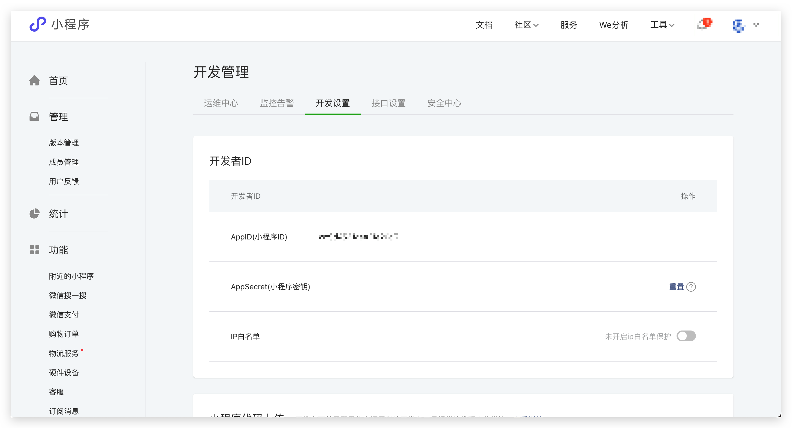
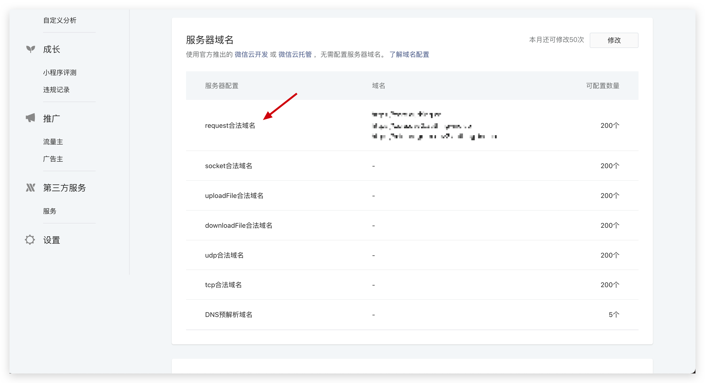
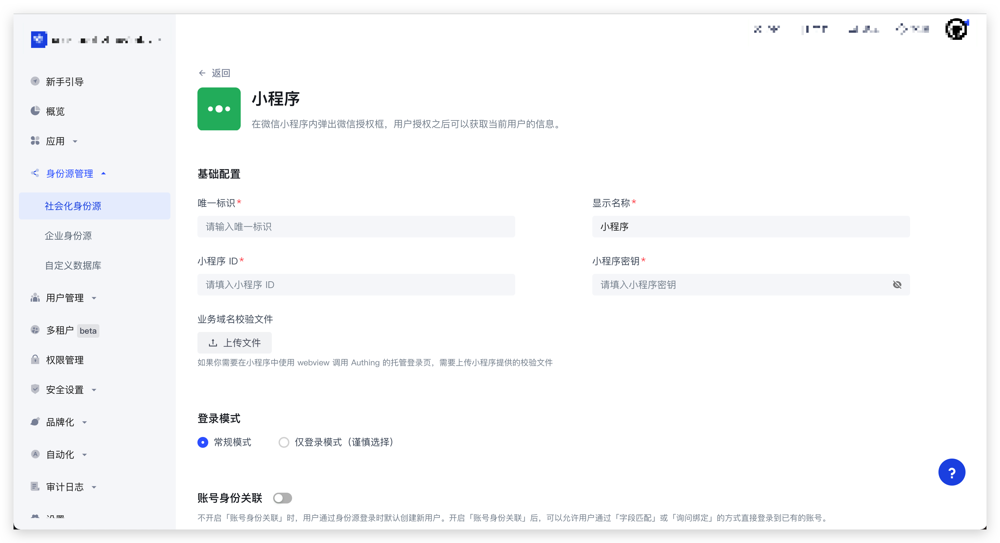
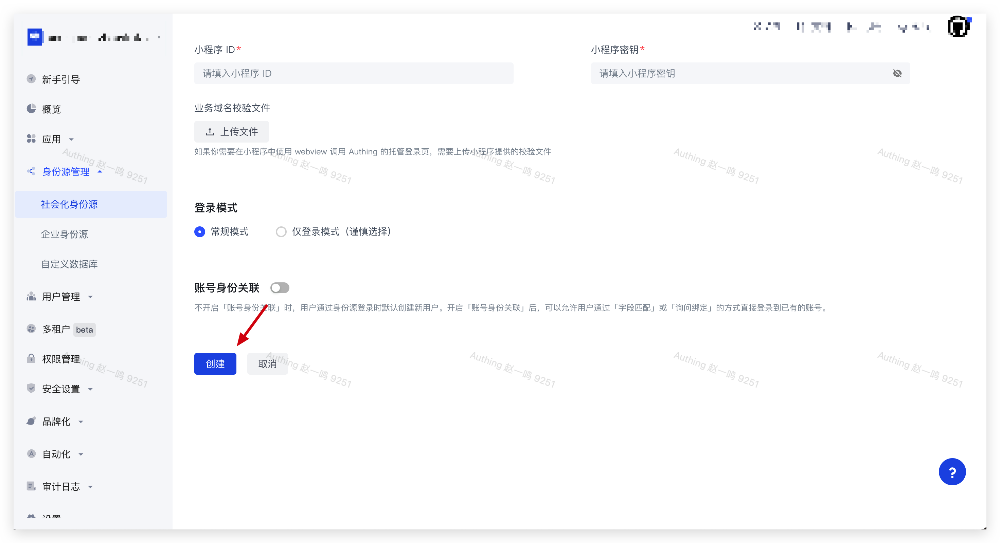
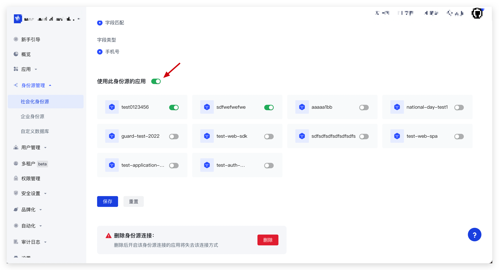
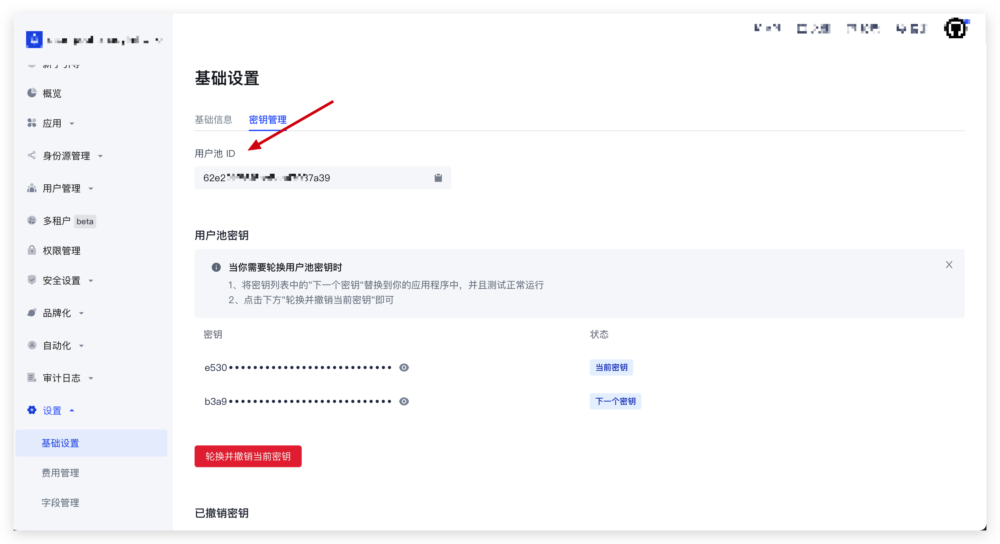

# 微信小程序 SDK

::: hint-info
Authing 小程序 SDK已经 于 2024 年 3 月 20 日使用新的文档。
[Authing 小程序 SDK ](https://docs.authing.cn/v3/reference/sdk/miniapp/quick.html) 
:::

## 说明

[Authing 小程序 SDK 5.0](https://github.com/Authing/authing-js-sdk/tree/master/packages/) 于 2022 年 9 月 7 日发布，相较于原版 SDK，Authing 小程序 SDK 5.0 主要有以下几个优势：

- 用法更简单，NPM 包名更清晰：用法更简单，按需导入 NPM 包。
- 支持的接口更多、框架更多，覆盖更多开发者需求：
  - 支持的接口更多：集成并增强 Authing 最新 V3 版认证 API，覆盖核心认证、授权类功能。
  - 支持的小程序框架更多：包括 **微信原生小程序**、**Taro**、**uni-app** 框架。
- 支持完整的 TS 类型提示，操作更便捷。
- 运行更流畅：包体积更小，不到 5 分钟即可完成接入。
- 支持小程序基础库 2.14.1+。

升级版 SDK 为开发者提供了更稳定、更便捷的开发环境，建议您尽快升级。

|条目|说明|
|-----|----|
|最新版本|5.1.4|
|仓库地址|https://github.com/authing/authing-js-sdk|

## 第一步：创建应用

使用 Authing 创建一个应用：

<ul style="padding-left: 50px">
  <li>进入<a href="https://console.authing.cn/" target="blank">控制台</a>；</li>
  <li>展开左侧 <strong>应用</strong> 菜单，点击 <strong>自建应用</strong> 菜单；</li>
  <li>点击右上角 <strong>创建自建应用</strong> 按钮；</li>
  <li>填写 <strong>应用名称</strong>、<strong>认证地址</strong>、选择 <strong>小程序应用</strong>；</li>
  <li>点击 <strong>创建</strong>。</li>
</ul>


## 第二步：创建社会化身份源

1. 在[微信小程序后台](https://mp.weixin.qq.com/wxamp/index/index?lang=zh_CN&token=678159627)的 <strong>开发 -> 开发管理 -> 开发设置</strong> 页面获取 <strong>APPID(小程序 ID)</strong> 和 <strong>AppSecrect(小程序密钥)</strong>。



在当前页面底部配置 **服务器域名**，添加 `request 合法域名`。

如果你使用的是 Authing 公有云服务，`request 合法域名` 添加 `https://core.authing.cn`；如果是私有化部署，请填写你的私有化服务端地址。



2. 在 Authing 控制台 <strong>身份源管理 -> 社会化身份源 -> 创建社会化身份源 -> 微信 -> 小程序</strong> 创建一个微信社会化身份源，并填写以下信息：

    - <strong>唯一标识</strong>：因为这是此连接的唯一标识，所以设置之后不能修改。
    - <strong>显示名称</strong>
    - <strong>小程序 ID</strong>
    - <strong>小程序密钥</strong>



<p>以上内容填写完成后，点击 <strong>创建</strong> 按钮进行保存。</p>



3. 在当前页面选择 **使用此身份源的应用** 并点击 **保存** 按钮再次保存。



## 第三步：安装 SDK

:::: tabs :options="{ useUrlFragment: false }"
::: tab 微信原生小程序
``` shell
# 原生小程序 npm 支持：
# https://developers.weixin.qq.com/miniprogram/dev/devtools/npm.html
npm install --save @authing/miniapp-wx

or

yarn add @authing/miniapp-wx
```
:::

::: tab Taro
``` shell
npm install --save @authing/miniapp-taro

or

yarn add @authing/miniapp-taro
```
:::

::: tab uni-app
``` shell
npm install --save @authing/miniapp-uniapp

or

yarn add @authing/miniapp-uniapp
```
:::
::::


如果你是使用账号密码登录，且不想让密码以明文传输，可以按需使用以下两种加密方式之一实现密码加密

:::: tabs :options="{ useUrlFragment: false }"
::: tab rsa加密
``` shell
npm install --save @authing/miniapp-jsencrypt

or

yarn add @authing/miniapp-jsencrypt
```
:::
::: tab sm2加密
``` shell
npm install --save @authing/miniapp-sm2encrypt

or

yarn add @authing/miniapp-sm2encrypt
```
:::
::::

## 第四步：初始化 SDK

:::: tabs :options="{ useUrlFragment: false }"
::: tab 微信原生小程序
``` typescript
import { Authing } from '@authing/miniapp-wx'

// 以下两种密码加密方式可以按需使用，选其一即可

// rsa 加密
import { encryptFunction } from '@authing/miniapp-jsencrypt'

// sm2 加密
import { encryptFunction } from '@authing/miniapp-sm2encrypt'

const authing = new Authing({
  appId: 'AUTHING_APP_ID',

  // 公有云部署：Authing 控制台 -> 选择已创建的小程序应用 -> 应用配置 -> 认证配置 -> 认证地址
  // 私有化部署：填写你的私有服务地址
  host: 'https://my-authing-app.example.com',

  // 用户池 ID
  userPoolId: '62e221xxxxxxxxxxx7037a39',

  // 非必传，密码默认将以明文传输
  encryptFunction
})
```
:::
::: tab Taro
``` typescript
import { Authing } from '@authing/miniapp-taro'

// 以下两种密码加密方式可以按需使用，选其一即可

// rsa 加密
import { encryptFunction } from '@authing/miniapp-jsencrypt'

// sm2 加密
import { encryptFunction } from '@authing/miniapp-sm2encrypt'

const authing = new Authing({
  appId: 'AUTHING_APP_ID',

  // 公有云部署：Authing 控制台 -> 选择已创建的小程序应用 -> 应用配置 -> -> 认证配置 -> 认证地址
  // 私有化部署：填写你的私有服务地址
  host: 'https://my-authing-app.example.com',

  // 用户池 ID
  userPoolId: '62e221xxxxxxxxxxx7037a39',

  // 非必传，密码默认将以明文传输
  encryptFunction
})
```
:::
::: tab uni-app
``` typescript
import { Authing } from '@authing/miniapp-uniapp'

// 以下两种密码加密方式可以按需使用，选其一即可

// rsa 加密
import { encryptFunction } from '@authing/miniapp-jsencrypt'

// sm2 加密
import { encryptFunction } from '@authing/miniapp-sm2encrypt'

const authing = new Authing({
  appId: 'AUTHING_APP_ID',

  // 公有云部署：Authing 控制台 -> 选择已创建的小程序应用 -> 应用配置 -> -> 认证配置 -> 认证地址
  // 私有化部署：填写你的私有服务地址
  host: 'https://my-authing-app.example.com',

  // 用户池 ID
  userPoolId: '62e221xxxxxxxxxxx7037a39',

  // 非必传，密码默认将以明文传输
  encryptFunction
})
```
:::
::::

`userPoolId` 可通过 **控制台 -> 设置 -> 基础设置** 获取。



## 第五步：使用 SDK

### 获取登录态

> authing.getLoginState

#### 入参

无

#### 出参

Promise<[SDKResponse](#SDKResponse)<[LoginState](#LoginState)>>

#### 示例代码

:::: tabs :options="{ useUrlFragment: false }"
::: tab 微信原生小程序
``` html
<!-- index.wxml -->
<button bindtap="getLoginState">Get Login State</button>
```
``` typescript
// index.js
Page({
  async getLoginState () {    
    const [error, loginState] = await authing.getLoginState()

    if (error) {
      // 用户未登录，或登录态已过期
    } else {
      // 用户已登录，且登录态未过期
      console.log(loginState)
    }
  }
})
```
:::
::: tab Taro
``` tsx
export default class Index extends Component<PropsWithChildren> {
  render () {
    return (
      <View className='index'>
        <Button onClick={() => this.getLoginState()}>Get Login State</Button>
      </View>
    )
  }
  async getLoginState () {    
    const [error, loginState] = await authing.getLoginState()

    if (error) {
      // 用户未登录，或登录态已过期
    } else {
      // 用户已登录，且登录态未过期
      console.log(loginState)
    }
  }
}
```
:::
::: tab uni-app
``` typescript
export default {
  methods: {
    async getLoginState () {      
      const [error, loginState] = await authing.getLoginState()

      if (error) {
        // 用户未登录，或登录态已过期
      } else {
        // 用户已登录，且登录态未过期
        console.log(loginState)
      }
    }
  }
}
```
:::
::::

### 微信授权 code 登录

>authing.loginByCode

#### 入参

|名称|类型|描述|默认值|必填|
|-----|----|----|----|----|
|connection|String|认证方式|wechat_mini_program_code|否|
|extIdpConnidentifier|String|Console 控制台中小程序身份源唯一标识| - |是|
|wechatMiniProgramCodePayload|WechatMiniProgramCodePayload|社会化登录数据|-|是|
|options|[WxLoginOptions](#WxLoginOptions)|额外数据| - |否|

**WechatMiniProgramCodePayload**
|名称|类型|描述|默认值|必填|
|-----|----|----|----|----|
|encryptedData|String|包括敏感数据在内的完整用户信息的加密数据|-|是|
|iv|String|加密算法的初始向量|-|是|

#### 出参

Promise<[SDKResponse](#SDKResponse)<[LoginState](#LoginState)>>

#### 说明

微信小程序相关接口说明请参考：

- [wx.getUserProfile](https://developers.weixin.qq.com/miniprogram/dev/api/open-api/user-info/wx.getUserProfile.html)

- [小程序用户头像昵称获取规则调整公告](https://developers.weixin.qq.com/community/develop/doc/00022c683e8a80b29bed2142b56c01)

微信小程序用户头像昵称获取规则生效后，你可以使用 `authing.updateUserInfo` 引导用户更新头像昵称。

#### 示例代码
:::: tabs :options="{ useUrlFragment: false }"
::: tab 微信原生小程序
``` html
<!-- index.wxml -->
<button bindtap="loginByCode">Login By Code</button>
```
``` typescript
// index.js
Page({
  async loginByCode () {
    // 微信小程序限制：wx.getUserProfile 必须使用 button 触发
    // 为了防止用户频繁触发登录按钮
    // 建议使用 const [error, loginState] = await authing.getLoginState() 方法获取登录态
    // 如果 loginState 为 undefined，说明用户未登录，或登录态已过期，则显示登录按钮
    // 如果 loginState 不为 undefined，说明用户已登录，且登录态未过期，则无需再显示登录按钮
    const { encryptedData, iv } = await wx.getUserProfile({
      desc: 'getUserProfile'
    })

    // 由于微信小程序 wx.login() 获取 code 、 session_key 有效期及相关数据解密的机制
    // 偶然情况下 res 会是 undefined
    // 所以需要判断 res 是否为 undefined 再进一步处理剩余业务逻辑
    // 如果 res 是 undefined，则提示用户再点击一次按钮重新登录即可
    const [error, res] = await authing.loginByCode({
      // 你的小程序身份源唯一标识
      extIdpConnidentifier: 'AUTHING_EXT_IDP_CONN_IDENTIFIER',
      wechatMiniProgramCodePayload: {
        encryptedData,
        iv
      },
      options: {
        scope: 'openid profile offline_access'
      }
    })
  }
})
```
:::
::: tab Taro
``` tsx
export default class Index extends Component<PropsWithChildren> {
  render () {
    return (
      <View className='index'>
        <Button onClick={() => this.loginByCode()}>Login By Code</Button>
      </View>
    )
  }
  async loginByCode () {    
    // 微信小程序限制：wx.getUserProfile 必须使用 button 触发
    // 为了防止用户频繁触发登录按钮
    // 建议使用 const [error, loginState] = await authing.getLoginState() 方法获取登录态
    // 如果 loginState 为 undefined，说明用户未登录，或登录态已过期，则显示登录按钮
    // 如果 loginState 不为 undefined，说明用户已登录，且登录态未过期，则无需再显示登录按钮
    const { encryptedData, iv } = await Taro.getUserProfile({
      desc: 'getUserProfile'
    })

    // 由于微信小程序 wx.login() 获取 code 、 session_key 有效期及相关数据解密的机制
    // 偶然情况下 res 会是 undefined
    // 所以需要判断 res 是否为 undefined 再进一步处理剩余业务逻辑
    // 如果 res 是 undefined，则提示用户再点击一次按钮重新登录即可
    const [error, res] = await authing.loginByCode({
      // 你的小程序身份源唯一标识
      extIdpConnidentifier: 'AUTHING_EXT_IDP_CONN_IDENTIFIER',
      wechatMiniProgramCodePayload: {
        encryptedData,
        iv
      },
      options: {
        scope: 'openid profile offline_access'
      }
    })
  }
}
```
:::
::: tab uni-app
``` typescript
export default {
  methods: {
    async loginByCode () {   
      // 微信小程序限制：wx.getUserProfile 必须使用 button 触发
      // 为了防止用户频繁触发登录按钮
      // 建议使用 const [error, loginState] = await authing.getLoginState() 方法获取登录态
      // 如果 loginState 为 undefined，说明用户未登录，或登录态已过期，则显示登录按钮
      // 如果 loginState 不为 undefined，说明用户已登录，且登录态未过期，则无需再显示登录按钮
      const [, { encryptedData, iv }] = await uni.getUserProfile({
        desc: 'getUserProfile'
      })

      // 由于微信小程序 wx.login() 获取 code 、 session_key 有效期及相关数据解密的机制
      // 偶然情况下 res 会是 undefined
      // 所以需要判断 res 是否为 undefined 再进一步处理剩余业务逻辑
      // 如果 res 是 undefined，则提示用户再点击一次按钮重新登录即可 
      const [error, res] = await authing.loginByCode({
        // 你的小程序身份源唯一标识
        extIdpConnidentifier: 'AUTHING_EXT_IDP_CONN_IDENTIFIER',
        wechatMiniProgramCodePayload: {
          encryptedData,
          iv
        },
        options: {
          scope: 'openid profile offline_access'
        }
      })
    }
  }
}
```
:::
::::

### 账号密码登录

> authing.loginByPassword

**入参**

|名称|类型|描述|默认值|必填|
|-----|----|----|----|----|
|connection|String|认证方式|PASSWORD|否|
|passwordPayload|PasswordPayload|登录数据| - | 是|
|options|[NormalLoginOptions](#NormalLoginOptions)|额外数据| - |否|

**PasswordPayload**

|名称|类型|描述|默认值|必填|
|-----|----|----|----|----|
|password|String|密码|-|是|
|username|String|用户名|-|否|
|email|String|邮箱|-|否|
|phone|String|手机号|-|否|
|account|String|用户账号（用户名/手机号/邮箱）|-|否|

#### 出参

Promise<[SDKResponse](#SDKResponse)<[LoginState](#LoginState)>>

#### 示例代码
:::: tabs :options="{ useUrlFragment: false }"
::: tab 微信原生小程序
``` html
<!-- index.wxml -->
<button bindtap="loginByPassword">Login By Password</button>
```
``` typescript
// index.js
Page({
  async loginByPassword () {
    const [error, res] = await authing.loginByPassword({
      passwordPayload: {
        // 你的用户密码
        password: 'USER_PASSWORD',
        // 你的用户名
        username: 'USER_NAME'
      },
      options: {
        // 如果使用 rsa，则需要安装 @authing/miniapp-jsencrypt 并在初始化 SDK 时传入 encryptFunction 
        // 如果使用 sm2，则需要安装 @authing/miniapp-sm2encrypt 并在初始化 SDK 时传入 encryptFunction 
        passwordEncryptType: 'sm2',
        scope: 'offline_access openid profile'
      }
    })
  }
})
```
:::
::: tab Taro
``` tsx
export default class Index extends Component<PropsWithChildren> {
  render () {
    return (
      <View className='index'>
        <Button onClick={() => this.loginByPassword()}>Login By Password</Button>
      </View>
    )
  }
  async loginByPassword () {
    const [error, res] = await authing.loginByPassword({
      passwordPayload: {
        // 你的用户密码
        password: 'USER_PASSWORD',
        // 你的用户名
        username: 'USER_NAME'
      },
      options: {
        // 如果使用 rsa，则需要安装 @authing/miniapp-jsencrypt 并在初始化 SDK 时传入 encryptFunction 
        // 如果使用 sm2，则需要安装 @authing/miniapp-sm2encrypt 并在初始化 SDK 时传入 encryptFunction 
        passwordEncryptType: 'sm2',
        scope: 'offline_access openid profile'
      }
    })
  }
}
```
:::
::: tab uni-app
``` typescript
export default {
  methods: {
    async loginByPassword () {
      const [error, res] = await authing.loginByPassword({
        passwordPayload: {
          // 你的用户密码
          password: 'USER_PASSWORD',
          // 你的用户名
          username: 'USER_NAME'
        },
        options: {
          // 如果使用 rsa，则需要安装 @authing/miniapp-jsencrypt 并在初始化 SDK 时传入 encryptFunction 
          // 如果使用 sm2，则需要安装 @authing/miniapp-sm2encrypt 并在初始化 SDK 时传入 encryptFunction 
          passwordEncryptType: 'rsa',
          scope: 'offline_access openid profile'
        }
      })
    }
  }
}
```
:::
::::

### 发送短信验证码

> authing.sendSms

#### 入参

|名称|类型|描述|默认值|必填|
|-----|----|----|----|----|
|phoneNumber|String|手机号码|是|
|phoneCountryCode|String|默认 +86，手机区号，中国大陆手机号可不填| +86 | 否|
|channel|[SmsChannel](#SmsChannel)|短信验证码用途|-|是|

#### 出参

Promise<[SDKResponse](#SDKResponse)<[SimpleResponseData](#SimpleResponseData)>>

|名称|类型|描述|
|-----|----|----|
|message|String|返回信息
|statusCode|Number|状态码

#### 示例代码
:::: tabs :options="{ useUrlFragment: false }"
::: tab 微信原生小程序
``` html
<!-- index.wxml -->
<button bindtap="sendSms">Send Sms</button>
```
``` typescript
// index.js
Page({
  async sendSms () {
    const [error, res] = await authing.sendSms({
      phoneNumber: '188xxxx8888',
      phoneCountryCode: '+86',
      // 指定 channel 为 CHANNEL_LOGIN，发送登录所用的验证码
      channel: 'CHANNEL_LOGIN'
    })
  }
})
```
:::
::: tab Taro
``` tsx
export default class Index extends Component<PropsWithChildren> {
  render () {
    return (
      <View className='index'>
        <Button onClick={() => this.sendSms()}>Send Sms</Button>
      </View>
    )
  }
  
  async sendSms () {
    const [error, res] = await authing.sendSms({
      phoneNumber: '188xxxx8888',
      phoneCountryCode: '+86',
      // 指定 channel 为 CHANNEL_LOGIN，发送登录所用的验证码
      channel: 'CHANNEL_LOGIN'
    })
  }
}
```
:::
::: tab uni-app
```html
<button @click="sendSms">Send Sms</button>
```
``` typescript
export default {
  methods: {
    async sendSms () {
      const [error, res] = await authing.sendSms({
        phoneNumber: '188xxxx8888',
        phoneCountryCode: '+86',
        // 指定 channel 为 CHANNEL_LOGIN，发送登录所用的验证码
        channel: 'CHANNEL_LOGIN'
      })
    },
  }
}
```
:::
::::

### 验证码登录

>authing.loginByPassCode

**入参**

|名称|类型|描述|默认值|必填|
|-----|----|----|----|----|
|connection|String|认证方式|PASSCODE|否|
|passCodePayload|PassCodePayload|登录数据| - | 是|
|options|[NormalLoginOptions](#NormalLoginOptions)|额外数据| - |否|

**PassCodePayload**
|名称|类型|描述|默认值|必填|
|-----|----|----|----|----|
|passCode|String|短信/邮箱等验证码|-|是|
|email|String|邮箱|-|否|
|phone|String|手机号|-|否|
|phoneCountryCode|String|默认 +86,手机区号，中国大陆手机号可不填|-|否|

#### 出参

Promise<[SDKResponse](#SDKResponse)<[LoginState](#LoginState)>>

#### 示例代码
:::: tabs :options="{ useUrlFragment: false }"
::: tab 微信原生小程序
``` html
<!-- index.wxml -->
<button bindtap="loginByPassCode">Login By Pass Code</button>
```
``` typescript
// index.js
Page({
  async loginByPassCode () {
    const [error, res] = await authing.loginByPassCode({
      passCodePayload: {
        // 手机收到的短信验证码
        passCode: 'xxxx',
        phone: '188xxxx8888',
        phoneCountryCode: '+86'
      },
      options: {
        scope: 'openid profile offline_access'
      }
    })
  }
})
```
:::
::: tab Taro
``` tsx
export default class Index extends Component<PropsWithChildren> {
  render () {
    return (
      <View className='index'>
        <Button onClick={() => this.loginByPassCode()}>Login By Pass Code</Button>
      </View>
    )
  }
  async loginByPassCode () {
    const [error, res] = await authing.loginByPassCode({
      passCodePayload: {
        // 手机收到的短信验证码
        passCode: 'xxxx',
        phone: '188xxxx8888',
        phoneCountryCode: '+86'
      }
    })
  }
}
```
:::
::: tab uni-app
``` typescript
export default {
  methods: {
    async loginByPassCode () {
      const [error, res] = await authing.loginByPassCode({
        passCodePayload: {
          // 手机收到的短信验证码
          passCode: 'xxxx',
          phone: '188xxxx8888',
          phoneCountryCode: '+86'
        }
      })
    }
  }
}
```
:::
::::

### 刷新 Token

>authing.refreshToken

#### 说明

刷新 Token 需要用到登录接口返回的 `refresh_token` 字段，使用登录相关方法时需传入参数 `scope`，并包含 `offline_access`，具体参考：[WxLoginOptions](#WxLoginOptions) 和 [NormalLoginOptions](#NormalLoginOptions)。

::: hint-info
请前往控制台进入当前小程序应用，找到 **应用配置 -> 其他配置 -> 授权配置 -> 授权模式**，勾选 **refresh_token**。
:::

#### 入参

无

#### 出参

Promise<[SDKResponse](#SDKResponse)<[LoginState](#LoginState)>>

#### 示例代码
:::: tabs :options="{ useUrlFragment: false }"
::: tab 微信原生小程序
``` html
<!-- index.wxml -->
<button bindtap="refreshToken">Refresh Token</button>
```
``` typescript
// index.js
Page({
  async refreshToken () {
    const [error, res] = await authing.refreshToken()
  }
})
```
:::
::: tab Taro
``` tsx
export default class Index extends Component<PropsWithChildren> {
  render () {
    return (
      <View className='index'>
        <Button onClick={() => this.refreshToken()}>Refresh Token</Button>
      </View>
    )
  }
  
  async refreshToken () {
    const [error, res] = await authing.refreshToken()
  }
}
```
:::
::: tab uni-app
```html
<button @click="refreshToken">Refresh Token</button>
```
``` typescript
export default {
  methods: {
    async refreshToken () {
      const [error, res] = await authing.refreshToken()
    }
  }
}
```
:::
::::

### 获取用户手机号

> authing.getPhone

#### 入参

|名称|类型|描述|默认值|必填|
|-----|----|----|----|----|
|extIdpConnidentifier|String|Console 控制台中小程序身份源唯一标识|-|是|
|code|String|button 的 open-type 为 getPhoneNumber 时获取到的 code| - | 是|

#### 出参

Promise<[SDKResponse](#SDKResponse)<[GetUserPhoneResponseData](#GetUserPhoneResponseData)>>

#### 示例代码
:::: tabs :options="{ useUrlFragment: false }"
::: tab 微信原生小程序
``` html
<!-- index.wxml -->
<button open-type="getPhoneNumber" bindgetphonenumber="getPhone">Get Phone</button>
```
``` typescript
// index.js
Page({
  /**
   * 需要在真机上测试，微信开发者工具不会返回 code
   * @param {*} e 
   */
  async getPhone (e) {
    const { code } = e.detail

    const [error, res] = await authing.getPhone({
      // 你的小程序身份源唯一标识
      extIdpConnidentifier: 'AUTHING_EXT_IDP_CONN_IDENTIFIER',
      code
    })
  }
})
```
:::
::: tab Taro
``` tsx
export default class Index extends Component<PropsWithChildren> {
  render () {
    return (
      <View className='index'>
        <Button openType="getPhoneNumber" onGetPhoneNumber={(e) => this.getPhone(e)}>Get Phone</Button>
      </View>
    )
  }
  /**
   * 需要在真机上测试，微信开发者工具不会返回 code
   * @param {*} e 
   */
  async getPhone (e) {
    const { code } = e.detail

    const [error, res] = await authing.getPhone({
      // 你的小程序身份源唯一标识
      extIdpConnidentifier: 'AUTHING_EXT_IDP_CONN_IDENTIFIER',
      code
    })
  }
}
```
:::
::: tab uni-app
```html
<button open-type="getPhoneNumber" @getphonenumber="getPhone">Get Phone</button>
```
``` typescript
export default {
  methods: {
    /**
    * 需要在真机上测试，微信开发者工具不会返回 code
    * @param {*} e 
    */
    async getPhone (e) {
      const { code } = e.detail

      const [error, res] = await authing.getPhone({
        // 你的小程序身份源唯一标识
        extIdpConnidentifier: 'AUTHING_EXT_IDP_CONN_IDENTIFIER',
        code
      })
    }
  }
}
```
:::
::::

### 修改密码

> authing.updatePassword

#### 入参

|名称|类型|描述|默认值|必填|
|-----|----|----|----|----|
|newPassword|String|新密码|-|是|
|oldPassword|String|旧密码|-|是|
|passwordEncryptType|none / rsa / sm2|加密方式|none|否

#### 出参

Promise<[SDKResponse](#SDKResponse)<[SimpleResponseData](#SimpleResponseData)>>

#### 示例代码
:::: tabs :options="{ useUrlFragment: false }"
::: tab 微信原生小程序
``` html
<!-- index.wxml -->
<button bindtap="updatePassword">Update Password</button>
```
``` typescript
// index.js
Page({
  async updatePassword () {
    const [error, res] = await authing.updatePassword({
      newPassword: 'USER_NEW_PASSWORD',
      oldPassword: 'USER_OLD_PASSWORD',
      // 如果使用 rsa，则需要安装 @authing/miniapp-jsencrypt 并在初始化 SDK 时传入 encryptFunction 
      // 如果使用 sm2，则需要安装 @authing/miniapp-sm2encrypt 并在初始化 SDK 时传入 encryptFunction
      passwordEncryptType: 'sm2'
    })
  },
})
```
:::
::: tab Taro
``` tsx
export default class Index extends Component<PropsWithChildren> {
  render () {
    return (
      <View className='index'>
        <Button onClick={() => this.updatePassword()}>Update Password</Button>
      </View>
    )
  }
  
  async updatePassword () {
    const [error, res] = await authing.updatePassword({
      newPassword: 'USER_NEW_PASSWORD',
      oldPassword: 'USER_OLD_PASSWORD',
      // 如果使用 rsa，则需要安装 @authing/miniapp-jsencrypt 并在初始化 SDK 时传入 encryptFunction 
      // 如果使用 sm2，则需要安装 @authing/miniapp-sm2encrypt 并在初始化 SDK 时传入 encryptFunction
      passwordEncryptType: 'sm2'
    })
  }
}
```
:::
::: tab uni-app
```html
<button @click="updatePassword">Update Password</button>
```
``` typescript
export default {
  methods: {
    async updatePassword () {
      const [error, res] = await authing.updatePassword({
        newPassword: 'USER_NEW_PASSWORD',
        oldPassword: 'USER_OLD_PASSWORD',
        // 如果使用 rsa，则需要安装 @authing/miniapp-jsencrypt 并在初始化 SDK 时传入 encryptFunction 
        // 如果使用 sm2，则需要安装 @authing/miniapp-sm2encrypt 并在初始化 SDK 时传入 encryptFunction
        passwordEncryptType: 'sm2'
      })
    },
  }
}
```
:::
::::


### 获取用户信息

> authing.getUserInfo

#### 入参

无

#### 出参

Promise<[SDKResponse](#SDKResponse)<[UserInfo](#UserInfo)>>
#### 示例代码
:::: tabs :options="{ useUrlFragment: false }"
::: tab 微信原生小程序
``` html
<!-- index.wxml -->
<button bindtap="getUserInfo">Get User Info</button>
```
``` typescript
// index.js
Page({
  async getUserInfo () {
    const [error, res] = await authing.getUserInfo()
  }
})
```
:::
::: tab Taro
``` tsx
export default class Index extends Component<PropsWithChildren> {
  render () {
    return (
      <View className='index'>
        <Button onClick={() => this.getUserInfo()}>Get User Info</Button>
      </View>
    )
  }
  
  async getUserInfo () {
    const [error, res] = await authing.getUserInfo()
  }
}
```
:::
::: tab uni-app
```html
<button @click="getUserInfo">Get User Info</button>
```
``` typescript
export default {
  methods: {
    async getUserInfo () {
      const [error, res] = await authing.getUserInfo()
    }
  }
}
```
:::
::::

### 修改头像

> authing.updateAvatar

#### 入参

无

#### 出参

Promise<[SDKResponse](#SDKResponse)<[UploadFileResponseData](#UploadFileResponseData)>>

#### 示例代码
:::: tabs :options="{ useUrlFragment: false }"
::: tab 微信原生小程序
``` html
<!-- index.wxml -->
<button bindtap="updateAvatar">Update Avatar</button>
```
``` typescript
// index.js
Page({
  async updateAvatar () {
    const [error, res] = await authing.updateAvatar()
  },
})
```
:::
::: tab Taro
``` tsx
export default class Index extends Component<PropsWithChildren> {
  render () {
    return (
      <View className='index'>
        <Button onClick={() => this.updateAvatar()}>Update Avatar</Button>
      </View>
    )
  }
  
  async updateAvatar () {
    const [error, res] = await authing.updateAvatar()
  }
}
```
:::
::: tab uni-app
```html
<button @click="updateAvatar">Update Avatar</button>
```
``` typescript
export default {
  methods: {
    async updateAvatar () {
      const [error, res] = await authing.updateAvatar()
    }
  }
}
```
:::
::::

### 修改用户信息

> authing.updateUserInfo

#### 入参

参考：[UpdateUserInfo](#UpdateUserInfo)

#### 出参

Promise<[SDKResponse](#SDKResponse)<[UserInfo](#UserInfo)>>

#### 示例代码
:::: tabs :options="{ useUrlFragment: false }"
::: tab 微信原生小程序
``` html
<!-- index.wxml -->
<button bindtap="updateUserInfo">Update User Info</button>
```
``` typescript
// index.js
Page({
  async updateUserInfo () {
    const [error, res] = await authing.updateUserInfo({
      address: 'YOUR_ADDRESS'
    })
  }
})
```
:::
::: tab Taro
``` tsx
export default class Index extends Component<PropsWithChildren> {
  render () {
    return (
      <View className='index'>
        <Button onClick={() => this.updateUserInfo()}>Update User Info</Button>
      </View>
    )
  }
  
  async updateUserInfo () {
    const [error, res] = await authing.updateUserInfo({
      address: 'YOUR_ADDRESS'
    })
  }
}
```
:::
::: tab uni-app
```html
<button @click="updateUserInfo">Update User Info</button>
```
``` typescript
export default {
  methods: {
    async updateUserInfo () {
      const [error, res] = await authing.updateUserInfo({
        address: 'YOUR_ADDRESS'
      })
    }
  }
}
```
:::
::::

### 退出登录

> authing.logout

#### 入参

无

#### 出参

``` typescript
Promise<SDKResponse<boolean>>
```

#### 示例代码
:::: tabs :options="{ useUrlFragment: false }"
::: tab 微信原生小程序
``` html
<!-- index.wxml -->
<button bindtap="logout">Logout</button>
```
``` typescript
// index.js
Page({
  async logout () {
    const [error, res] = await authing.logout()
  }
})
```
:::
::: tab Taro
``` tsx
export default class Index extends Component<PropsWithChildren> {
  render () {
    return (
      <View className='index'>
        <Button onClick={() => this.logout()}>Logout</Button>
      </View>
    )
  }
  
  async logout () {
    const [error, res] = await authing.logout()
  }
}
```
:::
::: tab uni-app
```html
<button @click="logout">Logout</button>
```
``` typescript
export default {
  methods: {
    async logout () {
      const [error, res] = await authing.logout()
    }
  }
}
```
:::
::::

## 错误处理

Authing 小程序 SDK 所有方法都会返回 `Promise`，且提供了完善的错误处理机制。

你可以使用数组解构的方式获取 SDK 返回结果：

- 第一个参数 [error](#ErrorData) 不为 `null` 时表示有错误产生，此时第二个参数是 `undefined`。

- 第二个参数作为成功返回的数据，如果没有异常，`error` 会被设为 `null`，第二个成功的数据就会被返回。

代码示例如下：

``` typescript
const [error, userInfo] = await authing.getUserInfo()

if (error) {
  wx.showToast({
    title: error.message
  })
} else {
  console.log(userInfo)
}
```

## 示例代码

当前文档对应的完整示例代码请参考：[examples](https://github.com/Authing/authing-js-sdk/tree/master/examples)。

## 附录公共参数列表

### <p id="SDKResponse">SDKResponse</p>
``` typescript
type SDKResponse<T> = SDKResponseSuccess<T> | SDKResponseError

type SDKResponseSuccess<T> = [null, T]

type SDKResponseError = [ErrorData, undefined]

interface ErrorData {
  message: unknown
  statusCode?: number
  apiCode?: number
}
```

### <p id="WxLoginOptions">WxLoginOptions</p>

> 用于 authing.loginByCode

|名称|类型|描述|默认值|必传|
|-----|----|----|----|----|
|scope|[Scope](#Scope)|获取的资源类型，以空格分割| - | 否 |
|context|Object|额外请求上下文，将会传递到认证前和认证后的 [Pipeline](https://docs.authing.cn/v2/guides/pipeline/) 的 `context` 对象中。了解[如何在 Pipeline 的 `context` 参数中获取传入的额外 context](https://docs.authing.cn/v2/guides/pipeline/context-object.html)| - | 否 |
|tenantId|String|租户 ID| - | 否|
|customData|Object|自定义数据| - | 否|

### <p id="NormalLoginOptions">NormalLoginOptions</p>

> 用于 authing.loginByPassword 和 authing.loginByPassCode

|名称|类型|描述|默认值|必传|
|-----|----|----|----|----|
|passwordEncryptType|none / rsa / sm2|密码加密方式|none|否|
|scope|[Scope](#Scope)|获取的资源类型，以空格分割| - | 否|
|autoRegister|Boolean|是否开启自动注册。如果设置为 true，当用户不存在的时候，会先自动为其创建一个账号。| false | 否|
|clientIp|String|客户端真实 IP 地址。默认情况下，Authing 会将请求来源的 IP 识别为用户登录的 IP 地址，如果你在后端服务器中调用此接口，需要将此 IP 设置为用户的真实请求 IP。| - | 否 |
|context|String|额外请求上下文，将会传递到认证前和认证后的 Pipeline 的 context 对象中。了解如何在 Pipeline 的 context 参数中获取传入的额外 context。| - | 否|
|tenantId|String|租户 ID| - | 否|
|customData|Object|自定义数据| - | 否 |


### <p id="Scope">Scope</p>

以下内容需使用空格分割使用，可根据自身需要按需添加，如：`openid offline_access username`

- `openid`：必须包含
- `offline_access`: 如果存在此参数，token 接口会返回 refresh_token 字段
- `profile`：返回 birthdate, family_name, gender, given_name, locale, middle_name, name, nickname, picture,preferred_username, profile, update_at, website, zoneinfo
- `username`： 返回 username
- `email`：返回 email、email_verified
- `phone`：返回 phone_number, phone_number_verified
- `roles`: 返回用户的角色列表
- `external_id`：用户在原有系统的用户 ID
- `extended_fields`：返回用户的扩展字段信息，内容为一个对象，key 为扩展字段，value 为扩展字段值
- `tenant_id`：返回用户的租户 id

### <p id="UpdateUserInfo">UpdateUserInfo</p>
|名称|类型|描述|
|-----|----|----|
|name|String|姓名|
|nickname|String|昵称|
|username|String|用户名|
|photo|String|头像地址|
|externalId|String|第三方外部 ID|
|birthdate|String|出生日期|
|country|String|所在国家|
|province|String|所在省份|
|city|String|所在城市|
|address|String|所处地址|
|streetAddress|String|所处街道地址|
|postalCode|String|邮政编码|
|gender|[Gender](#Gender)|性别|
|customData|Object|自定义数据，传入的对象中的 key 必须先在用户池定义相关自定义字段|

### <p id="Gender">Gender</p>
|名称|描述|
|-----|----|
|M|男性|
|F|女性|
|U|未知|

### <p id="UserInfo">UserInfo</p>

|名称|类型|描述|
|-----|----|----|
|userId|String|用户 ID|
|name|String|姓名|
|nickname|String|昵称|
|photo|String|头像|
|externalId|String|在外部系统 ID|
|birthdate|String|生日|
|country|String|国家|
|province|String|省份|
|city|String|城市|
|address|String|地址|
|streetAddress|String|街道地址|
|postalCode|String|邮递地址|
|gender|[Gender](#Gender)|性别|
|username|String|用户名|
|customData|String|自定义数据|
|createdAt|String|用户创建时间|
|email|String|邮箱|
|emailVerified|Boolean|邮箱是否已验证|
|lastIp|String|最后一次登录的 IP 地址|
|lastLogin|String|上次登录时间|
|loginsCount|Number|历史总登录次数|
|passwordLastSetAt|String|用户上次密码修改时间|
|phone|String|手机号|
|phoneCountryCode|String|手机号码所在地区编号|
|phoneVerified|Boolean|手机号已否已验证|
|resetPasswordOnNextLogin|Boolean|下次登录是否要求重置密码|
|company|String|所在公司|
|region|String|所在地区|
|status|Suspended / Resigned / Activated / Archived / Deactivated |账户当前状态|
|browser|String|最近一次登录时使用的浏览器 UA|
|device|String|最近一次登录时使用的设备|
|givenName|String|名|
|familyName|String|姓|
|middleName|String|中间名|
|profile|String| 个人资料  |
|preferredUsername|String| Preferred Username |
|website|String|用户个人网页|
|zoneinfo|String|用户时区信息|
|locale|String|  Locale  |
|formatted|String|标准的完整地址|
|userSourceType|excel：通过 excel 导入 / register：用户自主注册 / adminCreated：管理员后台手动创建（包含使用管理 API 创建用户 ） / syncTask： 同步中心的同步任务 |来源类型|
|userSourceId|String|应用 ID 或者同步任务 ID|
|lastLoginApp|String|用户上次登录的应用 ID|
|mainDepartmentId|String|用户主部门 ID|
|lastMfaTime|String|用户上次进行 MFA 认证的时间|
|passwordSecurityLevel|Number|用户密码安全强度等级|
|departmentIds|String[]|用户所属部门 ID 列表|
|identities|[Identity](#Identity)[]|外部身份源|

### <p id="Identity">Identity</p>
|名称|类型|描述|
|-----|----|----|
|identityId|String|身份源 ID|
|extIdpId|String|身份源连接 ID|
|provider|[Provider](#Provider)|外部身份源类型|
|type|String|Identity 类型，如 unionid, openid, primary|
|userIdInIdp|String|在外部身份源中的 ID|
|originConnIds|String[]|身份来自的身份源连接 ID 列表|

### <p id="Provider">Provider</p>
|名称|描述|
|-----|----|
|wechat|微信|
|qq|QQ|
|wechatwork|企业微信|
|dingtalk|钉钉|
|weibo|微博|
|github|Github|
|alipay|支付宝|
|baidu|百度|
|lark|飞书|
|welink|Welink|
|yidun|网易易盾|
|qingcloud|青云|
|google|Google|
|gitlab|Gitlab|
|gitee|Gitee|
|twitter|Twitter|
|facebook|Facebook|
|slack|Slack|
|linkedin|Linkedin|
|instagram|Instagram|
|oidc|OIDC 型企业身份源|
|oauth2|OAuth2 型企业身份源|
|saml|SAML 型企业身份源|
|ldap|LDAP 型企业身份源|
|ad|AD 型企业身份源|
|cas|CAS 型企业身份源|
|azure-ad|Azure AD 型企业身份源|
### <p id="LoginState">LoginState</p>

|名称|类型|描述|
|-----|----|----|
|access_token|String|access token|
|id_token|String|id token|
|expires_in|String|token 有效期|
|expires_at|String|token 过期时间|
|scope|String|参考 [Scope](#Scope)|
|token_type|String|token 类型，默认：Bearer|
|refresh_token|String|用于更新 token|

### <p id="SmsChannel">SmsChannel</p>
|名称|描述|
|-----|----|
|CHANNEL_LOGIN|登录|
|CHANNEL_REGISTER|注册|
|CHANNEL_RESET_PASSWORD|重置密码|
|CHANNEL_BIND_PHONE|绑定手机号|
|CHANNEL_UNBIND_PHONE|解绑手机号|
|CHANNEL_BIND_MFA|绑定 MFA|
|CHANNEL_VERIFY_MFA|校验 MFA|
|CHANNEL_UNBIND_MFA|解绑 MFA|
|CHANNEL_COMPLETE_PHONE|确认手机号码|
|CHANNEL_IDENTITY_VERIFICATION|实名认证|
|CHANNEL_DELETE_ACCOUNT|删除账号|

### <p id="ErrorData">ErrorData</p>
|名称|类型|描述|
|-----|----|----|
|message|String|错误信息|
|statusCode|Number|状态码|
|apiCode|Number|code|

### <p id="SimpleResponseData">SimpleResponseData</p>
|名称|类型|描述|
|-----|----|----|
|message|String|错误信息|
|statusCode|Number|状态码|

### <p id="GetUserPhoneResponseData">GetUserPhoneResponseData</p>
|名称|类型|描述|
|-----|----|----|
|countryCode|String|区号，默认为 86|
|phoneNumber|String|用户绑定的手机号（国外手机号会有区号）|
|purePhoneNumber|String|没有区号的手机号|
|watermark|Watermark|微信返回的其他信息|

**Watermark**

|名称|类型|描述|
|-----|----|----|
|appid|String|app id|
|timestamp|Number|时间戳|

### <p id="UploadFileResponseData">UploadFileResponseData</p>
|名称|类型|描述|
|-----|----|----|
|code|Number|wx.uploadFile 返回的 code|
|message|String|wx.uploadFile 返回的 message|
|data|Data|主体数据|

**Data**

|名称|类型|描述|
|-----|----|----|
|key|String|wx.uploadFile 返回的 key|
|url|String|文件地址|
