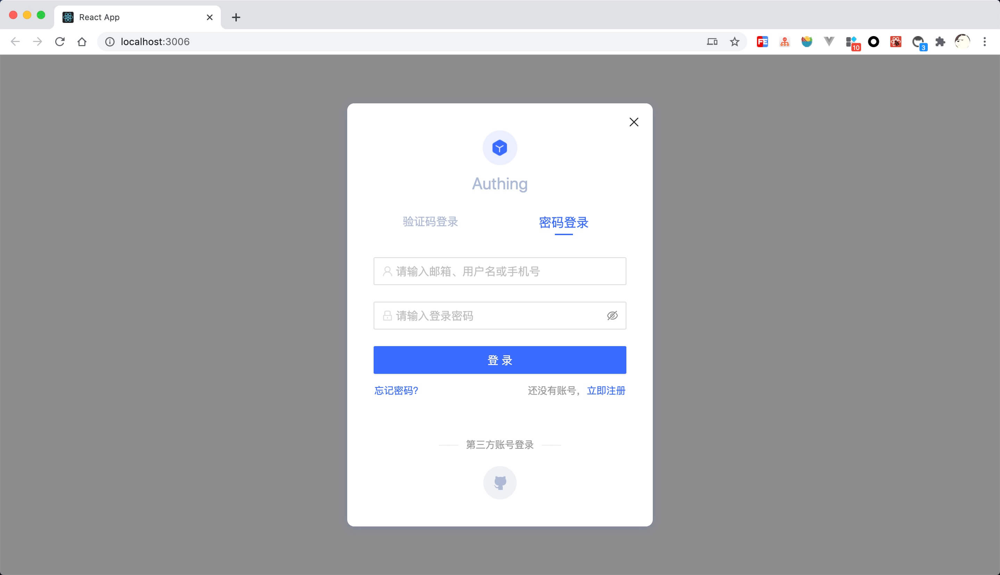

# 登录组件（Guard）

<LastUpdated/>

::: hint-info
本文对应 {{$localeConfig.brandName}} 老版本产品。如需了解最新功能说明，请查看 [接入 Authing Guard](https://docs.authing.cn/v2/reference/guard/v2/)。
::: 

Authing 登录组件（Guard）是一种可嵌入的登录表单，可根据你的需求进行配置，建议用于单页面应用程序。它使你可以轻松添加各种社会化登录方式，以便你的用户可以无缝登录，并且在不同平台拥有一致的登录体验。Guard 为开发者屏蔽了很多底层认证的实现细节，同时也包括繁琐的 UI 开发。

Guard 可以集成到你的 React、Vue.js、Angular 以及原生 JavaScript 项目中，你可以借助此组件快速实现登录认证流程。

## 功能列表

#### 丰富的登录注册方式

内置丰富的登录注册方式供开发者选择：

- 账号密码登录（包括手机号 + 密码、邮箱 + 密码、用户名 + 密码）；
- 手机验证码登录；
- APP 扫码登录（[需先接入 APP 扫码登录](/guides/authentication/qrcode/use-self-build-app/overview.md)）；
- 小程序扫码登录（[需先在后台配置](/guides/authentication/qrcode/use-wechat-miniprogram/)）；
- 社会化登录，如 GitHub 登录（[需先在后台配置](/guides/connections/social.md)）；
- 企业身份源登录（[需要配置企业身份源](/guides/connections/enterprise.md)）；

#### 内置忘记密码流程

Guard 内置了忘记密码的交互 UI，你无需编写任何额外代码。

#### 内置多因素认证（MFA）能力

Guard 内置了多因素认证（MFA）功能，当你的[应用开启了多因素认证](/guides/app-new/create-app/security-management.md#多因素认证)之后，用户可以使用该组件完成多因素认证。你无需编写任何额外代码。

#### 响应式布局

响应式布局，完美兼容移动端和 PC 端，同时你可以通过自定义 CSS 轻易地自定义登录框样式。

#### 兼容前端所有主流框架

- [原生 JavaScript 调用](./native-javascript.md)；
- [Vue 组件](./vue.md)；
- [React 组件](./react.md)；
- [Angular 组件](./angular.md)。

## 在线示例

<iframe src="https://codesandbox.io/embed/red-microservice-6613h?fontsize=14&hidenavigation=1&theme=dark"
     style="width:100%; height:500px; border:0; border-radius: 4px; overflow:hidden;"
     title="authing-react-guard"
     allow="accelerometer; ambient-light-sensor; camera; encrypted-media; geolocation; gyroscope; hid; microphone; midi; payment; usb; vr; xr-spatial-tracking"
     sandbox="allow-forms allow-modals allow-popups allow-presentation allow-same-origin allow-scripts"
   ></iframe>

## 在 React 项目中使用

你可以在你的 React 项目中引入 `@authing/react-ui-components` 包，详情请见 [React 登录组件使用文档](./react.md)。

## 在 Vue.js 项目中使用

你可以在你的 Vue.js 项目中引入 `@authing/vue-ui-components` 包，详情请见 [Vue.js 登录组件使用文档](./vue.md)。

## 在 Angular 项目中使用

你可以在你的 Vue.js 项目中引入 `@authing/ng-ui-components` 包，详情请见 [Angular 登录组件使用文档](./angular.md)。

## 在原生 JavaScript 项目中使用

你可以在你的原生 JavaScript 项目中引入 `@authing/native-js-ui-components` 包，详情请见 [原生 JavaScript 登录组件使用文档](./native-javascript.md)。

## 获取帮助

请访问 [Authing 论坛](https://forum.authing.cn/)。
