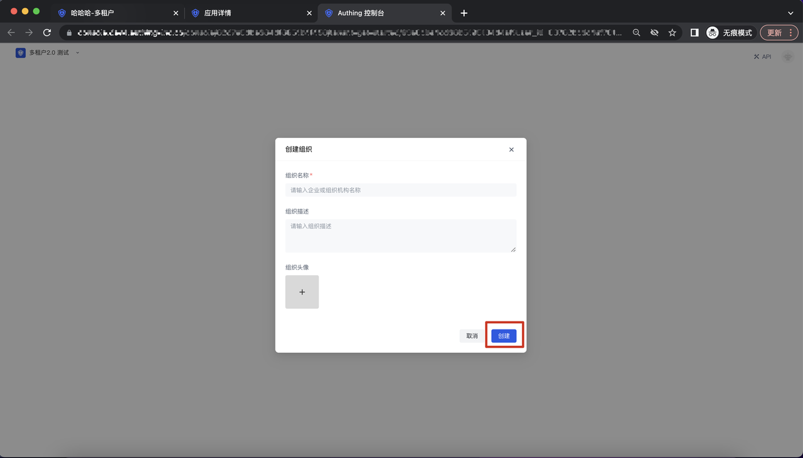
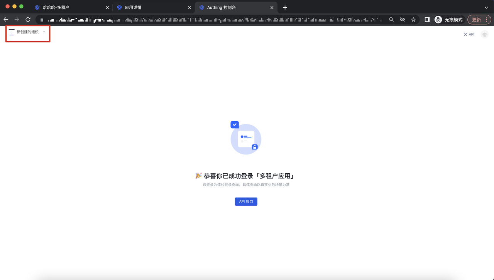
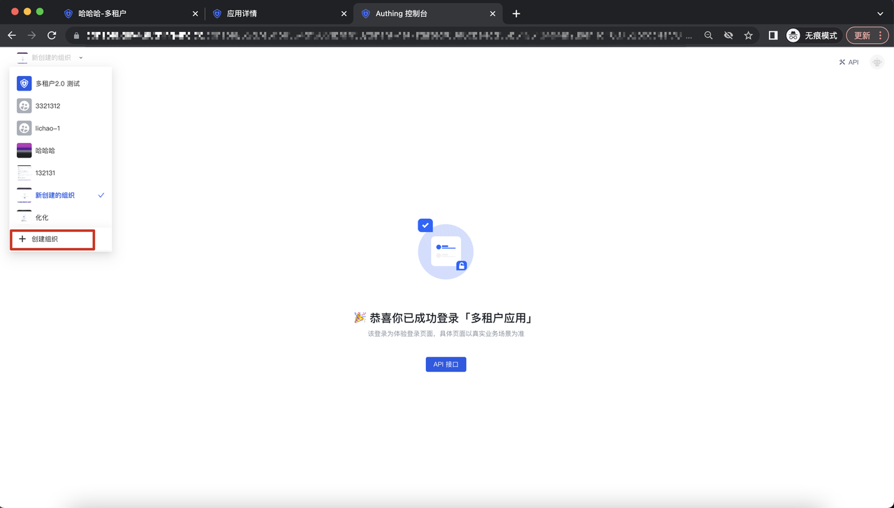
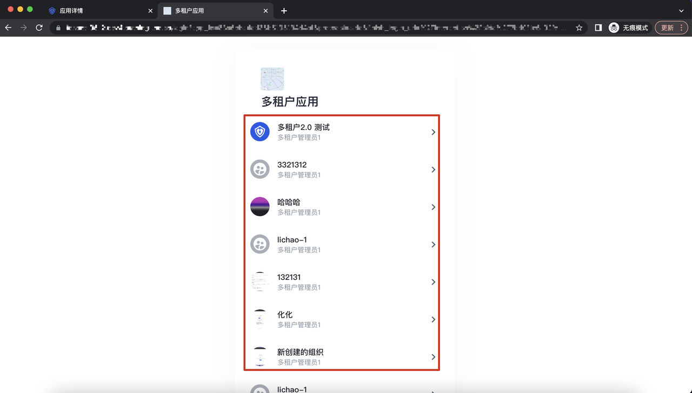
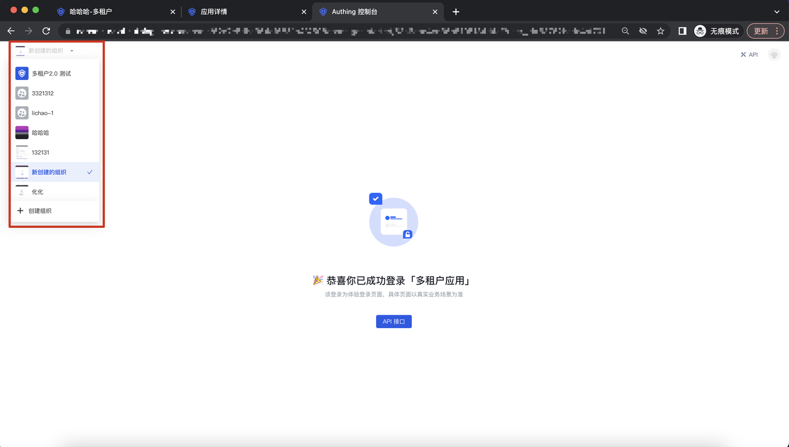

# 创建/切换/配置组织

<LastUpdated/>

## 如何创建组织

### 路径 1 : Saas 型应用平台侧

进入到 Saas 型应用平台侧的页面，点击「创建组织」button：

在调起的创建组织弹窗页面，输入组织名称、组织描述和组织头像，点击「创建」即可创建成功一个组织：

创建完成后，进入到该租户界面：

### 路径 2 : Saas 型应用租户侧

点击左上角的组织名称 button，点击「创建组织」，即可调起创建组织的弹窗；

## 如何切换组织

### 路径 1 : Saas 型应用选择组织登录

当用户通过登录租户下的应用 Guard，进入到选择组织的面板，点击选择某个组织，即可登录到相关的组织页面：

### 路径 2 : Saas 型应用租户侧

点击左上角的「下拉」button，即可进行组织之间的切换：

## 如何配置组织

当租户管理员进入到应用后，右上角会有一个租户控制台的 button，点击该 button，进入到租户控制台页面；

进入租户控制台后，设置-基础设置页面-基础信息 Tab，即可以进行租户基础信息的填写，点击保存即可保存相关的信息：

