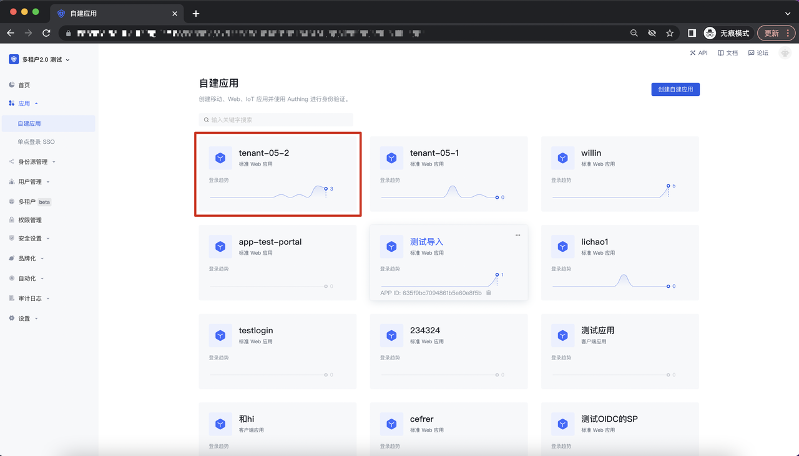
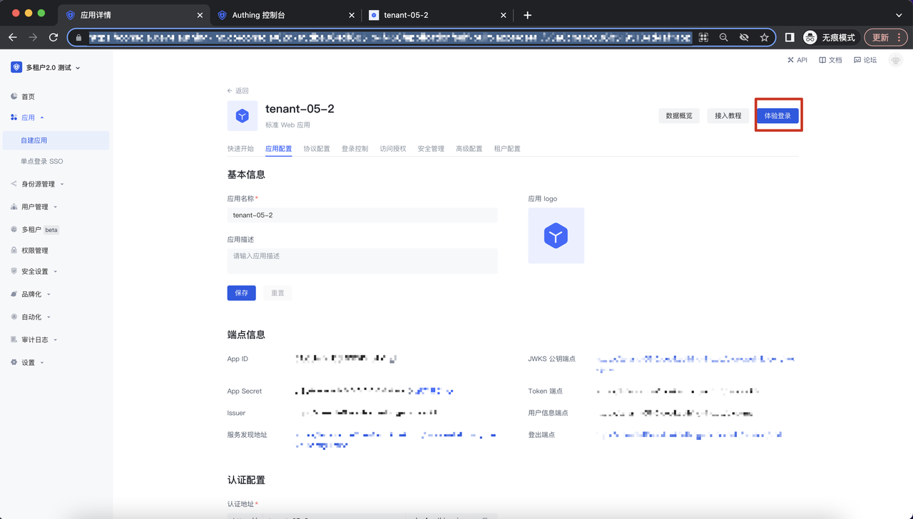
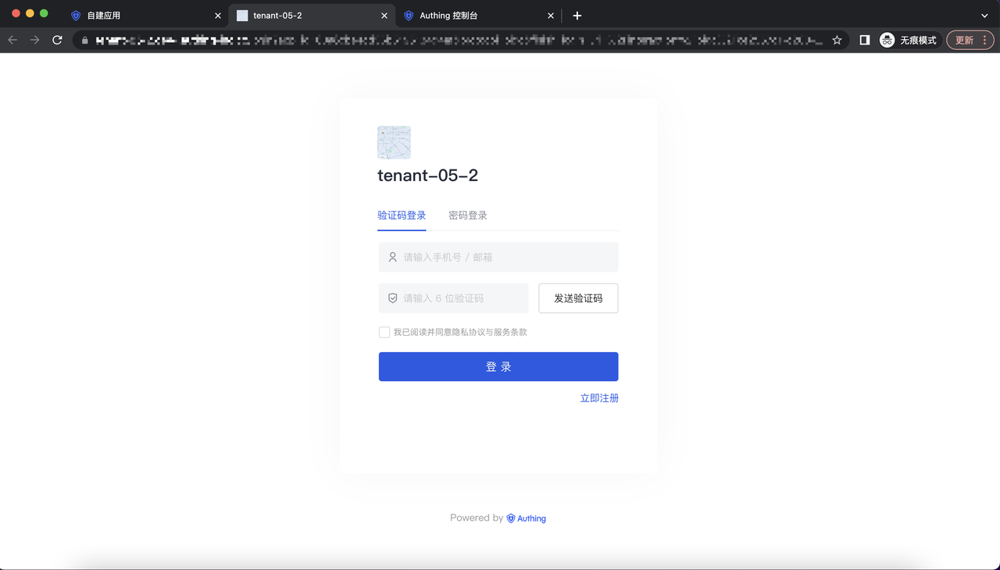
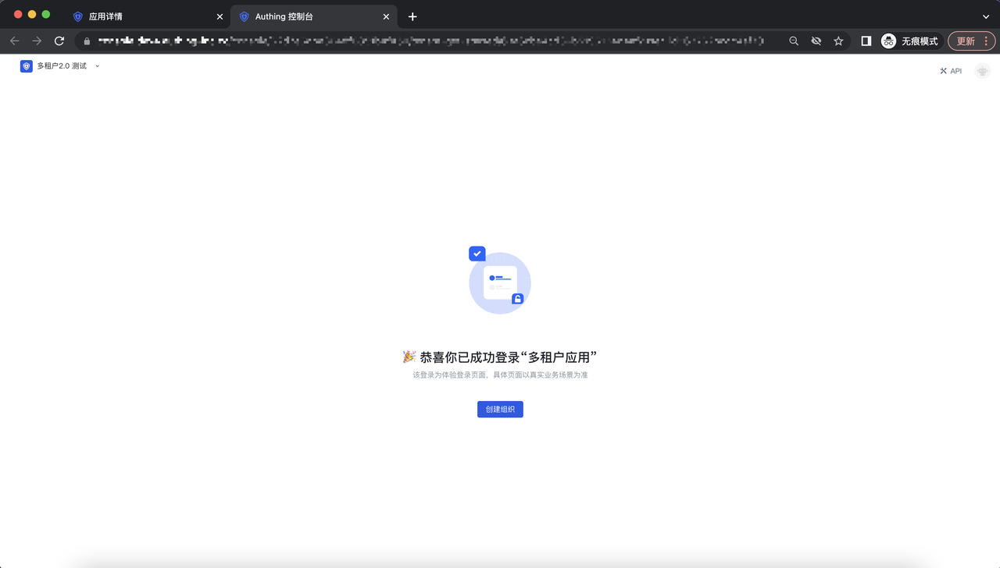
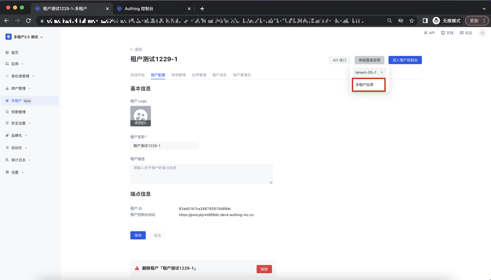
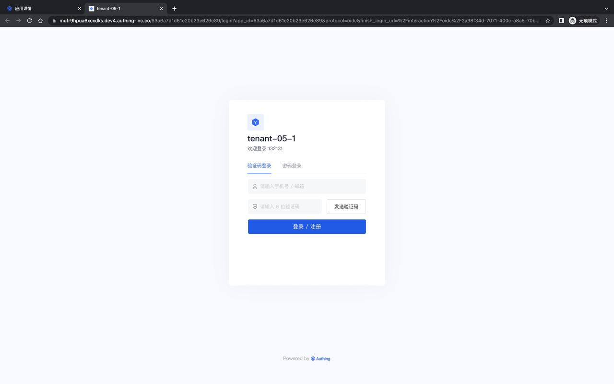
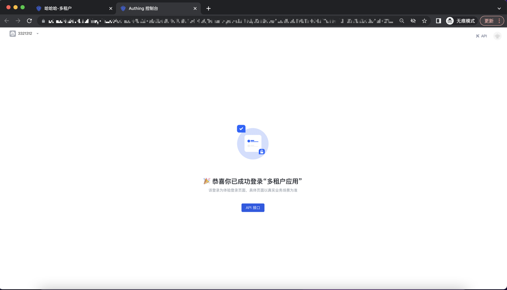
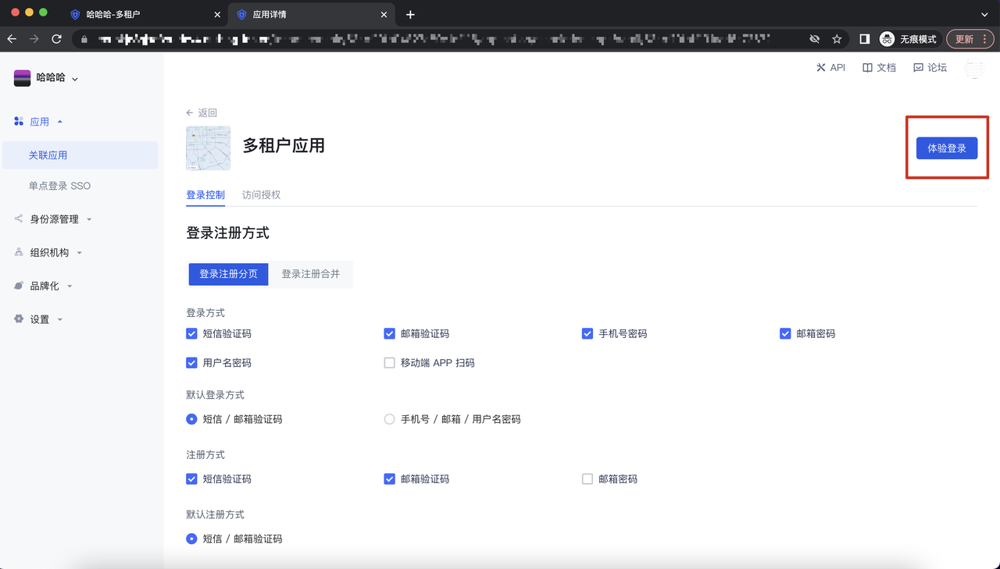
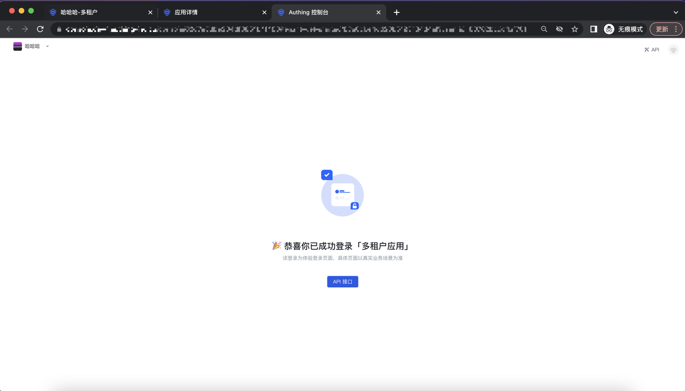

# 注册/登录应用

## Saas 型应用平台

当自建应用被一个以上的的租户关联后，该应用的体验登录及登录后的落地页面就会变成 Saas 型应用样式。

### 注册/登录路径 : B2B 用户池-自建应用

点击自建应用，进入到自建应用列表页面，点击某一个 Saas 应用：

进入到应用详情页面，点击「体验登录」button，进入到 Guard 登录界面：

输入账号及密码，登录成功后，判断你是否在某个租户下，选择租户后，即可进入该租户的应用内：

当该用户不属于任何租户的情况下，进入到相应的平台界面，引导该用户创建组织（租户）：

## Saas 型应用租户侧

### 注册/登录路径 1 : 多租户控制台

进入到多租户控制台-租户详情页面-应用管理-应用详情页面，点击「体验登录应用」 button，进入到租户下的  Guard 界面：

输入账号及密码，登录成功后，进入该租户的应用内：

当该用户进入租户下应用后：

### 注册/登录路径 2 : 租户控制台

进入到控制台-关联应用-应用详情页面，点击「体验登录应用」 button，进入到租户下的  Guard 界面：

进入到应用详情页面，点击「体验登录」button，进入到 Guard 登录界面：

输入账号及密码，登录成功后，进入该租户的应用内：

当该用户进入租户下应用后：

