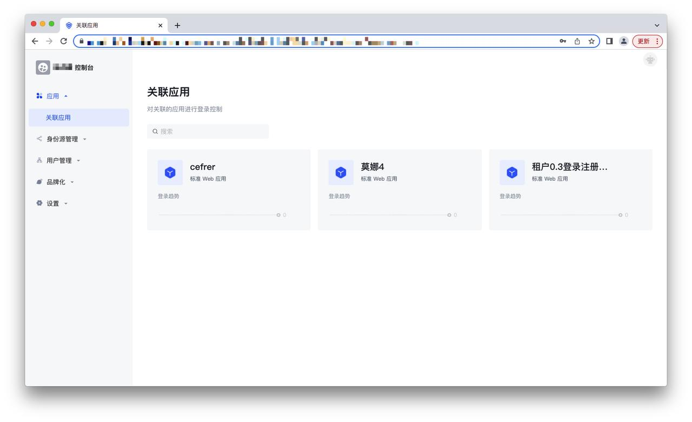
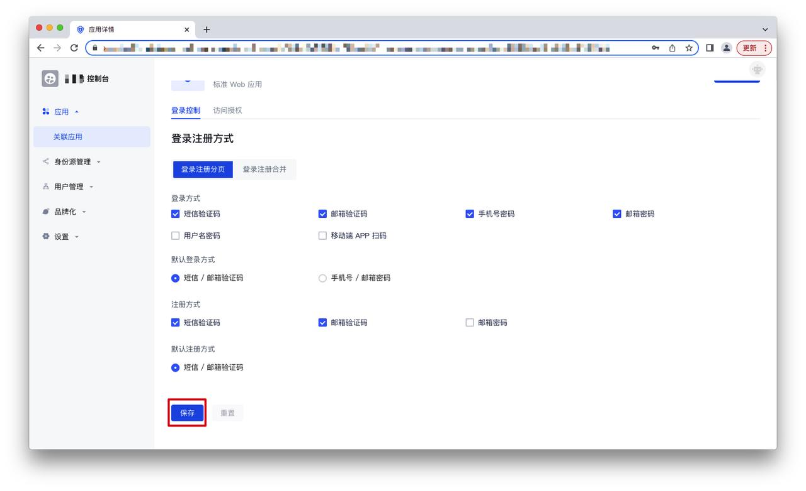
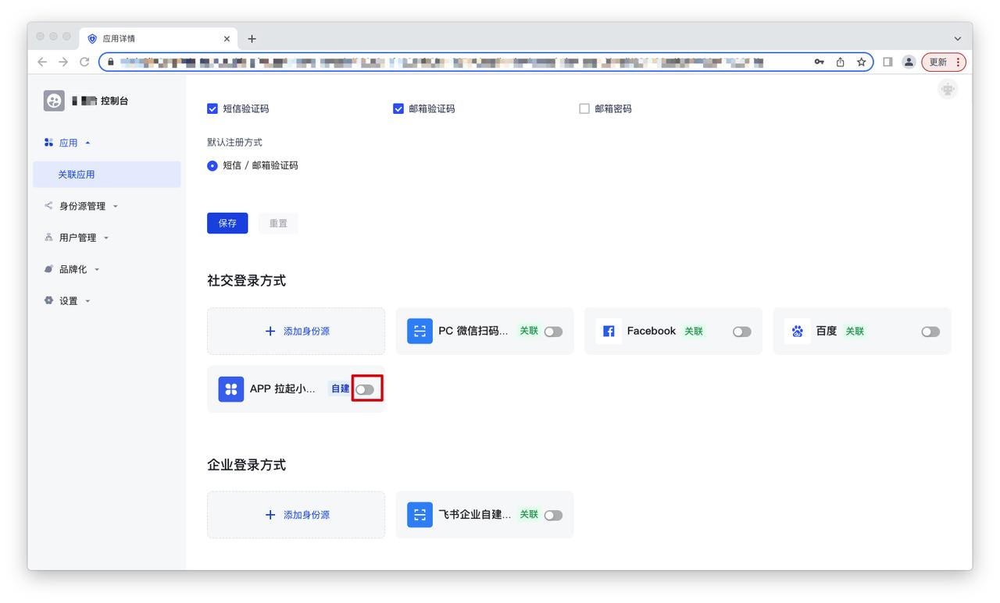
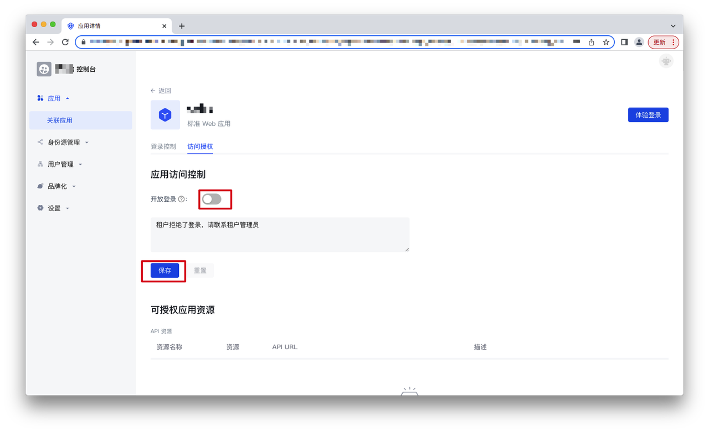
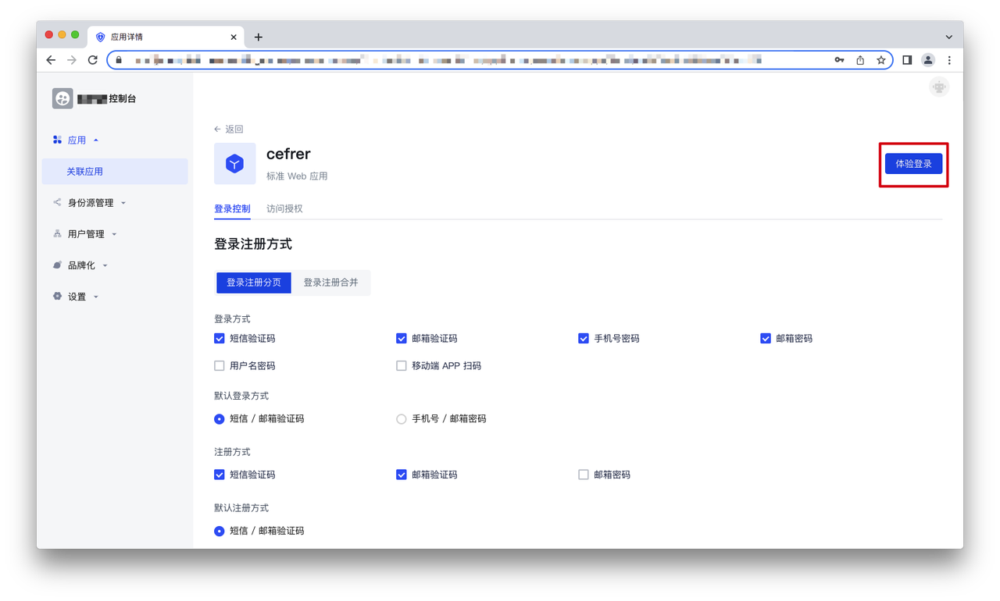
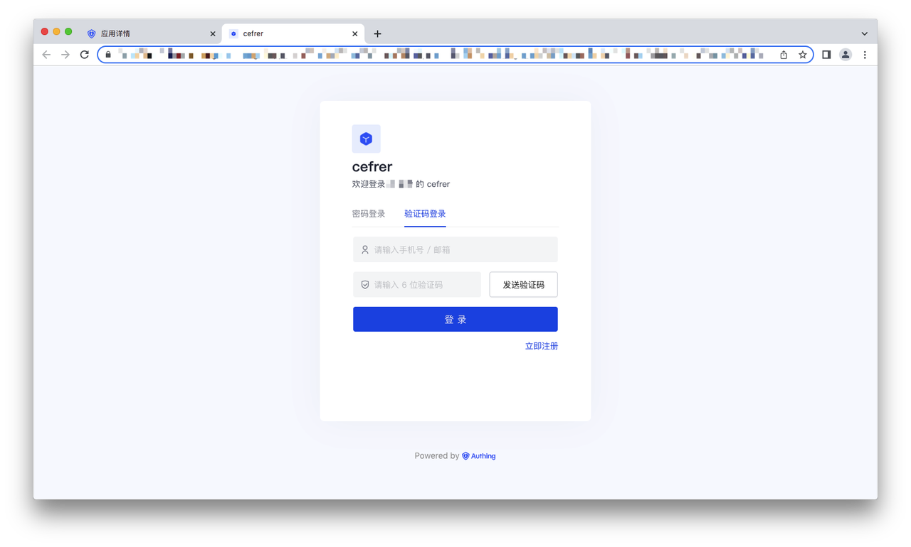

# 关联应用

<LastUpdated/>

## 如何查看租户关联应用

在租户控制台-应用-关联应用菜单下，可以看到租户下可用的应用列表，点击某个具体的应用可以进入应用设置页面：

## 如何对租户关联应用进行登录控制

**步骤1** 在应用设置页面-登录控制下，可以设置该租户应用的登录/注册方式，勾选想要的登录/注册方式并点击「保存」即可：

**步骤2** 在应用设置页面-登录控制下，显示该租户下目前的可用的身份源，可以选择该应用需要的身份源登录方式，开启身份源右侧的开关即可实现用该身份源登录该应用：

## 如何对租户关联应用进行访问授权

在应用设置页面-访问授权下，可以设置「开放登录」开关。默认该开关是关闭的，即同一用户池的非租户成员不可以通过登录的方式加入租户，可手动开启开关并点击「保存」，开启后同一用户池的非租户成员可以通过登录的方式加入租户：

在可授权应用资源列表中，可以看到在多租户控制台授权给该租户的应用资源：

## 如何体验登录租户下的关联应用

在租户控制台-应用-关联应用菜单下，可以看到租户下可用的应用列表，点击某个具体的应用可以进入应用设置页面，在页面右上角点击「体验登录」：

进入下面的体验登录页面，该页面的登录注册方式和在关联应用设置页面-登录控制下设置的登录注册方式是一致的：

填写账号信息并点击「登录」，即可成功登录。
