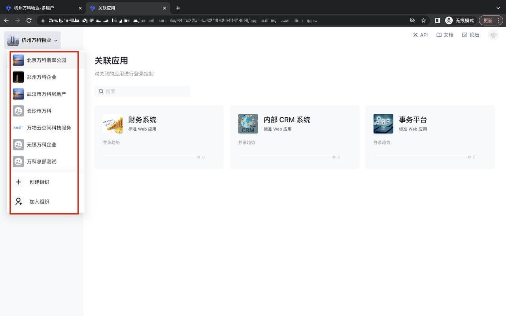
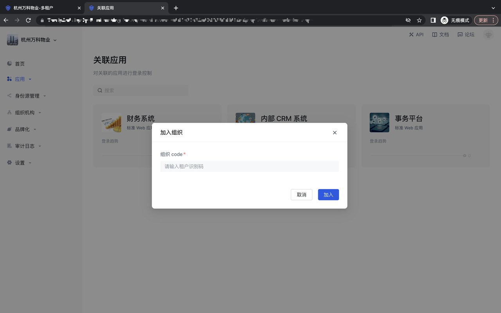

# 切换/加入/创建租户

<LastUpdated/>

## 切换租户

点击左上角的租户名称，会展示出所有该管理员所在的租户，通过点击租户名称，即可跳转到相应的租户控制台；

## 创建租户

点击左上角的「创建租户」button，调起加入租户的弹窗，输入相关的组织名称、企业邮箱域名、组织描述、组织头像，点击「创建」button，即可跳转到相应的租户控制台：

## 加入租户

点击左上角的「加入租户」button，调起加入租户的弹窗，输入租户的识别码及进行相关的企业邮箱域名校验，即可跳转到相应的租户控制台：

