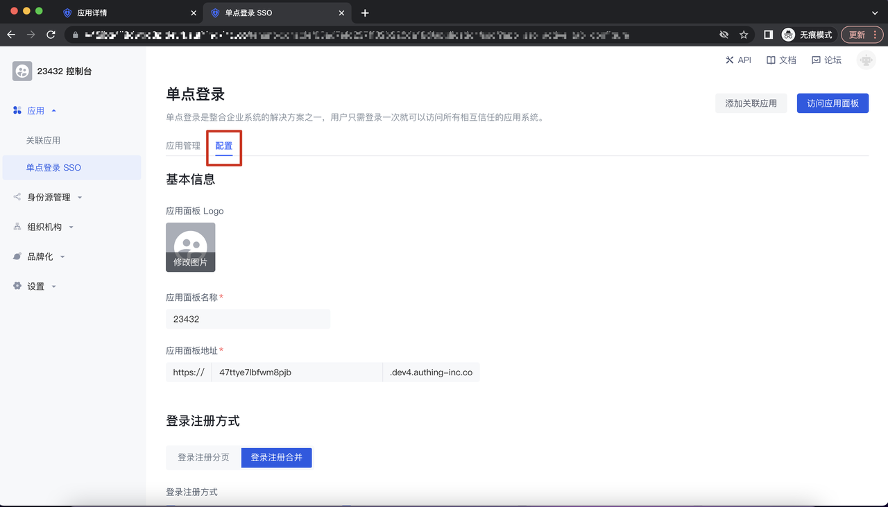
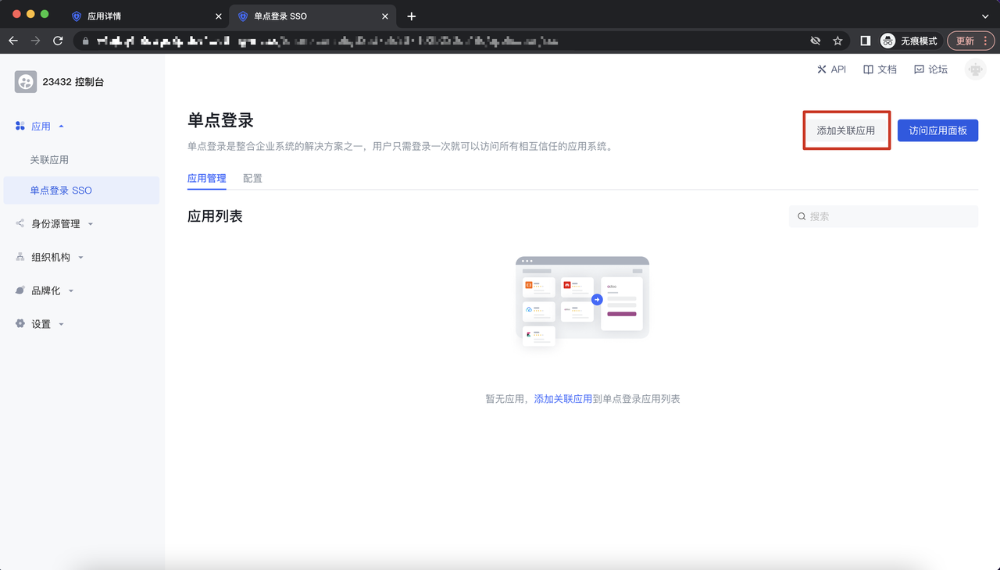
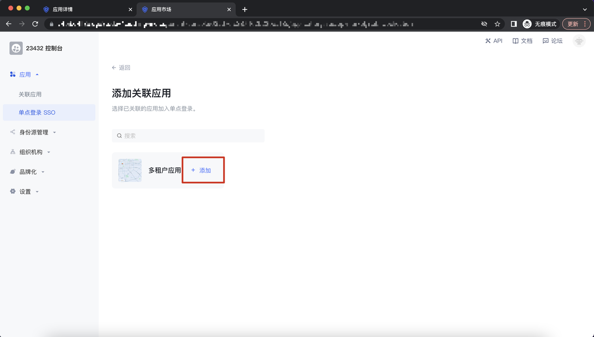
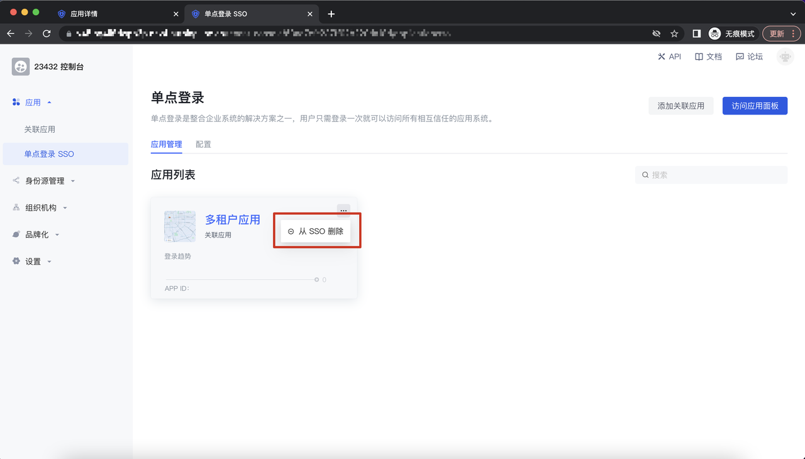
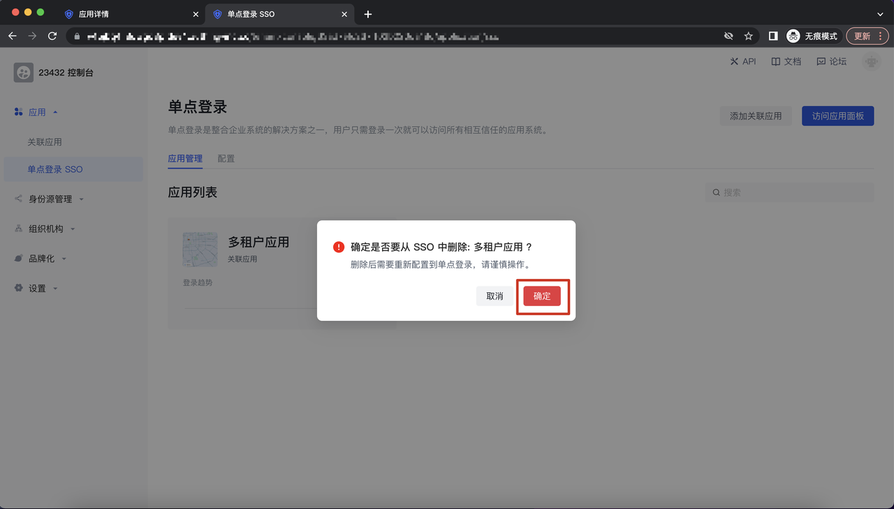
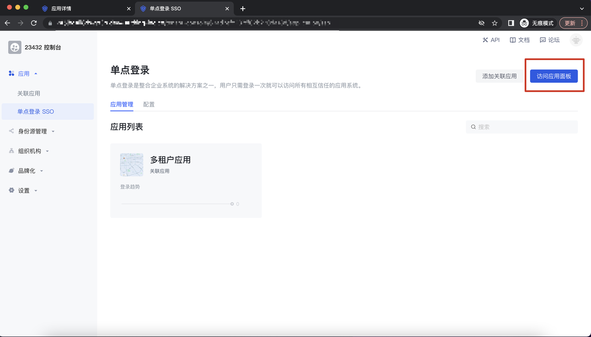
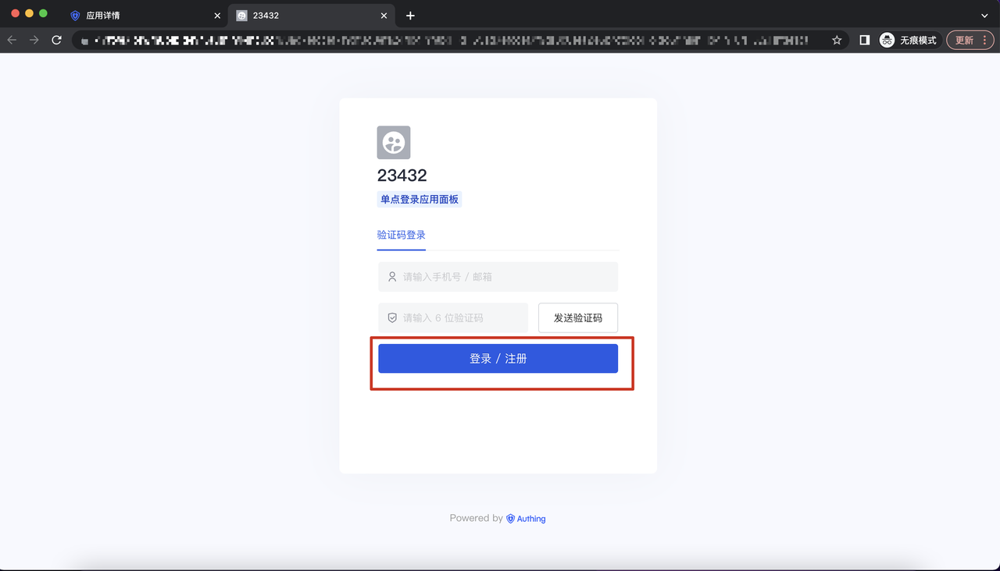
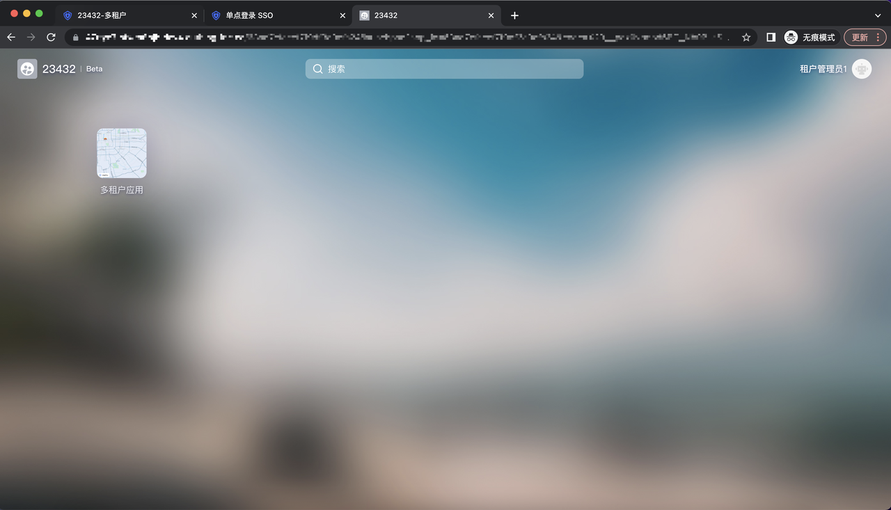

# 单点登录

目前租户控制台支持将关联应用集成到单点登录面板，实现应用的一键登录。

## 如何配置单点登录面板

打开单点登录 SSO 模块，点击配置 button，可以对单点登录面板的基本信息、登录注册方式进行配置。

## 如何添加关联应用到单点登录面板

打开单点登录 SSO 模块，点击「添加关联应用」button，调起添加关联应用的页面：

进入添加关联应用的页面，点击添加后，该应用将被添加到单点登录面板；

## 如何在单点登录面板移除关联应用

在应用管理面板-应用列表，点击某个应用的操作 button，调起「从 SSO 删除」button，点击删除，弹出二次确认弹窗：

## 如何登录单点登录面板

打开单点登录 SSO 模块，点击「访问应用面板」button，调起访问应用面板登录框：

在访问面板登录框，输入账号相关信息后，点击注册/登录，即可进入单点登录面板：

进入到单点登录面板 SSO 页面，点击某个应用，跳转到相关应用的落地场景页面：

