# 用户管理

## 如何创建租户成员

**步骤1** 在租户控制台-用户管理-用户列表中，点击列表右上方「创建用户」的按钮：

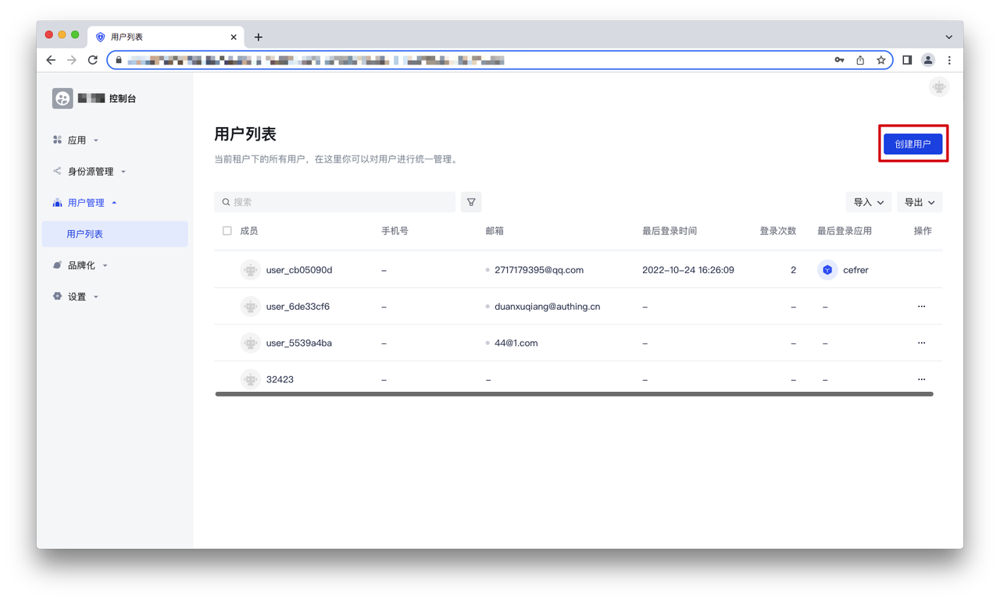

**步骤2** 在弹出的弹窗中，输入用户信息，点击「确定」，即可创建成功：

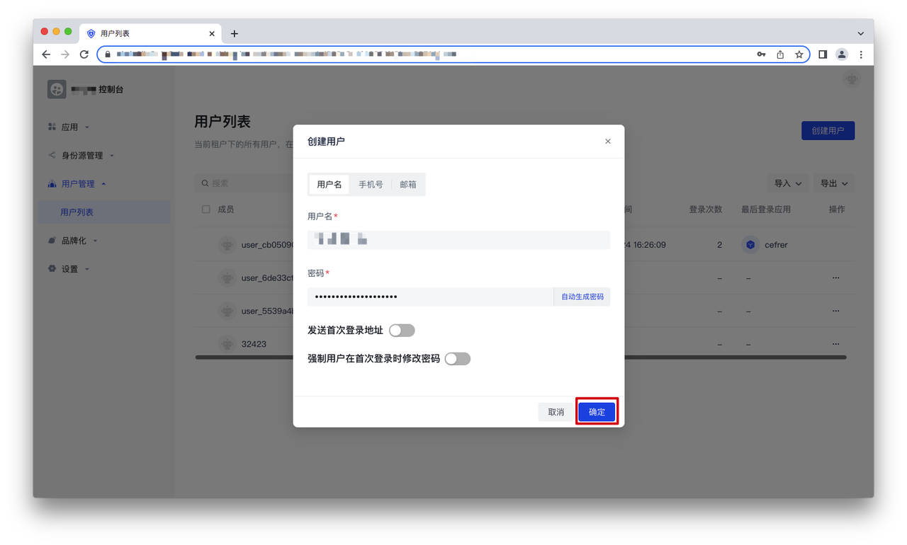

## 如何邀请租户成员

### 复制链接邀请

**步骤1** 点击用户列表右上方的「邀请用户」：

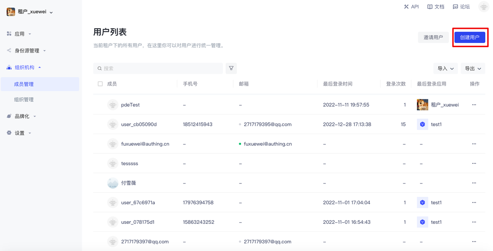

**步骤2** 在邀请页面，先选择希望邀请用户登录的应用，再选择下方的邀请有效期。点击「通过链接邀请」下方的链接，即可复制链接，发送给需要邀请的对象：

**步骤3** 邀请对象获取链接后，点击链接进入注册页面，输入注册信息，注册成功后即可加入租户：

### 发送邮件邀请

**步骤1** 点击用户列表右上方的「邀请用户」：

**步骤2** 在邀请页面，先选择希望邀请用户登录的应用，再选择下方的邀请有效期。在「通过邮件邀请」下方的输入框中输入邀请对象的邮件，点击「邀请」，提示邀请成功，可以在对应邮箱中查收邀请邮件。

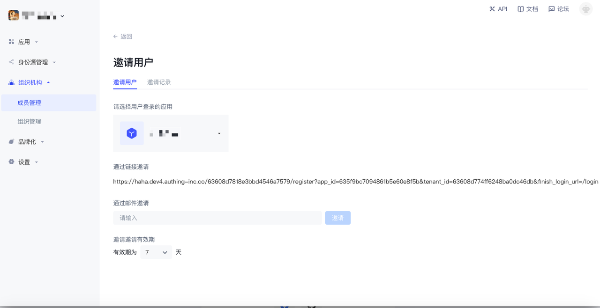

**步骤3** 邮箱中查看邀请邮件，点击「激活」跳转到激活页面：

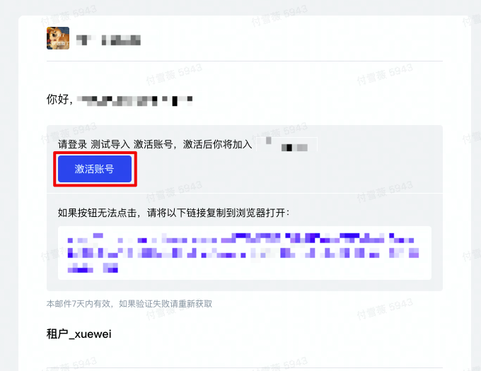

**步骤4** 在激活页面获取邮箱验证码完成身份验证，输入验证码后点击「确定」：

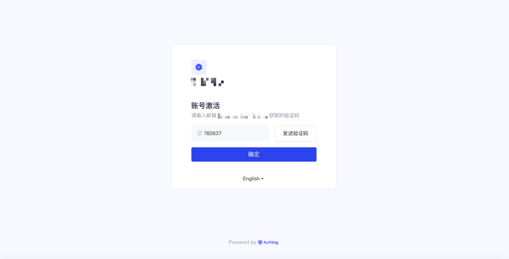

**步骤5** 进入注册页面，输入注册信息，注册成功后即可加入租户：

## 如何批量导入/导出租户成员

### 如何批量导入成员

**步骤1** 点击用户列表右上方的「通过Excel导入」：

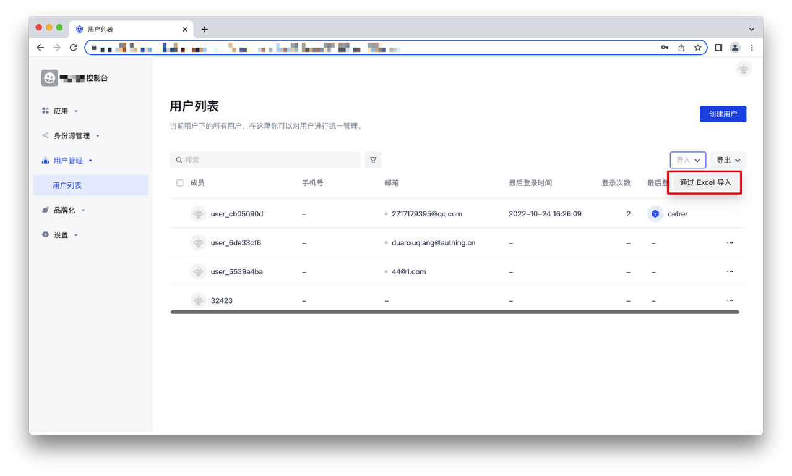

**步骤2** 在弹出的弹窗中上传导入的文件，注意需要先下载「用户导入模板」，按照模板中的字段要求来填写。

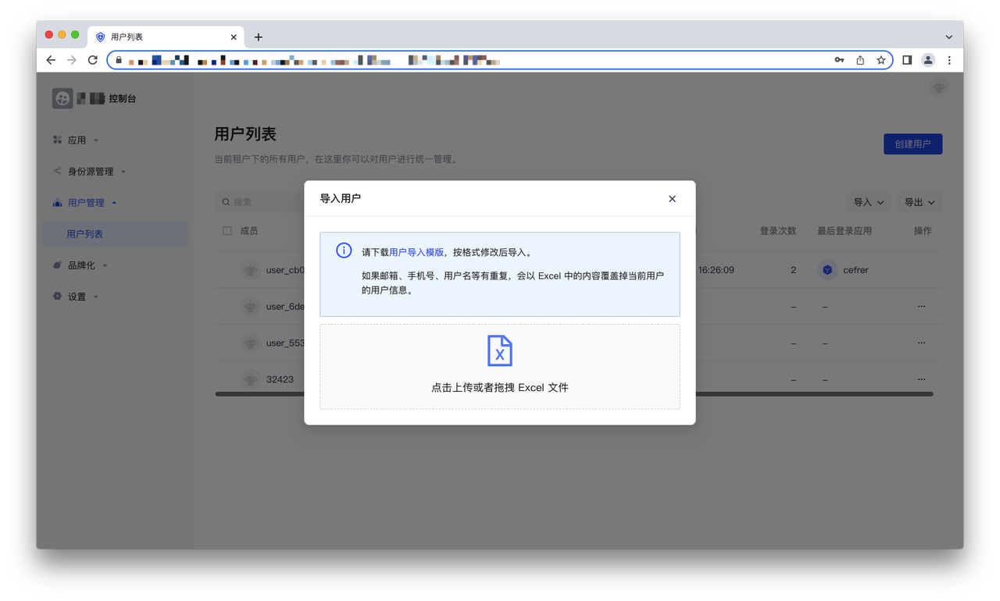

**步骤3** 文件上传后，将提示“导入成功”，并且对应的用户信息会添加到用户列表中：

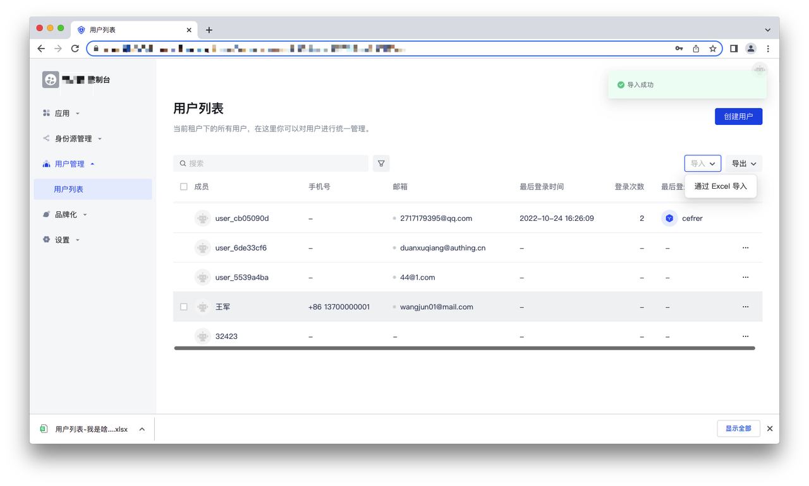

### 如何批量导出成员

**步骤1** 点击用户列表右上方的「导出」，选择「导出全部用户」：

**步骤2** 点击用户列表右上方的「导出」，选择「导出历史」：

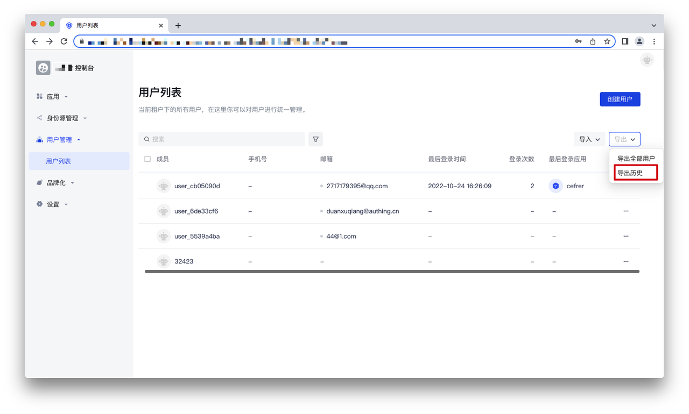

在导出历史页面，可以查看导出记录，并对于成功导出的任务进行下载。点击右侧的「点击下载」，即可下载导出的用户信息：

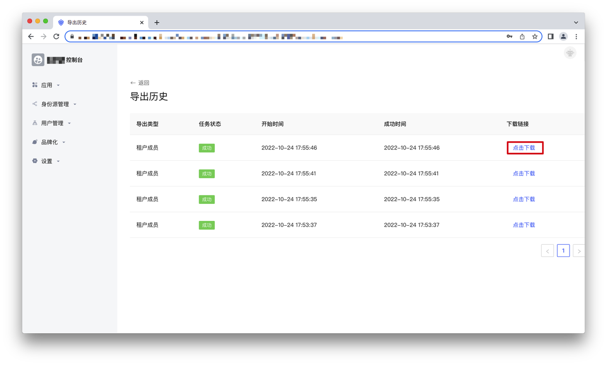

## 如何查看/修改租户成员的个人信息

### 查看个人信息

可在用户管理列表中查看租户成员，选择某个租户成员，点击进入用户详情页，可以查看租户成员个人信息：

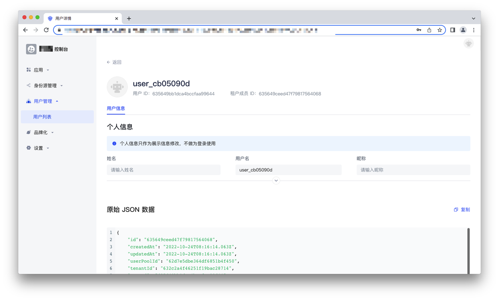

### 移除租户成员

在用户列表右侧可以点击操作按钮，选择「移除租户成员」，在弹窗中点击「移除」，移除后该用户将不在是该租户下的成员，不会出现在用户列表中：

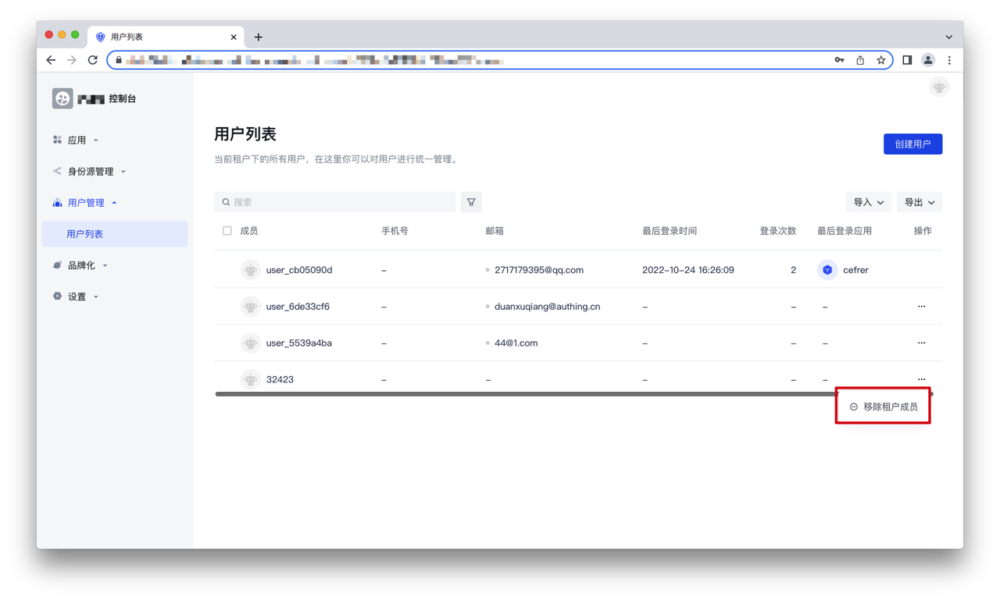

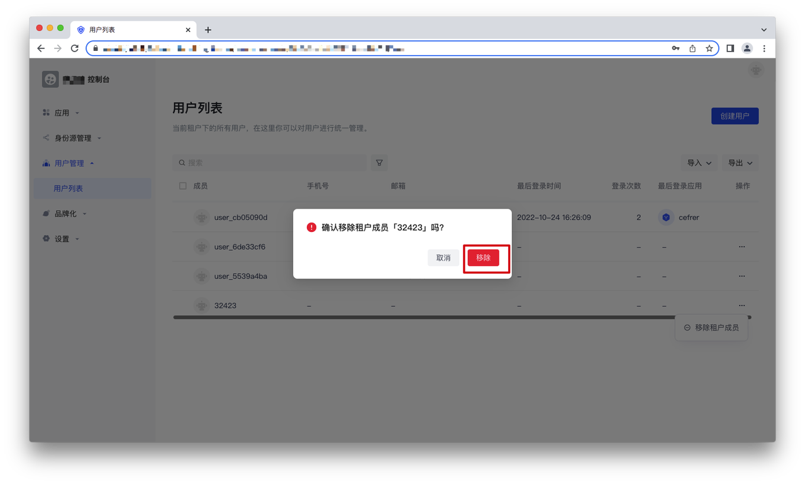
