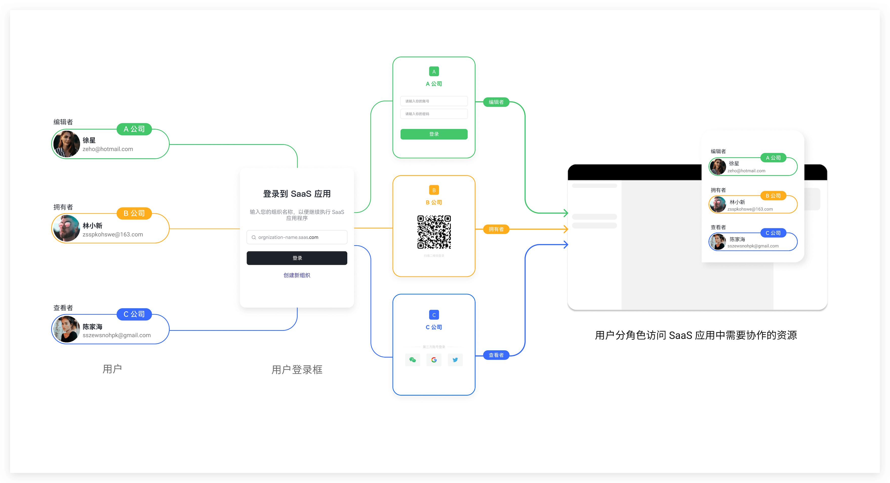

# 概览

<LastUpdated/>

多租户是 Authing 为企业客户提供的场景化解决方案。它不仅能够帮助 SaaS 企业更好的管理自己的合作伙伴和客户，同时也满足了企业客户和第三方之间进行跨组织协作过程中的用户信息隔离和权限管理需求。

Authing 将为客户提供多租户场景下的最佳实践：

- 一行代码快速创建租户，简单配置清晰管理租户。
- 为每个租户提供品牌化、个性化的登录页配置。
- 支持租户级别的社会化身份源配置。
- 通过开发者友好的 SDK，快速将多租户功能嵌入到客户自己的产品中。

以上功能无法满足你的需求？请联系你的销售顾问了解更多详情。

 

以下是多租户相关的操作，你可以[快速开始](./quickstart.md)，也可以阅读以下详细操作说明：

- [创建租户](./create-tenant.md)，开始创建你的第一个租户，并关联自建应用。

- [自定义登录样式](./brand-tenant.md)，通过自定义 CSS 个性化设计登录页面样式。

- [配置注册和登录方式](./login-register.md)，支持多种登录方式，如手机验证码、账号密码、邮箱、微信全场景能力等。客户可以根据自身需求灵活配置。

- [管理租户成员](./member-management.md)，如何将添加和管理租户成员。

- [管理租户下组织机构](./tenant-org.md)，管理租户下的组织机构。

- [为租户配置第三方身份源](./idp-social.md)，快速为租户提供第三方身份源接入。

- [应用租户配置](./tenant-config.md)，配置用户类型，控制哪类用户在多租户场景下可以登录。

  

