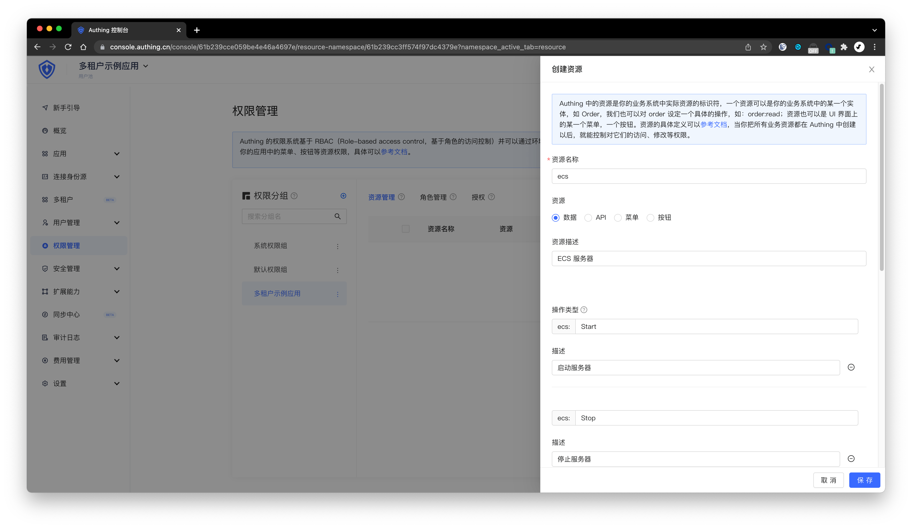

# 管理租户下权限

<LastUpdated/>

本文以一家具备多租户能力的云服务厂商为例，介绍如何基于 Authing 的「多租户」能力，实现多租户下的细粒度权限控制。

首先介绍几个概念：

1. 用户池管理员：基于 Authing 平台能力开发的应用的顶层管理员，用户池管理员可以管理用户池下的租户。在这个例子里，即为云服务厂商的大后台，可以管理员每个在云服务厂商购买服务的租户。
2. 租户管理员：租户管理员可以管理此租户下的成员，并对成员进行权限分配。在这个例子里，可以理解为云服务厂商租户的主账号，可以购买云厂商的服务或者产品，同时把这个服务或者产品细粒度地授权给租户成员。
3. 租户成员：在这里例子里，租户成员可以理解为云服务厂商某个租户下的子账号，可以被租户管理员（即主账号）授权权限，从而具备操作云服务资源或者服务的能力。
4. 业务资源：用户池管理员可以在用户池内定义一套自定义资源，我们把这些资源叫做你的**业务资源**。在这个例子里，可以定义的资源有服务器（ecs）、数据库（dbms）、网关（gateway）、对象存储（oss）等。

同时本文主要介绍两个场景：

1. 用户池管理员给租户管理员授权资源：在这个例子里，对应的是客户在云服务厂商购买云产品、开通服务或者体验使用版本的过程。
2. 租户管理员给租户成员授权资源：在这里例子里，对应的是租户的主账号给租户的成员分配子账号，同时细粒度授权的过程。

## 定义业务资源


在用户池管理的**权限管理**页面，选择多租户应用对应的权限分组，点击右上角的「添加资源」按钮，定义我们的业务资源：



在此篇示例里面，我们定义了一个业务资源 `ecs`（服务器），此资源具备以下操作：

- `ecs:Start`: 启动服务器；
- `ecs:Stop`: 停止服务器；
- `ecs:Restart`：重启服务器；
- `ecs:UpdateBasicInformation`：修改服务器基本信息；
- `ecs:ViewMonitoringStatistics`：查询服务器监控信息。

## 授权资源给租户管理员

如上所述，用户池管理员将业务资源授权给租户管理员的过程，可以理解为租户在你的平台开通服务，或者体验试用版本的过程。

在这个例子里，我们假设某个租户（租户管理员的 ID 为 `TENANT_ADMIN_ID`）购买了一台服务器（`ecs`），服务器的 ID 为 `1`。以下是在权限管理侧，该如何去完成相关的权限分配操作。

我们为此提供了相关的 SDK，下面以 Node.js 为例。

首先使用用户池 ID（userPoolId）和用户池密钥（secret）初始化 SDK：

```typescript
import { ManagementClient } from 'authing-js-sdk'

const managementClient = new ManagementClient({
  userPoolId: 'YOUR_USERPOOL_ID',
  secret: 'YOUR_USERPOOL_SECRET',
})
```

然后调用 `managementClient.acl.authorizeResources` 方法，进行授权操作，在这个例子里，我们给租户管理员（ID 为 `TENANT_ADMIN_ID`）授权了服务器 `ecs:1` 下的 `ecs:*` 操作（`*` 代表的是全部操作），即 ID 为 `1` 的服务器的所有操作权限。

```typescript
import { PolicyAssignmentTargetType } from "authing-js-sdk";

await managementClient.acl.authorizeResources({
  namespace: "NAMESPACE_CODE",
  tenantId: "TENANT_ID",
  opts: [
    {
      targetType: PolicyAssignmentTargetType.User,
      targetIdentifiers: ["TENANT_ADMIN_ID"],
      resources: [
        {
          code: `ecs:1`,
          actions: ["ecs:*"],
          resourceType: ResourceType.Data,
        },
      ],
    },
  ],
});
```

参数释义如下：

- `namespace`: 业务资源所在的权限分组的 code，在**权限管理**页面，选中某一个权限分组之后，点击详情，可以查看到`分组 ID`，这就是该权限分组的 code；
- `tenantId`: 租户的 ID，每个租户都有一个系统分配的唯一 ID；
- `opts`: 一个数组，数组中的每个元素描述的是需要给什么对象，授权哪些资源。
    - `opts.targetType`: 授权对象的类型，一个资源可以被授权给用户、角色、分组、组织机构（如果是租户内的资源授权，目前只支持授权给用户和组织机构）。可选值为 USER, ROLE, GROUP, ORG。
    - `opts.targetIdentifiers`: 授权目标对象的唯一标志符。如果是用户，为用户 ID；如果是角色，为角色 code；如果是分组，为分组 code；如果是组织机构部门，为部门 ID。
    - `opts.resources`: 一个数组，数组中的每个元素描述的是需要授权的资源。`code` 表示授权资源的标志，可以是一类资源，如 `ecs:*`，也可以是某个具体的资源，如 `ecs:1`；`actions` 表示需要授权的操作；`resourceType` 指的是这个资源的类型，可选值包含 DATA、API、MENU、UI、BUTTON。


That's it! 现在租户管理员已经具备了此台服务器的所有操作权限了。

## 在后端接口校验权限


假设你有一个 API 是用于进行启动服务器操作的，你现在需要对此接口进行权限控制。对此我们提供了相应的 SDK，可以非常快速得完成此工作。

调用 `acl.isAllowed` 方法，判断 `TENANT_ADMIN_ID` 对应的用户是否具备 `ecs:1` 的 `ecs:Start` 权限：

```typescript
import { PolicyAssignmentTargetType } from "authing-js-sdk";

const allowed = await managementClient.acl.isAllowed(
    'TENANT_ADMIN_ID',
    'ecs:1',
    'ecs:Start',
    {
        namespace: "NAMESPACE_CODE",
        tenantId: "TENANT_ID"
    }
);
```

你可以依据 `acl.isAllowed` 的返回值 `allowed` 变量，来决定是否允许操作。在这里例子里，此次的返回结果 `allowed` 应该是 `true`，代表他具备相关权限，接口可以放行。

## 授权资源给租户成员

如上所述，用户池管理员撤销租户管理员的资源权限，可以理解为租户管理员把这些资源再分配给租户内的用户、组织机构的过程，使得租户成员可以访问、操作这些资源。

租户管理员给租户成员授权资源有两点限制：

1. 租户管理员只能授权自身被授权过的资源；
2. 租户管理员只能给本租户内的用户、组织机构进行授权，不能跨租户进行操作。

租户购买了 ID 为 `1` 的 ECS 服务器后，租户管理员希望授权 IT 部的超级运维人员此台服务器的所有操作，同时授权 IT 部门启动（Start）、停止（Stop）、重启（Restart）、修改基本信息（UpdateBasicInformation）、查询服务器监控信息（ViewMonitoringStatistics）等操作。

以下是使用 SDK 进行操作的示例代码：


1. 首先使用租户管理员的 `token` 和租户 ID 初始化 `ManagementClient`，不再使用用户池全局的 `userPoolId` 和 `secret` 进行初始化：

```typescript
import { ManagementClient } from "authing-js-sdk";

const managementClient = new ManagementClient({
  tenantId: "TENANT_ID",
  accessToken: "租户管理员的 Token",
});
```

2. 租户管理员分别对 IT 部的超级运维人员和 IT 部门进行授权

```typescript
import { PolicyAssignmentTargetType } from "authing-js-sdk";

await managementClient.acl.authorizeResources({
  namespace: "NAMESPACE_CODE",
  tenantId: "TENANT_ID",
  opts: [
    {
      targetType: PolicyAssignmentTargetType.User,
      targetIdentifiers: ["IT 部超级运维人员的 ID"],
      resources: [
        {
          code: `ecs:1`,
          actions: ["ecs:*"],
          resourceType: ResourceType.Data,
        },
      ],
    },
  ],
});
```

```typescript
import { PolicyAssignmentTargetType } from "authing-js-sdk";

await managementClient.acl.authorizeResources({
  namespace: "NAMESPACE_CODE",
  tenantId: "TENANT_ID",
  opts: [
    {
      targetType: PolicyAssignmentTargetType.Org,
      targetIdentifiers: ["IT 部门的 ID"],
      resources: [
        {
          code: `ecs:1`,
          actions: [
            "ecs:Start",
            "ecs:Stop",
            "ecs:Restart",
            "ecs:UpdateBasicInformation",
            "ecs:ViewMonitoringStatistics",
          ],
          resourceType: ResourceType.Data,
        },
      ],
    },
  ],
});
```

而以下操作是不被允许的，因为 `ecs:2`（ID 为 2 的 ECS 服务器）没有被授权给租户管理员，即此租户没有购买此台服务器：

```typescript
import { PolicyAssignmentTargetType } from "authing-js-sdk";

await managementClient.acl.authorizeResources({
  namespace: "NAMESPACE_CODE",
  tenantId: "TENANT_ID",
  opts: [
    {
      targetType: PolicyAssignmentTargetType.User,
      targetIdentifiers: ["IT 部超级运维人员的 ID"],
      resources: [
        {
          code: `ecs:2`,
          actions: ["ecs:*"],
          resourceType: ResourceType.Data,
        },
      ],
    },
  ],
});
```

## 获取被授权资源列表

Authing 除了提供一键校验权限的接口外，还可以获取用户在租户下被授权的所有资源列表。

```typescript
const data = await managementClient.acl.listAuthorizedResourcesBatch({
  namespace: "NAMESPACE_CODE",
  tenantId: "TENANT_ID",
  targets: [
    {
      targetType: PolicyAssignmentTargetType.User,
      targetIdentifier: "USER_ID",
    },
    {
      targetType: PolicyAssignmentTargetType.Group,
      targetIdentifier: "GROUP_CODE",
    },
    {
      targetType: PolicyAssignmentTargetType.Role,
      targetIdentifier: "ROLE_CODE",
    },
    {
      targetType: PolicyAssignmentTargetType.Org,
      targetIdentifier: "NODE_ID",
    },
  ],
});
```

返回数据示例：


```json
{
  "list": [
    {
      "totalCount": 1,
      "list": [
        {
          "code": "ecs:1",
          "actions": ["ecs:*"]
        }
      ]
    },
     {
      "totalCount": 0,
      "list": []
    },
     {
      "totalCount": 1,
      "list": [
        {
          "code": "ecs:2",
          "actions": ["ecs:Start"]
        }
      ]
    },
     {
      "totalCount": 1,
      "list": [
        {
          "code": "ecs:3",
          "actions": ["ecs:*"]
        }
      ]
    }
  ]
}
```

返回数据中的 `list` 是一个数组，数组的顺序对应传入的 `targets`，值对应此 `target` 被授权的资源列表。
