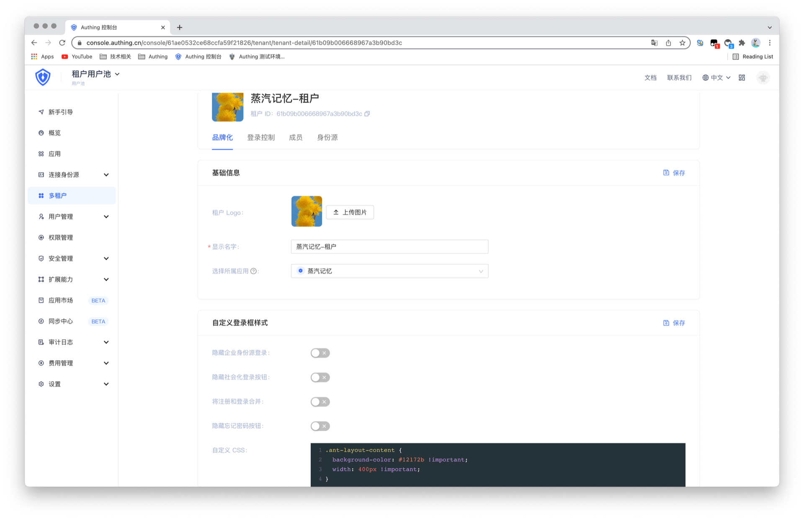
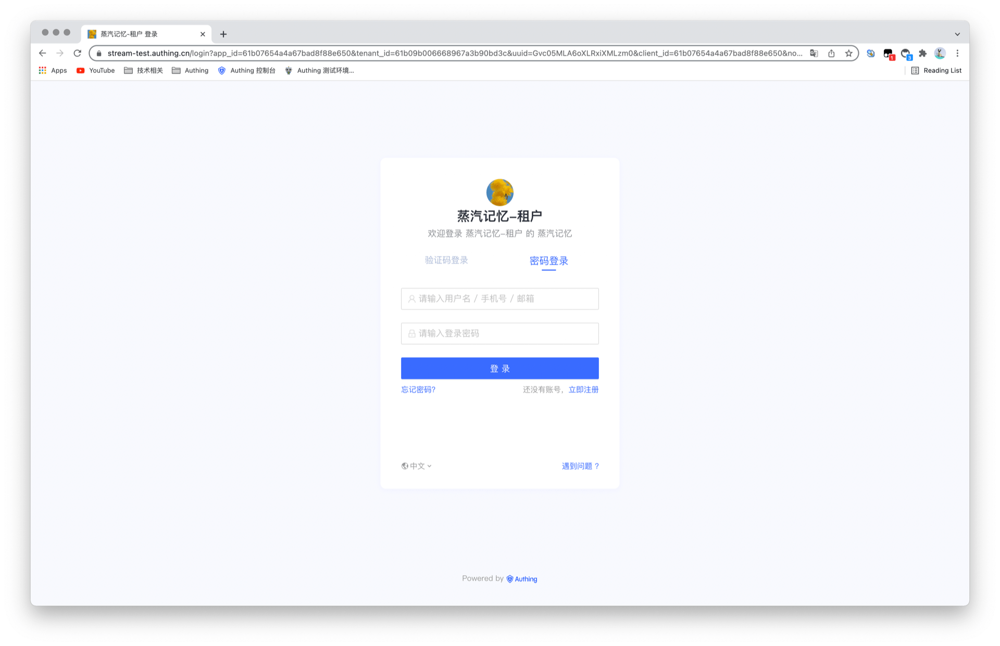
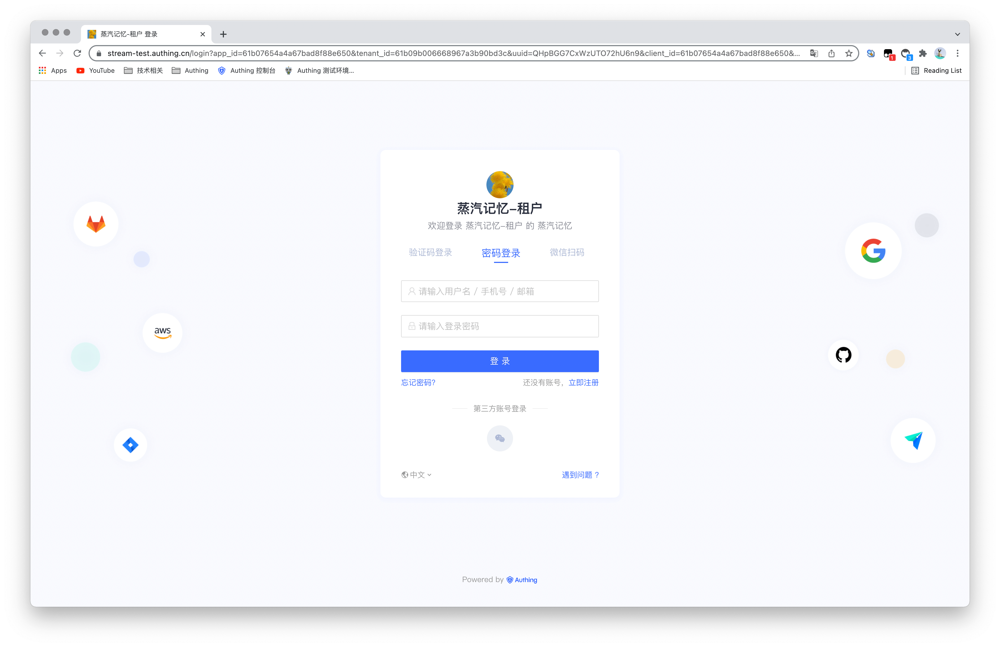

# 自定义登录样式

<LastUpdated/>

Authing 提供了非常灵活的的登录页面个性化配置，你可以在租户的 **品牌化** 中进行配置。




## 登录框可配置项

**隐藏企业身份源登录**：开启之后将不会显示所有第三方身份源按钮，仅支持应用默认的登录方式。

**隐藏社会化登录**：开启之后将不会显示所有社会化身份源登录方式。

**将注册和登录合并**：开启之后，如果用户输入了一个未注册过的账号，系统会自动为其创建一个账号并登录。



**隐藏忘记密码按钮**：开启之后，**忘记密码**按钮将会被隐藏。


### 自定义 CSS

你可以通过自定义 CSS 对登录框进行一些更加个性化的样式定制。例如修改背景颜色：

```css
.authing-guard-layout {
	background-image: url(https://files.authing.co/authing-blog/demo-bg.png);
    background-repeat: no-repeat;
  	background-size: cover;
}
```




