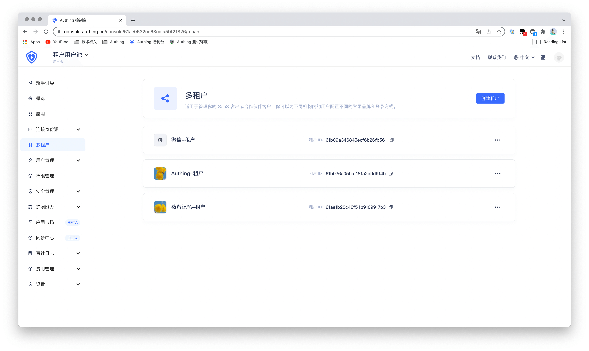

# 创建租户

<LastUpdated/>

在[控制台](https://console.authing.cn/)点击**多租户**即可进入多租户管理页面 ，在这里你可以看到所有你已经创建的租户，并且可以创建新的租户。

点击右上角的**创建租户**，你需要填写以下信息：

- 租户 Logo：你可以使用默认的 Logo，也可以上传自定义的 Logo；
- 显示名字：这里需要填写你的租户名称，此名称将显示在租户内终端用户的登录页面。
- 选择所属应用： 选择你要绑定该租户的应用，当前仅支持自建应用。

点击**创建**，完成创建工作。

