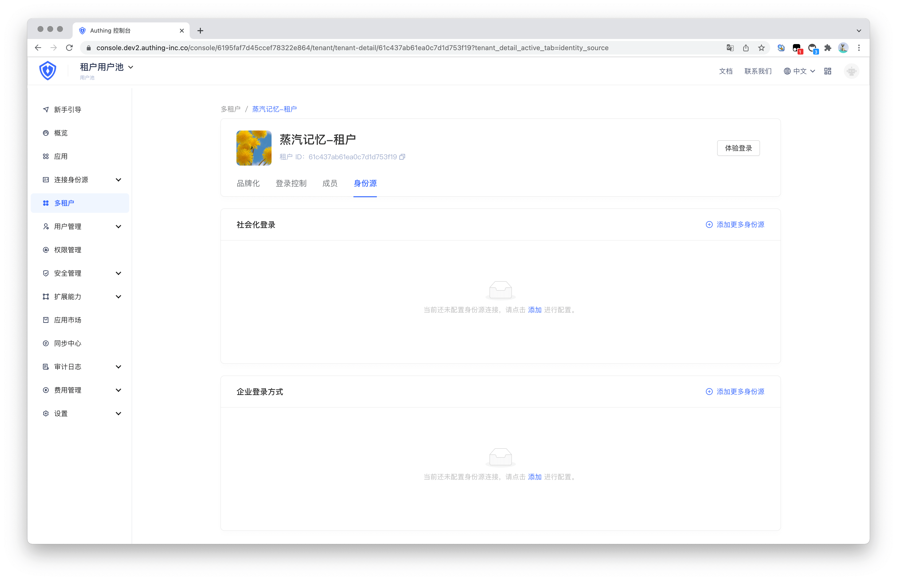
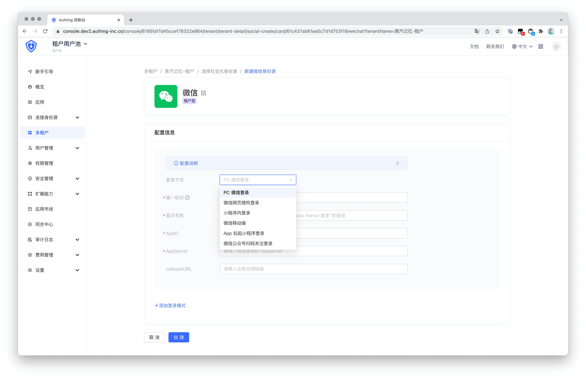
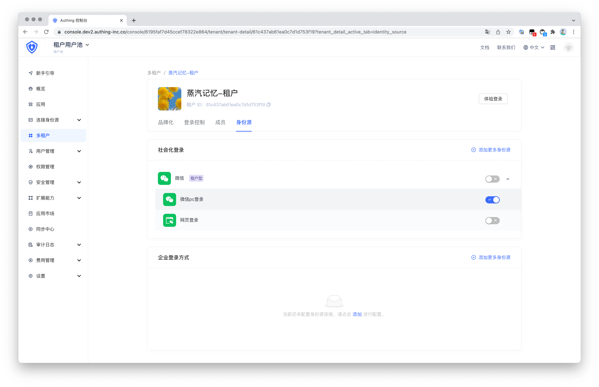
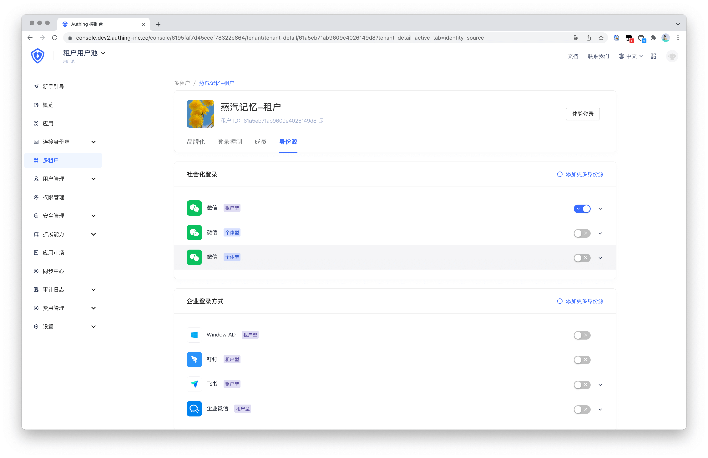
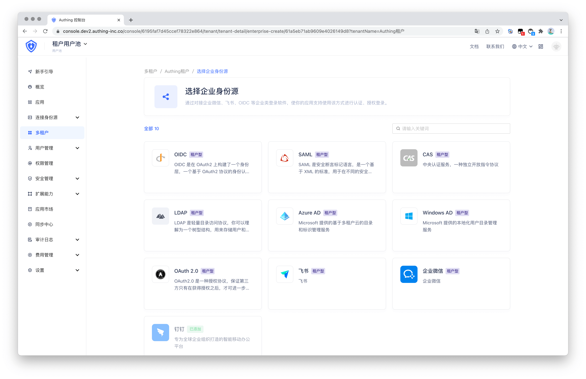

# 为租户配置第三方身份源

<LastUpdated/>

## 配置社会化身份源

租户可以使用社会化身份源进行登录，管理员可以点击**添加更多身份源**进行配置。

根据不同登录方式的配置要求，填写相关配置信息。点击**创建**按钮，即可创建新的社会化身份源登录方式。

配置完身份源后，在身份源列表中即可看到刚才新添加的身份源。点击右边按钮可以控制是否启用该身份源。

## 配置企业身份源

当前已支持添加第三方企业身份源作为租户的个性化登录方式。

现已支持的企业身份源如下图所示，后续我们将不断更新主流身份源，满足企业客户更多场景。

企业身份源的配置方式请参考[连接企业身份源指南](../guides/connections/enterprise.md)。

添加完成后在身份源列表中即可看到刚才新添加的身份源。点击右边按钮可以控制是否启用该身份源。

## 如何定义个体型身份源和租户型身份源

- 个体型身份源是属于用户池级别的第三方身份源，租户下的终端用户可以使用该用户池下所有已配置的第三方身份源进行登录。

- 而租户型身份源的配置仅针对该租户生效，非该租户下的终端用户无法使用。
