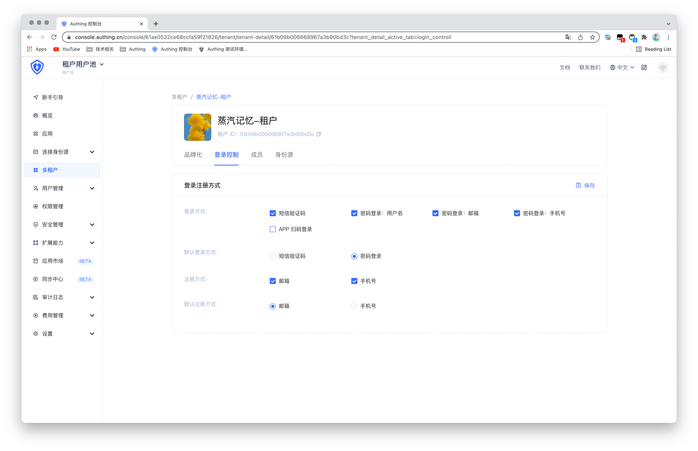
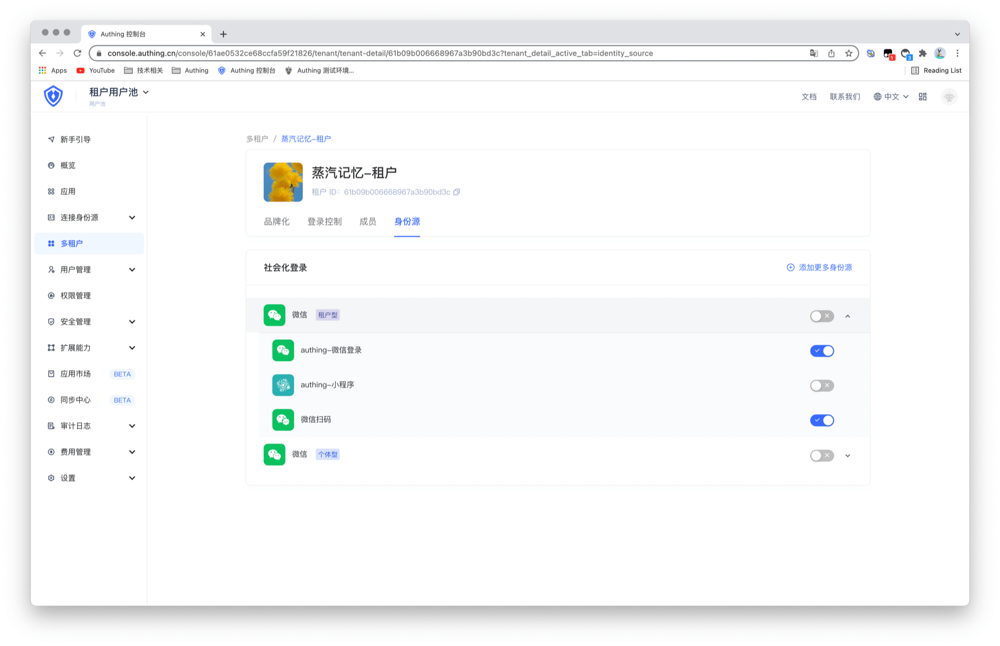
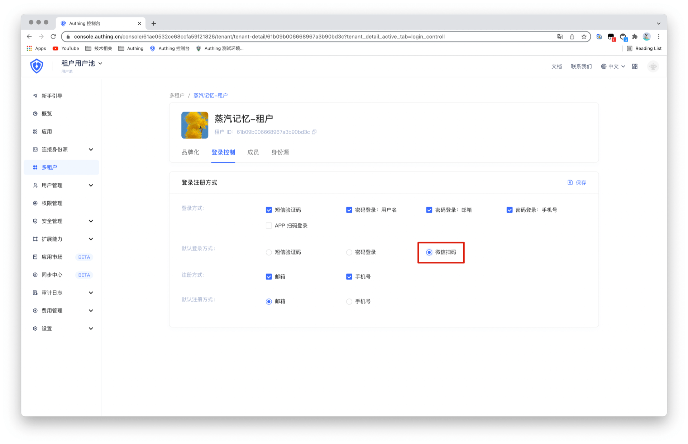
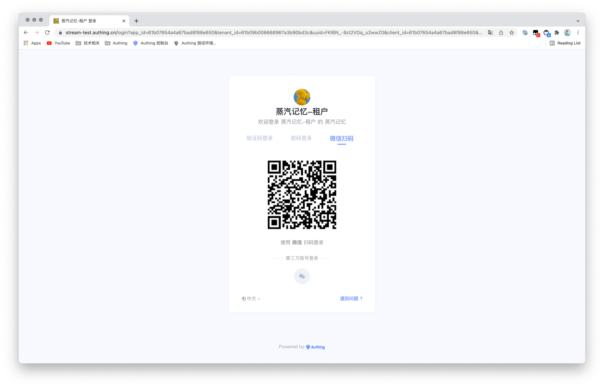

# 配置注册和登录方式

<LastUpdated/>

默认情况下， 你的租户只支持基本的注册和登录方式：邮箱注册、手机号注册、手机号验证码登录、账号密码登录。

在多租户功能下，Authing 当前也支持接入以下社会化登录方式：

- GitLab 身份源登录
- 微信身份源登录
  - PC 微信登录
  - 微信网页授权登录
  - 小程序内登录
  - 微信移动端
  - APP 拉起小程序登录
  - 微信公众号扫码关注登录

## 登录注册方式配置

在租户管理页面中，我们默认提供了灵活的登录注册方式配置，如下图所示：

针对微信生态，Authing 具备非常便捷微信全场景身份解决方案，你可以阅读[打通微信账号体系指引](https://docs.authing.cn/v2/guides/wechat-ecosystem/)，了解相关内容。

### 为租户配置第三方身份源登录方式

租户所关联的应用也支持以第三方身份源作为登录方式。首先按照[为租户配置第三方身份源](./idp-social.md)添加第三方身份源。

配置完成之后开启此身份源，比如「微信扫码」，便可以为终端用户开启此登录方式。

同时，打开租户的**登录控制**，可以看到默认登录注册方式下会出现了一个「微信扫码」选项，选择并保存即可使用微信扫码作为默认登录方式。

在终端用户进行登录时，登录页将默认优先显示「微信扫码」方式登录。

