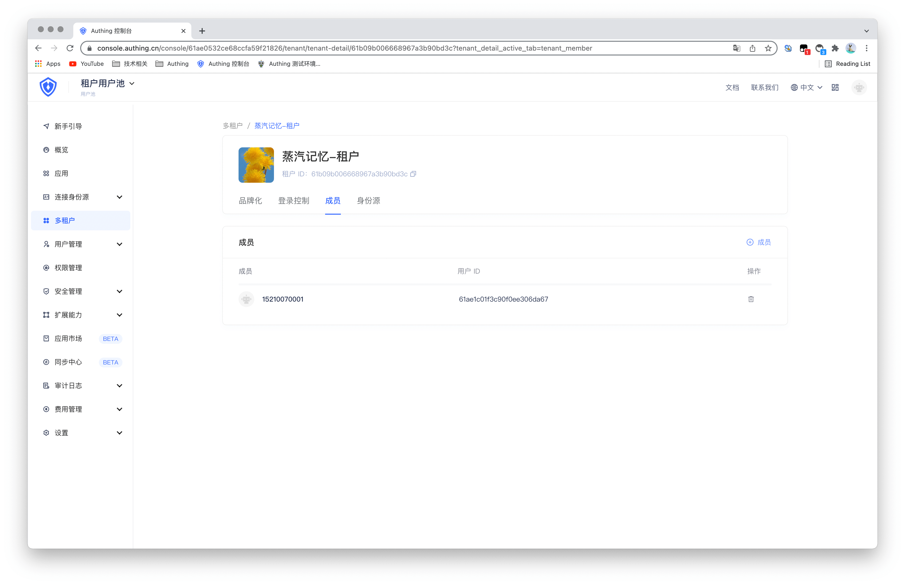
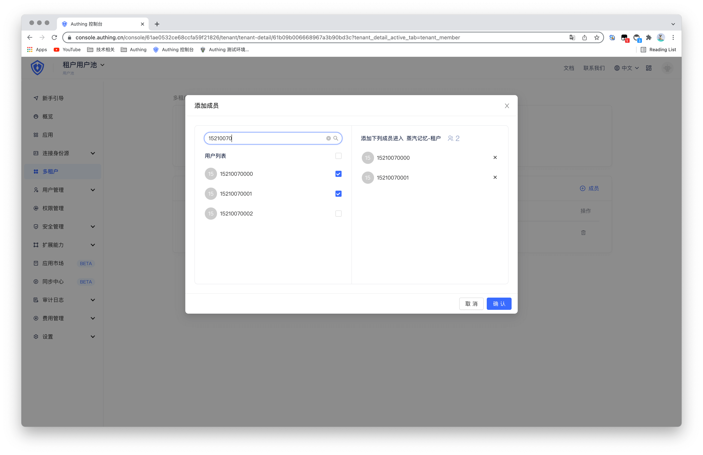

# 管理租户成员

<LastUpdated/>

在租户配置页面的**成员**菜单下，你可以管理你的租户成员。管理员可以直接将用户池中原有的用户添加为租户成员。终端用户也可以在租户登录页注册，从而自动成为当前租户的成员。操作示意如下：

1. 选择某一具体租户，选择**成员**，可以查看所有当前租户中的成员，也可以删除已添加的成员。

2、点击右上角的**添加成员**，即可从用户池中添加新的租户成员。当前支持通过手机号，用户名、邮箱模糊搜索用户。

3、点击**确定**按钮，即可完成租户成员添加。

