# 快速开始

<LastUpdated/>

通过以下三步快速体验 Authing 的多租户功能：

## STEP1：创建租户并关联你的自建应用

假如你还没有自建应用，请在 Authing 控制台上应用里点击**添加应用**，去创建一个自建应用。当前仅自建应用支持多租户功能。

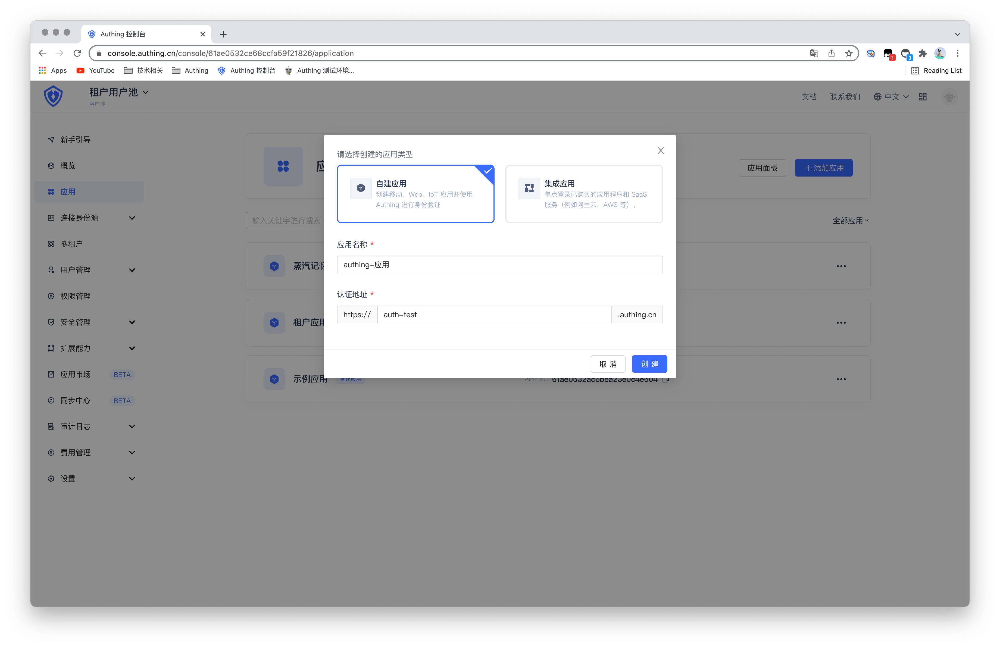

打开**多租户**，然后点击**创建租户**，上传租户的 Logo ，填写租户名称，然后选择你要绑定该租户的应用。此处设置的 Logo 和租户名称将显示在租户内终端用户的登录页面。

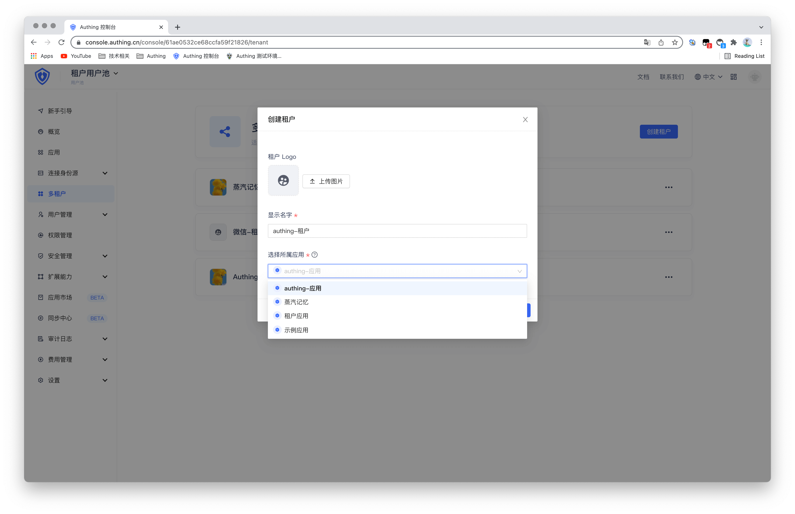

完成以上配置后，在列表中点击你新建的租户，即可进入租户配置页面。

## STEP2：通过丰富的配置管理你的租户

创建完租户后，点击**品牌化**，你可以通过自定义 CSS 改变登录页面样式，然后点击保存即可。当然也支持使用 Authing 默认提供的页面风格。

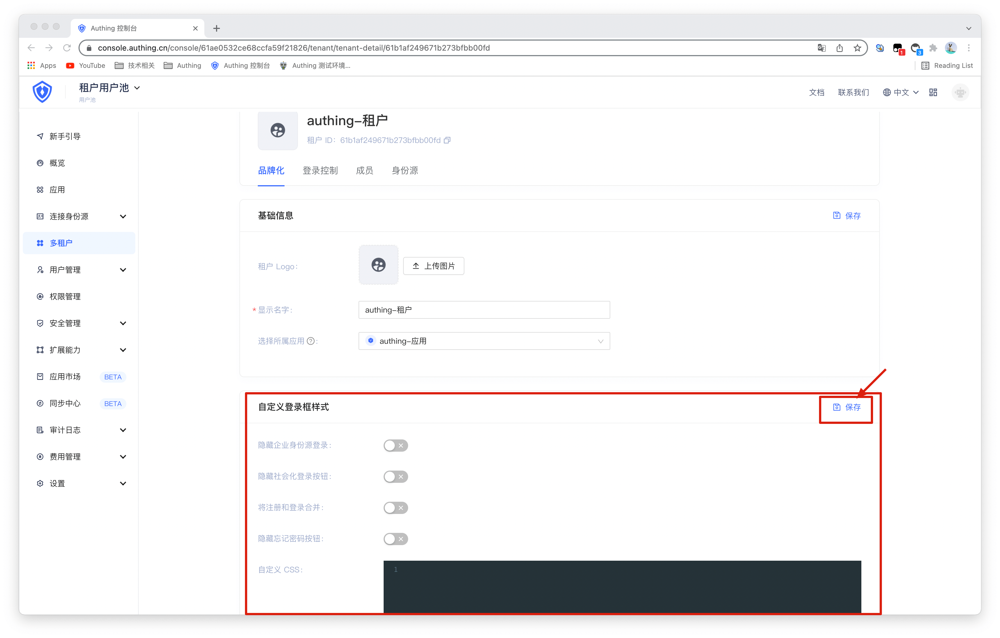

**登录控制**页面用于管理租户内用户的登录注册方式，你可以自定义配置所有的登录方式。

租户中的用户可以通过以下三种方式登录：

- 注册一个全新的账号，然后登录该租户关联的应用。
- 管理员将用户加入到租户成员中，然后此用户就可以登录该租户关联的应用。
- 管理员给租户配置了第三方身份源，用户就可以使用第三方身份源登录该租户关联的应用，该用户若不存在将会自动注册为租户成员。

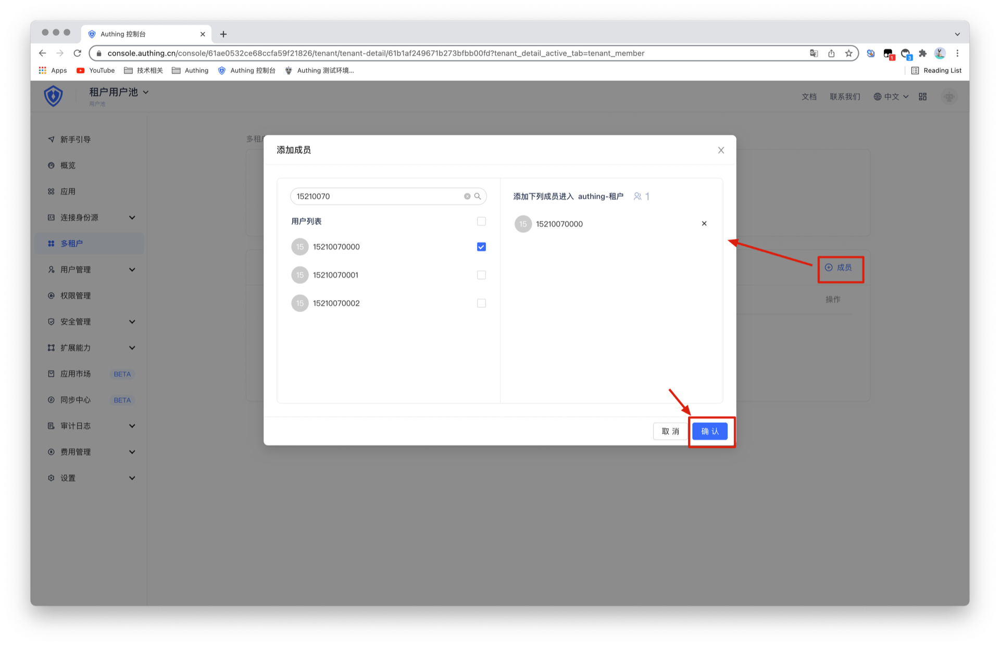

你可以为租户添加更多第三方身份源，从而终端用户可以通过第三方身份源登录租户，目前支持的第三方身份源有 GitLab 和微信生态。

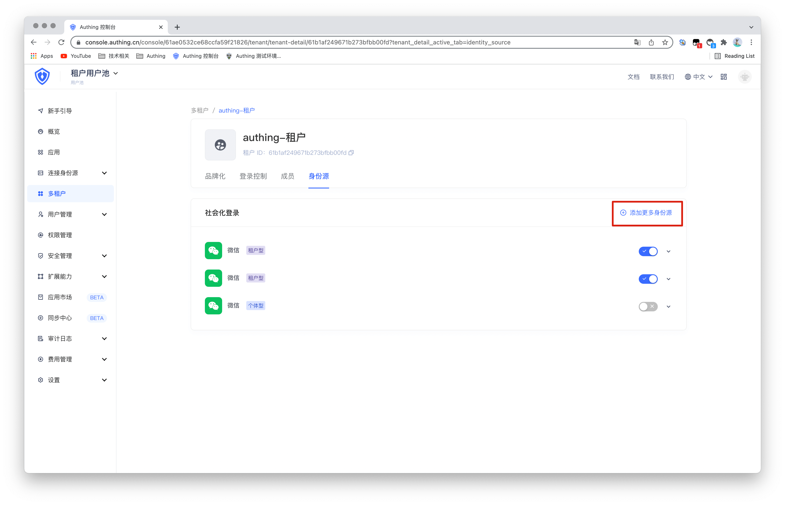

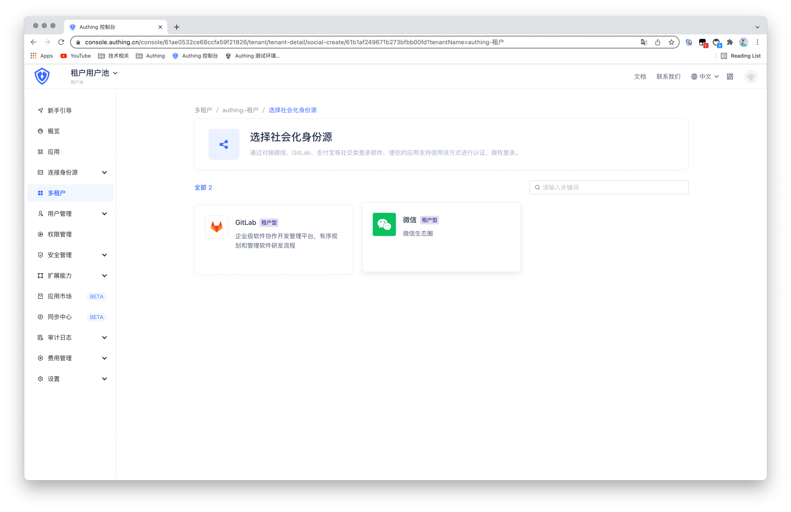

例如选择微信生态的第三方身份源，填写相关的配置信息。点击**创建**按钮即可保存该身份源。

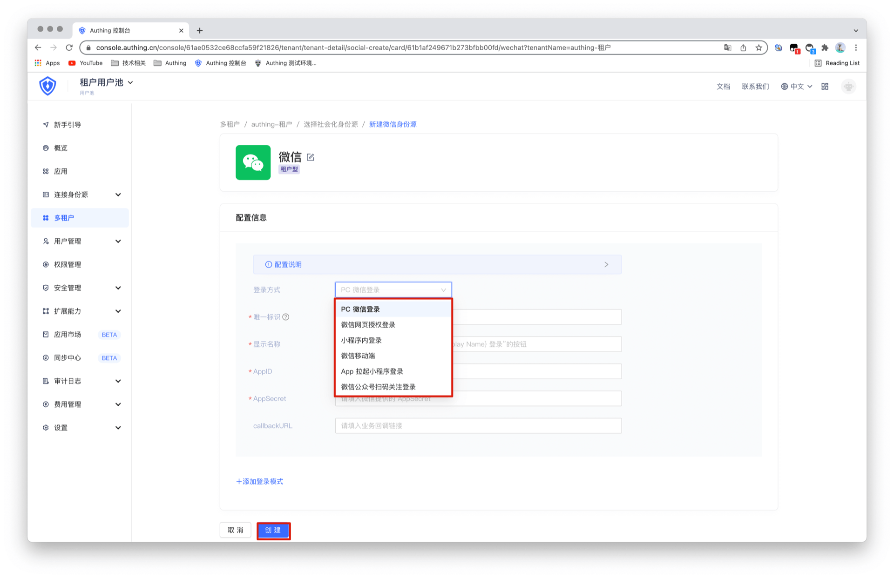

创建完身份源后，通过右侧开关按钮控制该租户是否支持该身份源作为登录方式。

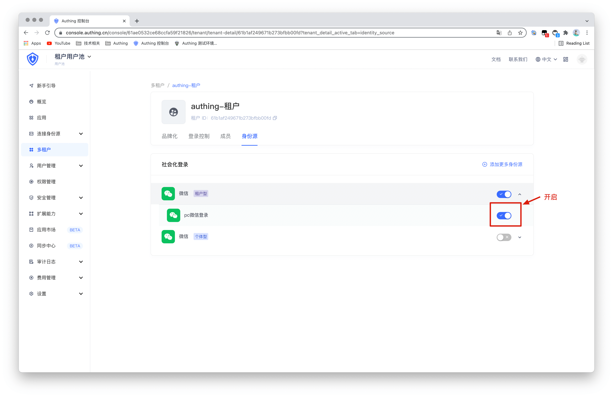

以上配置都完成后，在应用中选择**租户配置**菜单，可以选择哪些用户可以访问该应用。

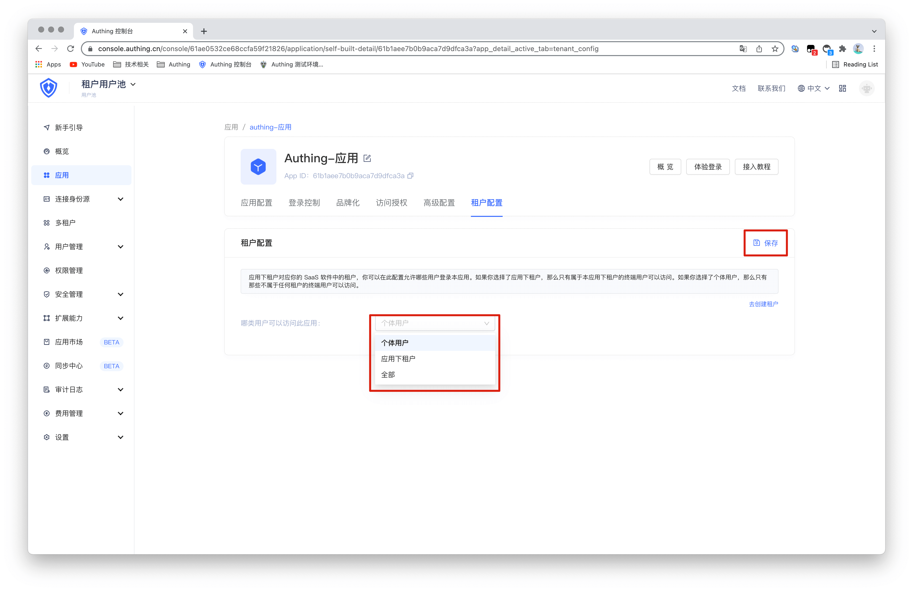

## STEP3：快速体验

进入已创建的租户内，点击**体验登录**按钮，即可快速体验登录效果。

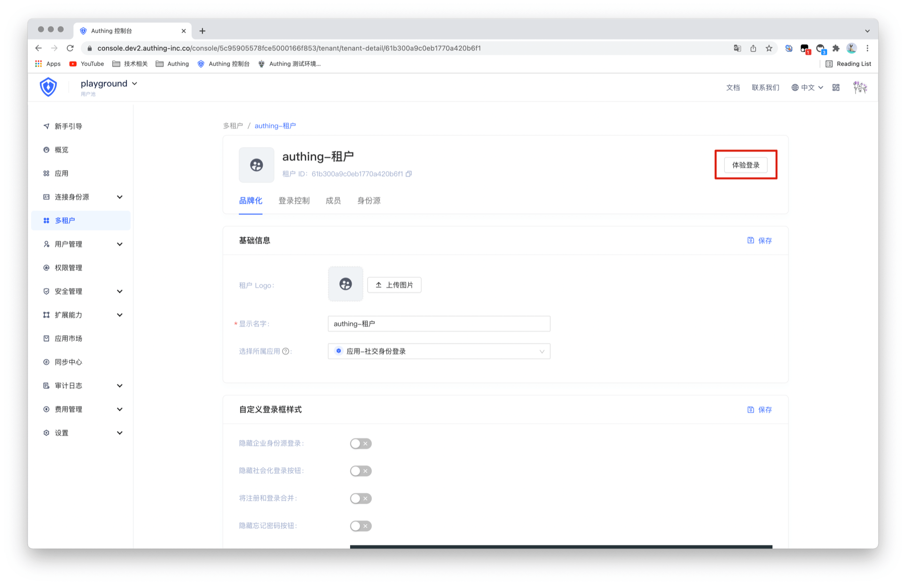

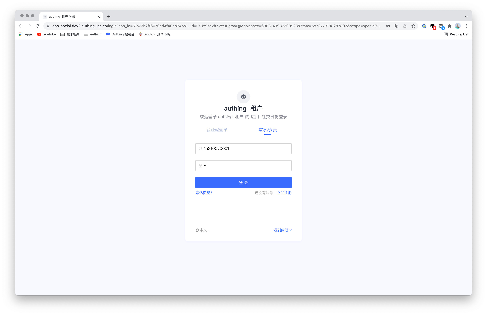

点击 [示例：基于 Authing 开发一个叫做 Uthing 的 SaaS 应用](./demo.md)。直接体验真实 SaaS 场景下 Authing 的多租户功能。

