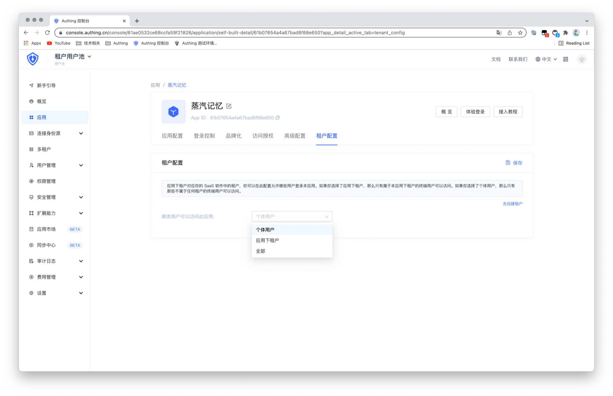

# 应用租户配置

<LastUpdated/>

恭喜你完成了所有的租户配置工作，现在我们需要进行最后一步操作：配置哪些用户可以登录该应用。

该配置在**应用**页面的**租户配置**中：

以下是三种用户配置的具体说明：

- 个体用户（默认配置）：用户池下被授权的用户只有部分可登录该应用。若某用户是关联该应用的租户下成员，则无法登录。

- 应用下租户：仅该应用所关联的租户下的成员可登录，具体可通过[租户成员](./member-management.md)配置。

- 全部：用户池下所有被授权的用户都可以登录。

配置完成后点击**保存**即可生效。

