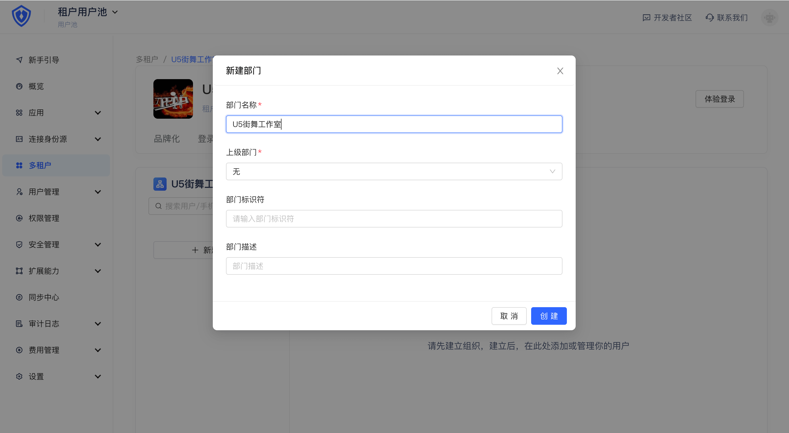
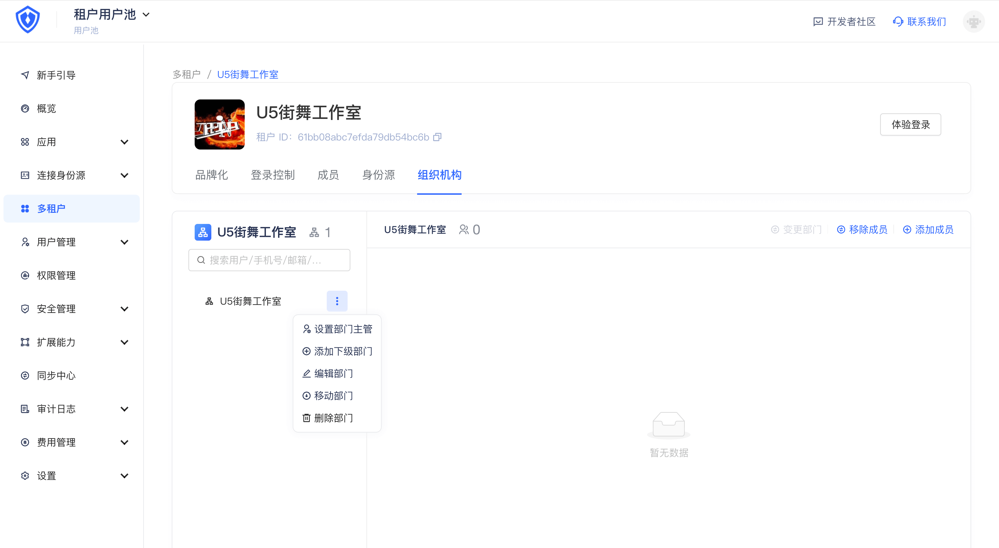
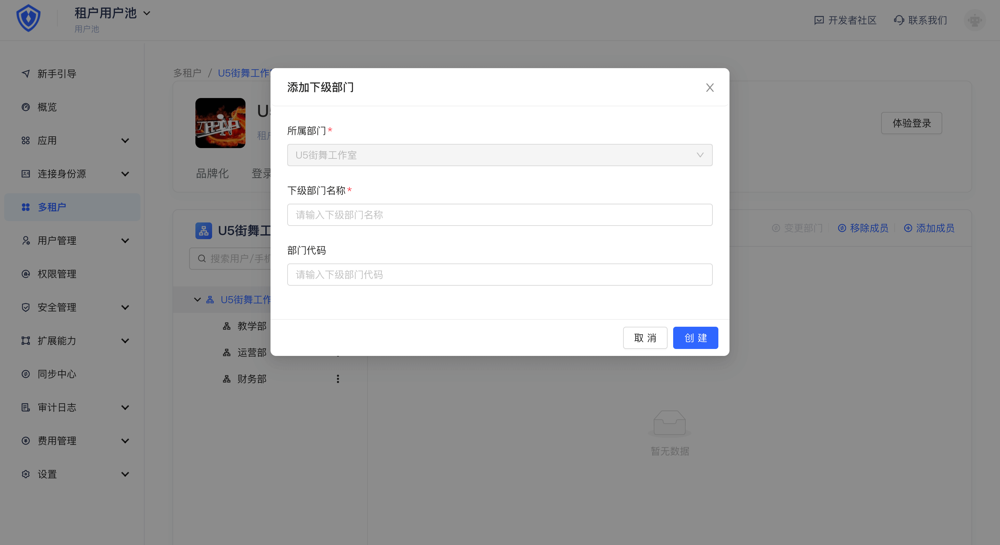
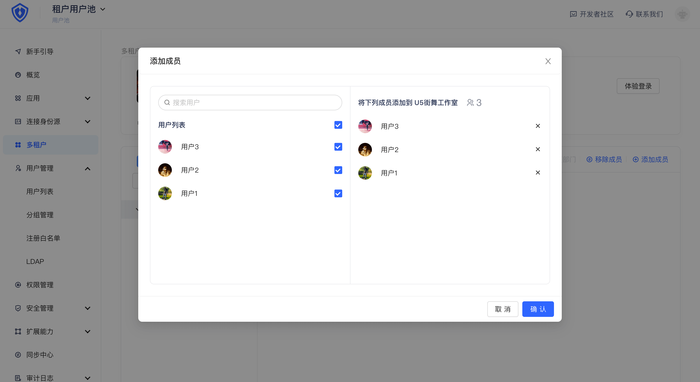
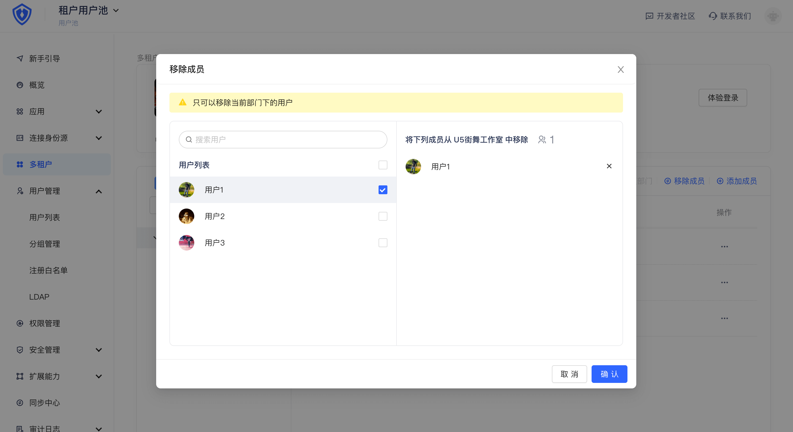
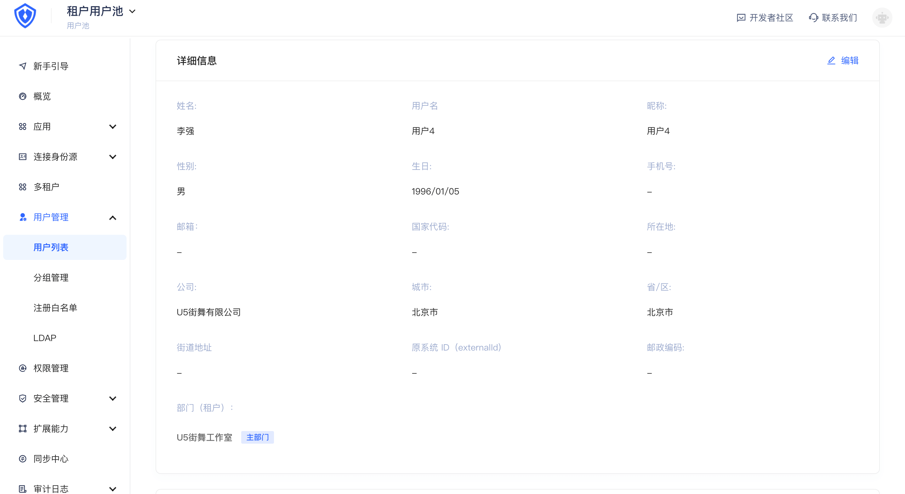

# 管理租户下组织机构

<LastUpdated/>

「多租户」版本用户池当前已支持「组织机构」功能，你可以为你的租户创建组织机构并通过组织机构管理租户下成员。也可以将组织机构通过 SDK 嵌入到你的 SaaS 软件，在此「开发文档」了解详情。

当前你仍需要通过手动配置的方式进行组织机构管理。在 2 月我们将支持租户侧通过「上游同步」方式进行组织机构管理，以满足不同客户在租户下个性化的组织机构，我们会优先支持的上游为飞书、企业微信、钉钉等国内主流企业级身份上游。

## 管理组织机构

你可以在「组织机构」机构标签下查看和管理组织结构节点：

## 管理机构成员

你可以按下图所示，添加移除组织机构成员。需要注意的是当你在用户池对租户下成员所对应的用户进行删除操作时，租户侧改成员也会被移除。

## 在用户详情中查看用户所在租户的组织机构信息

你可以在「用户详情」的「详细信息」卡片中，查看当前用户在各个租户下所属组织机构的信息。

