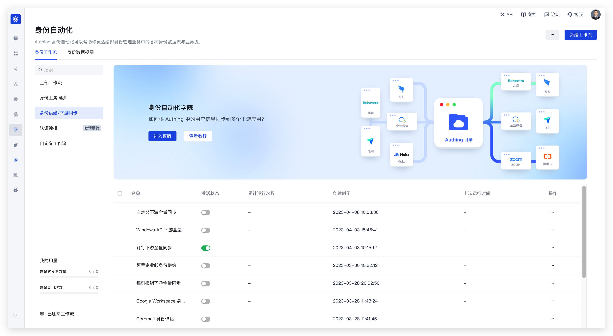
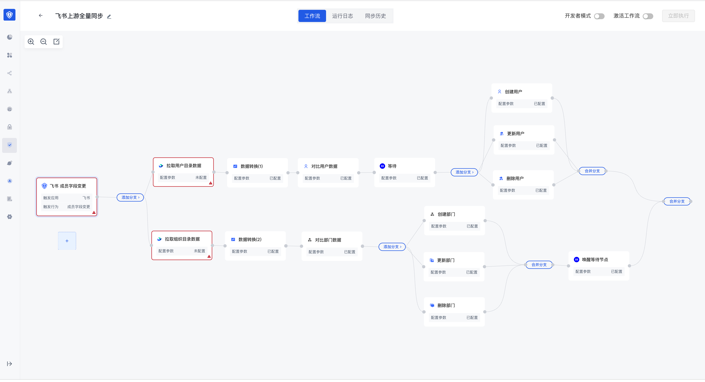
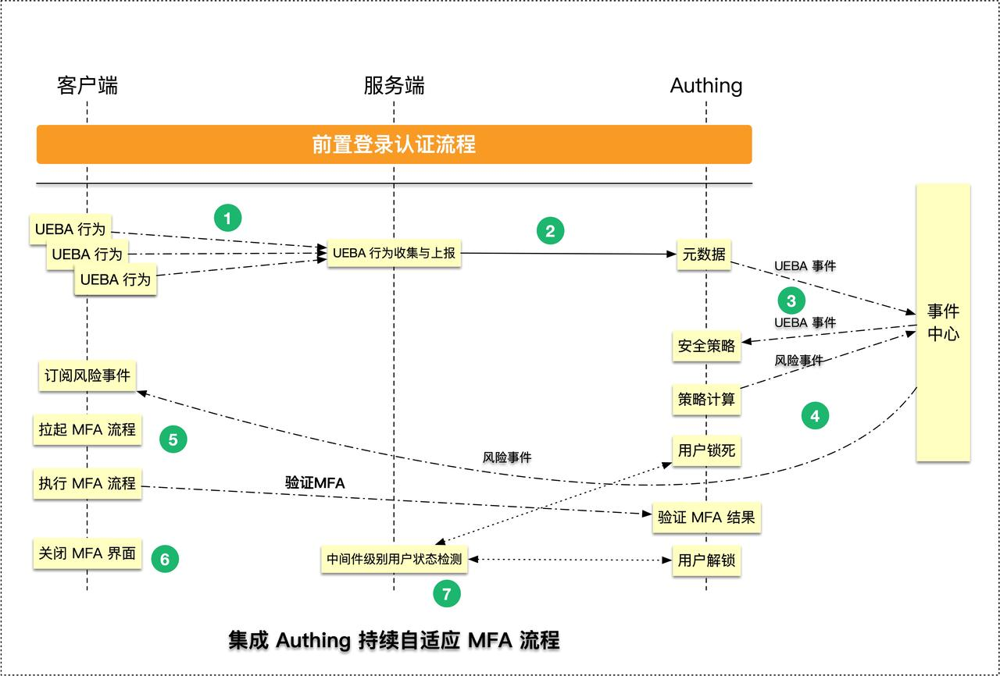
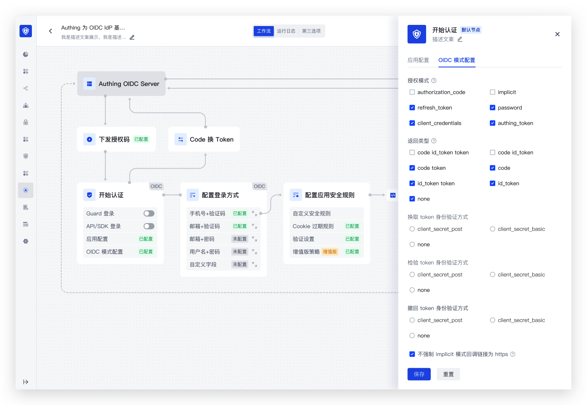

# 身份自动化概览

# 概述

Authing 身份自动化平台是基于事件驱动的下一代身份领域业务策略和数据策略的可视化工作流编排平台。旨在满足客户侧多元的针对<strong>用户</strong><strong>目录、组织架构、登录认证、安全</strong><strong>管理</strong>等功能灵活性的配置需求，能够进一步<strong>以面向变化设计系统架构、</strong><strong>敏捷</strong><strong>迭代</strong>的原则，支撑客户纷繁复杂的身份和组织架构自动化管理需求。

Authing 身份自动化平台的核心设计理念是「<strong>事件驱动</strong>」架构，从而有效支撑了流程运转的实时性、可靠性和可维护性，并能够保证工作流具备更佳的<strong>并发性</strong>和<strong>可靠性</strong>。事件驱动方式可以将事件与流程处理过程有效分离，从而实现灵活的任务调度和执行。

Authing 身份自动化平台可以帮助企业免除身份和账号管理过程中繁杂的定制化开发过程，基于下一代<strong>「</strong><strong>低代码</strong><strong>、无代码」</strong>的设计理念和可视化、拖拉拽的配置方式，快速构建和管理您的身份管理工作流程，大幅降低企业内部身份管理成本及身份安全风险。

# 核心能力

## 身份全生命周期管理旅程

平台为用户提供用户身份和员工身份管理领域可开箱即用旅程配置模版，你可以基于模版在编排画布中快速实现员工入、转、调、离全生命周期业务的灵活配置。例如：在员工入职时可以帮助员工自动化在应用程序中快速为员工创建身份、分配访问权限及通知相关方。并且可以在员工离职时自动化进行账号的锁定、冻结或者删除。

## 身份数据集成与分发

平台同时为用户提供员工身份管理下最佳的数据流集成和分发模版，除了继承 Authing APN 优势对具备 OpenAPI SaaS 应用的事件及操作全面集成外，我们也提供了对主流 HR 应用、OA 应用、数据库等开箱即用的连接和 ETL 能力，帮助企业快速打通身份数据孤岛。

## 身份安全风险实时监测

平台也为用户提供了 20+ 开箱即用的安全风控策略及个性化安全策略编排能力，结合 Authing 可嵌入的独立 MFA 能力，帮助企业在身份管理的全生命周期中实现持续、自适应的风控策略自定义。例如：管理员可以基于网络信息、设备信息、地理位置、访问来源等上下文信息编排风险计算策略和自定义风险处置行为，并且能够将策略在其他场景中灵活复用，帮助企业快速构建自适应、可持续的身份安全体系。

## 认证旅程原子化编排

基于我们「API-First 理念」下最具开发者友好体验用户注册和认证配置能力，及我们高度解耦的认证状态机引擎，为您提供了灵活、强大的注册、认证、忘记密码等功能的节点化编排模版，并提供完善的 SDK 和示例 Demo，开发者可以基于模块快速完成用户认证旅程的自定义配置并接入自建应用。

## 自定义编排

不止于此，你可以从 0 创建「身份全场景画布」，通过 Authing 预置的 1000+ 应用 API 节点、500+ 事件节点及 50+ 元子化算子节点及子工作流嵌套、跨工作流调用能力，基于现实业务旅程自由的构建个性化流程模版，从而充分通过我们的自动化能力解放您的生产力。

# 平台优势

### 实时性、高性能

Authing 身份自动化平台使用基于「事件驱动」的「Sub/Pub」模式进行设计，API 的调用者不再是通过「GET/POST/DELETE/PUT」的方式请求 API，而是订阅 API，然后异步消费 API，不仅可以方便开发者快速进行二次开发，更有效降低了全链路计算资源消耗。

### 全量算子节点

Authing 身份自动化平台除了提供常见的数据过滤、数据转换、数据合并等数据处理节点外，还提供了灵活的流程控制节点，例如 if/else、Switch、循环等常见节点，除此以外还有可以开箱即用的 JWT 节点、日期事件节点、文件处理节点等业务类算子节点。当然，你还可以用强大的自定义函数能力和自定义节点能力，进一步满足更加复杂的业务编排需求。

### DAG 模型

Authing 身份自动化平台底层基于 DAG （Directed Acyclic Graph）数据结构开发，满足工作流复杂依赖关系的处理和节点间执行规则的灵活自定义，保证工作流的整体任务调度的灵活性和易维护性。

### 监控告警

Authing 身份自动化平台具备强大的可视化监控告警配置能力，用户可自定义监控指标和告警规则，并预设自动化处理逻辑，例如清理僵尸任务或重试错误任务，充分保障用户业务安全。
